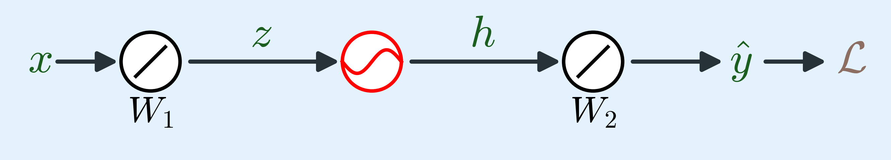
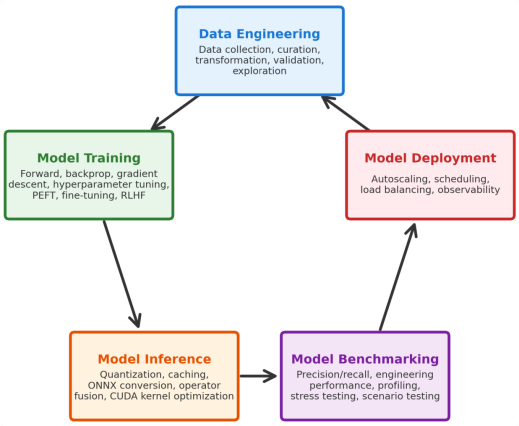
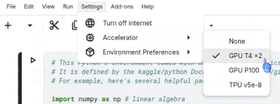
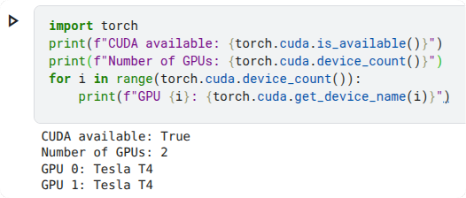
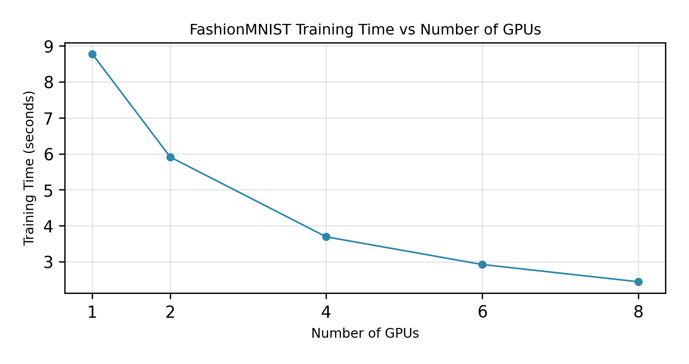
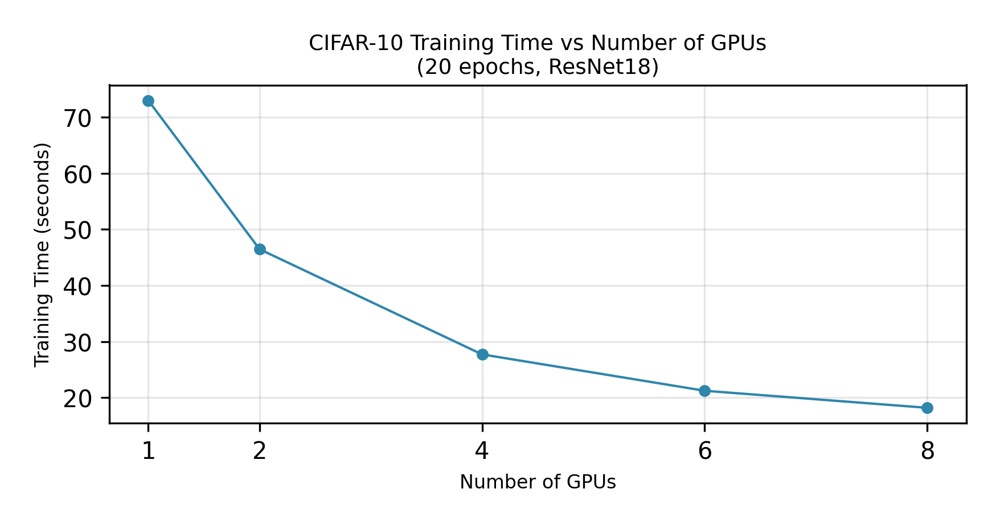

# 第 1 章：现代分布式 AI 导论 {-}

*构建从单 GPU 到分布式集群的高可扩展 AI 系统*

> 分布式系统就是这样一种系统：一个你甚至都不知道它存在的计算机发生故障，就会导致你自己的计算机无法运行。  
> —— Leslie Lamport，1987

**核心代码速查**

- `torch.distributed`：PyTorch 分布式计算的核心模块（用于训练与推理）
- `dist.init_process_group()`：初始化分布式通信进程组，支持 NCCL、Gloo 等后端
- `dist.all_reduce()`：跨所有 Rank 对张量执行归约操作（求和、最大值、最小值等），并将结果存放在所有 Rank 中
- `dist.all_gather()`：集合通信操作，从所有 Rank 收集张量并拼接至所有 Rank
- `dist.broadcast()`：将张量从源 Rank 广播至所有其他 Rank
- `dist.reduce()`：将所有 Rank 的张量归约至单个目标 Rank（通常为 Rank 0）
- `dist.gather()`：将所有 Rank 的张量收集至单个目标 Rank
- `dist.scatter()`：将源 Rank 中的张量列表分发（分散）至所有其他 Rank
- `dist.reduce_scatter()`：跨所有 Rank 归约张量，并将切分后的归约结果分散至所有 Rank
- `dist.all_to_all()`：每个 Rank 向其他所有 Rank 发送不同的数据切片


## 概述

现代 AI 模型的规模已经远远超出了单张 GPU 的承载极限。当前的大语言模型参数量动辄数十亿至上万亿。要在单张 GPU 上训练百亿乃至千亿参数的模型，即便显存能够勉强装下，也需要耗费数月甚至数年；而在生产环境中大规模提供这些模型的服务，则必须依赖分布式架构。

本章将系统讲解资源需求估算方法、在分布式训练、微调与推理之间进行权衡选型的决策框架，并提供可直接运行的实战代码帮助你快速上手。

## 为什么现代 AI 必须走向分布式

{#fig:model-comparison .block width=100%}

几年前，绝大多数模型都可以在单张 GPU 上完成训练。例如在 ImageNet 上训练 ResNet-50 只需要几天时间。而今天，在单张 GPU 上训练一个 70B 参数的语言模型可能需要数月，甚至根本无法载入显存。模型规模与数据集容量的双重爆发，让单 GPU 训练彻底失去了现实可行性。

如 @fig:model-comparison 所示，近年来模型参数量呈现指数级爆炸增长。从 @tbl:model-comparison 所列出的代表性模型中可以清晰看到这一演进趋势[^model_size_comp]。GPT-4 的参数量超过 1 万亿，而前沿大模型的规模仍在持续向上突破[^llm_param_lie]。训练这些庞然大物需要成千上万张 GPU 协同工作[^gpt4_training]。即便像 Llama 2（70B 参数）这样相对较小的模型，也需要多张 GPU 才能完整载入显存，更不用说进行高效训练了。

这不仅是训练端面临的挑战——在生产环境中大规模部署并提供这些模型的服务，同样需要能够并发承载数千请求的分布式推理架构。

单机 AI 的时代已经落幕，现代 AI 系统从底层设计开始就是天然原生的分布式架构。根据 PyTorch 官方分布式训练文档所述，分布式训练的核心在于将训练负载分摊至多个 Worker 节点，这对深度学习中的超大模型与高密度计算任务尤为关键。此外，工业界报告显示，训练万亿参数模型的算力基础设施投资动辄数千万美元[^training_costs]，这使得分布式计算不仅是一项技术上的必然选择，更是现代 AI 研发不可规避的经济规律。

::: {width=80%}

| 模型 | 参数量 | 机构 | 年份 |
|--|----------------------|-|-|
| ViT-22B | 22B | Google | 2023 |
| Grok-1 | 314B | xAI | 2023 |
| Gemini-1 | 1.6T | Google | 2023 |
| LLaMA-2 | 70B | Meta | 2023 |
| PanGu-$\Sigma$ | 1.085T | 华为 | 2023 |
| DeepSeek-V1 | 6.7B | DeepSeek | 2023 |
| GPT-4V | ~1.8T | OpenAI | 2024 |
| DeepSeek-V2 | 236B | DeepSeek | 2024 |
| Qwen-Max | ~1.2T | 阿里巴巴 | 2025 |
| GPT-5 | ~2–5T | OpenAI | 2025 |
| DeepSeek-V3 | 671B | DeepSeek | 2025 |
| Gemini 3.1 Pro | ~2–3T | Google | 2026 |
| Grok 4.3 | ~3–6T | xAI | 2026 |
| Claude Opus 4.7 | ~1T+ | Anthropic | 2026 |
| GPT-5.5 | ~2–5T | OpenAI | 2026 |
| Kimi K2.6 | 1T | 月之暗面 (Moonshot AI) | 2026 |
| DeepSeek-V4-Pro | 1.6T | DeepSeek | 2026 |
| Grok V9 Medium | 1.5T | xAI | 2026 |
| Claude Mythos 5 | ~10T | Anthropic | 2026 |

Table: 典型大型 AI 模型参数量对比 {#tbl:model-comparison}
:::

[^model_size_comp]: 波浪号（~）表示估算的近似参数量。许多前沿模型为闭源模型，官方并未公开确切参数量。此处估算值基于模型架构推断、训练成本反推及行业共识数据。

[^llm_param_lie]: Wu, "The LLM Parameter Lie," *Summer in Charlotte* (diary), June 7, 2026. \url{https://wu-99.com/diary/20260607.html\#the-llm-parameter-lie}. 深入探讨了 MoE 总参数与激活参数的区别、不可靠的回归探测法、前沿闭源模型的工业界估算（GPT-4 总量约 1.76T，Claude Opus 4.x 约 5T MoE，GPT-5/Gemini 3.1 处于 2T–5T 区间），以及 Claude Mythos 5 作为业界首个公开讨论的 10T 级模型（单 Token 激活约 800B–1.2T）。

[^gpt4_training]: SemiAnalysis, "GPT-4 Architecture, Infrastructure, Training Dataset, Costs, Vision, MoE," 2023; Epoch AI, "Compute Trends Across Three eras of Machine Learning," 2023.

[^training_costs]: Epoch AI, "Trends in GPU price-performance," 2024; SemiAnalysis, "The Cost of Training Large Language Models," 2023; OpenAI, "GPT-4 Technical Report," 2023.


### 规模带来的核心挑战

以 70B 参数模型为例。在全精度（FP32）下，仅模型权重就需要 280 GB 显存。目前没有任何主流数据中心单卡能够装下这一体积——即便拥有 141 GB 显存的 H200 和 192 GB 的 B200 依然不够（第~\ref{chap:gpu-hardware-networking-and-parallelism-strategies} 章将深入解析 GPU 架构演进与显存技术趋势）。仅加载模型就需要多张 GPU 协同，更不用说完整的训练过程了。

训练此类模型需要成千上万的 GPU 时（GPU-hours）。单 GPU 运行可能耗时数月。同时，训练数据集本身规模也极其庞大，往往包含数万亿（Trillions）Token。如何高效加载与预处理这些海量数据，需要构建专门的**分布式数据流水线**。

这种矛盾显而易见：模型规模与算力需求正在呈**指数级**暴增，而单卡显存与算力至多只能实现**线性**增长。


### 模型资源需求估算

在开始训练或部署之前，准确预估显存与算力需求至关重要。若预估偏差过大，轻则触发 Out-of-Memory (OOM) 导致训练崩溃，重则过度配置机器浪费高昂的云端成本。

显存占用的计算取决于所存储的具体内容。仅就模型权重而言，计算公式非常直接：FP32 精度下每个参数占用 4 字节，FP16/BF16 占用 2 字节，Int8 占用 1 字节，Int4 占用 0.5 字节。对于一个 7B 参数的模型，其权重在 FP32 下需 28 GB，在 BF16（或 FP16）下需 14 GB，Int8 下需 7 GB，Int4 下仅需 3.5 GB。

常用数值精度格式速查表如下：

| 格式 | 字节数 | 格式细节 | 主要应用场景 |
|------|--|----------------|---------------|
| FP32 | 4 | 32 位浮点（1 符号位，8 指数位，23 尾数位） | 训练基准、高精度推理 |
| BF16 | 2 | 16 位 bfloat（1 符号位，8 指数位，7 尾数位） | 训练（首选推荐）、推理 |
| FP16 | 2 | 16 位浮点（1 符号位，5 指数位，10 尾数位） | 推理 |
| FP8 E4M3 | 1 | 8 位浮点（1 符号位，4 指数位，3 尾数位） | 推理（激活值、权重） |
| FP8 E5M2 | 1 | 8 位浮点（1 符号位，5 指数位，2 尾数位） | 训练（梯度存储） |
| MXFP8 | ~1 | E4M3 + 32 元素块级缩放（Block Scale） | Blackwell 架构训练 |
| NVFP4 | ~0.5 | E2M1 + 16 元素块级缩放 | Blackwell 架构推理 |
| Int8 | 1 | 8 位定点整数 | 量化推理 |
| Int4 | 0.5 | 4 位定点整数 | 极致量化压缩推理 |


值得注意的是，FP8 分为两种格式：E4M3（精度更高，常用于推理中的激活值与权重计算）和 E5M2（动态范围更宽，常用于梯度存储）。两者虽然每个参数都占用 1 字节，但定位各有侧重。在 NVIDIA Blackwell 架构上，**MXFP8** 通过更细粒度的块级缩放升级了 Hopper 时代的张量级 FP8；而 **NVFP4** 则进一步突破 8-bit 下限用于高效推理（以及部分训练栈）。两者均采用了微缩放（Microscaling）机制——实际有效显存占用会略微高于标称比特数。详见第~\ref{chap:gpu-hardware-networking-and-parallelism-strategies} 章关于硬件体系的深入剖析，以及第~\ref{chap:beyond-state-sharding-with-deepspeed-and-megatron} 章关于 FP8 训练的实战内容。

在训练阶段，BF16 (bfloat16) 通常优于 FP16 (float16)。BF16 拥有与 FP32 相同的 8 位指数范围（尾数缩小至 7 位），从而具备了与 FP32 完全相同的动态范围。这让训练过程更加稳定，极不易出现数值溢出（Overflow）或下溢（Underflow）。相比之下，FP16 只有 5 位指数位，极易在反向传播中引发数值不稳定。现代数据中心 GPU（A100、H100、B200）的 Tensor Core 都针对 BF16 进行了高度硬件优化。在推理阶段，FP16 和 BF16 均可正常工作，但为了与训练阶段保持数值一致性，BF16 依然是业界首选。

然而，模型权重仅仅是显存占用的冰山一角。在**训练**过程中，显存还必须容纳梯度、优化器状态以及前向传播生成的激活值（Activations）。在**推理**过程中，则必须为注意力机制维护 KV 缓存（KV Cache）。KV 缓存是大模型推理的核心加速手段——它缓存了序列中历史 Token 的 Key-Value 向量，避免在自回归生成每个新 Token 时重复计算整段历史上下文的注意力。尽管这极大提升了解码速度，但 KV 缓存占用的显存会随着 Batch Size 和序列长度的增加而线性暴增。最终的系统峰值显存往往达到模型权重本身的数倍之多。

#### 训练显存开销分解

训练所需的显存远高于推理。显存中必须同时存放模型权重、梯度（每个参数对应一个）、优化器状态以及前向传播生成的激活值。

__优化器状态（Optimizer State）__

优化器状态占用的空间取决于所选取的优化算法。以随机梯度下降（SGD）为例，模型权重的更新公式如下：

$$
w_{t+1} = \boxed{w_t} - \eta  \boxed{g_t}
$$

其中：

$w_t$：迭代步 $t$ 时的模型参数  
$w_{t+1}$：更新后的参数  
$g_t$：损失函数对参数的梯度（$g_t = \nabla_w L(w_t)$）  
$g_t$：学习率（SGD 与 Adam 均使用）  

公式中方框圈出的变量即为必须驻留在显存中的张量。SGD 只需要学习率 $\eta$（一个标量）即可完成更新。在反向传播中算出 $g_t$ 后，直接从 $w_t$ 中减去 $\eta g_t$。优化器状态本身只有一个标量 $\eta$，内存占用几乎为零。因此 SGD 只需存储权重 $w_t$ 和梯度 $g_t$，无需额外的优化器状态张量。

自适应矩估计（Adam）的公式则更为复杂：

$$
w_{t+1} = \boxed{w_t} - \eta
\frac{\beta_1 \boxed{m_{t-1}} + (1-\beta_1) \boxed{g_t}}{\sqrt{\beta_2 \boxed{v_{t-1}} + (1-\beta_2) \boxed{g_t}^2} + \epsilon}
\cdot
\frac{\sqrt{1-\beta_2^t}}{1-\beta_1^t}
$$

各变量定义如下：

$\beta_1$：一阶矩（均值）的衰减率  
$\beta_2$：二阶矩（未中心化的方差）的衰减率  
$m_{t-1}$：上一时间步的一阶矩估计  
$v_{t-1}$：上一时间步的二阶矩估计  
$\epsilon$：数值稳定性微小常数  
$t$：用于偏差校正的迭代步索引  

从公式可以看出，Adam 为每个模型参数额外维护了两个张量：一阶矩估计 $m_{t-1}$ 和二阶矩估计 $v_{t-1}$。这两个张量的形状与 $w_t$ 完全一致（每个参数对应一个数值）。因此 Adam 需要分别存储 $m_{t-1}$（占用 1 倍模型大小）和 $v_{t-1}$（占用 1 倍模型大小），使得优化器状态总共占据 **2 倍模型参数量** 的显存。

超参数 $\beta_1$ 和 $\beta_2$ 是标量常量（通常为 $\beta_1=0.9$, $\beta_2=0.999$），作为全局配置保存一次即可，并非逐参数存储。学习率 $\eta$ 和 $\epsilon$ 同样为标量，显存占用可忽略不计。真正消耗大量显存的，是那些与 $w_t$ 尺寸完全相同的张量：$w_t$、$g_t$、$m_{t-1}$ 和 $v_{t-1}$。

这就是为什么 Adam 相比于几乎零开销的 SGD 需要额外付出 2 倍模型大小的显存。AdamW（带解耦权重衰减的 Adam）与 Adam 的显存需求完全相同，均需维护 $m_{t-1}$ 和 $v_{t-1}$（总计 2 倍模型大小），区别仅在于权重衰减是直接作用于参数本身还是融入梯度计算。

常见优化器的状态显存占用对照表如下：

| 优化器 | 内部状态 | 额外显存倍数 |
|-------|------------------|-----|
| SGD | 学习率 $\eta$ (标量) | ~0× |
| SGD+Momentum | $v_{t-1}$ (动量/速度) | 1× |
| Nesterov | $v_{t-1}$ (动量/速度) | 1× |
| Adagrad | 历史梯度平方累加值 | 1× |
| RMSProp | $v_{t-1}$ (二阶矩) | 1× |
| Adam | $m_{t-1}$ (一阶矩) + $v_{t-1}$ (二阶矩) | 2× |
| AdamW | $m_{t-1}$ (一阶矩) + $v_{t-1}$ (二阶矩) | 2× |
| Adafactor | 行列低秩分解统计量 | ~0.5× |
| LAMB | $m_{t-1}$ (一阶矩) + $v_{t-1}$ (二阶矩) | 2× |
| Lion | $m_{t-1}$ (仅一阶矩) | 1× |
| Nadam | $m_{t-1}$ (一阶矩) + $v_{t-1}$ (二阶矩) | 2× |
| AMSGrad | $m_{t-1}$ + $v_{t-1}$ + $v_{\max}$ | 3× |
| SparseAdam | $m_{t-1}$ + $v_{t-1}$ (稀疏存储) | 2× |
| Shampoo | 左右双侧预条件矩阵 | >2× (依参数结构而定) |
| AdaBelief | $m_{t-1}$ (一阶矩) + $s_{t-1}$ (置信项) | 2× |

上表仅列出了优化器状态自身的占用。在实际训练中，无论采用哪种优化器，你都必须同时保留模型权重（1×）和梯度（1×）。

__激活值输出（Activation Output）__

激活函数层（如 ReLU、GELU、Sigmoid）本身不包含可学习参数，它们仅对输入执行逐元素数学变换。但在反向传播过程中，为了计算网络各层的梯度，前向传播所计算出的中间激活值输出（通常简称为“激活值”/ Activations）必须保留在显存中。

以包含 Linear → Sigmoid → Linear 的三层简单神经网络 `SimpleDNN` 为例：



数据流向为 $x \rightarrow z \rightarrow h \rightarrow \hat{y}$。输入 $x$ 经过第一个线性层生成 $z$，经 Sigmoid 激活层映射为 $h$，最后由第二个线性层输出预测值 $\hat{y}$。在 PyTorch 中的实现代码如下：

```python
class SimpleDNN(nn.Module):
    def __init__(self, input_dim, output_dim, hidden_dim=1, bias=False):
        super(SimpleDNN, self).__init__()
        self.linear1 = nn.Linear(input_dim, hidden_dim, bias=bias)  # x -> z
        self.activation = nn.Sigmoid()                              # z -> h
        self.linear2 = nn.Linear(hidden_dim, output_dim, bias=bias) # h -> y_hat

    def forward(self, x):
        z = self.linear1(x)      # z = W_1 * x
        h = self.activation(z)   # h = sigmoid(z)
        y_hat = self.linear2(h)  # y_hat = W_2 * h
        return y_hat
```

前向传播的数学表达为：

$$
z = W_1 x, \quad h = \sigma(z), \quad \hat{y} = W_2 h, \quad L = \frac{1}{2}(y - \hat{y})^2
$$

在反向传播中应用链式法则计算梯度。

对于第二层权重梯度 $\frac{\partial L}{\partial W_2}$：

$$
\frac{\partial L}{\partial W_2} = \frac{\partial L}{\partial \hat{y}} \cdot \frac{\partial \hat{y}}{\partial W_2} = (\hat{y} - y) \cdot h
$$

可见该梯度的计算依赖于 $h$——即 Sigmoid 层的输出。因此在前向传播过程中必须将 $h$ 保存在显存中。

对于第一层权重梯度 $\frac{\partial L}{\partial W_1}$，链式法则更长：

$$
\frac{\partial L}{\partial W_1} = \frac{\partial L}{\partial \hat{y}} \cdot \frac{\partial \hat{y}}{\partial h} \cdot \frac{\partial h}{\partial z} \cdot \frac{\partial z}{\partial W_1}
$$

逐项展开：$\frac{\partial L}{\partial \hat{y}} = \hat{y} - y$（依赖 $\hat{y}$），$\frac{\partial \hat{y}}{\partial h} = W_2$（依赖 $W_2$），$\frac{\partial h}{\partial z} = \sigma'(z) = \sigma(z)(1-\sigma(z)) = h(1-h)$（依赖 $h$），$\frac{\partial z}{\partial W_1} = x$（依赖输入 $x$）。

最终得到：

$$
\frac{\partial L}{\partial W_1} = (\hat{y} - y) \cdot W_2 \cdot h(1-h) \cdot x
$$

该梯度同时依赖于激活输出 $h$ 和原始输入 $x$。这就是为什么前向传播产生的激活值和输入数据必须一直驻留显存，直到反向传播完成对应梯度的计算。

值得注意的一点是：在上述计算中，中间变量 $z$ 并没有被显式保留。因为 Sigmoid 的导数具备特殊性质 $\sigma'(z) = h(1-h)$，完全可以直接通过输出值 $h$ 算得，无需保存激活前的输入 $z$。

但这并不是所有激活函数的普遍性质。许多激活函数的导数显式依赖于激活前的输入值 $z$。对于这类函数，单靠输出 $h$ 无法复原导数，因此必须将原始 $z$ 完整保留在显存中。

常见激活函数导数及其显存依赖特性如下表所示：

| 激活函数 | 函数公式 | 导数公式 |
|------------|---------------------------|-------------------------------------|
| **Sigmoid** | $\sigma(z) = \frac{1}{1 + e^{-z}}$ | $\sigma'(z) = \sigma(z)(1 - \sigma(z))$ |
| **Tanh** | $\tanh(z) = \frac{e^z - e^{-z}}{e^z + e^{-z}} = 2\sigma(2 \cdot z) - 1$ | $\tanh'(z) = 1 - \tanh^2(z) = \text{sech}^2(z)$ |
| **ReLU** | $\text{ReLU}(z) = \max(0, z)$ | $\text{ReLU}'(z) = 1$ (当 $z > 0$), $0$ (当 $z \leq 0$) |
| **Leaky ReLU** | $\text{LeakyReLU}(z) = \max(\alpha z, z)$ | $\text{LeakyReLU}'(z) = 1$ (当 $z > 0$), $\alpha$ (当 $z \leq 0$) |
| **ELU** | $\text{ELU}(z) = z$ (当 $z > 0$), $\alpha(e^z - 1)$ (当 $z \leq 0$) | $\text{ELU}'(z) = 1$ (当 $z > 0$), $\alpha e^z$ (当 $z \leq 0$) |
| **GELU** | $\text{GELU}(z) = z \cdot \Phi(z)$ | $\text{GELU}'(z) = \Phi(z) + z \cdot \phi(z)$ |
| **Swish** | $\text{Swish}(z) = z \cdot \sigma(z)$ | $\text{Swish}'(z) = \sigma(z) + z \cdot \sigma(z)(1 - \sigma(z))$ |
| **Mish** | $\text{Mish}(z) = z \cdot \tanh(\text{Softplus}(z)) = z \cdot \tanh(\ln(1 + e^z))$ | $\text{Mish}'(z) = \frac{e^z (4(z+1) + 4e^{2z} + e^{3z} + e^z(4z+6))}{(1 + e^z)^2 (1 + e^{2z})}$ |
| **GEGLU** | $\text{GEGLU}(z) = z \odot \text{GELU}(z)$ | $\text{GEGLU}'(z) = \text{GELU}(z) + z \cdot \text{GELU}'(z) = \text{GELU}(z) + z(\Phi(z) + z \cdot \phi(z))$ |
| **ReGLU** | $\text{ReGLU}(z) = z \odot \text{ReLU}(z)$ | $\text{ReGLU}'(z) = 2z$ (当 $z > 0$), $0$ (当 $z \leq 0$) |
| **SwiGLU** | $\text{SwiGLU}(z) = z \odot \text{Swish}(z) = z^2 \cdot \sigma(z)$ | $\text{SwiGLU}'(z) = 2z \cdot \sigma(z) + z^2 \cdot \sigma(z)(1 - \sigma(z))$ |
| **Softplus** | $\text{Softplus}(z) = \ln(1 + e^z)$ | $\text{Softplus}'(z) = \sigma(z) = \frac{1}{1 + e^{-z}}$ |
| **Softmax** | $\text{Softmax}(\mathbf{z})_i = \frac{e^{z_i}}{\sum_{j=1}^{n} e^{z_j}}$ | $\nabla_{\mathbf{z}} \text{Softmax}(\mathbf{z})_{ij} = \text{Softmax}(\mathbf{z})_i(1 - \text{Softmax}(\mathbf{z})_i)$ ($i = j$), $-\text{Softmax}(\mathbf{z})_i \cdot \text{Softmax}(\mathbf{z})_j$ ($i \neq j$) |


>NOTES: **激活函数表说明**

上表中的激活函数除 Softmax 外均为逐元素计算（每个输出仅取决于对应的输入元素）。Softmax 是向量级变换（输入向量并输出和为 1 的概率分布），其导数为雅可比矩阵（Jacobian matrix），记作 $\nabla_{\mathbf{z}}$。Leaky ReLU 和 ELU 中的参数 $\alpha$ 是常数超参数（通常 Leaky ReLU 取 $\alpha = 0.01$，ELU 取 $\alpha = 1.0$）。GLU（门控线性单元）家族（GEGLU、ReGLU、SwiGLU）通过逐元素相乘（$\odot$）结合两个分支：一个分支原样通过（$z$），另一个分支施加激活函数。工业界通常使用独立的线性投影生成两个分支，此处为简化公式采用同一输入 $z$ 描述。

>NOTEE

根据导数形式，激活函数可划分为两大类：

- **导数可仅由输出 $h$ 表达**：Sigmoid、Tanh、Softplus 属于此类。$\sigma'(z) = h(1-h)$ 完全由 $h$ 决定。类似地，$\tanh'(z) = 1 - h^2$，$\text{Softplus}'(z) = \sigma(z)$ 也能从输出直接求得。前向传播时仅需保存 $h$。
- **导数必须依赖输入 $z$**：ReLU、Leaky ReLU、ELU、GELU、Swish、Mish 以及 GLU 家族（GEGLU、ReGLU、SwiGLU）属于此类。它们的导数公式中显式包含 $z$ 或依赖 $z$ 的正负号。例如 ReLU 必须知道 $z > 0$ 还是 $z \leq 0$；而 GELU、Swish、SwiGLU 的导数公式中直接包含 $z$ 项，单靠 $h$ 绝无法还原。

以 Transformer 中广泛使用的 GELU 与 Swish 为例。GELU（高斯误差线性单元）精确表达式为：

$$
h = z \cdot \Phi(z)
$$

其中 $\Phi$ 为标准正态分布的累积分布函数。其导数为：

$$
\frac{\partial h}{\partial z} = \Phi(z) + z \cdot \phi(z)
$$

其中 $\phi$ 为标准正态分布概率密度函数。导数中的 $z \cdot \phi(z)$ 显式包含输入 $z$。

在实际工程中，为了加速计算常采用 tanh 近似公式：

$$
h = 0.5 \cdot z \cdot \left(1 + \tanh\left(\sqrt{\frac{2}{\pi}} \cdot (z + c \cdot z^3)\right)\right)
$$

其中 $c \approx 0.044715$。该近似式的导数为：

$$
\begin{aligned}
\frac{\partial h}{\partial z} &= 0.5 \cdot \left(1 + \tanh\left(\sqrt{\frac{2}{\pi}} \cdot (z + c \cdot z^3)\right)\right) \\
&\quad + 0.5 \cdot z \cdot \left(1 - \tanh^2\left(\sqrt{\frac{2}{\pi}} \cdot (z + c \cdot z^3)\right)\right) \cdot \sqrt{\frac{2}{\pi}} \cdot (1 + 3c \cdot z^2)
\end{aligned}
$$

即使在 tanh 近似下，导数在多个项中均显式包含 $z$（包括 $z$ 本身以及 tanh 内部的 $z^2$ 和 $z^3$）。由于 $\tanh$ 不易直接反解且 $z$ 在多处耦合，根本无法从 $h$ 单独倒推 $z$。因此无论采用精确 GELU 还是近似 GELU，反向传播均必须保留原始 $z$。

类似地，Swish（即 SiLU）的公式为：

$$
h = z \cdot \sigma(z)
$$

其导数为：

$$
\frac{\partial h}{\partial z} = \sigma(z) + z \cdot \sigma(z)(1-\sigma(z))
$$

导数显式包含 $z$，必须在前向传播时保存 $z$。

在 PyTorch 等现代深度学习框架中，Autograd 自动求导系统会基于计算图的操作依赖，自动决策各层需要缓存哪些中间张量，以确保梯度计算正确并尽量最小化内存占用。

在前向传播期间，网络逐层计算并缓存激活值；在反向传播期间，从最后一层向前逐层计算梯度。当某层的梯度计算完毕且其参数已完成更新后，该层的激活值即可被释放。然而在反向传播执行过程中，早前各层的激活值与正在生成的梯度会同时驻留显存——**系统的显存峰值（Peak Memory）正是出现在激活值与梯度同时存在的反向传播阶段**。

激活值显存与 Batch Size 以及序列长度成正比。像梯度检查点（Gradient Checkpointing）这类技术，本质上就是通过在反向传播时“重新计算”激活值来换取显存空间的释放（以算力换显存）。

__训练生命周期各阶段显存变化__

理解训练循环各步骤对显存的动态占用，有助于精确评估峰值显存并定位优化瓶颈：

```python
for epoch in range(num_epochs):
    model.train()                         # 设置为训练模式
    for x_batch, y_batch in dataloader:   # 遍历数据 Batch
        optimizer.zero_grad()             # 1. 清空上一轮梯度
        y_hat = model(x_batch)            # 2. 前向传播
        loss = criterion(y_hat, y_batch)  # 3. 计算 Loss
        loss.backward()                   # 4. 反向传播
        optimizer.step()                  # 5. 更新参数
```

各步骤显存状态拆解：

- **步骤 2（前向传播）**：模型根据输入 `x_batch` 计算预测值 `y_hat`，同时缓存反向传播所需的中间激活值。此时显存包含：模型权重 $w_t$、激活值、上一轮残留的优化器状态（如 Adam 的 $m_{t-1}, v_{t-1}$）。梯度尚未产生。
- **步骤 4（反向传播）**：`loss.backward()` 计算所有参数的梯度 $g_t = \nabla_w L(w_t)$。这需要消耗步骤 2 缓存的激活值。此时显存包含：$w_t$、激活值（仍在被使用）、生成的梯度 $g_t$ 以及优化器状态。
- **步骤 5（优化器更新）**：`optimizer.step()` 利用梯度 $g_t$ 和优化器状态将参数从 $w_t$ 更新至 $w_{t+1}$。更新完成后，优化器状态被刷新（$m_t, v_t$），激活值可彻底释放。

{.wrap #fig:training-memory-timeline width=60% align=top-right}

如 @fig:training-memory-timeline 所示，该时序图展示了一个 7B 模型在全 BF16 精度（权重、梯度、Adam 优化器状态 $m, v$ 均为每参数 2 字节）下的显存动态变化。这是一个极佳的教学基准示例。而在工业界很多实际生产场景中，往往采用**混合精度训练**：前向与反向采用 BF16（通过 `torch.autocast`），但优化器状态（甚至包括主权重副本 Master Weights）保留为 FP32。这会使得优化器显存从 28 GB 攀升至 56 GB（4 字节 × 2 个状态 × 7B 参数）。

对应到代码各行：
在第 2 行（`y_hat = model(x_batch)`），前向传播产生激活值。显存占用为权重（14 GB）+ 优化器状态（28 GB）+ 激活值（12 GB）= **54 GB**。此时尚无梯度。

在第 4 行（`loss.backward()`），反向传播触发**显存峰值**。显存占用为权重（14 GB）+ 优化器状态（28 GB）+ 激活值（12 GB）+ 梯度（14 GB）= **68 GB**。

在第 5 行（`optimizer.step()`），反向传播结束后激活值释放，显存占用变为权重（14 GB）+ 优化器状态（28 GB）+ 梯度（14 GB）= **56 GB**。

68 GB 的显存峰值正是发生在 `loss.backward()` 期间。这就是为什么在遭遇 OOM 时，减小 Batch Size、使用**梯度累积（Gradient Accumulation）**（将大 Batch 拆为多个 Micro-batch 串行反向传播后再执行一次 `optimizer.step()`）或开启梯度检查点能够立竿见影：前两者降低了单次反向传播时的激活值显存，而检查点机制则用额外的重算开销换取了激活值的显存释放。

__显存开销小结：__

对于上述全 BF16 的 7B Adam 训练：模型权重（14 GB）+ 梯度（14 GB）+ 优化器状态（28 GB）= **56 GB 固定显存开销**。激活值依据 Batch Size 与序列长度增加 8–16 GB（图中取 12 GB），因此单卡训练总需求在 **64–72 GB** 之间。采用 SGD 可以省去 28 GB 优化器状态，但 Adam 收敛更快更稳定。因此，单卡训练 7B 模型至少需要一张 80GB 的 A100/H100；若要处理更大模型，就必须引入本章后续以及全书深入讲解的分片技术（FSDP、DeepSpeed、Megatron 等）。

#### 推理显存开销分解

推理与训练的显存结构截然不同：推理仅需存储模型权重和注意力机制所用的 **KV 缓存（KV Cache）**。KV 缓存保存了序列中之前所有 Token 的 Key 与 Value 张量，使自回归生成无需在每一步重新计算全序列的历史注意力。尽管这大幅提升了生成吞吐，但 KV 缓存的大小会随着 Batch Size、序列长度和网络层数线性扩展（第~\ref{chap:distributed-inference-fundamentals-and-vllm} 章将详细推导其计算公式）。

推理显存主要受模型大小、Batch Size 与序列长度三个维度制约。以 BF16 精度下的 70B 模型为例，模型权重约占 140 GB。在 Batch Size 为 32、序列长度为 2048 时，KV 缓存将额外消耗 20–40 GB，导致总显存需求达到 160–180 GB。这已超出单张 80GB A100 的物理极限，必须使用多 GPU 配置或模型并行策略提供服务。

在长上下文（Long Context）场景下，显存需求更加夸张。例如支持 1000 万 Token 上下文窗口的 `meta-llama/Llama-4-Scout-17B-16E-Instruct` 混合专家（MoE）模型，尽管激活参数有限，但在满上下文长度下单序列的 KV 缓存即可超过 1 TB 显存[^vllm-blog-llama4-mem]。单节点架构在此类场景下彻底失效，必须构建由数十张 GPU 组成的分布式推理系统。

[^vllm-blog-llama4-mem]: Llama 4 in vLLM - https://blog.vllm.ai/2025/04/05/llama4.html

#### GPU 数量需求估算

预估 GPU 数量需要综合考虑模型显存与系统运行时开销。对于训练任务，在理论显存基础上应增加 10%–20% 的安全裕量，以应对通信缓冲区（Communication Buffers）和框架内部开销。以 BF16 精度的 13B 模型为例：单卡基础需求约为 72 GB，加上安全裕量后达到 85 GB，单张 80GB A100 无法容纳，因此必须采用 2 张 GPU 配合 FSDP 或模型并行。

推理计算同样遵循该逻辑：70B 模型在 BF16 下需 160–180 GB（含 KV 缓存），至少需要 2 张 A100/H100；或者采用 Int8 量化将权重压缩至 70 GB，在严格限制 KV 缓存的前提下尝试单卡部署。

#### 生产环境实战考量

在生产环境中，系统运行开销不容忽视：PyTorch 运行时通常占用 1–2 GB，操作系统自身占用 5–10 GB，分布式通信库（NCCL）每个 GPU 额外开辟 2–5 GB 的通信缓冲区。此外，模型保存（Checkpointing）操作可能引发瞬间的显存毛刺。在容量规划时预留 20%–30% 的缓冲空间是最稳妥的做法。

显存优化技术在工业落地中扮演核心角色：BF16 混合精度相比 FP32 可节省 50% 显存且几乎不损失精度；Int8 量化可在轻微精度损失下将推理显存进一步减半。通过 `nvidia-smi` 实时监控显存使用情况能验证理论估算的准确性。当遇到 OOM 错误时，调小 Batch Size 永远是最直接快速的应对手段。

常用模型显存速查表[^memory_estimates]：

| 模型规模 | FP32 权重 | BF16 权重 | 训练需求 (BF16+Adam) | 推理需求 (BF16) |
|------------|--------------|--------------|----------------------|------------------|
| 1B         | 4 GB         | 2 GB         | ~8 GB                | 2-4 GB           |
| 7B         | 28 GB        | 14 GB        | ~60-70 GB            | 14-20 GB         |
| 13B        | 52 GB        | 26 GB        | ~110-130 GB          | 26-35 GB         |
| 70B        | 280 GB       | 140 GB       | ~600-700 GB          | 140-180 GB       |

[^memory_estimates]: 训练估算基于 Adam 优化器及中等 Batch Size。实际值会因网络架构、序列长度和 Batch 大小有所差异。

### 从传统机器学习到大模型架构演进

从传统机器学习到现代基础模型（Foundation Models）的演进，代表着计算体系与工程架构的范式转移。经典机器学习算法（线性回归、逻辑回归、决策树、随机森林、SVM、XGBoost、LightGBM 等）参数量在数千到数百万之间，数据通常可以直接全部放入内存中处理。

深度学习时代诞生了以 ResNet、BERT 为代表的数亿参数模型，虽然开始重度依赖 GPU 加速，但单卡依然足以支撑运行。而今天的大模型时代（GPT-4、Gemini、LLaMA、DeepSeek 等）参数量跃升至数百亿乃至万亿，分布式架构已经从一种“性能优化手段”转变为系统构建的“绝对前置条件”。

这一演进赋予了 AI 理解与生成自然语言、代码和多模态内容的强大能力，也推动了整个工业界在大规模生产环境中的落地应用。

## 现代 AI 模型全生命周期

构建 AI 系统不是一蹴而就的单向流程，而是一个周而复始的闭环体系：收集数据、训练模型、优化部署、监控线上表现、反哺数据与架构改进。

{#fig:lifecycle .block width=75% align=top-right}

如 @fig:lifecycle 所示，生命周期始于**数据工程**（海量数据的收集、清洗、校验与预处理）。随后进入**模型训练**（前向计算、反向求导、梯度下降、超参调优与指令微调）。训练完成后进入**推理优化**（量化、ONNX 转换、算子融合、CUDA Kernel 优化）。在部署前需进行全面的**性能评测与基准测试**（精度评估、耗时 Profiling、瓶颈分析与压力测试）。最后在生产环境实现**高可用服务部署**（弹性伸缩、调度编排、负载均衡、API 网关与全链路可观测性）。生产环境收集的反馈数据再次指导新一轮的数据工程与模型迭代。

本书聚焦于分布式 AI 系统在**训练、推理、基准测试与服务部署**中的核心技术。分布式数据处理（如 Spark、Ray、Dask）虽同样重要但已相对成熟，本书重点突破大模型特有的分布式技术：超大模型训练分片、推理加速引擎以及生产级高并发 Serving。

#### 训练阶段：学习参数

训练的核心是从数据中学习模型权重，通过前向传播、Loss 计算、反向求导和参数更新不断迭代。

训练需要在显存中维护激活值、梯度和优化器状态，计算密集且需要频繁跨卡同步梯度。面临的挑战包括梯度同步通信开销、超大模型显存墙、长达数周的训练稳定性保障以及容错 Checkpoint 机制。在 1 万亿 Token 上训练 7B 模型通常需要 8 张 80GB A100 GPU 连续运行约 2 周。

#### 推理阶段：预测与生成

推理是从训练好的模型生成预测结果。与训练不同，推理只有前向计算——没有梯度、没有反向传播、没有优化器状态。显存中主要存放模型权重和 KV 缓存。单请求计算量小，但要求极高的并发吞吐（Throughput）与极低的端到端延迟（Latency）。

核心挑战在于交互场景下的低延迟（亚秒级响应）、高吞吐（每秒数千请求）、KV 缓存高效管理以及连续批处理（Continuous Batching）调度。使用 vLLM 或 SGLang 等专用引擎是当今生产部署的标准方案。

#### 服务部署：生产级系统

Serving 是向外部提供高可用、可扩展的模型访问能力。它不仅是运行推理，更是一套包含模型 Runner、API 网关、负载均衡器和监控告警的完整分布式生产系统。面临多模型路由、租户隔离、GPU 利用率与弹性扩缩容优化等挑战。

*训练 vs 推理 vs 服务部署 对比表*：

| 维度 | 训练 (Training) | 推理 (Inference) | 服务部署 (Serving) |
|--------|----------|-----------|---------|
| **核心目标** | 学习模型参数 | 生成预测结果 | 对外提供高可用访问 |
| **显存占用** | 高（激活值 + 梯度 + 优化器） | 中等（权重 + KV 缓存） | 动态可变 |
| **计算特征** | 迭代式密集计算 | 单向前向传播 | 请求驱动（Request-driven） |
| **通信特征** | 高频高带宽（梯度同步） | 中等（张量并行跨卡通信） | API 与网络层通信 |
| **延迟要求** | 小时至数周 | 毫秒至秒级 | 毫秒级 |
| **吞吐指标** | 样本数/秒 (Samples/s) | 生成 Token 数/秒 (Tokens/s) | 请求数/秒 (QPS / RPS) |

## 决策框架：何时需要分布式系统？

分布式系统不可避免地引入了工程复杂度、网络通信开销和运维成本。**应当在必须使用时才引入分布式，而不是盲目为了分布式而分布式。**

### 决策树速查

如 @fig:decision-framework 所示，下面的决策树总结了分布式 AI 系统的选型框架。首先明确业务场景是训练（含微调）还是推理服务。

### 深入理解决策树

在**训练或微调**场景下，第一步检查模型能否放入单卡显存（按 BF16 每参数 2 字节计算）。若超出单卡容量，则必须引入参数分片或模型并行（如 FSDP、张量并行）。例如 13B 模型权重占 26 GB，加上 Adam 优化器状态后达到 72 GB，在 80GB A100 上已处于显存极限边缘。

若单卡能放得下，但单卡训练耗时过长（数周甚至数月），则应使用数据并行（Data Parallelism）加速。例如在 8 张 GPU 上训练 7B 模型仅需约两周，而单卡则需数月。

若模型体积与训练时间均可控，微调方案的选择也很关键。参数高效微调（PEFT，如 LoRA 和 QLoRA）显著改变了显存格局：QLoRA 可以在单张 48GB GPU 上微调 70B 模型（因为只训练微小的 Adapter 权重），而全量微调同一模型则必须使用多卡并行。

对于数据加载成为瓶颈的海量数据集（多 TB 级），分布式数据加载与数据并行同样是标准解法。

在**推理与服务**场景下，逻辑类似：若模型超出单卡显存，使用模型并行（如 70B 模型 BF16 需 140 GB 权重加 20–40 GB KV 缓存，至少需要 2 张 A100/H100）。若显存充足但需要支撑极高吞吐（每秒数千请求），则通过多 GPU 部署多个推理副本或使用张量并行降低延迟。当显存与吞吐都在单卡能力范围内时，保持单卡运行并配合 vLLM 或 SGLang 等高性能引擎即可达到最优效率。

{#fig:decision-framework .block width=100%}

>NOTES: **容量门槛与延迟优化（Capacity Gate vs. Latency Optimization）**

必须明确指出：“单卡放得下”仅仅是一个**容量门槛（Capacity Gate）**，绝不等于“单卡运行的延迟就是最优的”。即使模型完全能够装进单张 GPU 的显存中，在工业生产中工程团队依然经常使用张量并行（Tensor Parallelism）将模型切分到多张 GPU 上，以显著缩短迭代耗时与服务延迟：

- **在训练端（强扩展 Strong Scaling）：** 正如 Megatron-LM 论文基准测试（*Shoeybi et al., 2019, arXiv:1909.08053*）所示，将一个单卡完全装得下的 1.2B 模型切分到 8 张 GPU 上进行张量并行，可以取得高达 2.98× 的强扩展加速比；随着单卡计算粒度进一步变小、AllReduce 通信开销占主导，加速比曲线才会逐渐拉平饱和。
- **在推理端（显存带宽受限 Memory-Bandwidth Bound）：** 大模型自回归解码（Decode）阶段生成*每一个 Token* 都必须把全量模型权重从 HBM 显存完整读取到计算核心一次。正如 *Pope et al. (2022, arXiv:2211.05102)* 所述，将 8B 或 13B 这样的小模型切分到 2 或 4 张 GPU 上，能够**汇聚多张芯片的总 HBM 读取带宽**，成比例摊薄权重读取耗时，大幅降低首 Token 延迟（TTFT）与每 Token 生成延迟（TPOT）。只要跨卡 AllReduce 的通信延迟尚未成为瓶颈，增加 GPU 就能持续换取延迟收益。

>NOTEE


\fancydividerwithicon[center]{python.png}


## 实战：运行分布式训练

我们将从单 GPU 基线代码开始建立性能参考点，随后运行多 GPU 分布式训练，直观对比加速效果。

### 环境准备

本书所有代码均基于 PyTorch，配套代码可从官方代码仓库克隆：

```bash
git clone https://github.com/PacktPublishing/Distributed-AI-Systems
```

运行代码的最佳环境是具备多 GPU 的实例（如 A10、A100、H100/H200 或 B200）。如果你本地没有多卡环境，可以使用 Kaggle 提供的免费多卡环境：登录 [https://www.kaggle.com](https://www.kaggle.com)，点击 **Create** 并选择 **Notebook**。

{.block align=center}

在 Notebook 设置界面中，进入 **Settings → Accelerator** 并选择 **GPU T4x2**。

{.block width=60% align=top-left}

此时你将获得 2 张 Tesla T4 GPU。运行 `code/check_cuda.py` 验证环境：

```python
#LINENUM
import torch
print(f"CUDA available: {torch.cuda.is_available()}") #HL
print(f"Number of GPUs: {torch.cuda.device_count()}") #HL
for i in range(torch.cuda.device_count()):
    props = torch.cuda.get_device_properties(i) #HL
    vram_gb = props.total_memory / (1024**3) #HL
    print(f"GPU {i}: {props.name} ({vram_gb:.1f} GB)")
```
CODE_EXPLAIN_START:
- 2: 检查当前系统 CUDA 是否可用
- 3: 获取可用 GPU 总数
- 5: 获取指定 GPU 的硬件属性
- 6: 将显存字节数换算为 GB 单位

CODE_EXPLAIN_END

{#fig:gpu-setup .wrap width=65% align=top-right lines=10}

如 @fig:gpu-setup 所示，运行该脚本将正确输出当前环境可用的 GPU 信息。

### 单 GPU 基准测试

我们选用经典的 ResNet18 模型（一个用于图像分类的 18 层轻量卷积神经网络），其训练速度快且足以清晰演示分布式训练的核心概念。数据集选用 FashionMNIST（包含 10 类服装的 70,000 张 28×28 灰度图像，是比原生 MNIST 更具挑战性的经典基准）。

运行单 GPU 训练基准脚本：

```bash
python code/single_gpu_baseline.py
```

训练 3 个 Epoch 后，输出大致如下：

```
Epoch 1/3, Loss: 0.4164, Accuracy: 84.94%
Epoch 2/3, Loss: 0.2936, Accuracy: 89.17%
Epoch 3/3, Loss: 0.2531, Accuracy: 90.58%

Total training time: 8.78s
```

具体数值会因硬件差异略有不同，但 Loss 和 Accuracy 趋势一致。该基准为我们提供了性能对照基线。

>NOTES: **ResNet18 与 FashionMNIST 的适配改造**

torchvision 内置的 ResNet18 原生针对 3 通道 RGB 图像设计，而 FashionMNIST 是单通道灰度图。为了适配 FashionMNIST，我们对模型进行了两处修改：(1) 将第一层卷积的输入通道改为 1：`model.conv1 = nn.Conv2d(1, 64, kernel_size=7, stride=2, padding=3, bias=False)`；(2) 将最终全连接层的分类输出类别数改为 10：`model.fc = nn.Linear(model.fc.in_features, 10)`。这两处极小的改动即可让 ResNet18 完美处理灰度数据，同时完整保留其网络架构优势。

>NOTEE


### 多 GPU 分布式训练

接下来运行分布式版本。该脚本同样在 FashionMNIST 上训练 ResNet18，但会将数据分摊至多张 GPU 并行计算：

```bash
torchrun --nproc_per_node=2 code/multi_gpu_ddp.py
```

或使用启动脚本：

```bash
bash code/launch_torchrun.sh
```

使用 2 张 GPU 时，模型精度与单卡一致，但训练耗时从 8.78 秒缩短至 5.91 秒——获得了 **1.48× 加速比**。

我们测试了从 1 卡扩展至 8 卡的性能扩展表现：

| GPU 数量 | 训练耗时 | 加速比 |
|------|---------------|---------|
| 1    | 8.78s         | 1.00×   |
| 2    | 5.91s         | 1.48×   |
| 4    | 3.69s         | 2.38×   |
| 6    | 2.92s         | 3.01×   |
| 8    | 2.44s         | 3.60×   |

{.block width=70%}

训练时间从单卡的 8.78 秒大幅下降至 8 卡的 2.44 秒，实现 **3.6× 加速**。对于更大负载的任务，分布式加速效果将更为显著。

### 进阶测试：CIFAR-10 20 个 Epoch

为了模拟更贴近生产实际的计算负载，我们在 CIFAR-10 数据集上对 ResNet18 进行了 20 个 Epoch 的训练测试。CIFAR-10 包含 50,000 张 32×32 尺寸的 3 通道 RGB 彩色图像，计算负载显著高于 FashionMNIST。

运行单卡基线：

```bash
python code/single_gpu_extended.py --epochs 20
```

随后运行多卡分布式测试：

```bash
torchrun --nproc_per_node=2 code/multi_gpu_ddp_extended.py --epochs 20
torchrun --nproc_per_node=4 code/multi_gpu_ddp_extended.py --epochs 20
torchrun --nproc_per_node=6 code/multi_gpu_ddp_extended.py --epochs 20
torchrun --nproc_per_node=8 code/multi_gpu_ddp_extended.py --epochs 20
```

测试结果展现出更高的扩展效率：

| GPU 数量 | 训练耗时 | 加速比 |
|------|---------------|---------|
| 1    | 73.00s (1.22 分钟) | 1.00×   |
| 2    | 46.47s (0.77 分钟) | 1.57×   |
| 4    | 27.72s (0.46 分钟) | 2.63×   |
| 6    | 21.24s (0.35 分钟) | 3.44×   |
| 8    | 18.20s (0.30 分钟) | 4.01×   |

{.block width=70%}

训练时间从 73 秒缩减至 8 卡的 18.2 秒，实现 **4.01× 加速比**。由于每个 Step 的实际计算量增大，梯度同步通信开销占总时间的比例相对变小，使得每张 GPU 拥有更充足的计算时间来掩盖通信延迟，从而获得了更高的并行效率。

这清晰印证了分布式训练在大模型上的必要性：随着每步计算密度的增加，通信开销占比相对降低，扩展效率逐步逼近线性加速。这里的 DDP 采用的是经典的数据并行方案（每张卡维护完整的模型副本，各自处理不同的数据子集）。对于超出单卡显存容量的超大模型，后续章节将系统讲解张量并行（跨 GPU 切分网络层内部矩阵）、流水线并行（跨 GPU 切分网络深度阶段）以及混合并行等高阶策略。

### 分布式推理：吞吐扩展实战

训练关注的是“缩短模型收敛所需的总耗时”，而推理则关注**吞吐量（Throughput）**——即系统每秒能处理多少请求（Req/s 或 Token/s）。分布式推理允许多张 GPU 同时处理不同的用户请求，从而成倍拉升系统的服务吞吐。

我们对 ResNet18 在 FashionMNIST 上的推理吞吐扩展性进行了基准测试。与训练不同，数据并行推理阶段**没有任何梯度同步通信开销**，各 GPU 完全独立处理分配给自己的请求，因此具有极高的扩展效率。

实现分布式推理常见有两种任务切分模式：
1. **数据切分模式（Data-Split Pattern，`multi_gpu_inference.py`）**：使用 `DistributedSampler` 预先将请求静态切分给各 GPU，每张卡处理固定的数据子集。适合批处理离线任务。
2. **请求分发模式（Request-Split Pattern，`multi_gpu_inference_queue.py`）**：以 Round-Robin 轮询方式动态分发请求，模拟真实的请求队列服务。更适合在线异步到达的生产服务场景。

运行基准测试。首先测试单卡基线：

```bash
python code/single_gpu_inference.py --requests 1000
```

随后测试数据切分模式下的分布式推理：

```bash
torchrun --nproc_per_node=2 code/multi_gpu_inference.py --requests 1000
torchrun --nproc_per_node=4 code/multi_gpu_inference.py --requests 1000
torchrun --nproc_per_node=8 code/multi_gpu_inference.py --requests 1000
```

测试请求分发队列模式：

```bash
torchrun --nproc_per_node=2 code/multi_gpu_inference_queue.py \
  --requests 1000
```

实测基准数据对比：

::: {width=100%}

| GPU 数量 | 模式 | 总耗时 | 吞吐量 | 加速比 |
|--|---|---|----------------------------------|---|
| 1    | 单卡基线 | 1.85s  | 541.00 req/s        | 1.00×   |
| 2    | 数据切分 | 0.98s  | 1025.45 req/s       | 1.89×   |
| 2    | 请求队列 | 1.22s  | 819.09 req/s        | 1.51×   |

:::

在 2 张 GPU 上使用数据切分模式获得了 **1.89× 加速比**，吞吐几乎翻倍。由于各 GPU 无需任何通信协调，因而展现出近乎完美的线性加速。请求队列模式由于轮询调度和队列开销，吞吐略低（1.51×），但能灵活应对在线生产环境中的动态异步请求流。

上述示例属于单卡装得下的小模型数据并行推理。对于超出单卡显存的大语言模型，后续章节将深入介绍专家并行（MoE）、序列并行（SP）、张量并行（TP）以及生产级推理引擎 vLLM 与 SGLang。

## PyTorch 分布式 AI 核心技术原理

在体验了分布式训练与推理的加速效果后，我们来系统剖析底层的核心架构与 API 原理。

### 分布式 AI 技术栈

分布式 AI 系统由多个层次分层构建而成，从高层上层软件框架一直延伸到底层物理硬件。深刻理解这一分层架构对于性能调优、故障排查（Debug）和技术选型至关重要。

虽然此技术栈适用于所有分布式框架（PyTorch、JAX、TensorFlow 等），但本书以工业界主流的 PyTorch 为核心展开。

{.wrap width=40% align=top-right}

1. **框架层（Framework Layer）**：开发者直接编写业务代码的层次，包括 PyTorch 的 `torch.distributed` 模块、`DDP`、`FSDP` 等。当你定义模型并调用 `loss.backward()` 时，框架层负责梯度求导并编排通信触发时机。开发者无需直接操作底层网络数据包。
2. **张量分桶层（Tensor Bucketing Layer）**：PyTorch 在底层会将分散的微小梯度张量打包合并为固定大小的“桶”（Bucket）。若逐一发送成千上万个微小的梯度张量，网络调用开销将不可承受；分桶机制大幅减少了通信次数。分桶由框架自动管理，理解它可以帮助我们精准排查通信效率低下的根因。
3. **集合通信操作层（Collective Operations Layer）**：定义高维通信交互范式。如 AllReduce（跨卡求和归约并分发）、AllGather（全卡收集拼接）、Broadcast（单卡向全卡广播）等。DDP 在底层同步梯度时调用的正是 AllReduce。该层定义“做什么”，而非“如何实现”。
4. **数据传输层（Data Transfer Layer）**：集合通信的具体实现引擎。**NCCL**（NVIDIA 集合通信库）是 GPU 分布式训练的黄金标准后端，针对 NVIDIA 硬件进行了极致调优；**Gloo** 是 CPU 通信后端，适合无 GPU 时的本地调试；**MPI** 主要用于传统 CPU 高性能计算集群。通过 `backend="nccl"` 即选定了具体由哪个通信库驱动数据搬运。
5. **网络拓扑层（Network Topology Layer）**：计算节点内部与节点之间的互联拓扑结构。包括环形拓扑（Ring Topology）、胖树拓扑（Fat-Tree）、网格拓扑（Mesh / Torus）等。网络拓扑直接决定了 NCCL 如何规划路由，对有效带宽和通信延迟起决定性作用。
6. **物理链路层（Physical Links Layer）**：实际承载数据信号的高速物理介质。**NVLink** 提供极高带宽的节点内 GPU 直连（依代际不同达到 600 GB/s–1.8 TB/s，见第~\ref{chap:gpu-hardware-networking-and-parallelism-strategies} 章）；**InfiniBand (IB) + RDMA**（远程直接内存访问）实现跨节点绕过 CPU 的显存直接传输，是多机大集群的命脉；PCIe 连接 GPU 与 CPU；标准以太网（Ethernet）成本低但延迟高、带宽受限。
7. **物理硬件层（Physical Hardware Layer）**：底层的 GPU、TPU 与 CPU 硬件实体。它决定了计算算力的硬顶峰值和显存物理上限。上层的一切软件优化都无法突破物理硬件的绝对极限。

当在代码中调用 `dist.all_reduce()` 时，请求将自顶向下穿透整套技术栈：PyTorch 将梯度张量分桶，触发 AllReduce 集合通信，NCCL 根据探测到的网络拓扑执行高效路由算法，数据通过节点内 NVLink 或跨节点 InfiniBand 飞速传输，最终将归约结果写入各 GPU 显存。当遇到分布式任务卡死或通信缓慢时，了解这一数据流向能帮助你快速定位问题根源。

### 进程组与 Rank

在分布式任务中，多个独立进程协同工作。每个进程绑定运行在不同的 GPU 或节点上。PyTorch 将这些进程统一组织为一个**进程组（Process Group）**。在进程组内部，每个进程拥有一个从 0 开始的唯一整数编号，称为 **Rank**。参与整个分布式作业的进程总数称为 **World Size**。

- **World**：代表参与整个分布式训练或推理任务的全体进程集合。
- **World Size**：跨所有节点和 GPU 的总进程数。例如在 2 台机器、每台 4 张 GPU 的集群上，World Size 为 8。
- **Global Rank**：在整个分布式集群全局范围内的唯一编号，取值范围为 `0` 到 `world_size - 1`。
- **Local Rank**：仅在单个计算节点内部的局部编号，每个节点内部均从 `0` 开始编号（例如 2 节点 4 卡配置下，节点 0 的 Local Rank 为 0–3，节点 1 的 Local Rank 同样为 0–3）。Local Rank 通常直接对应所在节点的 GPU 设备索引号，因此代码中普遍使用 `torch.cuda.set_device(local_rank)` 绑定 GPU。

### 初始化进程组

在执行任何分布式通信之前，必须首先完成进程组的初始化：

```python
import torch.distributed as dist

def setup(rank, world_size):
    dist.init_process_group(
        backend="nccl",        # GPU 通信选用 NCCL 后端
        rank=rank,             # 当前进程的全局 Rank
        world_size=world_size  # 总进程数
    )
    torch.cuda.set_device(rank)  # 绑定当前进程使用的 GPU 设备
```

运行 `code/distributed_basic_test.py` 可以快速验证多卡通信是否正常：

```bash
torchrun --nproc_per_node=2 code/distributed_basic_test.py
```

若只有单张 GPU 但想验证分布式通信逻辑，可运行仿真脚本：

```bash
CUDA_VISIBLE_DEVICES=0 torchrun --nproc_per_node=2 code/multi_gpu_simulation.py
```

两个进程将分别打印 "Rank 0 says hello" 和 "Rank 1 says hello"，确认分布式环境就绪。

若在使用 `torchrun` 启动时看到关于 `OMP_NUM_THREADS` 的警告，可以通过在终端命令前显式设置 CPU 线程数来消除警告：

```bash
OMP_NUM_THREADS=4 torchrun --nproc_per_node=2 code/distributed_basic_test.py
```

### 集合通信原语详解

集合通信原语是分布式计算的基石，定义了数据在不同进程之间的流动方式。PyTorch 提供了 8 种核心集合通信操作：

#### 1. AllReduce

{#fig:allreduce}

如 @fig:allreduce 所示，AllReduce 是分布式训练中使用最广泛的原语。它对所有 Rank 的张量执行归约操作（求和、最大值、最小值等），并将最终结果同步写入每一个 Rank 的显存缓冲区。

在数据并行（DDP）中，每个 Rank 在反向传播后计算出本地数据切片上的梯度，DDP 调用 AllReduce 对所有 Rank 的梯度进行全局求和（SUM）并除以 World Size 得到平均梯度[^allreduce-note]。此后所有 Rank 拥有完全一致的梯度，从而保持模型参数同步更新。

[^allreduce-note]: AllReduce 是分布式训练中使用最为频繁的集合通信操作。

NCCL 针对 AllReduce 实现了 Ring AllReduce 和 Tree AllReduce 等算法，将通信步数从传统的两步法（Reduce + Broadcast）大幅压缩至仅需 $2 \times (\text{world\_size} - 1)$ 步数据块传输。

```python
# 每个 Rank 持有不同的输入数据
tensor = torch.tensor([rank + 1, rank + 2, rank + 3], device=device)
# 执行求和归约
dist.all_reduce(tensor, op=dist.ReduceOp.SUM)
# 此时所有 Rank 上的 tensor 均变为全卡求和后的结果
```

运行实战代码：

```bash
OMP_NUM_THREADS=1 torchrun --nproc_per_node=2 code/collective-operation/demo_allreduce.py
```

#### 2. AllGather {#sec:allgather}

{#fig:allgather}

如 @fig:allgather 所示，AllGather 从所有 Rank 收集数据切片，并将拼接后的完整数据广播给每一个 Rank。若每个 Rank 提供 $N$ 个元素，操作结束后每个 Rank 均获得按 Rank 顺序排列的 $\text{world\_size} \times N$ 个元素。

在 FSDP（全分片数据并行）中，每个 Rank 仅保存模型参数的一个分片（Shard）。在执行前向传播和反向传播前，FSDP 调用 AllGather 临时将各卡的分片重构成完整的网络层参数进行计算，计算完成后立即释放以节省显存。

```python
input_tensor = torch.tensor([rank * 10 + 1, rank * 10 + 2], device=device)
output_list = [torch.zeros_like(input_tensor) for _ in range(world_size)]
dist.all_gather(output_list, input_tensor)
# 此时 output_list 包含按 Rank 顺序排列的所有输入数据
```

运行实战代码：

```bash
OMP_NUM_THREADS=1 torchrun --nproc_per_node=2 code/collective-operation/demo_allgather.py
```

>NOTES: **AllReduce 的等价分解**

ReduceScatter 紧接 AllGather 在数学与数据流上完全等价于一次 AllReduce。FSDP 等系统正是利用这一分解，将通信过程与反向/前向计算精妙地流水线重叠（Overlap），以隐藏通信延迟。

>NOTEE

#### 3. Broadcast

{#fig:broadcast}

如 @fig:broadcast 所示，Broadcast 将数据从指定的根节点（Root Rank）原样复制分发给所有其他 Rank。

常用于训练初始阶段由 Rank 0 加载检查点权重后分发给全卡、同步全局随机种子（Random Seed）以确保训练可复现性、以及分发全局控制信号。

```python
root = 0
if rank == root:
    tensor = torch.tensor([10.0, 20.0, 30.0], device=device)
else:
    tensor = torch.zeros(3, device=device)
# 执行广播
dist.broadcast(tensor, src=root)
# 此时所有 Rank 的 tensor 均同步为 [10.0, 20.0, 30.0]
```

运行实战代码：

```bash
OMP_NUM_THREADS=1 torchrun --nproc_per_node=2 code/collective-operation/demo_broadcast.py
```

#### 4. Reduce

{#fig:reduce}

如 @fig:reduce 所示，Reduce 执行与 AllReduce 完全相同的数学归约，但最终结果仅保存在指定的根节点（Root Rank）上，其他 Rank 的数据保持不变。

当只需要 Rank 0 进行全局指标统计（如汇总各卡的 Validation Loss、计算全局准确率或日志记录）而不需要其他卡同步时，使用 Reduce 比 AllReduce 节省宝贵的一半通信带宽。

```python
root = 0
tensor = torch.tensor([rank + 1, rank + 2, rank + 3], device=device)
dist.reduce(tensor, dst=root, op=dist.ReduceOp.SUM)
# 只有 Rank 0 获得各卡求和结果；其他 Rank 数据保持不变
```

运行实战代码：

```bash
OMP_NUM_THREADS=1 torchrun --nproc_per_node=2 code/collective-operation/demo_reduce.py
```

#### 5. Gather

{#fig:gather}

如 @fig:gather 所示，Gather 从所有 Rank 收集数据并按 Rank 顺序拼接至根节点。非根节点无需接收数据。

常用于集中收集各卡的预测结果、评测指标或汇总各 Worker 生成的调试数据进行统一落盘存储。

```python
root = 0
input_tensor = torch.tensor([rank * 10 + 1, rank * 10 + 2], device=device)
if rank == root:
    output_list = [torch.zeros_like(input_tensor) for _ in range(world_size)]
    dist.gather(input_tensor, output_list, dst=root)
else:
    dist.gather(input_tensor, None, dst=root)
```

运行实战代码：

```bash
OMP_NUM_THREADS=1 torchrun --nproc_per_node=2 code/collective-operation/demo_gather.py
```

#### 6. Scatter

{#fig:scatter}

如 @fig:scatter 所示，Scatter 是 Gather 的逆过程。根节点将一个大张量列表按索引分别分发给各个 Rank（Rank $i$ 接收第 $i$ 块）。

常用于由主进程读取超大数据集后将不同 Batch 切片分发给各个 GPU Worker。

```python
root = 0
if rank == root:
    scatter_list = [torch.tensor([r * 10 + 1, r * 10 + 2], device=device) 
                   for r in range(world_size)]
output_tensor = torch.zeros(2, device=device)
if rank == root:
    dist.scatter(output_tensor, scatter_list=scatter_list, src=root)
else:
    dist.scatter(output_tensor, scatter_list=None, src=root)
```

运行实战代码：

```bash
OMP_NUM_THREADS=1 torchrun --nproc_per_node=2 code/collective-operation/demo_scatter.py
```

#### 7. ReduceScatter {#sec:reducescatter}

{#fig:reducescatter}

如 @fig:reducescatter 所示，ReduceScatter 将 Reduce 和 Scatter 合二为一：跨所有卡执行归约计算，但只把归约结果的第 $i$ 个切片分发给 Rank $i$。

这是 FSDP（全分片数据并行）在反向传播时的核心操作：每张卡计算出全量梯度后，通过 ReduceScatter 完成梯度的全局求和归约，同时直接将归约后的梯度分片分派给对应的参数所有者 Rank，各卡随后只需对自己分担的参数分片执行优化器更新。

```python
input_list = [torch.tensor([rank * 10 + i, rank * 10 + i + 1], device=device) 
              for i in range(world_size)]
output_tensor = torch.zeros(2, device=device)
dist.reduce_scatter(output_tensor, input_list, op=dist.ReduceOp.SUM)
```

运行实战代码：

```bash
OMP_NUM_THREADS=1 torchrun --nproc_per_node=2 code/collective-operation/demo_reducescatter.py
```

#### 8. AlltoAll

{#fig:alltoall}

如 @fig:alltoall 所示，AlltoAll 是最通用、最灵活的集合通信原语。每个 Rank 向其他每一个 Rank 发送独立定制的数据块，同时也从所有其他 Rank 接收数据块。

AlltoAll 是**张量并行（Tensor Parallelism）**、**序列并行（Sequence Parallelism）**以及**混合专家模型（MoE Expert Parallelism）**（将不同 Token 路由分发给位于不同 GPU 上的专家网络）不可或缺的底层支柱。

```python
input_list = []
for dst_rank in range(world_size):
    chunk = torch.tensor([rank * 100 + dst_rank * 10 + 1, 
                         rank * 100 + dst_rank * 10 + 2], device=device)
    input_list.append(chunk)
output_list = [torch.zeros(2, device=device) for _ in range(world_size)]
dist.all_to_all(output_list, input_list)
```

运行实战代码：

```bash
OMP_NUM_THREADS=1 torchrun --nproc_per_node=2 code/collective-operation/demo_alltoall.py
```

>NOTES: **AlltoAll 必须使用 NCCL 后端**

AlltoAll 仅支持 GPU NCCL 后端，CPU Gloo 后端不支持此操作。如果使用 `--use_cpu` 模式将会报错。

>NOTEE

#### 如何选择正确的集合通信原语？

- **梯度同步**：首选 **AllReduce**（见 @fig:allreduce），DDP 在反向传播时自动调用。
- **跨卡收集特征或全局评测**：选用 **AllGather**（见 @fig:allgather），每张卡都将获得全量副本。
- **参数广播与初始配置分发**：选用 **Broadcast**（见 @fig:broadcast）。
- **指标聚合汇总至主节点**：选用 **Reduce**（求和/均值）或 **Gather**（拼接明细）（见 @fig:reduce、@fig:gather）。
- **分片并行（FSDP）**：采用 **ReduceScatter**（见 @fig:reducescatter）与 **AllGather** 组合。
- **MoE 专家路由与张量维度转置**：采用 **AlltoAll**（见 @fig:alltoall）。

### 分布式数据并行 (DDP)

在所有分布式训练策略中，DDP 是最直观易用、工业界采用最广泛的起点。它对单卡训练代码的侵入性极小。本节简要介绍其核心机制，第 3 章将对其进行深度解析与实战调优。

DDP 对单机模型进行封装。封装后，各进程在独立的数据子集上独立执行前向传播和反向传播，DDP 在底层自动通过 AllReduce 同步并平均各卡梯度，确保所有 Worker 在执行参数更新后保持完全一致的模型状态。

DDP 的基本封装代码：

```python
from torch.nn.parallel import DistributedDataParallel as DDP

model = YourModel().cuda(rank)
model = DDP(model, device_ids=[rank])
```

### 分布式数据采样器 (DistributedSampler)

为了确保各 GPU 训练不同的数据切片，必须配置 `DistributedSampler`。它根据 World Size 和当前 Rank 对数据集进行无重叠切分：

```python
from torch.utils.data import DataLoader, DistributedSampler

sampler = DistributedSampler(
    dataset, 
    num_replicas=world_size,  # 总进程数
    rank=rank                 # 当前进程 Rank
)
dataloader = DataLoader(dataset, batch_size=32, sampler=sampler)
```

在每个 Epoch 开始前，务必调用 `sampler.set_epoch(epoch)`，以确保数据跨 Epoch 进行正确的伪随机 Shuffle。

### 启动分布式任务

现代标准启动方式是使用 `torchrun`：

```bash
torchrun --nproc_per_node=2 code/multi_gpu_ddp.py
```

对于多机多卡训练，只需额外指定 `--nnodes`、`--node_rank` 和 `--master_addr` 即可。

---

本章系统梳理了分布式 AI 系统的资源需求估算、选型决策树以及核心集合通信原语。核心原则非常明确：**先算清资源账，再决定是否上分布式——绝不盲目引入无谓的系统复杂度**。

在掌握了这些顶层方法论之后，我们必须深入了解运行这些算法的硬件底座。第 2 章将系统探讨现代 GPU 硬件架构、网络互联拓扑以及构建现代大模型基石的各类核心并行策略。

<!-- include: exercises/torch_zh.md if include_math -->
<!-- include: exercises/torch_zh.md if include_torch -->
