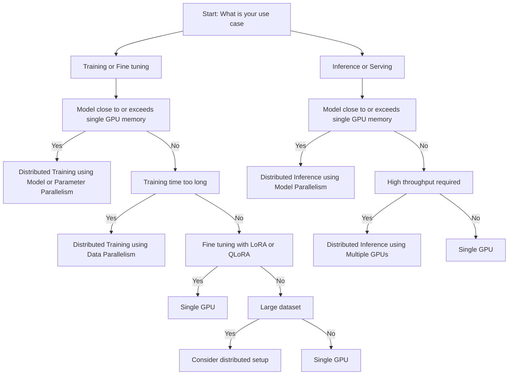

```mermaid
flowchart TD
    A[Start: What is your use case]

    A --> B[Training or Fine tuning]
    A --> D[Inference or Serving]

    %% Training including fine tuning
    B --> B1[Model close to or exceeds single GPU memory]
    B1 -->|Yes| B1Y[Distributed Training using Model or Parameter Parallelism]
    B1 -->|No| B2[Training time too long]
    B2 -->|Yes| B2Y[Distributed Training using Data Parallelism]
    B2 -->|No| B3[Fine tuning with LoRA or QLoRA]
    B3 -->|Yes| B3Y[Single GPU]
    B3 -->|No| B4[Large dataset]
    B4 -->|Yes| B4Y[Consider distributed setup]
    B4 -->|No| B4N[Single GPU]

    %% Inference or Serving
    D --> D1[Model close to or exceeds single GPU memory]
    D1 -->|Yes| D1Y[Distributed Inference using Model Parallelism]
    D1 -->|No| D2[High throughput required]
    D2 -->|Yes| D2Y[Distributed Inference using Multiple GPUs]
    D2 -->|No| D2N[Single GPU]
```