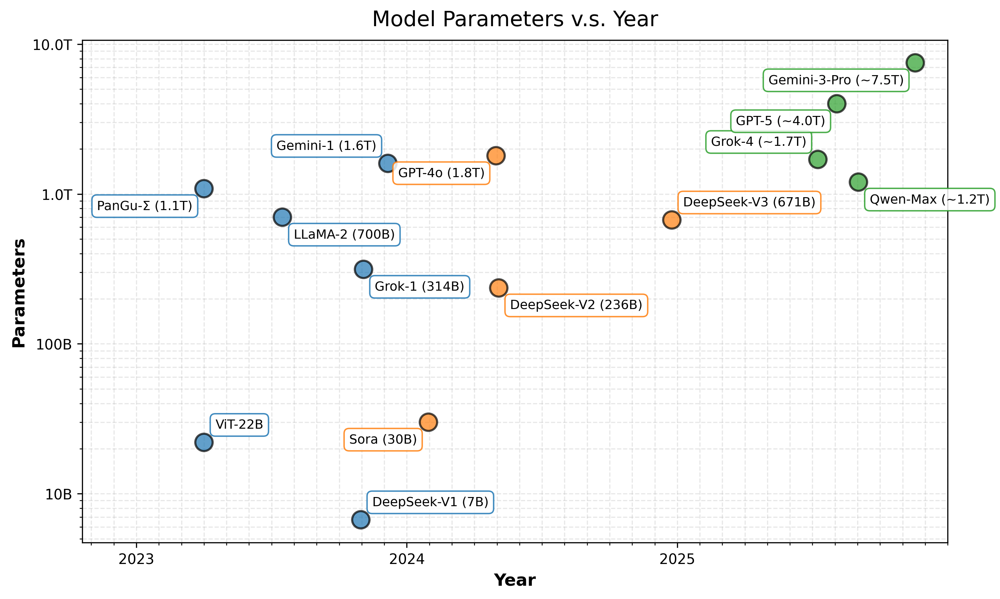
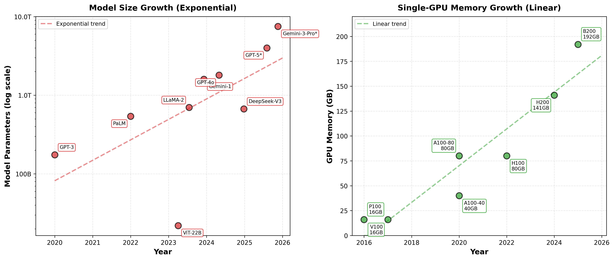
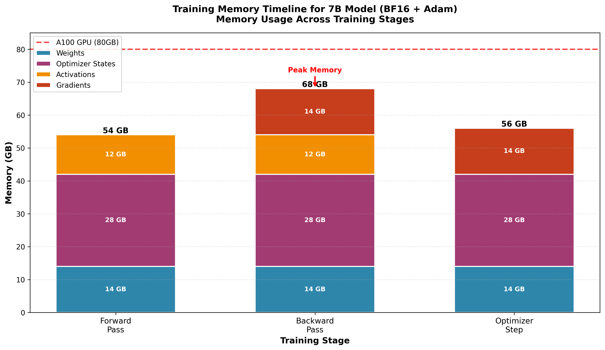
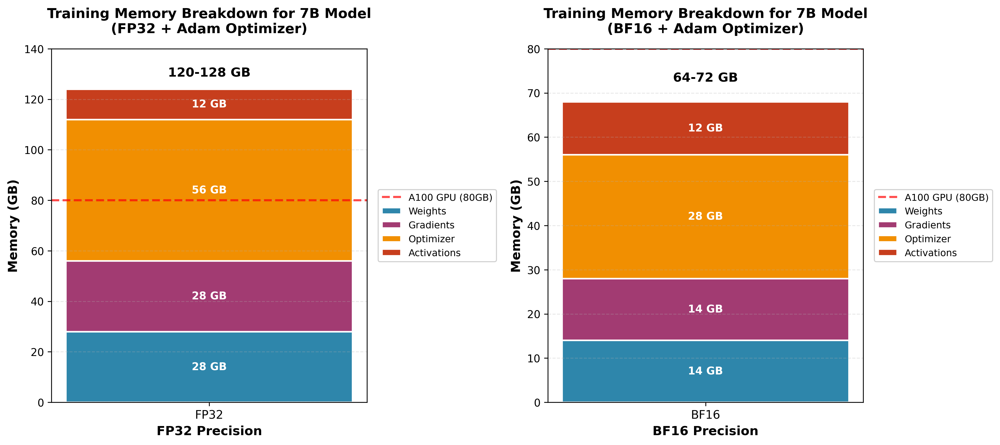
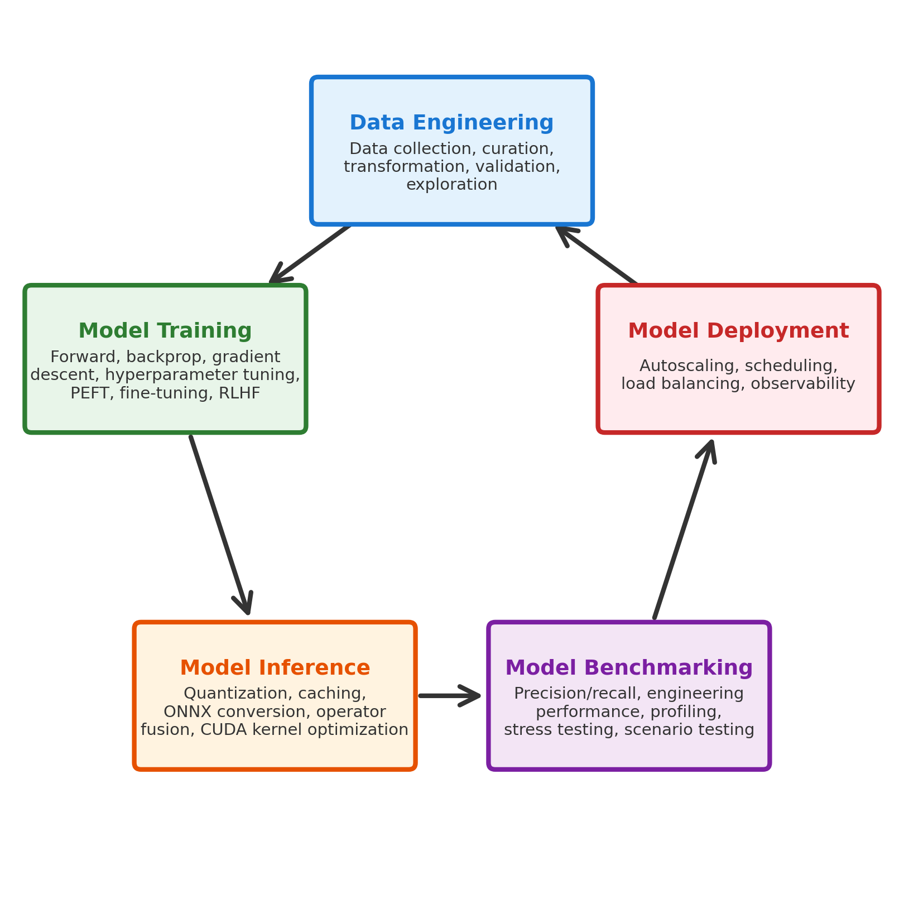

# Chapter 1: Introduction to Modern Distributed AI

**Chapter Length:** 28 pages

## Overview

Modern AI models have grown beyond what single GPUs can handle. Large language models now range from several billion to over a trillion parameters. Training models with tens of billions of parameters on a single GPU would take months, if they even fit in memory. Serving these models at scale requires distributed architectures.

This chapter covers resource estimation, decision frameworks for choosing between distributed training, fine-tuning, or inference, and practical examples to get started. Focus on making informed decisions and running distributed workloads effectively.

---

## 1. Why Modern AI Requires Distribution

A few years ago, you could train most models on a single GPU. ResNet-50 on ImageNet took a couple of days. Today, training a 70B parameter language model on a single GPU would take months, if it even fits in memory. The models got bigger, the datasets got bigger, and single-GPU training became impractical.

Looking at recent models, the scale is clear. GPT-4 has over 1 trillion parameters. Training it requires thousands of GPUs working together. Even smaller models like Llama 2 (70B parameters) need multiple GPUs just to fit in memory, let alone train efficiently.

| Model Name | Parameters | Company | Year |
|------------|------------|---------|------|
| ViT-22B | 22B | Google | 2023 |
| Sora | 30B | OpenAI | 2023 |
| Grok-1 | 314B | xAI | 2023 |
| Gemini-1 | 1.6T | Google | 2023 |
| LLaMA-2 | 700B | Meta | 2023 |
| PanGu-Σ | 1.085T | Huawei | 2023 |
| DeepSeek-V1 | 6.7B | DeepSeek | 2023 |
| GPT-4V | 1.8T | OpenAI | 2024 |
| DeepSeek-V2 | 236B MoE (16 experts, 2 active) | DeepSeek | 2024 |
| Grok-4 | ~1.7T (MoE) | xAI | 2025 |
| Qwen-Max | ~1.2T | Alibaba | 2025 |
| GPT-5 | ~2–5T | OpenAI | 2025 |
| DeepSeek-V3 | 671B MoE (64 experts, 8 active) | DeepSeek | 2025 |
| Gemini-3-Pro | ~7.5T | Google | 2025 |



### The Scale Challenge

Take a 70B parameter model as an example. In full precision (FP32), the model weights alone need 280GB of memory. An A100 GPU can have 80GB memory. You can't even load the model, let alone train it.

Training these models takes thousands of GPU-hours. A single GPU training run would take months. The datasets are massive too - trillions of tokens. Loading and preprocessing this data efficiently requires `distributed pipelines`.

The mismatch is clear: model size and compute requirements have grown exponentially, while single-GPU memory and compute have grown linearly at best.



### Estimating Model Resource Requirements

Before you start training or deploying, you need to know how much memory and compute you'll need. Get this wrong, and you'll hit out-of-memory errors or waste money on over-provisioned infrastructure.

The memory footprint depends on what you're storing. For model weights alone, the calculation is straightforward. Each parameter in FP32 takes 4 bytes, FP16/BF16 takes 2 bytes, Int8 takes 1 byte, and Int4 takes 0.5 bytes. For a 7B parameter model, that's 28 GB in FP32, 14 GB in BF16 (or FP16), 7 GB in Int8, and 3.5 GB in Int4.

**Note on precision:** For training, BF16 (bfloat16) is preferred over FP16 (float16). BF16 has the same exponent range as FP32 (8 bits) but reduced mantissa (7 bits), giving it the same dynamic range as FP32. This makes training more stable - less likely to overflow or underflow. FP16 has a smaller exponent range (5 bits), which can cause numerical issues during training. Modern GPUs (A100, H100) have Tensor Cores optimized for BF16. For inference, both FP16 and BF16 work, but BF16 is still preferred for consistency with training.

But model weights are just the start. During training, you also need space for gradients, optimizer states, and activations. For inference, you need KV cache for attention mechanisms. The total memory requirement can be several times larger than just the model weights.

#### Training Memory Requirements

Training needs way more memory than inference. You're storing model weights, gradients (one per parameter), optimizer states, and activations from the forward pass. The optimizer state size depends on which optimizer you use.

**SGD:**

$$
w_{t+1} = \boxed{w_t} - \eta  \boxed{g_t}
$$

SGD only needs the learning rate $\eta$ (a scalar) to update parameters. Looking at the formula, you compute $g_t$ during backprop, then subtract $\eta g_t$ from $w_t$. The optimizer state is just $\eta$ - negligible memory. You need to store $w_t$ (model weights) and $g_t$ (gradients), but no additional optimizer tensors.

**Adam:**

$$
w_{t+1} = \boxed{w_t} - \eta
\frac{\beta_1 \boxed{m_{t-1}} + (1-\beta_1) \boxed{g_t}}{\sqrt{\beta_2 \boxed{v_{t-1}} + (1-\beta_2) \boxed{g_t}^2} + \epsilon}
\cdot
\frac{\sqrt{1-\beta_2^t}}{1-\beta_1^t}
$$

Adam needs more. The formula shows it maintains two per-parameter tensors: $m_{t-1}$ (first-moment estimate) and $v_{t-1}$ (second-moment estimate). Both $m_{t-1}$ and $v_{t-1}$ have the same shape as $w_t$ - one value per parameter. So Adam stores $m_{t-1}$ (1× model size) and $v_{t-1}$ (1× model size), totaling 2× model size for optimizer states. 

$\beta_1$ and $\beta_2$ are hyperparameters - scalar constants (typically $\beta_1=0.9$, $\beta_2=0.999$). You store them once as configuration, not per parameter. Same with $\eta$ (learning rate) and $\epsilon$ - they're scalars, negligible memory. Only tensors with the same shape as $w_t$ (one value per parameter) need significant memory: $w_t$, $g_t$, $m_{t-1}$, and $v_{t-1}$.

That's why Adam needs 2× the model size for optimizer states compared to SGD's near-zero overhead.

**AdamW:**

AdamW (Adam with decoupled weight decay) has the same memory requirements as Adam. The difference is how weight decay is applied - AdamW applies it directly to parameters, while Adam adds it to gradients. But both maintain the same optimizer states: $m_{t-1}$ (1× model size) and $v_{t-1}$ (1× model size), totaling 2× model size. So AdamW also needs 2× the model size for optimizer states.

**When optimizers are used:**

The training loop follows this sequence: (1) forward pass - compute predictions and loss, storing activations; (2) backward pass - compute gradients $g_t$ for all parameters; (3) optimizer step - use the optimizer to update parameters from $w_t$ to $w_{t+1}$ using gradients $g_t$. 

The optimizer is called after backpropagation completes. At that point, you have gradients $g_t$ for all parameters. The optimizer uses these gradients (and its internal state like $m_{t-1}$ and $v_{t-1}$ for Adam) to compute parameter updates. After the optimizer step, you have updated parameters $w_{t+1}$ ready for the next iteration. The optimizer states ($m_{t-1}$, $v_{t-1}$ for Adam) persist across iterations - they're updated during each optimizer step and stored for the next iteration.

**Memory overlap during training:**

Activations, gradients, and optimizer states don't all overlap at the same time. Here's the timeline:

- **Forward pass**: Only activations in memory (no gradients yet, optimizer states persist but aren't actively used)
- **Backward pass**: Activations and gradients overlap (you need activations to compute gradients, and gradients accumulate as you go backward)
- **Optimizer step**: Gradients and optimizer states overlap (optimizer uses gradients and its states to update parameters). Activations are typically freed after backward pass completes, so they don't overlap with optimizer states.

The peak memory occurs during backward pass when both activations and gradients are in memory simultaneously. After backward pass, activations can be freed, so optimizer step only needs gradients and optimizer states.


```python
for epoch in range(num_epochs):
    model.train()                         # set to training mode
    for x_batch, y_batch in dataloader:   # iterate over batches
        optimizer.zero_grad()             # 1. clear gradients
        y_hat = model(x_batch)            # 2. forward pass
        loss = criterion(y_hat, y_batch)  # 3. compute loss
        loss.backward()                   # 4. backward pass
        optimizer.step()                  # 5. update parameters
```



**Memory timeline mapped to code:**

The timeline shows memory usage across the training loop. Here's how each stage maps to the code:

- **Line 2 (`y_hat = model(x_batch)`) - Forward Pass**: During forward pass, activations are computed and stored. Memory: weights (14 GB) + optimizer states (28 GB) + activations (12 GB) = 54 GB. Gradients don't exist yet.

- **Line 4 (`loss.backward()`) - Backward Pass**: This is where peak memory occurs. During backpropagation, you need both activations (to compute gradients) and gradients (being computed). Memory: weights (14 GB) + optimizer states (28 GB) + activations (12 GB) + gradients (14 GB) = 68 GB. This is the peak because activations and gradients overlap in memory.

- **Line 5 (`optimizer.step()`) - Optimizer Step**: After backward pass completes, activations can be freed. The optimizer uses gradients and its internal states to update parameters. Memory: weights (14 GB) + optimizer states (28 GB) + gradients (14 GB) = 56 GB. Activations are no longer needed.

The peak memory of 68 GB occurs during `loss.backward()` (line 4) when both activations and gradients are simultaneously in memory. This is why reducing batch size or using gradient checkpointing helps when you hit out-of-memory errors - they reduce activation memory during the backward pass.

**Why activations need memory:**

Activation layers (like ReLU, GELU, sigmoid) don't have parameters - they're just functions applied element-wise. But their outputs (activation outputs, often shortened to "activations") need to be stored in memory during training. 

During the forward pass, you compute and store all layer activation outputs (we call these "activations" for short). During backpropagation, you compute gradients layer by layer from the last layer backward. For each layer, you need its activation outputs to compute gradients. Once you've computed a layer's gradient and updated its parameters, you can free that layer's activation outputs - they're no longer needed. However, during the backward pass, there's overlap: while computing gradients for one layer, you still have activation outputs from earlier layers in memory. The peak memory occurs when you have both activations (activation outputs from forward pass) and gradients (from backward pass) simultaneously.

In practice, activations (activation outputs) and gradients do overlap in memory during backpropagation. The activation memory scales with batch size and sequence length - larger batches or longer sequences mean more activation outputs to store. Techniques like gradient checkpointing trade compute for memory by recomputing activations instead of storing them all.

**Mathematical derivation: Why gradients need activations**

Consider a simple 3-layer DNN: $x \rightarrow z \rightarrow h \rightarrow \hat{y}$ with Linear → Sigmoid → Linear layers:

```python
class SimpleDNN(nn.Module):
    def __init__(self, input_dim, output_dim, hidden_dim=1, bias=False):
        super(SimpleDNN, self).__init__()
        self.linear1 = nn.Linear(input_dim, hidden_dim, bias=bias)  # x -> z
        self.activation = nn.Sigmoid()                              # z -> h
        self.linear2 = nn.Linear(hidden_dim, output_dim, bias=bias) # h -> y_hat

    def forward(self, x):
        z = self.linear1(x)      # z = W₁x
        h = self.activation(z)   # h = σ(z)
        y_hat = self.linear2(h)  # y_hat = W₂h
        return y_hat
```

The forward pass is:

$$
z = W_1 x, \quad h = \sigma(z), \quad \hat{y} = W_2 h, \quad L = \frac{1}{2}(y - \hat{y})^2
$$

To compute gradients using backpropagation, we apply the chain rule. For $\frac{\partial L}{\partial W_2}$:

$$
\frac{\partial L}{\partial W_2} = \frac{\partial L}{\partial \hat{y}} \cdot \frac{\partial \hat{y}}{\partial W_2} = (\hat{y} - y) \cdot h
$$

The gradient depends on $h$ - the activation output from the sigmoid layer. You need $h$ stored in memory to compute this gradient.

For $\frac{\partial L}{\partial W_1}$, the chain is longer:

$$
\frac{\partial L}{\partial W_1} = \frac{\partial L}{\partial \hat{y}} \cdot \frac{\partial \hat{y}}{\partial h} \cdot \frac{\partial h}{\partial z} \cdot \frac{\partial z}{\partial W_1}
$$

Expanding each term:

- $\frac{\partial L}{\partial \hat{y}} = \hat{y} - y$ (needs $\hat{y}$)
- $\frac{\partial \hat{y}}{\partial h} = W_2$ (needs $W_2$)
- $\frac{\partial h}{\partial z} = \sigma'(z) = \sigma(z)(1-\sigma(z)) = h(1-h)$ (needs $h$)
- $\frac{\partial z}{\partial W_1} = x$ (needs input $x$)

So:

$$
\frac{\partial L}{\partial W_1} = (\hat{y} - y) \cdot W_2 \cdot h(1-h) \cdot x
$$

This gradient requires both $h$ (the activation output from the sigmoid layer) and $x$ (the input data read from the dataloader). Without storing $h$ (activation output) and $x$ (input data) during the forward pass, you can't compute these gradients during backpropagation. That's why activation outputs (activations) and input data must be kept in memory until their gradients are computed.

**Memory breakdown:**

For a 7B model with BF16: model weights (14 GB), gradients (14 GB), optimizer states with Adam (28 GB for $m_{t-1}$ and $v_{t-1}$), and activations (8-16 GB depending on batch size and sequence length). That's 64-72 GB total per GPU. With SGD, you'd save 28 GB on optimizer states, but Adam's adaptive learning rates usually converge faster, so the trade-off is worth it for most cases. That's why a 7B model needs at least an A100 (80GB) for training with Adam, even with mixed precision (BF16). Smaller GPUs won't cut it.

**Variable definitions:**

$w_t$: model parameters at iteration $t$  
$w_{t+1}$: updated parameters  
$g_t$: gradient of loss w.r.t. parameters at iteration $t$ ($g_t = \nabla_w L(w_t)$)  
$\eta$: learning rate (used for both SGD and Adam)  
$\beta_1$: decay rate for the first moment (mean)  
$\beta_2$: decay rate for the second moment (uncentered variance)  
$m_{t-1}$: first-moment estimate from previous step  
$v_{t-1}$: second-moment estimate from previous step  
$\epsilon$: small constant for numerical stability  
$t$: iteration index used for bias correction




#### Inference Memory Requirements

Inference is simpler. You just need the model weights and KV cache for attention. The KV cache size depends on your batch size, sequence length, and model architecture. For a 70B model with BF16, you're looking at 140 GB for model weights and another 20-40 GB for KV cache with a batch size of 32 and sequence length of 2048. That's 160-180 GB total. That's why inference for large models needs multiple GPUs or model parallelism. A single A100 won't hold it.

#### GPU Requirements Estimation

For training, calculate your memory needs, add 10-20% safety margin for communication buffers and framework overhead, then see if it fits. A 13B model with BF16 needs about 72 GB per GPU. With safety margin, that's 85 GB. An A100 has 80 GB, so you'll need 2 GPUs with model parallelism or FSDP.

For inference, it's similar. Calculate model size plus KV cache. A 70B model in BF16 needs 140 GB just for weights. With KV cache, you're looking at 160-180 GB total. You'll need 2+ A100 GPUs, or use Int8 quantization to get it down to 70 GB for weights, which might fit on one GPU with careful KV cache management.

#### Real-World Considerations

Don't forget the overhead. PyTorch adds 1-2 GB. The OS needs 5-10 GB. Distributed training needs 2-5 GB per GPU for communication buffers. Checkpointing causes temporary spikes. Start conservative and add 20-30% buffer to your estimates. Use mixed precision (BF16 for training, FP16/BF16 for inference) to cut memory in half compared to FP32. Monitor with `nvidia-smi` to see actual usage. For inference, Int8 quantization can halve memory with minimal accuracy loss. And remember, activations scale linearly with batch size - if you hit OOM, reduce batch size first.

**Quick Reference Table:**

| Model Size | FP32 Weights | BF16 Weights | Training (BF16+Adam) | Inference (BF16) |
|------------|--------------|--------------|----------------------|------------------|
| 1B         | 4 GB         | 2 GB         | ~8 GB                | 2-4 GB           |
| 7B         | 28 GB        | 14 GB        | ~60-70 GB            | 14-20 GB         |
| 13B        | 52 GB        | 26 GB        | ~110-130 GB          | 26-35 GB         |
| 70B        | 280 GB       | 140 GB       | ~600-700 GB          | 140-180 GB       |

*Note: Training estimates assume Adam optimizer and moderate batch size. Actual values vary based on architecture, sequence length, and batch size.*

### The Evolution from Classic ML to Foundation Models

Classic machine learning models were designed to fit on a single machine. Traditional ML models - such as linear regression, logistic regression, decision trees, random forests, support vector machines (SVM), and gradient boosting (XGBoost, LightGBM) - typically had thousands to millions of parameters and were trained on datasets that fit in memory. The deep learning era brought models with hundreds of millions of parameters (e.g., ResNet, BERT), requiring GPUs but still manageable on single devices. Today's foundation model era has models with billions to trillions of parameters (e.g., GPT-4, Gemini, LLaMA), requiring distributed systems from day one.

The shift to distributed AI enabled breakthrough capabilities - models that can understand and generate human-like text, code, and multimodal content. It also drove enterprise adoption, with companies deploying AI at scale for production workloads, and accelerated research through faster iteration cycles enabled by parallel experimentation.

---

## 2. The Modern AI Model Lifecycle

Building AI models isn't a one-shot process. It's a cycle: you collect data, train a model, deploy it, see how it performs, then go back and improve the data or model. Each stage feeds into the next.

The lifecycle looks like this:

**Data Engineering** → **Model Training** → **Model Inference** → **Model Benchmarking** → **Model Deployment** → **Data Engineering** (repeat)



You start with data engineering. Collect data, curate it, transform it, validate it, explore it. You're preparing terabytes of data for training. Clean it, deduplicate it, filter for quality, format it. Tools like NeMo Curator handle this at scale.

Then you train the model. Forward pass, backprop, gradient descent. Tune hyperparameters, use parameter-efficient tuning (PEFT), fine-tune, maybe do RLHF. You're learning model parameters from data. This is where distributed training shines - split models and data across GPUs.

Once trained, you run inference. Quantize the model, cache activations, convert to ONNX, fuse operators, optimize CUDA kernels. You're generating predictions. Latency and throughput matter here. Distributed inference handles models too large for a single GPU.

Before deploying, you benchmark. Measure precision and recall, evaluate engineering performance, profile bottlenecks, run stress tests, test different scenarios. You're checking how well the model works. Distributed evaluation speeds up testing on large datasets.

Then you deploy. Set up autoscaling, scheduling, load balancing, observability. Put the model in production. That means API gateways, monitoring, handling thousands of requests per second.

Production feedback tells you what data to collect next, or where the model fails. You loop back to data engineering. The cycle repeats.


This book focuses on the distributed technologies you need for training, inference, benchmarking, and deployment. Data engineering gets a brief overview but isn't the main focus. Distributed data processing is important, but it's a well-established topic. Spark, Dask, and Ray have been around for years. This book covers the basics - what you need to know to prepare data for distributed training - but the real focus is on AI-specific distributed challenges: training large models, serving them at scale, and optimizing inference.

The principles are the same across all stages: parallelism, communication, memory management, fault tolerance. But the techniques differ. Training is iterative with frequent gradient syncs. Inference is latency-sensitive with throughput requirements.

---

## 3. Distributed Data Processing: Preparing Data at Scale

Before you can train or serve models, you need to prepare your data. Modern AI models are trained on massive datasets - trillions of tokens for language models, billions of images for vision models, petabytes of multimodal data. Processing and curating this data efficiently requires distributed systems, often before you even start thinking about model training.

### The Data Preparation Challenge

Training a large language model means processing terabytes to petabytes of raw text data. You're loading data from multiple sources - web crawls, databases, APIs. Then you clean it, filter out low-quality content, deduplicate it, detect languages. You score content for training value. You format it - tokenize it, chunk it. You store it efficiently so distributed training can load it fast.

A single-node approach would take weeks or months. Processing 8TB of text data for deduplication on a single machine might take days. With distributed processing across multiple nodes, you can reduce that to hours.

### Distributed Data Processing Technologies

Modern data curation tools use distributed computing frameworks to scale. Ray lets you run tasks in parallel across clusters. Apache Spark handles large-scale data processing with distributed dataframes. Dask schedules tasks across multiple workers.

For GPU acceleration, RAPIDS (cuDF, cuML) gives you GPU-accelerated dataframes and machine learning primitives. GPU-accelerated deduplication uses GPU memory and compute for similarity calculations. Parallel I/O with distributed file systems and object storage maximizes throughput.

Take [NVIDIA NeMo Curator](https://github.com/NVIDIA-NeMo/Curator) as an example. It's a scalable data preprocessing and curation toolkit for large-scale AI model training. It processes data across clusters, scaling from single machines to hundreds of nodes. It uses RAPIDS libraries (cuDF, cuML) for GPU-accelerated operations like deduplication and quality filtering. It has modular pipelines - composable data processing stages that run in parallel. It's optimized for distributed storage systems like S3.

The performance numbers are real: 16× faster fuzzy deduplication on 8TB datasets compared to CPU-based alternatives. Near-linear scaling from 1 to 4 H100 nodes (2.05 hours → 0.50 hours). 40% lower total cost of ownership through GPU acceleration.

### Key Distributed Data Processing Patterns

Data parallelism in processing means splitting datasets across multiple workers. Each worker processes a shard independently. Then you aggregate results. Deduplication requires cross-worker communication, which adds complexity.

Pipeline parallelism means stage-based processing: ingestion → cleaning → filtering → formatting. Different stages can run in parallel on different workers. You stream data through the pipeline for memory efficiency.

Distributed storage and I/O use distributed file systems (HDFS, Lustre) or object storage (S3, GCS). Parallel I/O maximizes bandwidth. Caching strategies reduce redundant reads.

Fault tolerance means checkpointing intermediate results. You need resumable processing pipelines. Handle worker failures gracefully. Processing terabytes of data takes time - if a worker crashes, you don't want to start over.

### When Do You Need Distributed Data Processing?

You need distributed data processing when your dataset size exceeds single-node capacity. Multi-terabyte datasets don't fit in memory or take too long to process. Single-node processing would take days or weeks. GPU-accelerated distributed processing can be more cost-effective than CPU-based single-node processing. Or you need real-time data pipelines - continuous data ingestion and processing for ongoing model training.

For smaller datasets (under 100GB) that fit comfortably in memory, single-node processing is often sufficient. But as datasets grow to terabytes and beyond, distributed processing becomes essential.

### Integration with Training Pipelines

Distributed data processing feeds into distributed training. The output of data curation - cleaned, deduplicated, and formatted datasets - becomes the input for distributed training systems. This helps you design end-to-end pipelines from raw data to trained models. You can optimize data loading with efficient data sharding and loading for distributed training. You can handle large-scale datasets that are too large for single nodes. Faster data preparation means faster iteration cycles.

The distributed systems principles you learn in data processing - parallelism, fault tolerance, efficient I/O - apply directly to distributed training and inference.

---

## 4. Training vs Inference vs Serving

Training, inference, and serving are different. Each has different requirements, bottlenecks, and optimization strategies. Know these differences to design effective distributed systems.

### Training: The Learning Phase

Training is about learning model parameters from data. The process follows a pattern: forward pass through the model, loss computation, backward pass to compute gradients, and gradient update to adjust parameters. This happens iteratively over multiple epochs until the model converges.

Training requires storing activations, gradients, and optimizer states in memory. The compute is intensive and iterative. In distributed training, you need frequent gradient synchronization across devices to keep all model copies consistent. The challenges are gradient synchronization overhead, memory constraints for large models, long training times that can span days to weeks, and the need for fault tolerance and checkpointing.

Training a 7B parameter model on 1 trillion tokens typically requires 8 A100 GPUs (80GB each) and about 2 weeks of continuous training. You need careful gradient synchronization to maintain training stability across all GPUs.

### Inference: The Prediction/Generation Phase

Inference is about generating predictions from a trained model. Unlike training, you only need a forward pass - no gradients, no backward pass, no optimizer states. Memory requirements are lower: just model weights and KV cache for attention mechanisms. The compute per request is lower, but you need high throughput to serve many requests at once. Communication is minimal, mostly only for distributed inference.

The challenges are latency (sub-second for interactive apps), throughput (thousands of requests per second), efficient memory usage through KV cache management, and effective batching and scheduling. Serving a 70B parameter model for chat requires optimized inference engines like vLLM or SGLang, continuous batching to maximize GPU utilization, and careful KV cache management for variable-length sequences.

### Serving: The Production System

Serving is about providing reliable, scalable access to models. It's not just running inference - it's building a production system with a model runner, API gateway, load balancer, and monitoring. The requirements are high availability, fault tolerance, and observability. At scale, you're dealing with multi-model, multi-tenant systems.

The challenges are system reliability and uptime, multi-model routing and load balancing, cost optimization through GPU utilization and autoscaling, and observability for debugging. A production LLM serving platform might include multiple model variants (different sizes, fine-tuned versions), A/B testing infrastructure, canary deployment pipelines, and distributed tracing and monitoring.

### Comparison Table

| Aspect | Training | Inference | Serving |
|--------|----------|-----------|---------|
| **Primary Goal** | Learn parameters | Generate predictions | Provide access |
| **Memory Usage** | High (activations + gradients) | Medium (weights + KV cache) | Variable |
| **Compute Pattern** | Iterative, intensive | Single forward pass | Request-driven |
| **Communication** | Frequent (gradients) | Minimal | API-level |
| **Latency Requirement** | Hours to days | Milliseconds to seconds | Milliseconds |
| **Throughput Focus** | Samples per second | Tokens per second | Requests per second |

---

## 5. Decision Framework: When Do You Need Distributed Systems?

The question isn't whether distributed systems are cool - it's whether you actually need them. Distributed training adds complexity, communication overhead, and cost. Use it when you have to, not when you want to.

### When Do You Need Distributed Training?

Three scenarios force you into distributed training:

First, the model doesn't fit. Calculate model size in BF16 (parameters × 2 bytes). If that's more than 80% of your GPU memory, you need model parallelism or FSDP. A 13B model needs 26GB just for weights. With Adam optimizer, you're looking at 72GB total. An A100 has 80GB, so you're cutting it close. You'll need 2+ GPUs.

Second, training takes too long. If single-GPU training would take weeks or months, and you need faster iteration, go distributed. Training a 7B model on 1T tokens takes about 2 weeks on 8 GPUs. On 1 GPU, it's months.

Third, the dataset is too large. If data loading becomes the bottleneck, or you can't fit the dataset on a single node, use data parallelism. Multi-terabyte datasets benefit from distributed data loading.

When is single-GPU enough? If the model fits comfortably with room for activations, training completes in hours to days, the dataset fits locally, and budget favors single-GPU solutions, stick with one GPU.

### When Do You Need Distributed Fine-tuning?

Fine-tuning is usually lighter than full training, but you might still need distribution.

If the base model is too large for a single GPU, you need model parallelism. Fine-tuning a 70B model requires splitting it across multiple GPUs, just like training.

Large fine-tuning datasets benefit from distributed data loading. If you're fine-tuning on a domain-specific corpus with millions of examples, multiple GPUs help.

Parameter-efficient methods like LoRA and QLoRA change the equation. QLoRA on a 70B model can fit in a 48GB GPU because it only trains adapter weights. Full fine-tuning of the same model needs multiple GPUs. If you can use LoRA/QLoRA, you can often stick with a single GPU.

### When Do You Need Distributed Inference?

Inference has different constraints than training. You need distribution when:

The model doesn't fit. A 70B model in BF16 needs 140GB just for weights. With KV cache, you're at 160-180GB. That's 2+ A100 GPUs minimum.

Throughput exceeds single GPU capacity. If you need to serve thousands of requests per second, a single GPU won't cut it. A chat application with 10,000 concurrent users needs multiple GPUs or nodes.

You need low latency at high throughput. Real-time services need sub-second latency while handling many requests. That often requires tensor parallelism or multiple inference instances.

When is single-GPU inference enough? If the model fits with room for KV cache, throughput is within single GPU capacity, latency requirements are met, and cost favors single-GPU deployment, stick with one GPU. Use optimized engines like vLLM or SGLang to maximize utilization.

### Decision Tree: Quick Reference

```
Start: What is your use case?
│
├─ Training from scratch?
│  ├─ Model > 60GB? → Distributed Training (FSDP/Model Parallel)
│  ├─ Training time too long? → Distributed Training (Data Parallel)
│  └─ Both OK? → Single GPU
│
├─ Fine-tuning?
│  ├─ Base model > GPU memory? → Distributed Fine-tuning
│  ├─ Using LoRA/QLoRA? → Usually single GPU OK
│  └─ Large dataset? → Consider distributed
│
└─ Inference/Serving?
   ├─ Model > GPU memory? → Distributed Inference (Model Parallel)
   ├─ High throughput needed? → Distributed Inference (Multiple GPUs)
   └─ Both OK? → Single GPU with optimization (vLLM/SGLang)
```

### Real-World Examples

A startup training a 7B model: model size is 14GB in BF16, they have one A100 with 80GB. The model fits with room for training overhead, so a single GPU is sufficient. They use mixed precision (BF16) and gradient checkpointing if needed.

An enterprise fine-tuning a 70B model: model size is 140GB in BF16, exceeding a single GPU's capacity. With 4 A100 GPUs available, they need distributed fine-tuning. They use FSDP or model parallelism, and might consider QLoRA to reduce memory requirements.

Production inference with a 13B model: requirements are 1000 requests per second with less than 500ms latency. Model size is 26GB in BF16. With 2 A100 GPUs, distributed inference is needed to meet the throughput requirement. They use vLLM with tensor parallelism or multiple instances.

A research lab training a 1B model: model is only 2GB in BF16, dataset is 100GB, they have one RTX 4090 with 24GB. The model and data fit comfortably, so a single GPU is sufficient. They use a standard training pipeline with BF16.

---

## 6. PyTorch Distributed Fundamentals

Before writing distributed training code, you need the basic concepts and APIs that PyTorch provides. Here are the essential building blocks that all distributed code relies on.

### Process Groups and Ranks

In distributed training, multiple processes work together. Each process runs on a different GPU or node. PyTorch organizes these processes into a process group. Within a process group, each process has a unique rank - an integer identifier starting from 0. The total number of processes is called the world size.

Think of it like this: if you have 4 GPUs, you'll have 4 processes. Process 0 runs on GPU 0, process 1 on GPU 1, and so on. The rank tells each process which GPU it should use and which part of the data it should process.

To check your GPU setup, you can use the code in `code/check_cuda.py`:

```python
import torch

print(f"CUDA available: {torch.cuda.is_available()}")
print(f"Number of GPUs: {torch.cuda.device_count()}")
for i in range(torch.cuda.device_count()):
    print(f"GPU {i}: {torch.cuda.get_device_name(i)}")
```

### Initializing the Process Group

Before any distributed operations, initialize the process group. This tells PyTorch how processes should communicate. The most common backend for GPU training is NCCL (NVIDIA Collective Communications Library).

Here's the basic initialization pattern:

```python
import torch.distributed as dist

def setup(rank, world_size):
    dist.init_process_group(
        backend="nccl",  # Use NCCL for GPU communication
        rank=rank,       # This process's rank
        world_size=world_size  # Total number of processes
    )
    torch.cuda.set_device(rank)  # Set which GPU this process uses
```

The simplest test to verify your distributed setup works is in `code/distributed_basic_test.py`. It's a basic distributed test that verifies process group initialization and communication. It doesn't use DDP - it just tests that multiple processes can communicate.

For multi-GPU testing:
```bash
torchrun --nproc_per_node=2 code/distributed_basic_test.py
```

For single-GPU simulation (useful for testing without multiple GPUs), use `code/multi_gpu_simulation.py`:
```bash
# Simulate 2 processes on GPU 0
CUDA_VISIBLE_DEVICES=0 torchrun --nproc_per_node=2 code/multi_gpu_simulation.py
```

When you run either script, you should see "Rank 0 says hello" and "Rank 1 says hello" printed from different processes. Single-GPU simulation mode is helpful for testing distributed code logic before running on actual multi-GPU setups.

### DistributedDataParallel (DDP)

DDP is PyTorch's way of wrapping a model for distributed training. When you wrap a model with DDP, PyTorch automatically handles gradient synchronization across all processes. Each process computes gradients on its local data, then DDP averages these gradients across all processes before updating the model.

DDP assumes each process has a complete copy of the model. The model itself isn't split - only the data is partitioned. Each process trains on a different subset of the data, but all processes maintain identical model parameters after each training step.

Here's how you wrap a model:

```python
from torch.nn.parallel import DistributedDataParallel as DDP

model = YourModel().cuda(rank)
model = DDP(model, device_ids=[rank])
```

After wrapping, you use the model exactly as you would in single-GPU training. DDP handles the synchronization behind the scenes during `loss.backward()`.

### DistributedSampler

Each process should train on different data, so you need a DistributedSampler. It splits the dataset so each process gets a unique subset. Without it, all processes see the same data, defeating the purpose of distributed training.

```python
from torch.utils.data import DataLoader, DistributedSampler

sampler = DistributedSampler(
    dataset, 
    num_replicas=world_size,  # Total number of processes
    rank=rank  # This process's rank
)
dataloader = DataLoader(dataset, batch_size=32, sampler=sampler)
```

You must call `sampler.set_epoch(epoch)` at the start of each epoch to ensure data shuffling works correctly across epochs.

### Launching Distributed Jobs

You can launch distributed training in two ways. The modern approach uses `torchrun`, which handles process spawning automatically.

```bash
torchrun --nproc_per_node=2 code/multi_gpu_ddp.py
```

This launches 2 processes on the current machine. For multi-node training, specify `--nnodes`, `--node_rank`, and `--master_addr` as well.

The alternative is using `torch.multiprocessing.spawn()` directly in your code, which is what `multi_gpu_ddp.py` does internally.

### Common Pitfalls

Several mistakes trip up beginners. The code in `code/ddp_pitfalls.py` shows the wrong and right ways:

First, all processes must use the same `MASTER_PORT`. If each process uses a different port, they can't communicate. Set it once before initialization, not per-process.

Second, always use DistributedSampler with your DataLoader. Without it, each process sees all the data, which means you're not actually doing distributed training - just running the same training multiple times.

Third, call `sampler.set_epoch(epoch)` in your training loop. This ensures data shuffling works correctly. Without it, each epoch uses the same data order.

---

## 7. Quick Start: Your First Distributed Workloads

Let's run some actual distributed training code. All examples in this section correspond to files in `code/`.

**Note:** All commands in this section should be run from the book root directory (where the `code/` folder is located).

### Prerequisites Check

Verify your environment using `code/check_cuda.py`:

```python
import torch

print(f"CUDA available: {torch.cuda.is_available()}")
print(f"Number of GPUs: {torch.cuda.device_count()}")
for i in range(torch.cuda.device_count()):
    print(f"GPU {i}: {torch.cuda.get_device_name(i)}")
```

**Requirements:**
- PyTorch with CUDA support
- 2+ GPUs (for distributed examples)
- NCCL (usually included with PyTorch)

### Quick Start 1: Single-GPU Baseline

**File:** `code/single_gpu_baseline.py`

Establish a single-GPU baseline before comparing distributed training. This script trains ResNet18 (from torchvision) on the FashionMNIST dataset. The model completes training in under 30 seconds on a single GPU, making it perfect for quick experiments and comparisons.

```bash
python code/single_gpu_baseline.py
```

This gives you a reference point for comparing distributed training performance. You'll see training loss, accuracy, total time, and peak memory usage. The same model architecture is used in the multi-GPU script for fair comparison.

### Quick Start 2: Multi-GPU Distributed Training

**File:** `code/multi_gpu_ddp.py`

A complete distributed training example using DDP. This script trains the same ResNet18 model (from torchvision) on FashionMNIST using multiple GPUs. It uses the exact same model architecture as the single-GPU baseline for fair comparison. It includes proper setup, DistributedSampler usage, and cleanup. The code shows the full pattern you'll use in real training jobs.

**Run it:**
```bash
# Using torchrun (recommended)
# Set OMP_NUM_THREADS before running to avoid warning
OMP_NUM_THREADS=4 torchrun --nproc_per_node=2 code/multi_gpu_ddp.py

# Or use the launch script (sets OMP_NUM_THREADS automatically)
bash code/launch_torchrun.sh
```

The launch script contains the torchrun command with proper arguments, making it easier to run distributed training.

Compare the training time with your single-GPU baseline. You should see a speedup, though not perfectly linear due to communication overhead. With 2 GPUs, you typically see 1.5-1.8× speedup depending on your hardware and network configuration.

### Quick Start 3: Profiling and Performance Analysis

**File:** `code/profiling.py`

When you need to see where time and memory are spent, use profiling. The `profiling.py` script shows how to use PyTorch's profiler to measure CUDA operations and memory usage. Run it to see detailed timing and memory breakdowns:

```bash
python code/profiling.py
```

Compare the single-GPU baseline (`single_gpu_baseline.py`) with multi-GPU training (`multi_gpu_ddp.py`) to see where distributed training helps and where communication overhead appears. Typical findings show data loading takes 20-40% of time, forward pass 30-50%, backward pass 40-60%, and communication adds 10-30% overhead in multi-GPU setups. The FashionMNIST dataset downloads automatically on first run (rank 0 handles the download in distributed mode).

### Additional Helper Scripts

The `code/` directory also contains utility scripts:

- `gpu_friendly_config.py`: Recommended GPU-friendly configuration settings for batch size, precision, and gradient checkpointing.
- `measure_components.py`: Helper function to measure time spent in data loading, computation, and communication separately.
- `ddp_pitfalls.py`: Common mistakes and their correct implementations.

### Launching Distributed Jobs

**Using torchrun (recommended):**

```bash
# Single node, multiple GPUs
torchrun --nproc_per_node=4 train.py

# Multiple nodes (node 0)
torchrun --nnodes=2 --node_rank=0 --nproc_per_node=8 \
    --master_addr="192.168.1.1" --master_port=29500 train.py

# Multiple nodes (node 1)
torchrun --nnodes=2 --node_rank=1 --nproc_per_node=8 \
    --master_addr="192.168.1.1" --master_port=29500 train.py
```

### Quick Validation

**Check if distributed training is working:**

```python
import time

# Measure training speed
start = time.time()
# ... training step ...
elapsed = time.time() - start

if rank == 0:
    print(f"Time per step: {elapsed:.3f}s")
    print(f"Using {world_size} GPUs")
```

**Common issues:**
- **Hanging:** Check NCCL communication, firewall settings
- **OOM:** Reduce batch size or use gradient accumulation
- **Slow:** Check data loading, use high-speed interconnects

---

## Key Takeaways

Estimate resources first. Use the formulas in this chapter to calculate memory and compute requirements before starting. Make informed decisions using the decision framework to determine if you need distributed systems for your use case. Start simple - begin with single-GPU solutions, then scale when necessary. Profile before optimizing - measure actual bottlenecks before making changes. Use the right approach - training, fine-tuning, and inference have different requirements and optimization strategies.

---

## Summary

This chapter covered when and how to use distributed AI systems. You learned resource estimation - formulas and methods to calculate memory and compute requirements for models. You got a decision framework - clear guidelines for determining when you need distributed training, fine-tuning, or inference. You saw quick start examples - practical, runnable code for distributed training, fine-tuning, and inference. You learned the fundamental differences between training, inference, and serving.

The most important lesson: estimate first, decide second, then implement. Don't assume you need distributed systems - calculate your requirements and make an informed decision.

The next chapter dives deeper into GPU hardware, networking, and parallelism strategies, building on the foundation established here.

---

## Further Reading

- PyTorch Distributed Training: https://pytorch.org/tutorials/intermediate/ddp_tutorial.html
- NVIDIA NCCL Documentation: https://docs.nvidia.com/deeplearning/nccl/
- GPU Memory Management: https://pytorch.org/docs/stable/notes/cuda.html
- Profiling PyTorch Models: https://pytorch.org/tutorials/recipes/recipes/profiler_recipe.html
