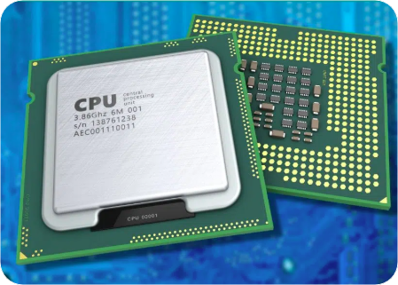
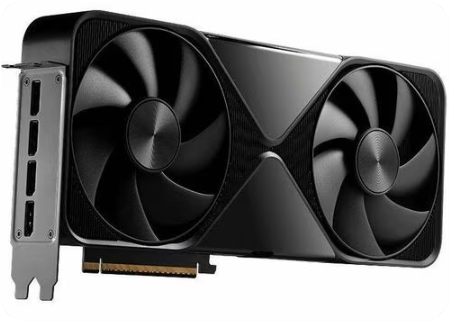
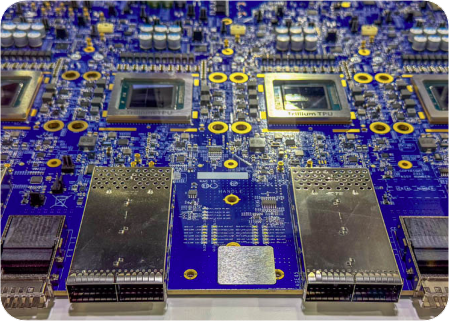
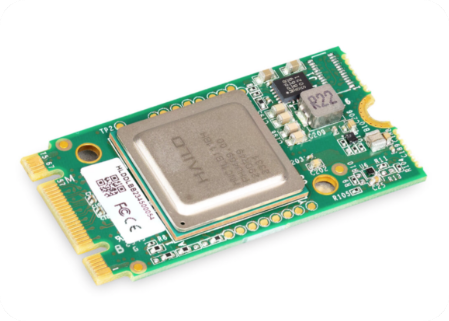

# Chapter 2: GPU Hardware, Networking, and Parallelism Strategies {-}

*Understanding hardware topology and parallelism strategies for distributed AI*

> The innovation isn't just about chips, it's about the entire stack.
- Jensen Huang

**Code Summary**

- `nvidia-smi`: Command-line utility to monitor GPU status and utilization
- `torch.cuda.device_count()`: Get the number of available CUDA devices
- `torch.cuda.get_device_name()`: Get the name of a CUDA device
- `torch.cuda.is_available()`: Check if CUDA is available
- `torch.distributed.get_world_size()`: Get the total number of processes in the distributed group
- `torch.distributed.get_rank()`: Get the rank of the current process
- `torch.distributed.get_backend()`: Get the backend name (e.g., 'nccl', 'gloo')
- `nvidia-ml-py`: Python library for querying NVIDIA GPU information
- `ibstat`: Command to check InfiniBand adapter status


## Computational Power: AI Clusters and Metrics

In Chapter 1, we established why distributed AI is essential—models have grown beyond single-GPU capacity, and the computational gap between model requirements and hardware capabilities continues to widen. Now we need to understand the hardware foundation that makes distributed training possible. Before diving into GPU specifics, let's step back and understand what we're really building: AI clusters that deliver massive computational power. The numbers matter here—when you're training a 70B parameter model, you're not just using a few GPUs. You're orchestrating hundreds or thousands of them, and the way they're connected determines whether your training job finishes in days or weeks.

### What is Computational Power?

Computational power, or compute capacity, measures how many operations a system can perform per second. For AI workloads, we care about __floating-point operations per second (FLOPS)__. The scale is exponential: a single modern GPU like the H200 delivers around 1,000 TFLOPS (teraFLOPS, or $10^{12}$ operations per second) for FP16 operations. A cluster with 1000 such GPUs gives you roughly 1,000 PFLOPS (petaFLOPS, $10^{15}$ operations per second), or 1 EFLOPS (exaFLOPS, $10^{18}$ operations per second): 1000 GPUs × 1000 TFLOPS = $10^{6}$ TFLOPS = 1000 PFLOPS = 1 EFLOPS.

{#fig:computational-growth-gap .wrap width=60% align=top-right lines=15}

But here's the thing: raw FLOPS numbers don't tell the whole story. Peak throughput depends on precision—FP64 for traditional HPC, FP32 as a training baseline, FP16/BF16 for modern AI training, FP8 and lower for inference and quantization (see the precision-format table in Chapter~\ref{chap:introduction-to-modern-distributed-ai}). When someone says "this cluster delivers 500 PFLOPS," ask at what precision: an HPC cluster might quote FP64, while an AI cluster quotes FP16 or BF16. The same hardware can show very different numbers depending on which format you measure.


The growth in computational demand for AI has been staggering. Large language models require computational resources that grow by orders of magnitude over a few years, depending on workload and model scaling, while hardware capabilities grow only about 3x in the same period. This gap is why distributed training isn't optional—it's __the only way__ to train modern models in reasonable time.

As shown in @fig:computational-growth-gap, model memory requirements have grown exponentially while single-GPU memory capacity has increased more gradually. This widening gap makes distributed training not just beneficial, but essential for training modern large-scale models within reasonable timeframes.[^computational-gap-data]

[^computational-gap-data]: GPU memory capacity data from NVIDIA specifications: A100 (2020, 80GB), H100 (2022, 80GB HBM3), H200 (2023, 141GB HBM3e), B200 (2024, 192GB); each new generation typically adds HBM capacity and NVLink bandwidth, so later flagship GPUs follow the same trend even though the figure shows representative deployed SKUs. Model memory requirements calculated from published parameter counts (see @tbl:model-comparison) using BF16 precision (2 bytes per parameter): GPT-3 175B (2020, ~350GB), LLaMA-2 70B (2023, ~140GB), DeepSeek-V2 236B (2024, ~472GB), DeepSeek-V3 671B (2025, ~1342GB), DeepSeek-V4-Pro 1.6T (2026, ~3200GB). The figure uses these disclosed milestones; larger approximate counts (marked ~ in the table) are omitted. Values shown represent single-GPU memory requirements for model weights only; actual training requires additional memory for gradients, optimizer states, and activations, further necessitating distributed training.

[^h100-te]: NVIDIA, "NVIDIA H100 Tensor Core GPU Architecture," whitepaper, 2022, https://resources.nvidia.com/en-us-hopper-architecture (Transformer Engine with FP8; up to 6× training throughput on transformer models vs A100). For independently audited results on large language-model training, see NVIDIA, "Breaking MLPerf Training Records with NVIDIA H100 GPUs," Technical Blog, 2023, https://developer.nvidia.com/blog/breaking-mlperf-training-records-with-nvidia-h100-gpus/ (MLPerf Training 3.0; GPT-3 175B and BERT with Transformer Engine and FP8).

### Why Clusters?

A single GPU, even a high-end one, isn't enough for modern AI workloads. A 70B parameter model with FP16 weights takes about 140 GB just to store the model. Add gradients, optimizer states, and activations, and you're looking at 500+ GB per training step. That's beyond what any single GPU can hold.

A **cluster** is a group of computers (nodes) connected by high-speed networks, working together as a single system. Each node typically has multiple GPUs, CPUs, memory, and storage. The key insight is that by coordinating work across many nodes, you can:

- **Scale memory**: Distribute model parameters, gradients, and optimizer states across GPUs
- **Scale compute**: Process larger batches or train faster by parallelizing work
- **Scale storage**: Handle datasets that don't fit on a single machine

{#fig:ai-cluster .block width=100% align=top-right}


As illustrated in @fig:ai-cluster, an AI cluster consists of multiple nodes, each containing multiple CPUs and GPUs (typically 8 GPUs per node in modern systems). Intra-node, GPUs are connected via NVSwitch, providing all-to-all connectivity at NVLink speeds (300-900 GB/s per GPU on Ampere–Hopper systems, up to 1.8 TB/s on Blackwell B200; all figures aggregate bidirectional per GPU). Inter-node, GPUs communicate via high-speed networks such as InfiniBand (200-400 Gb/s per link), enabling distributed training and inference across the entire cluster. This architecture allows work to be coordinated across all available resources. The cluster shown demonstrates how memory can be scaled by distributing model parameters, gradients, and optimizer states across GPUs, while compute can be scaled by parallelizing workloads across nodes. Each node operates as an independent server with its own CPUs, memory, and storage, but the high-speed network connections (NVSwitch intra-node, InfiniBand inter-node) allow them to work together as a unified system for large-scale AI workloads.

Clusters aren't new—they've been used in high-performance computing (HPC) for decades. What's different for AI is the communication patterns. HPC workloads often do large, infrequent data exchanges. AI training does frequent, smaller exchanges (gradient synchronization every step), which makes network bandwidth and latency critical. We will discuss how to run distributed training jobs on SLURM-managed clusters in Chapter~\ref{chap:running-distributed-training-with-slurm}.

### AI Clusters: Built for Training and Inference

An **AI cluster** is a cluster specifically designed for AI workloads. Unlike general-purpose cloud data centers that handle diverse workloads, AI clusters are optimized for the unique characteristics of deep learning:

**For training**, AI clusters need:

- **High-bandwidth interconnects**: Gradient synchronization happens every training step. If communication is slow, GPUs sit idle waiting for gradients. NVLink (300-900 GB/s per GPU on Ampere–Hopper, up to 1.8 TB/s on Blackwell B200) intra-node and InfiniBand (200-400 Gb/s per link) inter-node are standard.
- **Large aggregate memory**: Model parameters, gradients, and optimizer states are sharded across GPUs. A 70B model might need 8-16 GPUs just to fit in memory, even with techniques like FSDP (see Chapter~\ref{chap:scaling-with-fully-sharded-data-parallel-fsdp}).
- **Fast storage**: Training datasets are large (ImageNet is 150 GB, text datasets can be terabytes). You need fast parallel filesystems or object storage inter-node, plus fast local NVMe per node (see CPU pairing below).

**For inference**, the requirements shift (see Chapter~\ref{chap:distributed-inference-fundamentals-and-vllm} and Chapter~\ref{chap:production-llm-serving-stack}):

- **Lower latency networking**: While training cares about bandwidth, inference cares about latency. Users expect responses in milliseconds, not seconds.
- **Efficient memory usage**: KV caches for attention mechanisms can consume significant memory. You need to balance cache size (for longer context) against memory limits.
- **Load balancing**: Inference workloads are bursty. You need to route requests efficiently across GPUs and handle traffic spikes.

The hardware topology—how GPUs connect intra-node and how nodes connect inter-node—directly impacts what parallelism strategies work. A cluster where all GPUs are connected via NVSwitch (all-to-all connectivity) can use tensor parallelism effectively. A cluster where GPUs are only connected via PCIe will struggle with communication-heavy strategies.

### Key Metrics for AI Clusters

When you're evaluating or optimizing an AI cluster, you need concrete metrics. Raw FLOPS numbers are marketing—what matters is how efficiently you use the hardware. Here are the metrics that actually matter:

**Model FLOPS Utilization (MFU)** is the most important metric for training efficiency. It measures what percentage of peak hardware FLOPS you're actually using:

```Python
MFU = (Model FLOPs per iteration / Iteration time) / Peak FLOPS
```

MFU tells you if you're compute-bound or limited by something else. A well-optimized cluster might achieve 40-60% MFU for large models. If MFU is low (say, 20%), you're likely hitting memory bandwidth limits, communication bottlenecks, or inefficient kernel launches.

For a 70B parameter transformer model training on H100 GPUs, you might see:

- **Theoretical FLOPs per iteration**: ~860 TFLOP (depends on batch size, sequence length)
- **Iteration time**: ~2.0 seconds
- **Actual FLOPS per second**: ~860 TFLOP / 2.0 s ≈ 430 TFLOPS
- **Peak H100 FLOPS**: ~989 TFLOPS (BF16)
- **MFU**: 430/989 ≈ 43%

That puts you in the 40-60% range many teams aim for on large models. If MFU is much lower (say, 20%), you're likely hitting memory bandwidth limits, communication overhead, or small batch sizes that don't keep GPUs busy.

You can run the same check on your own training jobs. Start with how many tokens each step touches—on one GPU that's usually microbatch size times sequence length; multiply by data-parallel width if you want the whole cluster. For a dense transformer, a workable FLOP estimate is about six times the parameter count per token (forward and backward combined)[^mfu-flops]. Your trainer logs give you step time; divide those FLOPs by wall-clock seconds and by the peak matmul rate from the datasheet at the precision you train in—BF16 or FP16 on an H100, not the FP8 number on the marketing slide. The 70B walk-through above is just those pieces plugged into one line.

[^mfu-flops]: Chowdhery et al., "PaLM: Scaling Language Modeling with Pathways," *Journal of Machine Learning Research* 24 (2023): 1–113, Appendix B (6N matmul FLOPs per token and model FLOPs utilization). Kaplan et al., "Scaling Laws for Neural Language Models," arXiv:2001.08361, 2020.

**Linear scaling** measures how well performance scales with cluster size. The formula is:

```Python
Linear scaling = (Multi-GPU throughput) / (Single-GPU throughput × GPU count)
```

Perfect scaling gives you 1.0 (100%). In practice, you'll see 0.7-0.9 for well-optimized clusters. If scaling drops below 0.5, you have a communication bottleneck.

**GPU utilization** is simpler—it's the percentage of time GPUs spend computing vs waiting. You can check it with:

```Python
nvidia-smi --query-gpu=utilization.gpu --format=csv,noheader
```

High utilization (90%+) is good, but it doesn't tell you if you're using the right kernels or if communication is blocking computation. MFU is more informative.

**Communication efficiency** measures how well you're using network bandwidth:

```Python
Communication efficiency = Actual bandwidth / Theoretical bandwidth
```

For InfiniBand HDR (200 Gb/s), you might achieve 180 Gb/s actual bandwidth, giving 90% efficiency. If efficiency is low, you might have topology issues, packet loss, or suboptimal communication patterns.

**Throughput** (samples per second or tokens per second) is what you care about for training speed. There are two ways to measure it:

**Cluster throughput** (total tokens processed per second across all GPUs):
```Python
Throughput_cluster = (Global batch size × Sequence length) / Total training time
```

**Per-GPU throughput** (tokens per second per GPU):
```Python
Throughput_per_GPU = (Global batch size × Sequence length) / (Total training time × GPU count)
```

Higher throughput is better, but you need to balance it with convergence—larger batches might train faster per iteration but need more iterations to converge.

**Resource utilization** breaks down where time is spent:

- **GPU compute time**: Actual matrix multiplications
- **Memory transfer time**: Moving data between CPU and GPU, or between GPUs
- **Communication time**: Gradient synchronization, AllReduce operations
- **Idle time**: Waiting for data, synchronization, or other bottlenecks

A well-optimized cluster spends 70-80% of time in compute, 10-20% in communication, and minimal time idle.

**Energy efficiency** matters for large clusters. **FLOPS per Watt** measures compute efficiency:

```Python
FLOPS/Watt = Total FLOPS / Total power consumption
```

An H100 delivers about 1.4 TFLOPS/Watt at FP16. Higher is better—it means you're getting more compute for the same power bill.

**PUE (Power Usage Effectiveness)** measures datacenter efficiency:

```Python
PUE = Total facility power / IT equipment power
```

A PUE of 1.0 means all power goes to IT equipment (impossible in practice). Real datacenters achieve 1.2-1.5. Lower is better—it means less power wasted on cooling and overhead.

**Reliability metrics** matter when you're running week-long training jobs:

- **MTBF (Mean Time Between Failures)**: Average time between system failures. For a 10,000 GPU cluster, you might see failures every few hours.
- **Availability**: Percentage of time the system is operational. Target: 99%+ for production clusters.
- **MTTR (Mean Time To Recovery)**: Average time to recover from a failure. Good clusters recover in minutes, not hours.

**Communication latency** is critical for distributed training. AllReduce latency should be:

- **Intra-node (NVLink)**: < 1 ms for typical gradient sizes
- **Inter-node (InfiniBand)**: < 5 ms for inter-node communication
- **P99 latency**: The 99th percentile latency matters more than average—one slow node can stall the entire training job

When you're benchmarking a cluster, measure these metrics at different scales: 8 GPUs, 64 GPUs, 512 GPUs, 2048 GPUs. The metrics that degrade with scale (like linear scaling or communication efficiency) tell you where your bottlenecks are.

With this foundation in place, let's examine the hardware components that make clusters work. We'll start with CPUs, which orchestrate the entire system, then move to GPUs where the actual computation happens, followed by alternative accelerators, interconnect technologies, and finally how to choose parallelism strategies based on your cluster's topology.

## Central Processing Unit (CPU)

{#fig:cpu-icon .wrap width=15% align=top-right vspaces=40pt}

While GPUs do the heavy lifting in distributed training, CPUs play a crucial supporting role. Understanding CPU architecture helps you optimize data loading, manage GPU coordination, and debug performance bottlenecks.

### CPU Architecture Basics

CPUs are built around the **von Neumann architecture**: a central processing unit with arithmetic logic unit (ALU), control unit (CU), and memory unit (registers). Unlike GPUs optimized for throughput, CPUs optimize for latency—fast single-threaded execution with complex control logic.

The key difference: CPUs spend most of their silicon on control logic and cache, not compute units. A modern CPU might have 8-64 cores, each with complex out-of-order execution, branch prediction, and multi-level caches. GPUs have thousands of simple cores optimized for parallel workloads.

For distributed training, CPUs handle:

- **Data loading and preprocessing**: Reading from disk, decoding images, tokenizing text
- **Orchestration**: Launching GPU kernels, managing process groups, handling communication
- **System management**: Memory allocation, process scheduling, network stack

If your CPU is the bottleneck, GPUs sit idle waiting for data. This is why data loading pipelines matter—you need enough CPU cores and fast storage to keep GPUs fed.

### CPU-GPU Interaction

{#fig:cpu-gpu-interaction .block width=60% align=top-right}

When you run distributed training, here's what happens:

1. **CPU launches GPU kernels**: Your Python code (running on CPU) calls PyTorch, which generates CUDA kernels. The CPU sends these to the GPU via PCIe.
2. **CPU manages memory**: CPU allocates GPU memory, transfers data from CPU RAM to GPU memory, and coordinates multi-GPU communication.
3. **CPU handles communication**: For multi-node training, CPU processes handle network communication (InfiniBand, Ethernet) and coordinate with NCCL for GPU collectives.

As shown in @fig:cpu-gpu-interaction, the PCIe connection between CPU and GPU is often a bottleneck. PCIe Gen 4 x16 gives you about 31.5 GB/s per direction (~63 GB/s bidirectional), while NVLink between GPUs gives 300-900 GB/s per GPU on Ampere–Hopper (up to 1.8 TB/s on Blackwell B200), aggregate bidirectional. This is why you want GPUs to communicate directly via NVLink, not through the CPU.


### NUMA and CPU Affinity

Modern servers have multiple CPU sockets (NUMA nodes). Each socket has its own memory controllers and PCIe lanes. GPUs connected to different sockets have different memory access patterns.

You can check NUMA topology:

```bash
numactl --hardware
```

For distributed training, try to keep processes on the same NUMA node as their GPUs. This reduces memory access latency. PyTorch doesn't do this automatically—you may need to set CPU affinity manually or use `numactl` when launching jobs.

### CPU Requirements for Distributed Training

For a typical 8-GPU server:

- **CPU cores**: You want at least 2-4 CPU cores per GPU for data loading and orchestration. An 8-GPU system should have 16-32 CPU cores minimum.
- **Memory**: CPU RAM should be 1.5-2x GPU memory for data staging. With 8×80GB GPUs, you want at least 1 TB CPU RAM.
- **PCIe lanes**: Each GPU needs PCIe x16. An 8-GPU system needs 128 PCIe lanes, which typically means dual-socket CPUs (AMD EPYC or Intel Xeon).
- **NVMe storage**: For an 8-GPU training node, target **~10–20 GB/s aggregate sequential read** from local NVMe (e.g., two to four PCIe Gen4/Gen5 drives, often RAID-0) so dataloaders and checkpoint I/O do not stall the GPUs. Terabyte-scale datasets usually live on a cluster parallel filesystem; local NVMe still matters for per-node cache and scratch space.

The CPU doesn't need to be the latest generation—it's not doing the compute. But it needs enough cores and PCIe bandwidth to keep GPUs busy. Now let's turn to the component that does the heavy lifting: GPUs.

## Graphics Processing Unit (GPU)

{#fig:gpu-icon .wrap width=15% align=right}

When you're building distributed training systems, the GPU architecture matters. NVIDIA has been iterating on GPU designs since 2010, and each generation brings changes that affect how you design your training pipeline. Here's what you need to know about the GPUs you're likely to encounter.

### Understanding GPU Memory and Compute Architecture

GPUs are built for throughput, not latency. Unlike CPUs that optimize for fast single-threaded execution, GPUs pack thousands of simple cores and prioritize high-bandwidth memory access. When you're training large models, this design pays off—but it also means you need to think differently about memory and compute.

The memory hierarchy matters. Registers are fastest but tiny. Shared memory (L1 cache) is fast but limited. L2 cache sits between shared memory and device DRAM, which is your main GPU memory. When you see "out of memory" errors, it's usually the device DRAM that's full, not the caches.

{#fig:gpu-memory-hierarchy .block width=60% align=top-right lines=8}

As illustrated in @fig:gpu-memory-hierarchy, the GPU memory hierarchy consists of multiple levels, each with different characteristics: registers provide the highest bandwidth and lowest latency but have minimal capacity; L1/shared memory offers fast access with limited capacity per streaming multiprocessor (SM); L2 cache provides a larger shared cache with moderate bandwidth; and VRAM (HBM/GDDR) offers the largest capacity but with higher latency and lower bandwidth relative to the smaller memory levels. This hierarchy reflects the fundamental tradeoff in memory design: higher bandwidth and lower latency come at the cost of reduced capacity, while larger capacity requires accepting higher latency and lower bandwidth.

One thing that trips people up: memory bandwidth often becomes the bottleneck before compute does. If your kernels are memory-bound, adding more compute won't help. You can spot this by profiling—if your GPU utilization is low but memory bandwidth is maxed out, you're memory-bound.

To see what you're working with, check your GPU specs:

```bash
nvidia-smi \
  --query-gpu=name,memory.total,pcie.link.gen.max,pcie.link.width.max \
  --format=csv
```

Here's what you might see on different systems. An H200 system with 8 GPUs:

```
$ nvidia-smi --query-gpu=name,memory.total,pcie.link.gen.max,pcie.link.width.max --format=csv
name, memory.total [MiB], pcie.link.gen.max, pcie.link.width.max
NVIDIA H200, 143771 MiB, 5, 16
NVIDIA H200, 143771 MiB, 5, 16
...
```

That's PCIe Gen 5 with 16 lanes—roughly 64 GB/s per direction. Compare that to a consumer RTX 4090:

```
NVIDIA GeForce RTX 4090, 24564 MiB, 4, 16
```

PCIe Gen 4, same 16 lanes, but only about 31.5 GB/s per direction (~63 GB/s bidirectional). The PCIe connection is what your GPU uses to talk to the CPU, but for multi-GPU communication, you want something faster.

But PCIe is just one part of the story. For multi-GPU communication, you want NVLink—direct GPU-to-GPU links that bypass the CPU entirely. To see what your system actually has, run:

```bash
nvidia-smi topo -m
```

This shows the topology matrix. The output can be dense, but here's what to look for:

If you see `NV18`, `NV12`, or `NV4` between GPUs, you have NVLink. That's good—those links give you 300-900 GB/s per GPU on Ampere–Hopper (up to 1.8 TB/s on Blackwell B200), aggregate bidirectional, way faster than PCIe. In a well-configured system like a DGX or HGX box, you'll see all GPUs connected via NVLink through an NVSwitch, meaning every GPU can talk to every other GPU at full speed.

If you see `PIX` or `PXB` between GPUs, they're only connected via PCIe. That works, but you'll hit bandwidth limits faster. You might also see `NODE` or `SYS`, which means the connection crosses NUMA boundaries—another thing that can slow things down.

Here's a real example from an H200 system with NVSwitch. All 8 GPUs show `NV18` connections to each other:

```
GPU0    GPU1    GPU2    GPU3    GPU4    GPU5    GPU6    GPU7
GPU0     X      NV18    NV18    NV18    NV18    NV18    NV18    NV18
GPU1    NV18     X      NV18    NV18    NV18    NV18    NV18    NV18
...
```

That's the ideal setup. Every GPU can communicate with every other GPU at NVLink speeds. In a standard server, you might see some GPUs only connected via `PIX` or `PXB`, which means they're going through PCIe. That still works, but you'll want to be more careful about which GPUs you pair together for communication-heavy operations.

One more thing: notice the CPU affinity column. GPUs 0-3 might be on NUMA node 0, while GPUs 4-7 are on NUMA node 1. If you're doing multi-node training, try to keep processes on the same NUMA node when possible—cross-NUMA communication adds latency.

### Key Architecture Milestones

**Through Pascal (2016):** Fermi and Pascal established CUDA and early NVLink for multi-GPU systems—you are unlikely to see them in production AI clusters today.

**Volta and Ampere (2017–2020):** Volta introduced Tensor Cores; the A100 (Ampere) added TF32/BF16, NVLink 3.0 (600 GB/s per GPU), and NVSwitch. A100s remain common for inference and older training fleets, but new large-scale training builds have moved on.

**Hopper (2022)** is the current workhorse for distributed training. The H100 brought FP8, Transformer Engine for dynamic precision switching, and NVLink 4.0 (900 GB/s per GPU, aggregate bidirectional). The H200 keeps the same compute but adds HBM3e capacity (141 GB vs 80 GB on H100)—important when model state and activations dominate memory.

**Blackwell (2024)** is the high-end NVIDIA training generation if you're building a new cluster today. Roadmaps already name successors such as Vera Rubin, so check SKU lists and lead times with your vendor or cloud provider before you commit. The B200 doubles NVLink bandwidth to 1.8 TB/s per GPU (aggregate bidirectional), uses a dual-die package (two dies per module), and raises HBM bandwidth to 8 TB/s per GPU—roughly 2× the transformer training throughput of an H100 at scale.

### What These Numbers Mean for Training

When you're choosing GPUs for distributed training, you care about three things:

**Memory capacity and bandwidth**: A 70B parameter model with FP16 weights needs about 140 GB just for the model. Add gradients, optimizer states (Adam uses 2x model size), and activations, and you're looking at 500+ GB per training step. The H100 has 80 GB HBM3, the H200 has 141 GB, and the B200 has 192 GB. More memory means larger batch sizes or fewer GPUs needed.

HBM bandwidth matters too. The A100 has 2 TB/s, H100 has 3 TB/s, and B200 has 8 TB/s (all per GPU). However, interconnect bandwidth (NVLink/InfiniBand) is typically the main bottleneck for gradient synchronization across GPUs. HBM bandwidth primarily affects local operations like reduce kernels and fused operators—higher HBM bandwidth means faster local reductions and memory-bound operations.

**Compute throughput**: This is where Tensor Cores shine. The H100 delivers about 1 PFLOP for FP16, while the B200 hits 2.25 PFLOP. But raw FLOPS don't tell the whole story—you need to look at what precision you're actually using. FP8 training can be 2x faster than FP16, but not all models train well at FP8. Hopper's Transformer Engine (carried forward on Blackwell) automatically switches between FP8 and FP16 during training; NVIDIA's H100 architecture whitepaper reports **up to 6× higher training throughput on transformer workloads vs A100** when FP8 and Transformer Engine are enabled[^h100-te]—not a guarantee for every model or stack.

**Interconnect bandwidth**: NVLink bandwidth (per GPU, aggregate bidirectional) determines how fast GPUs can synchronize gradients. A100 has 600 GB/s, H100 has 900 GB/s, and B200 has 1.8 TB/s (all per GPU, aggregate bidirectional). When you're doing data parallelism, you're doing AllReduce operations every step. Faster NVLink means less communication overhead.

### Graphics Processing Unit (GPU) Product Families

NVIDIA ships GPUs in different form factors depending on your needs:

**HGX (Hyperscale GPU eXchange)** is a baseboard module that OEMs integrate into servers. An HGX H100 has 8 H100 GPUs connected via NVSwitch, giving you 640 GB total HBM, 900 GB/s NVLink per GPU, and about 3.6 TB/s NVSwitch bisection bandwidth across the baseboard. You buy this from server vendors like Dell, Supermicro, or Inspur, who add CPUs, storage, and networking.

**DGX (Deep GPU Xceleration)** is NVIDIA's complete system. A DGX H100 is a pre-integrated server with 8 H100s, AMD EPYC CPUs, NVMe storage, and InfiniBand networking. It's more expensive but comes with optimized software stack and support. DGX systems are what most AI companies use for training—they're tested, documented, and just work.

**SuperPOD** scales beyond a single server. A DGX SuperPOD connects multiple DGX systems (typically 32-64 nodes) via InfiniBand, creating a cluster with thousands of GPUs. The GB200 SuperPOD connects 8 GB200 NVL72 units (each with 72 GPUs, on the order of 130 TB/s NVLink capacity per rack per NVIDIA specifications) for a total of 576 GPUs, with additional NVLink switching between racks.

The GB200 NVL72 is interesting—it's a liquid-cooled rack unit with 36 GB200 superchips (72 GPUs total) connected via NVLink. NVIDIA markets it as a "single massive GPU" because NVLink ties the rack together with very high bandwidth—but that is marketing, not a programming model. You still run 72 GPUs with explicit parallelism (TP/PP/DP, collectives, and deliberate tensor placement); frameworks shard the model for you. Do not expect transparent unified memory like CPU NUMA. The benefit is fast intra-rack communication for trillion-parameter training, not one logical device with no distributed code.

### Choosing the Right GPU

For most distributed training, you'll be choosing between H100, H200, or B200. Here's the decision tree:

- **H100**: Still the workhorse. 80 GB memory, 3 TB/s bandwidth, 900 GB/s NVLink. Good balance of performance and availability. Use this if you're building a cluster now and need proven hardware.

- **H200**: Same compute as H100 but 141 GB memory. Use this if you're memory-bound—larger models, longer sequences, or when you want bigger batch sizes. The extra memory costs more but can reduce the number of GPUs you need.

- **B200**: Flagship Blackwell for training—192 GB HBM, 8 TB/s memory bandwidth, 1.8 TB/s NVLink per GPU. Use it when you need maximum throughput and can get capacity; the dual-die design gives you roughly 2× the H100's compute, at a premium, and availability varies by quarter and region.

One thing to watch: **availability** matters as much as the spec sheet. Demand spikes and product transitions often leave older GPUs in production while newer SKUs ramp, so lead times, cloud quotas, and which generation is easiest to buy can flip quarter to quarter. Confirm any backlog rumor with your vendor or cloud provider before you freeze a design—high-demand parts have seen multi-month waits in past cycles, and that eases or returns as new silicon ships. Roadmap announcements beyond Blackwell can reshuffle what you can actually source, so check again when you're ready to buy.

For inference, the calculus changes. B200's FP4 performance (20 PFLOP) makes it attractive for high-throughput inference, but the cost per request matters more than peak FLOPS. Many inference deployments still use A100 or even consumer GPUs because they're cheaper and good enough.

### Architecture Features That Matter

**Tensor Cores** are the secret sauce. They're specialized units that do matrix multiplication 10-100x faster than CUDA cores. Every modern training framework (PyTorch, TensorFlow, JAX) uses them automatically through cuBLAS and cuDNN. You don't need to write special code—just make sure you're using FP16/BF16/FP8 precision.

**Transformer Engine** (Hopper and Blackwell) automatically switches between FP8 and FP16 during training. It monitors activation statistics and uses FP8 when safe, FP16 when needed for accuracy—the source of the up-to-6× transformer training claims cited above[^h100-te].

**MIG (Multi-Instance GPU)** on A100 and H100 lets you partition a single GPU into multiple virtual GPUs. Each partition gets dedicated memory and compute. This is useful for cloud providers who want to rent GPU time to multiple customers, but for training large models, you'll want the full GPU.

**NVLink-C2C** in Grace Hopper systems connects the CPU and GPU with 900 GB/s bandwidth (aggregate bidirectional). This lets the GPU access CPU memory directly, useful for models that don't fit in GPU memory. The Grace CPU has 512 GB LPDDR5X, so a GH200 system gives you 608 GB total addressable memory (96 GB GPU + 512 GB CPU).

When you're designing distributed systems, these architectural details determine your parallelism strategy. High NVLink bandwidth means tensor parallelism is viable. Large memory means you can fit bigger models or use fewer GPUs. Fast HBM means you can process larger batches without hitting memory bandwidth limits.

While NVIDIA GPUs dominate the distributed training landscape, it's worth understanding alternative accelerators. Google's Tensor Processing Units (TPUs) offer a different architectural approach optimized specifically for neural networks, and Neural Processing Units (NPUs) represent another domain-specific option. Understanding these alternatives helps when choosing hardware or porting code between platforms.

## Tensor Processing Unit (TPU)

{#fig:tpu-icon .wrap width=15% align=right}

Google's Tensor Processing Unit (TPU) offers a different architectural approach from GPUs. TPUs are application-specific integrated circuits (ASICs) designed from the ground up for neural network workloads. If you're working at Google or using Google Cloud, you'll encounter TPUs. Understanding how they differ from GPUs helps when choosing hardware or porting code between platforms.

### Why TPU Exists

Google started designing TPUs in 2013 when they realized that running neural networks on CPUs was too expensive. Their prediction: if people used 3 minutes of voice search per day with neural network-based speech recognition, they'd need to double their datacenter capacity. CPUs couldn't scale cost-effectively, and GPUs at the time (2013) weren't optimized for neural networks.

TPU v1 shipped in 2016—just 15 months from design to deployment. That's fast for a chip. The first silicon worked without any mask changes, which is rare. The key insight: neural networks don't need the flexibility of CPUs or GPUs. They're mostly matrix multiplication, so you can build a chip that does one thing extremely well.

### TPU Architecture: Systolic Arrays

The core of a TPU is the **Matrix Multiply Unit (MXU)**, which uses a **systolic array** architecture. Unlike GPUs that use thousands of CUDA cores with registers and caches, a systolic array is a grid of processing elements (PEs) where data flows through the array like a heartbeat—hence "systolic."

Here's how it works: instead of storing intermediate results in registers and fetching them later, data flows directly from one PE to the next. Each PE multiplies two values and passes results to neighbors. This eliminates most memory accesses because data is reused as it flows through the array. For matrix multiplication, this is incredibly efficient—you read each input value once and reuse it many times.

TPU v1 had a 256×256 systolic array (65,536 PEs) running at 700 MHz, giving about 92 TOPS for INT8 operations. TPU v2 and later use 128×128 arrays but have multiple MXUs per chip. The systolic design means TPUs excel at dense matrix multiplication but aren't as flexible as GPUs for other operations.

### TPU Generations

Google's line evolved in a few jumps that still show up in papers and pod design: **v1 (2016)** was inference-only (INT8 over PCIe); **v2** added BF16 training, HBM, and chip-to-chip links; **v4** added **Sparse Core** for embeddings, **3D torus** pods at thousands of chips, and **optical circuit switching (OCS)**. Early generations are no longer offered on GCP, but those milestones explain the vocabulary in older write-ups.

On Google Cloud, the currently relevant public TPU families include **v5e/v5p**, **Trillium**, **TPU7x/Ironwood**, and the newer eighth-generation **TPU 8t/8i** line, though availability depends on region, quota, and deployment mode. Peak FLOPS, memory per chip, pod size, and regional availability change every generation, but the stack stays the same: **JAX or TensorFlow through XLA**, with `jax.jit` and pod sharding as in the section below. Check [Google Cloud TPU documentation](https://cloud.google.com/tpu/docs) for which SKUs you can bind.

### TPU Pod Architecture

A **TPU Pod** is Google's term for a TPU cluster. Unlike GPU clusters that use InfiniBand switches, TPU Pods use custom interconnects. Newer generations scale pod size and fabric details; the ideas below come from v2–v4 designs but still describe how traffic tends to flow on a torus:

- **2D torus** (early pods): Chips on a grid, each with four neighbors (edges wrap). Good local bandwidth; distant pairs take more hops.

- **3D torus** (from v4 onward): Six neighbors per chip (a 3D mesh with wraparound). Shorter diameter than 2D for the same chip count—important at pod scale.

- **Optical circuit switching (OCS)**: Introduced at v4 scale—MEMS optical switches route light between chips with less conversion loss. Routes can be reconfigured for fault tolerance.

The torus topology is different from GPU clusters' Clos/fat-tree networks. Torus is cheaper (fewer switches, simpler wiring) and has lower latency for local communication, but it's less flexible for scaling and load balancing. Clos networks are non-blocking (any input can talk to any output at full bandwidth simultaneously), while torus networks can have congestion.

### TPU vs GPU: When to Use Which

**Use TPUs if:**

- You're at Google or using Google Cloud Platform
- Your workload is mostly dense matrix multiplication (transformers, CNNs)
- You want maximum performance for specific models (Google optimizes TPU software stack for their models)
- You're training at Google scale (thousands of chips)

**Use GPUs if:**

- You need flexibility (different model architectures, research)
- You're using PyTorch (TPU support exists but GPU is first-class)
- You need to run on-premise or multi-cloud
- Your workload has sparse operations or irregular patterns
- You need practical debugging—opaque XLA errors, weaker profilers than NVIDIA Nsight, and little public community support unless you are a large Google/GCP customer

**Performance characteristics:**

- TPUs excel at dense matrix ops. Per-chip peak FLOPS varies by generation (v4 was about 275 TFLOPS BF16; Trillium, Ironwood, and 8th-gen SKUs are higher—see GCP specs)—roughly Ampere-class per chip at the v4 era, not H100-class (~990 TFLOPS BF16/FP16 dense). End-to-end transformer training can still be competitive at pod scale when XLA and the workload match the stack.
- GPUs are more general-purpose. They handle sparse operations, custom kernels, and mixed workloads better.
- TPU software stack (XLA compiler) is highly optimized but less flexible. You compile your model to XLA, and the compiler generates optimized code. This can be faster than GPU for supported operations but harder to debug.

**Debugging and tooling:** On GPUs you get mature tools (`nvidia-smi`, Nsight, PyTorch profiler) and a large community. On TPUs, failures often show up as **opaque XLA compilation errors** (long compiler logs, little line-level context), profiling is less mature, and help is mostly **GCP/Google channels**—not Stack Overflow depth. For teams learning distributed training, that friction is a real cost next to FLOPS and price per hour.

**Cost and availability:**

- TPUs are only available on Google Cloud. You can't buy them.
- GPU pricing varies by cloud provider and availability. H100s are expensive but available from multiple vendors.
- TPU pricing is per-hour on GCP. For large-scale training, TPUs can be cost-effective if your workload fits.

### TPU Programming Model

TPUs run through **XLA (Accelerated Linear Algebra)**. You write TensorFlow or JAX code; XLA lowers it to TPU instructions. That is a different workflow from GPUs, where you typically rely on CUDA kernels and libraries such as cuDNN rather than a whole-program compile step.

The trade-off is startup time. The first run compiles the full graph and can take minutes; later runs reuse the compiled binary and are much faster. GPUs usually start quicker but may carry more per-step runtime overhead.

For multi-chip training, TensorFlow distribution strategies remain common. In JAX, use **`jax.jit` with sharding annotations**—`PartitionSpec` and `NamedSharding` on a device mesh—to describe how tensors map across the pod; use `jax.shard_map` when you need explicit per-chip logic. Placement still matters on a torus: shard tensors so most traffic stays between neighbors, and let XLA optimize the rest. Poor layouts still show up as slow steps or confusing errors at debug time.

### Sparse Core (since v4)

**Sparse Core** debuted on TPU v4 and remains part of later training-oriented generations (including embedding-heavy **TPU 8t** workloads). Embedding layers map discrete IDs to dense vectors; access is irregular and does not fit pure systolic matmuls. Sparse Core tiles fetch and process those lookups with dedicated HBM paths—algorithm-hardware co-design that GPUs usually handle in software.

If you train recommendation models or models with large embedding tables, check whether your GCP SKU includes Sparse Core. For transformer-only workloads it matters less.

Beyond GPUs and TPUs, another class of accelerators has emerged: Neural Processing Units (NPUs), which represent a broader category of domain-specific AI chips. While less common in large-scale training, NPUs are worth understanding as they represent a different tradeoff between flexibility and efficiency.

## Neural Processing Unit (NPU)

{#fig:npu-icon .wrap width=15% align=right}

**Neural Processing Units (NPUs)** represent another approach: domain-specific architecture (DSA) chips optimized for AI workloads. NPUs are ASICs (Application-Specific Integrated Circuits) designed from the ground up for neural network operations, trading general-purpose flexibility for efficiency.

### What Makes NPUs Different

NPUs are built around **AI Cores**—specialized units optimized for matrix multiplication, convolution, and other neural network primitives. Early GPUs grew out of graphics; today's training GPUs lean on similar specialized blocks (Tensor Cores, matrix units), so the historical "GPU vs NPU" story is as much about **software and go-to-market** as about a fundamentally different die.

The architecture tradeoff is a useful mental model, not a hard boundary:

- **CPUs** — general-purpose control and orchestration.
- **GPUs** — throughput-oriented parallel processors with a large software stack.
- **NPUs** — AI-first designs that trade flexibility for efficiency.

**Convergence:** Those lines are blurring. Modern datacenter GPUs are less "graphics chips" every generation—NVIDIA **Tensor Cores** are domain-specific matrix engines for training and inference, and AMD **MI300X** (CDNA3) dedicates much of the die to matrix units and HBM in ways that look very NPU-like. Pure NPUs still differ in software (proprietary stacks, edge focus), but when you're choosing hardware you're usually comparing **degrees of specialization**, not three separate species. Ecosystem (CUDA/ROCm, PyTorch, NCCL) still matters more than the label on the slide.

You'll still run into a mixed deployment landscape. **Huawei Ascend** (910C and later) pairs datacenter NPUs with rack-scale **SuperPoD** systems on custom interconnects—common in China and some export markets. **AWS Trainium** is Amazon's training ASIC on EC2, from **Trainium2** instances up to multi-rack clusters. **Google's Edge TPU** is a separate, low-power line for edge inference, not the cloud TPU pods in the previous section. Regional vendors such as **Cambricon MLU** matter where their stacks and supply chains fit your workload. Specs and SKUs change fast—check vendor docs before you lock in hardware.

### NPU Architecture: AI Cores and Memory

NPU architecture centers on **AI Cores**—dedicated compute units for neural network operations. Each AI Core typically includes:

- **Matrix multiplication units**: Optimized for GEMM (General Matrix Multiply) operations
- **Vector processing units**: For element-wise operations, activations, normalization
- **Specialized units**: For operations like pooling, convolution, attention

Memory hierarchy is critical. NPUs use high-bandwidth memory (HBM) similar to GPUs, but the memory subsystem is often simpler—fewer cache levels, more direct paths to compute units. This reduces latency but requires careful memory management.

Training-focused datacenter NPUs today often ship **64–128+ GB HBM** per chip with **hundreds of TFLOPS** of BF16/FP16 peak (vendor-dependent—well above the early 200–300 TFLOPS class). The architecture still centers on many AI Cores per die and matrix-heavy execution.

### Training vs Inference NPUs

Like GPUs, NPUs come in training and inference variants:

**Training NPUs** need:

- High precision support (FP32, BF16, FP16) for stable gradient computation
- Large memory capacity for model parameters, gradients, and optimizer states
- High-bandwidth interconnects for multi-chip training
- Flexibility to support various model architectures

**Inference NPUs** (like Edge TPU) prioritize:

- Lower precision (INT8, INT4) for efficiency
- Lower power consumption for edge deployment
- Lower latency for real-time applications
- Cost efficiency for mass deployment

The same chip rarely excels at both. Training requires flexibility and precision; inference requires efficiency and low cost.

### NPU Software Stack

NPU software stacks are typically more proprietary than GPU ecosystems. Each vendor provides their own framework and runtime (e.g., MindSpore, CANN). Unlike CUDA which works across NVIDIA GPUs, NPU software is often vendor-specific.

This creates a lock-in risk: code written for one vendor's NPUs won't run on other NPUs without significant porting. The ecosystem is fragmented compared to CUDA's dominance in the GPU space.

However, some frameworks are trying to abstract this. PyTorch has experimental support for some NPU backends, and ONNX Runtime can target multiple NPU vendors. But the experience isn't as seamless as GPU development.

### NPU vs GPU: When to Choose Which

**Choose NPUs if:**

- You have specific workloads that NPUs optimize for (certain model types or operations)
- You're building edge devices where power efficiency matters more than flexibility
- You're working with vendors who provide NPU-optimized solutions
- You need alternatives to NVIDIA GPUs for specific use cases

**Choose GPUs if:**

- You need flexibility (research, different model architectures)
- You want the largest ecosystem (PyTorch, TensorFlow, JAX all have first-class GPU support)
- You need to run on multiple clouds or on-premise
- You're doing general-purpose ML work, not just specific NPU-optimized workloads

**Performance comparison**: NPUs can match or exceed GPUs for specific workloads they're optimized for. Training performance can be comparable to A100 for certain models. But GPUs have broader model support and better software ecosystem.

**Cost**: NPU pricing varies by vendor and region. GPU ecosystem maturity often makes GPUs the better choice for most use cases, but NPUs can be cost-effective for specific workloads or regions.

### NPU Interconnects and Scaling

Like GPUs, NPUs need high-bandwidth interconnects for distributed training. NPU vendors use custom collective communication services and interconnects. NPU clusters can scale to thousands of chips, similar to GPU clusters.

The interconnect topology matters. NPU systems typically use a hierarchical architecture with chip-to-chip, node-to-node, and cluster-level interconnects. Understanding this topology helps when designing distributed training strategies.

One challenge: NPU interconnects are often proprietary. Unlike InfiniBand which is an open standard, NPU interconnects are vendor-specific. This can make multi-vendor clusters difficult.

### The NPU Landscape

NPUs don't look like GPUs. NVIDIA still dominates global GPU training; NPUs split across hyperscalers, regions, and short product cycles. Tesla has wound down Dojo; Graphcore was acquired by SoftBank and is no longer a standalone comparison point. What you'll actually encounter are **hyperscaler stacks**—**Trainium** on AWS, **Ascend SuperPoD** on Huawei Cloud—and edge parts like **Google's Edge TPU**, each with its own collectives and compilers.

For distributed training, NPUs are viable where the vendor stack matches your framework and region, but expect **more porting work than CUDA/NCCL**. GPUs remain the default for multi-cloud and research flexibility; NPUs can win on **cost, locality, or tuned workloads** in specific deployments.

Now that we've covered the compute hardware (CPUs, GPUs, TPUs, and NPUs), we need to understand how these components communicate. The interconnect technology—how chips talk to each other—is often the bottleneck in distributed training. Fast interconnects enable efficient gradient synchronization and data movement, while slow interconnects can cripple performance regardless of how powerful your compute hardware is.

## High-Speed Interconnects: The Network Backbone

There are several ways GPUs connect, and which one matters depends on whether you're talking about intra-node or inter-node communication.

**Within a single server:**

**PCIe** is what you get by default. Every GPU connects to the CPU via PCIe, and if there's no NVLink, GPUs talk to each other through the CPU too. It works, but it's the slowest option—typically 16-64 GB/s depending on PCIe generation. The latency is also higher since everything goes through the CPU.

**NVLink** is NVIDIA's direct GPU-to-GPU interconnect. When two GPUs have NVLink between them, they can talk directly without involving the CPU. Bandwidth is much higher—300-900 GB/s per GPU on Ampere–Hopper (up to 1.8 TB/s on Blackwell B200), aggregate bidirectional. The catch is that not all systems have it, and even when they do, not all GPU pairs might be connected.

**NVSwitch** is what you see in high-end systems like DGX or HGX boxes. It's essentially a switch that connects all GPUs via NVLink, giving you all-to-all connectivity. Every GPU can talk to every other GPU at full NVLink speed simultaneously. This is what you want for large-scale distributed training intra-node.

**Across multiple servers:**

**InfiniBand** is the standard for multi-node GPU clusters. When you're running distributed training across multiple servers, GPUs on different nodes need to communicate, and that's where InfiniBand comes in. It provides high-bandwidth, low-latency networking—typically 200-400 Gb/s (25-50 GB/s) per port, with sub-microsecond latency. Modern systems use InfiniBand HDR (200 Gb/s) or NDR (400 Gb/s).

The key feature that makes InfiniBand fast is **RDMA (Remote Direct Memory Access)**. RDMA allows network adapters to read and write memory directly without involving the CPU or kernel. InfiniBand was designed from the ground up to support RDMA natively—it's built into the protocol. When you use InfiniBand, you get RDMA by default.

You'll see InfiniBand NICs in the `nvidia-smi topo -m` output—those are the network interface cards that connect your server to the cluster network. When NCCL does multi-node communication, it uses **GPUDirect RDMA**, which is NVIDIA's implementation that extends RDMA to GPU memory. This allows data to transfer directly from GPU memory on one node to GPU memory on another node, completely bypassing the CPU and system RAM. That's why it's so fast.

**Ethernet** is the other option for multi-node networking. There are two flavors:

Standard Ethernet (TCP/IP) works, but it's slower. You're looking at 10-100 Gb/s per port, and latency is higher because everything goes through the kernel network stack. For small clusters or when cost is a concern, it can work, but you'll see performance degradation as you scale up.

**RoCE (RDMA over Converged Ethernet)** is the interesting one. As the name suggests, it's RDMA over Ethernet instead of InfiniBand. So RDMA isn't exclusive to InfiniBand—it's a capability that can be implemented over different network technologies. RoCE v2 gives you the same RDMA benefits (GPU-to-GPU direct memory access, bypassing the CPU) but over standard Ethernet infrastructure. Bandwidth is comparable—100-400 Gb/s depending on the NIC—but latency is typically higher than InfiniBand, and you need proper switch configuration (DCB/PFC) to avoid packet loss under load.

The practical difference: InfiniBand is purpose-built for HPC workloads and tends to be more reliable at scale. RoCE works when you're already on Ethernet infrastructure, but you need to tune it carefully (DCB/PFC, lossless fabrics).

For most on-prem clusters, InfiniBand is still the default choice. If you have existing Ethernet infrastructure instead, RoCE is a viable alternative. Bandwidth and latency still dominate gradient sync at scale, so benchmark what your environment actually provides.

If you're buying hardware, DGX systems are pre-integrated—NVIDIA ships you a complete system with GPUs, CPUs, networking (including InfiniBand), and software stack. HGX is more modular—it's a baseboard design that OEMs use to build custom servers. Both can include NVSwitch for intra-node communication and InfiniBand for inter-node.

To actually measure your interconnect bandwidth, you can use NCCL tests or write a simple benchmark. The `code/bandwidth_test.py` script gives you a basic single-GPU test. For multi-GPU intra-node, you'll want to use `nccl-tests`. For inter-node clusters, NCCL tests will show you InfiniBand bandwidth.

Understanding hardware is only half the story. To write efficient distributed training code, you also need to understand how chips are programmed. The programming model (how you write code) and execution model (how hardware runs it) are different layers, and knowing both helps when debugging performance or porting code between platforms.

## Chip Programming Systems: SPMD and CUDA

Understanding how chips are programmed helps you write efficient distributed training code. The programming model (how you write code) and execution model (how hardware runs it) are different layers, and knowing both helps when debugging performance or porting code between platforms.

### Programming Models vs Execution Models

**Programming models** are abstractions for developers. They define how you structure code, what concepts you use (threads, blocks, kernels), and how you express parallelism. You write code using the programming model.

**Execution models** describe how hardware actually runs your code. The hardware might execute SIMD instructions, but you program it using threads. The compiler bridges this gap.

For distributed training, you're usually working at the programming model level (PyTorch, TensorFlow, JAX), but understanding the execution model helps when things go wrong or when you need to optimize.

### SPMD: Single Program, Multiple Data

**SPMD (Single Program, Multiple Data)** is the programming model that CUDA uses. The idea: you write one program (kernel), and it runs on multiple threads, each processing different data.

Here's a simple CUDA kernel that adds two vectors:

```c
__global__ void vectorAdd(float *A, float *B, float *C, int N) {
    int i = blockIdx.x * blockDim.x + threadIdx.x;
    if (i < N) {
        C[i] = A[i] + B[i];
    }
}
```

You launch this with:

```c
vectorAdd<<<numBlocks, threadsPerBlock>>>(A, B, C, N);
```

Each thread executes the same code (`vectorAdd`), but `threadIdx.x` gives each thread a unique ID, so they process different array elements. This is SPMD: one program, multiple data elements.

SPMD is different from SIMD (Single Instruction, Multiple Data). SIMD is an execution model—hardware executes one instruction on multiple data elements simultaneously. SPMD is a programming model—you write code as if each thread is independent, even though hardware might execute them in SIMD fashion.

### CUDA's Execution Model: SIMT

NVIDIA GPUs execute SPMD programs using **SIMT (Single Instruction, Multiple Thread)**. Here's how it works:

**Thread hierarchy**: CUDA organizes threads into a hierarchy:

- **Thread**: The smallest unit. Each thread has its own registers and can execute independently.
- **Warp**: A group of 32 threads that execute together. This is the hardware scheduling unit.
- **Block**: A group of threads (typically 128-1024) that can share memory and synchronize.
- **Grid**: A collection of blocks that execute the same kernel.

**Warp execution**: When you launch a kernel, the GPU groups threads into warps. All 32 threads in a warp execute the same instruction simultaneously (SIMD-style), but each thread operates on different data. If threads in a warp take different branches (divergence), the warp executes both paths sequentially, which hurts performance.

**Fine-grained multithreading (FGMT)**: GPUs use FGMT to hide memory latency. When one warp is waiting for memory, the scheduler switches to another warp that's ready to execute. This keeps the execution units busy even when individual warps are stalled.

This is why GPU utilization matters. If you have enough warps, the GPU can hide latency by switching between them. If you don't have enough parallelism, warps sit idle waiting for memory, and utilization drops.

### Why SIMT Over SIMD?

SIMT (what GPUs use) is more flexible than traditional SIMD (what CPUs use for vectorization):

**Data alignment**: SIMD requires data to be aligned and contiguous. SIMT doesn't—each thread can access different memory locations independently. This makes irregular memory patterns easier to handle.

**Branch divergence**: In SIMD, if one element takes a different branch, you execute both paths and mask results. SIMT handles this more gracefully—threads can diverge, though it still costs performance.

**Programming model**: SIMT lets you write scalar code (one thread, one element) that gets compiled to SIMD execution. You don't need to manually vectorize or think about vector widths.

**Dynamic grouping**: SIMT hardware dynamically groups threads into warps. You don't need to know the warp size when writing code—the hardware handles it.

### CUDA Thread Indexing

Understanding thread indexing is crucial for writing correct CUDA kernels. Each thread has identifiers:

- `threadIdx.x/y/z`: Thread's position within its block (0 to blockDim.x-1)
- `blockIdx.x/y/z`: Block's position within the grid
- `blockDim.x/y/z`: Number of threads per block (set at launch)
- `gridDim.x/y/z`: Number of blocks in the grid

To compute a global thread ID for a 1D grid:

```c
int i = blockIdx.x * blockDim.x + threadIdx.x;
```

For a 2D grid (common for image processing):

```c
int row = blockIdx.y * blockDim.y + threadIdx.y;
int col = blockIdx.x * blockDim.x + threadIdx.x;
```

The key insight: you use these indices to determine which data each thread processes. If you have N elements and launch M threads, thread i processes element i (with bounds checking).

### Memory Hierarchy in CUDA

CUDA exposes a memory hierarchy that maps to hardware:

- **Registers**: Fastest, private to each thread. Limited quantity (typically 64KB per SM).
- **Shared memory**: Fast, shared within a block. Used for communication and caching. Typically 48KB or 96KB per SM.
- **Global memory**: Slow but large. All threads can access it. This is GPU DRAM (HBM).
- **Constant memory**: Read-only, cached. Good for values that don't change.
- **Texture memory**: Cached, optimized for 2D access patterns.

For distributed training, you're mostly using global memory (model weights, activations, gradients). But understanding shared memory helps when writing custom kernels or optimizing data loading.

### How Frameworks Use CUDA

When you write PyTorch code like:

```python
output = torch.matmul(input, weight)
```

PyTorch doesn't generate CUDA kernels on the fly. Instead, it calls pre-compiled kernels from libraries like cuBLAS (for matrix multiplication) or cuDNN (for convolutions). These libraries are highly optimized and use techniques like:

- **Kernel fusion**: Combining multiple operations into one kernel to reduce memory traffic
- **Tile-based algorithms**: Breaking large matrices into tiles that fit in shared memory
- **Tensor Core usage**: Automatically using Tensor Cores when available

You rarely write CUDA kernels directly for distributed training. But understanding how CUDA works helps when:

- Debugging performance issues (why is my GPU utilization low?)
- Writing custom operations (maybe you need a fused kernel)
- Understanding framework limitations (why can't PyTorch do X?)

### SPMD in Distributed Training

SPMD extends naturally to distributed training. Each GPU runs the same program (your training script), but processes different data:

- **Data parallelism**: Each GPU gets a different batch. Same model, different data.
- **Model parallelism**: Each GPU gets different model layers. Same data, different model parts.

The communication primitives (AllReduce, AllGather, etc.) coordinate between GPUs, but each GPU still executes the same program structure.

This is why distributed training frameworks (DDP, see Chapter~\ref{chap:distributed-training-with-pytorch-ddp}; FSDP, see Chapter~\ref{chap:scaling-with-fully-sharded-data-parallel-fsdp}) feel similar to single-GPU training—you're still writing SPMD code, just with communication added.

### AMD and Other Alternatives

AMD GPUs use a different execution model. AMD's CDNA architecture (MI300X) uses **SIMD execution units** rather than SIMT. Each Compute Unit (CU) has 4 SIMD units, and the scheduler picks which SIMD unit to use.

ROCm (AMD's CUDA alternative) provides a CUDA-like programming interface, but the hardware execution is different. This can lead to performance differences—code optimized for NVIDIA GPUs might not run as well on AMD GPUs.

For distributed training, stick with NVIDIA if possible. The ecosystem (CUDA, cuDNN, NCCL) is mature and well-optimized. AMD is catching up, but NVIDIA still has the advantage in software support.

Now that we understand how individual chips work and how they're programmed, we need to understand how multiple chips communicate during distributed training. The communication patterns and primitives determine how efficiently gradients and data flow between GPUs.

## Distributed Communication: Patterns and Primitives

Chapter~\ref{chap:introduction-to-modern-distributed-ai} defines Broadcast, AllReduce, AllGather, ReduceScatter, and the rest, with diagrams and runnable demos. Those calls describe *what* must happen between ranks; in production, **NCCL** (PyTorch's default GPU backend, `backend="nccl"`) implements them over the interconnects above. CPU-only or debugging jobs may use Gloo instead. The training mappings you will see again in later chapters: **AllReduce** for DDP gradient sync (Chapter~\ref{chap:distributed-training-with-pytorch-ddp}); **ReduceScatter** and **AllGather** for FSDP-style sharding (Chapter~\ref{chap:scaling-with-fully-sharded-data-parallel-fsdp}); **AllGather** every layer in tensor parallelism (below).

A 900 GB/s NVLink or 400 Gb/s InfiniBand port is an upper bound, not your AllReduce throughput. Collectives add startup latency, and NCCL may choose ring- or tree-style algorithms depending on message size and topology. Frameworks also hide some of the cost: DDP buckets gradients so AllReduce can overlap with backward compute (Chapter~\ref{chap:distributed-training-with-pytorch-ddp}). That is why the interconnect section ended with NCCL benchmarks—effective collective bandwidth is what limits training, not the peak number on a slide.

NCCL discovers the same topology you inspect with `nvidia-smi topo -m` (hands-on below): NVLink versus PCIe between GPUs, NICs for inter-node traffic. When communication is slow or hangs, try these before you change parallelism strategy:

- **`NCCL_DEBUG=INFO`** — prints which paths and algorithms NCCL picked (NVLink, PCIe, InfiniBand). Run a short job; turn off for long production runs.
- **`NCCL_IB_DISABLE=1`** — disables InfiniBand/RoCE so traffic falls back to TCP sockets. Helps isolate a bad IB setup; use `NCCL_IB_DISABLE=0` (or unset) on clusters that should train over IB.
- **`NCCL_TOPO_FILE=/path/to/topo.xml`** — overrides auto-discovered topology when visibility is wrong (containers, odd PCIe trees, partial GPU sets). Rare; see NCCL documentation for the XML format.

On multi-node clusters, set **`NCCL_SOCKET_IFNAME`** (e.g. `ib0`) so NCCL uses the high-speed NIC from the interconnect section, not a management Ethernet port. Additional flags are covered with DDP troubleshooting in Chapter~\ref{chap:distributed-training-with-pytorch-ddp}.

The hands-on at the end of this chapter closes the loop: after `topo -m`, run `code/allreduce_microbench.py` with `torchrun` (same launch pattern as `distributed_basic_test.py` in Chapter~\ref{chap:introduction-to-modern-distributed-ai}) to measure AllReduce on your real links. Compare the printed bus bandwidth to the NVLink and InfiniBand ranges above—that gap tells you how much headroom parallelism strategy can buy.

With links, collectives, and NCCL behavior on the table, the next question is how to split model and batch across GPUs: the parallelism strategies that follow.

## Parallelism: Core Strategies

There are several ways to split work across GPUs. Each has tradeoffs, and you'll often combine them. But first, let's get the terminology right—there's a lot of confusion about what counts as "model parallelism" versus "data parallelism."

The key distinction is simple: **are you sharding computation or state?** If a single sample's forward pass requires multiple GPUs to complete, that's model parallelism. If each GPU processes samples independently and you just synchronize gradients or shard optimizer states, that's data parallelism.

### Parallelism Taxonomy Table

The following table provides a canonical taxonomy of all parallelization and scaling techniques used in large-model training and inference. The classification is based on **what is being sharded**—computation, model state, or data.

| Parallelism | Category | Sub-Category | Phase | Implementation |
| ----------------------- | ---------------- | -------------------------------- | ------------- | -------------------- |
| Data Parallel (DP) | Data | Replicated model, data sharded | Training | PyTorch DDP (Chapter~\ref{chap:distributed-training-with-pytorch-ddp}) / Horovod |
| Fully Sharded Data Parallel (FSDP) | State | Full state sharding | Training | PyTorch FSDP (Chapter~\ref{chap:scaling-with-fully-sharded-data-parallel-fsdp}) |
| ZeRO-1 | State | Optimizer state sharding | Training | DeepSpeed (Chapter~\ref{chap:beyond-state-sharding-with-deepspeed-and-megatron}) |
| ZeRO-2 | State | Optimizer + gradient sharding | Training | DeepSpeed (Chapter~\ref{chap:beyond-state-sharding-with-deepspeed-and-megatron}) |
| ZeRO-3 | State | Parameter + grad + opt sharding | Training | DeepSpeed (Chapter~\ref{chap:beyond-state-sharding-with-deepspeed-and-megatron}) |
| Tensor Parallelism (TP) | Computation | Intra-layer (hidden/head) split | Training / Inference | Megatron-LM (Chapter~\ref{chap:beyond-state-sharding-with-deepspeed-and-megatron}) |
| Sequence Parallelism | Computation | Sequence-length dimension split | Training | Megatron-LM (Chapter~\ref{chap:beyond-state-sharding-with-deepspeed-and-megatron}) |
| Context Parallelism | Computation | Long-context attention/KV split | Inference | vLLM (Chapter~\ref{chap:distributed-inference-fundamentals-and-vllm}) / SGLang (Chapter~\ref{chap:request-level-routing-and-sglang}) |
| Pipeline Parallelism (PP) | Computation | Inter-layer / stage split | Training / Inference | GPipe / DeepSpeed PP (Chapter~\ref{chap:beyond-state-sharding-with-deepspeed-and-megatron}) |
| Expert Parallelism (MoE EP) | Computation | Sparse conditional compute | Training / Inference | DeepSpeed-MoE (Chapter~\ref{chap:beyond-state-sharding-with-deepspeed-and-megatron}) |
| Operator / Intra-op Parallelism | Computation | Generic op-level sharding (SPMD) | Training / Inference | XLA SPMD / JAX `jit`+sharding / PyTorch DTensor |

### The Three Questions for Parallelism Determination

To classify any parallelism technique, ask three questions:

1. **Does it split computation?** Is the forward/backward pass itself divided across devices, or only model state (parameters, gradients, optimizer states)?

2. **Must a single sample cross devices?** Does processing one sample require multiple devices, or can each device handle samples independently?

3. **Does it introduce new device-to-device collaboration?** Does it need new communication patterns, or use existing primitives like AllReduce?

**What the answers tell you:**

- **Model parallelism** (Computation category): Answers "Yes" to questions 1 and 2. Examples: TP, PP, EP, Sequence, Context Parallelism.

- **State sharding** (State category): Answers "No" to questions 1 and 2, "Yes" to question 3. Examples: FSDP (Chapter~\ref{chap:scaling-with-fully-sharded-data-parallel-fsdp}), ZeRO (Chapter~\ref{chap:beyond-state-sharding-with-deepspeed-and-megatron}). These are NOT model parallelism—they shard state but don't split computation.

- **Data parallelism** (Data category): Answers "No" to questions 1 and 2, "Yes" to question 3. Example: DDP (Chapter~\ref{chap:distributed-training-with-pytorch-ddp}). Each GPU processes different samples independently.

### Data Parallelism: Replicated and Sharded

**Replicated Data Parallelism (DDP)** (see Chapter~\ref{chap:distributed-training-with-pytorch-ddp}) is the simplest. You replicate the entire model on each GPU and split the batch across GPUs. Each GPU processes different data samples independently, then you synchronize gradients using AllReduce. It's easy to implement and works great when your model fits on a single GPU. The downside is that you're storing the full model on every GPU, so memory usage scales with the number of GPUs.

**Sharded Data Parallelism (FSDP/ZeRO)** doesn't replicate the model. Instead, you shard parameters, gradients, and optimizer states across GPUs. FSDP (see Chapter~\ref{chap:scaling-with-fully-sharded-data-parallel-fsdp}) shards all three. ZeRO (see Chapter~\ref{chap:beyond-state-sharding-with-deepspeed-and-megatron}) has stages—Stage 1 shards optimizer states, Stage 2 adds gradients, Stage 3 adds parameters. Both let you train much larger models with the same number of GPUs.

FSDP and ZeRO are **not model parallelism**—they shard state, not computation. Each GPU still processes samples independently. You're just not storing the full model state on each GPU.

### Model Parallelism: Computation Sharding

Model parallelism means the computation of a single sample is split across multiple GPUs. There are several ways to do this:

**Tensor Parallelism (TP)** splits individual layers across GPUs. Instead of replicating a layer, you split the weight matrix. For example, if you have a linear layer with a 4096×4096 weight matrix, you might split it into two 4096×2048 matrices on two GPUs. During forward pass, each GPU computes part of the output, then you AllGather to combine results. This lets you fit larger layers, but communication happens every layer, which can be expensive.

**Sequence Parallelism** splits computation along the sequence length dimension. Different GPUs handle different token positions in the same sequence. This is often combined with tensor parallelism in systems like Megatron-LM (see Chapter~\ref{chap:beyond-state-sharding-with-deepspeed-and-megatron}). It's useful for very long sequences where attention computation becomes the bottleneck.

**Context Parallelism** is similar to sequence parallelism but specifically for long-context scenarios. It splits attention computation and KV cache management across GPUs, allowing you to handle context windows that don't fit on a single GPU. This is particularly important for inference with long prompts (see Chapter~\ref{chap:distributed-inference-fundamentals-and-vllm}).

**Pipeline Parallelism (PP)** splits the model depth-wise. GPU 0 handles layers 0-10, GPU 1 handles layers 11-20, and so on. You pipeline microbatches through the stages to keep all GPUs busy. The challenge is pipeline bubbles—when one stage finishes before the next is ready, GPUs sit idle. Getting the scheduling right matters.

**Expert Parallelism (EP)** is for MoE (Mixture of Experts) models. You distribute different experts across GPUs, and tokens get routed to the right expert. If you have 64 experts and 8 GPUs, each GPU might hold 8 experts. The tricky part is load balancing—some experts get more traffic than others, so you need good routing. This is still model parallelism because a single sample's forward pass may require multiple GPUs (different experts for different tokens).


### Combining Strategies

In practice, you'll combine these. A common setup for a 70B model might be: FSDP (Chapter~\ref{chap:scaling-with-fully-sharded-data-parallel-fsdp}) for memory efficiency, plus some tensor parallelism (Chapter~\ref{chap:beyond-state-sharding-with-deepspeed-and-megatron}) for the largest layers, plus pipeline parallelism if you have enough GPUs. For MoE models, you might do expert parallelism plus data parallelism across expert groups.

### Composition Patterns (Hybrid Parallelism)

The following table shows common composition patterns. These are combinations of primitive strategies, not new primitives themselves:

| Composition Pattern | Constituent Primitives | Typical Use Case | Representative Systems |
| ------------------- | ---------------------- | ---------------- | ---------------------- |
| DP + TP | Data + Computation | Large dense LLM training | Megatron-LM (Chapter~\ref{chap:beyond-state-sharding-with-deepspeed-and-megatron}) |
| DP + PP | Data + Computation | Deep models with limited memory | GPipe + DDP (Chapter~\ref{chap:distributed-training-with-pytorch-ddp}) |
| DP + TP + PP | Data + Computation | Multi-thousand-GPU training | Megatron-DeepSpeed (Chapter~\ref{chap:beyond-state-sharding-with-deepspeed-and-megatron}) |
| DP + EP | Data + Computation | Sparse MoE models | DeepSpeed-MoE (Chapter~\ref{chap:beyond-state-sharding-with-deepspeed-and-megatron}) |
| FSDP + TP | State + Computation | Memory-efficient large LLMs | PyTorch FSDP (Chapter~\ref{chap:scaling-with-fully-sharded-data-parallel-fsdp}) + Megatron (Chapter~\ref{chap:beyond-state-sharding-with-deepspeed-and-megatron}) |
| ZeRO-3 + PP | State + Computation | Extreme-scale models | DeepSpeed (Chapter~\ref{chap:beyond-state-sharding-with-deepspeed-and-megatron}) |
| TP + Context Parallelism | Computation + Computation | Long-context inference | vLLM (Chapter~\ref{chap:distributed-inference-fundamentals-and-vllm}) / SGLang (Chapter~\ref{chap:cross-request-optimization-with-sglang}) |

Most people don't implement these from scratch—you'll use PyTorch's DDP (Chapter~\ref{chap:distributed-training-with-pytorch-ddp})/FSDP (Chapter~\ref{chap:scaling-with-fully-sharded-data-parallel-fsdp}), DeepSpeed's ZeRO (Chapter~\ref{chap:beyond-state-sharding-with-deepspeed-and-megatron}), or libraries like Megatron-LM (Chapter~\ref{chap:beyond-state-sharding-with-deepspeed-and-megatron}) that handle the tensor parallelism details. But understanding what's happening under the hood helps when things go wrong.

## Strategy Selection: Choosing the Right Approach

Below there is a systematic way to think about it.

### Training Strategy Decision Tree


Figure~\ref{fig:training-strategy-tree} provides a systematic decision tree to guide your training strategy selection.

__Step 1: Does a full model replica fit on one device?__

If yes, use **replicated data parallelism (DDP)** (see Chapter~\ref{chap:distributed-training-with-pytorch-ddp}). It's simple, and you'll get good speedup as long as communication doesn't dominate. This is the starting point for most models.

If no, move to sharded data parallelism.

__Step 2: Use sharded data parallelism (FSDP/ZeRO)__

FSDP (see Chapter~\ref{chap:scaling-with-fully-sharded-data-parallel-fsdp}) or ZeRO-3 (see Chapter~\ref{chap:beyond-state-sharding-with-deepspeed-and-megatron}) shards parameters, gradients, and optimizer states. This alone might be enough—try it first before adding model parallelism.

__Step 3: Is computation of one sample split across devices?__

If you're still memory-limited or want better throughput, you might need to split computation. This is where true model parallelism comes in.

__Step 4: How is computation split?__

- **Tensor/Head/Hidden dimension**: Use **tensor parallelism** (see Chapter~\ref{chap:beyond-state-sharding-with-deepspeed-and-megatron}). Good for large layers that don't fit on one GPU. Requires fast interconnects (NVLink or high-bandwidth InfiniBand) since communication happens every layer.
- **Sequence length**: Use **sequence parallelism** (see Chapter~\ref{chap:beyond-state-sharding-with-deepspeed-and-megatron}). Often combined with tensor parallelism for very long sequences.
- **Layer/Stage**: Use **pipeline parallelism** (see Chapter~\ref{chap:beyond-state-sharding-with-deepspeed-and-megatron}). Good for deep models where you have enough GPUs to split layers. Watch out for pipeline bubbles.
- **Experts/Sparse routing**: Use **expert parallelism** (see Chapter~\ref{chap:beyond-state-sharding-with-deepspeed-and-megatron}). Only for MoE models. Requires good load balancing.

__Step 5: Hybrid combinations__

Most large models use combinations:

- **DP + TP**: Data parallelism inter-node, tensor parallelism intra-node
- **DP + PP**: Data parallelism with pipeline stages
- **DP + TP + PP**: All three combined for very large models
- **DP + EP**: Data parallelism with expert parallelism for MoE

__Step 6: System-level optimizations__

If memory is still insufficient:

- **Activation checkpointing**: Recompute activations during backward (almost always used with FSDP, see Chapter~\ref{chap:scaling-with-fully-sharded-data-parallel-fsdp})
- **CPU/NVMe offloading**: Move optimizer states or parameters off GPU (slower but enables larger models)

{#fig:training-strategy-tree}

### Key Considerations for Training

**Network topology matters.** If you're on a system where some GPU pairs are connected via NVLink and others via PCIe, try to keep communication-heavy operations (like tensor parallelism) on the NVLink-connected pairs. PyTorch and most frameworks don't do this automatically, so you might need to set process groups or device placement manually.

**Interconnect speed determines what's feasible.** Tensor parallelism requires communication every layer, so you need fast interconnects (NVLink for intra-node, InfiniBand for inter-node). If you only have PCIe, avoid tensor parallelism—stick with FSDP/ZeRO or pipeline parallelism.

**Memory vs. throughput tradeoff.** FSDP/ZeRO maximize memory efficiency but don't necessarily improve throughput. Tensor parallelism can improve throughput (by splitting large layers) but uses more memory per GPU. Pipeline parallelism can improve throughput if you have enough GPUs and can keep the pipeline full.

**Start simple, add complexity only if needed.** Most models can be trained with just DDP or FSDP. Each additional parallelism strategy adds complexity and potential failure modes.

### Inference Strategy Decision Tree

Inference has different constraints than training (see Chapter~\ref{chap:distributed-inference-fundamentals-and-vllm} and Chapter~\ref{chap:production-llm-serving-stack}). You don't need to store gradients or optimizer states, but you do need to handle KV cache for attention, and latency matters more than throughput in many cases. Figure~\ref{fig:inference-strategy-tree} provides a systematic decision tree to guide your inference strategy selection.


__Step 1: Are you scaling a single request or multiple requests?__

If you're serving multiple requests, start with **request-level parallelism** (see Chapter~\ref{chap:request-level-routing-and-sglang}):

- **Batching**: Group multiple requests into batches for better GPU utilization
- **Multiple model replicas**: Run multiple copies of the model to serve more concurrent requests
- **Load-balanced serving**: Distribute requests across replicas

If you're scaling a single request (e.g., very large model or long context), move to model parallelism.

__Step 2: Does the model computation fit on one device?__

If yes, use **single-GPU inference** with optimized kernels:

- **FlashAttention**: Optimized attention kernels that reduce memory and improve speed
- **Quantization**: INT8/INT4 quantization to reduce memory and increase throughput
- **Kernel fusion**: Combine operations to reduce kernel launch overhead

If no, you need model parallel inference.

__Step 3: How is computation split?__

- **Tensor/Head/Hidden dimension**: Use **tensor parallelism**. Common in inference systems like vLLM (see Chapter~\ref{chap:distributed-inference-fundamentals-and-vllm}) and TensorRT-LLM. Requires fast interconnects.
- **Long Context/KV**: Use **context parallelism** (see Chapter~\ref{chap:distributed-inference-fundamentals-and-vllm}). Essential for long-context inference where the context window doesn't fit on one GPU. Splits attention computation and KV cache across GPUs.
- **Layer/Stage**: Use **pipeline parallelism**. Less common in inference than training, but useful for very large models where you want to keep latency low.
- **Experts**: Use **expert parallelism**. Only for MoE models. Routes tokens to experts on different GPUs.

__Step 4: Is memory or KV cache the bottleneck?__

For inference, KV cache can be a major memory bottleneck, especially with long contexts and many concurrent requests. Use system-level serving techniques:

- **KV Cache Paging / PagedAttention**: Virtualize KV cache memory, allowing you to serve more concurrent requests than would fit in GPU memory. Used in vLLM (see Chapter~\ref{chap:distributed-inference-fundamentals-and-vllm}).
- **KV Cache Disaggregation**: Store KV cache on separate devices or in CPU memory, fetching as needed. Useful for very long contexts (see Chapter~\ref{chap:distributed-inference-fundamentals-and-vllm}).
- **CPU/NVMe Offloading**: Move model parameters or KV cache off GPU. Slower but enables serving larger models or more concurrent requests (see Chapter~\ref{chap:production-llm-serving-stack}).

{#fig:inference-strategy-tree}

### Key Considerations for Inference

- **Latency vs. throughput.** Serving cares about TTFT and per-token latency; model parallelism adds communication every layer—use only when needed (Chapter~\ref{chap:distributed-inference-fundamentals-and-vllm}, Chapter~\ref{chap:production-llm-serving-stack}).
- **KV cache.** Unlike training, memory is dominated by KV cache at long context and high concurrency; PagedAttention and related techniques are essential (Chapter~\ref{chap:distributed-inference-fundamentals-and-vllm}).
- **Batching and replicas.** Replicate and batch requests before reaching for TP (Chapter~\ref{chap:distributed-inference-fundamentals-and-vllm}, Chapter~\ref{chap:request-level-routing-and-sglang}, Chapter~\ref{chap:production-llm-serving-stack}).
- **Quantization.** INT8/INT4 often fits a model on one GPU without retraining (Chapter~\ref{chap:distributed-inference-fundamentals-and-vllm}).
- **Start simple.** Single GPU with quantization and fused kernels before TP/PP (Chapter~\ref{chap:distributed-inference-fundamentals-and-vllm}).

### Practical Tips

- **Profile before you optimize.** Use `nvidia-smi` to watch memory usage, and PyTorch's profiler to see where time is spent. You might think communication is the bottleneck, but it could be data loading or something else.

- **Use NCCL for GPU collectives.** It's optimized and handles NVLink automatically. The alternative backends (GLOO, MPI) are slower.

- **Mixed precision helps.** FP16 or BF16 cuts memory and bandwidth in half. Most models train fine with it, and the speedup is significant.

- **Watch out for NUMA.** If you're on a multi-socket system, try to keep processes on the same NUMA node. Cross-NUMA communication adds latency.

- **Test on small scale first.** Get your parallelism strategy working on 2-4 GPUs before scaling to many nodes. Debugging is much easier at small scale.

\fancydividerwithicon[center]{python.png}

## Hands-On: Hardware Inspection and Bandwidth Testing

Understanding your hardware topology and bandwidth characteristics is crucial before designing distributed training strategies. This hands-on section walks through inspecting GPU hardware, measuring memory bandwidth, and benchmarking inter-GPU communication.

### Environment Setup

The code examples are available in the `code/` directory. If you haven't already, clone the repository:

```bash
git clone https://github.com/fuhengwu2021/coderepo.git
cd coderepo/chapter2-gpu-hardware-networking-and-parallelism-strategies
```

You'll need a machine with at least one GPU (preferably multiple GPUs) to run these examples. For multi-GPU tests, you'll need 2 or more GPUs connected via NVLink or PCIe.

### Step 1: Inspect GPU Hardware

Start by verifying your GPU setup and gathering basic hardware information. Run the `check_cuda.py` script (expect **well under a second**):

```bash
python code/check_cuda.py
```

This script displays essential GPU information:

```python
#LINENUM
import torch
print(f"CUDA available: {torch.cuda.is_available()}") #HL
print(f"Number of GPUs: {torch.cuda.device_count()}") #HL
for i in range(torch.cuda.device_count()):
    props = torch.cuda.get_device_properties(i) #HL
    vram_gb = props.total_memory / (1024**3) #HL
    print(f"GPU {i}: {props.name}")
    print(f"  Total memory: {vram_gb:.1f} GB")
    print(f"  Compute capability: {props.major}.{props.minor}")
    print(f"  Multiprocessors: {props.multi_processor_count}")
```
CODE_EXPLAIN_START:
- 2: Checks if CUDA is available on the system
- 3: Gets the total number of GPUs
- 5: Retrieves properties for each GPU
- 6: Converts memory from bytes to GB
CODE_EXPLAIN_END

Example output on an H100 system:

```
CUDA available: True
CUDA version: 12.1
Number of GPUs: 8

GPU 0: NVIDIA H100
  Total memory: 80.0 GB
  Compute capability: 9.0
  Multiprocessors: 132
...
```

This confirms your GPUs are detected and shows memory capacity, compute capability, and multiprocessor count. The compute capability (9.0 for H100) indicates which CUDA features are supported.

### Step 2: Inspect Hardware Topology

To understand how your GPUs are connected, use `nvidia-smi` to inspect the topology (runs **instantly**—no training job):

```bash
nvidia-smi topo -m
```

This displays a connection matrix showing how GPUs connect to each other. Look for:

- **`NV18`, `NV12`, `NV4`**: NVLink connections (good—high bandwidth)
- **`PIX` or `PXB`**: PCIe connections (slower, but still functional)
- **`NODE` or `SYS`**: Crosses NUMA boundaries (adds latency)

Example output showing NVLink connectivity:

```
        GPU0    GPU1    GPU2    GPU3    GPU4    GPU5    GPU6    GPU7
GPU0     X      NV18    NV18    NV18    NV18    NV18    NV18    NV18
GPU1    NV18     X      NV18    NV18    NV18    NV18    NV18    NV18
...
```

All GPUs showing `NV18` connections means every GPU can communicate with every other GPU at NVLink speeds—ideal for tensor parallelism and other communication-heavy strategies.

You can also check PCIe generation and width:

```bash
nvidia-smi --query-gpu=name,memory.total,pcie.link.gen.max,pcie.link.width.max --format=csv
```

This shows PCIe Gen 4/5 and x16 width, which determines CPU-GPU bandwidth (~31-64 GB/s per direction).

### Step 3: Measure Single-GPU Memory Bandwidth

Before testing inter-GPU communication, establish a baseline by measuring single-GPU memory bandwidth. This tells you the maximum memory throughput of each GPU:

```bash
python code/bandwidth_test.py
```

Expect **a few seconds** on a modern GPU (200 warmup-style iterations over 64 MB tensors).

The script measures bandwidth by copying data within GPU memory. Each `copy_` reads `a` and writes `b`, so we count **2×** the tensor size per iteration (combined read+write traffic):

```python
#LINENUM
import torch
import time
size_mb = 64
iterations = 200
nbytes = size_mb * 1024 * 1024
a = torch.randn(nbytes // 4, device='cuda')
b = torch.empty_like(a) #HL
# Warmup
for _ in range(10):
    b.copy_(a) #HL
torch.cuda.synchronize()
# Benchmark
t0 = time.time()
for _ in range(iterations):
    b.copy_(a)
torch.cuda.synchronize()
t1 = time.time()
bytes_moved = 2 * nbytes * iterations  # read a + write b per iteration
bandwidth_gb_per_s = bytes_moved / (1024**3) / (t1 - t0)
print(f"Effective bandwidth (read+write): {bandwidth_gb_per_s:.2f} GB/s")
```
CODE_EXPLAIN_START:
- 5: Creates a tensor on GPU (float32 = 4 bytes per element)
- 6: Creates an empty tensor of the same size
- 10: Copies data within GPU memory
- 18: Each copy moves 2× nbytes (read from `a`, write to `b`)
CODE_EXPLAIN_END

Example results (hardware-dependent):

```
GPU Memory Bandwidth Test
Data size: 64 MB
Iterations: 200
Effective bandwidth (read+write): 1980.45 GB/s
```

Typical effective copy bandwidth (read+write combined):

- **H100**: 2-3 TB/s (2000-3000 GB/s)
- **A100**: 1.5-2 TB/s (1500-2000 GB/s)
- **H200**: 2-3 TB/s (2000-3000 GB/s)

If your measured bandwidth is significantly lower, you might have memory bandwidth saturation or other bottlenecks. This baseline helps you understand whether memory bandwidth is limiting your training performance.

### Step 4: Benchmark Inter-GPU Communication

For distributed training, inter-GPU communication bandwidth is often more critical than single-GPU memory bandwidth. The `allreduce_microbench.py` script measures AllReduce performance across multiple GPUs—launch with `torchrun` the same way you ran `distributed_basic_test.py` in Chapter~\ref{chap:introduction-to-modern-distributed-ai}. With the defaults below (100 MB tensors, 50 iterations), expect **roughly a few seconds to tens of seconds** on 2–4 GPUs—not minutes.

```bash
torchrun --nproc_per_node=2 code/allreduce_microbench.py
```

For 4 GPUs:

```bash
torchrun --nproc_per_node=4 code/allreduce_microbench.py
```

The script times `dist.all_reduce` and reports two bandwidth numbers. **Algorithm bandwidth** is what NCCL benchmarks use: each rank holds `size_mb`, and all `n` ranks participate, so useful throughput is `n × size / time`. **Bus bandwidth** adjusts for how much data actually crosses the interconnect in a ring AllReduce—about `2×(n−1)/n` of the per-rank tensor size on each of the `n` ranks, or **`2×(n−1)×size` total** per iteration:

```python
#LINENUM
import torch.distributed as dist

size = size_mb * 1024 * 1024 // 4  # float32 elements per GPU
tensor = torch.ones(size, device=f'cuda:{local_rank}') #HL

for _ in range(warmup):
    dist.all_reduce(tensor, op=dist.ReduceOp.SUM) #HL
torch.cuda.synchronize()

start = time.time()
for _ in range(iterations):
    dist.all_reduce(tensor, op=dist.ReduceOp.SUM)
torch.cuda.synchronize()
elapsed = time.time() - start

size_bytes = size_mb * 1024 * 1024
n = world_size
alg_bytes = size_bytes * n * iterations
bus_bytes = size_bytes * 2 * (n - 1) * iterations  # ring: 2*(n-1)/n per rank × n ranks
alg_bw_gb_s = alg_bytes / (1024**3) / elapsed
bus_bw_gb_s = bus_bytes / (1024**3) / elapsed  # equals alg_bw * 2*(n-1)/n
```
CODE_EXPLAIN_START:
- 3: Tensor size in float32 elements on each GPU
- 6: AllReduce sums tensors across all ranks
- 16: Ring AllReduce moves ~2×(n−1)×size bytes on the network per iteration (NCCL may pick tree instead)
CODE_EXPLAIN_END

Example output for 2 GPUs with NVLink (numbers vary by hardware and driver):

```
AllReduce Benchmark Results
World size: 2 GPUs
Tensor size: 100 MB per GPU
Iterations: 50
Total time: 0.248 seconds
Algorithm bandwidth: 40322.58 MB/s (39.38 GB/s)
Bus bandwidth (ring estimate): 40322.58 MB/s (39.38 GB/s)
```

For `n = 2`, the ring factor `2×(n−1)/n` is 1, so algorithm and bus bandwidth coincide. For 4 GPUs, bus bandwidth is `1.5×` algorithm bandwidth under the ring model.

Expected **AllReduce bus bandwidth** (message-size dependent; 100 MB is in a reasonable range):

- **NVLink-connected GPUs**: often tens of GB/s up to low hundreds of GB/s
- **PCIe-only GPU pairs**: often ~10–50 GB/s

These are effective collective throughput numbers, not the **peak NVLink link** specs quoted in datasheets (300–900 GB/s per GPU on Ampere–Hopper, up to 1.8 TB/s on Blackwell B200). If you see much lower AllReduce bandwidth than the ranges above, check topology with `nvidia-smi topo -m`. GPUs connected only via PCIe will show significantly lower bandwidth, which affects what parallelism strategies are feasible.

### Step 5: Analyze Results

Compare your measured bandwidths to theoretical values:

| Metric | Your System | Expected Range | Notes |
|--------|-------------|----------------|-------|
| Single-GPU HBM | ? GB/s | H100: 2-3 TB/s<br>A100: 1.5-2 TB/s | Lower values indicate memory bottlenecks |
| Inter-GPU AllReduce (NVLink) | ? GB/s | tens–low hundreds of GB/s (bus) | From Step 4; message-size dependent |
| Inter-GPU AllReduce (PCIe) | ? GB/s | ~10–50 GB/s (bus) | Much slower than NVLink |

__What these numbers mean:__

- **High HBM bandwidth but low inter-GPU bandwidth**: Your system is good for single-GPU workloads but will struggle with communication-heavy parallelism (tensor parallelism, frequent AllReduce). Prefer FSDP/ZeRO or pipeline parallelism.

- **High inter-GPU bandwidth (NVLink)**: Your system can efficiently use tensor parallelism and other communication-heavy strategies. All GPUs connected via NVSwitch is ideal.

- **Low inter-GPU bandwidth (PCIe-only)**: Avoid tensor parallelism—communication overhead will dominate. Stick with FSDP/ZeRO or pipeline parallelism where communication is less frequent.

These measurements help you choose the right parallelism strategy for your hardware. In later chapters, we'll see how DDP, FSDP, and other frameworks use these communication primitives, but understanding the underlying bandwidth characteristics helps when debugging performance issues.

For real workloads, you'll use the higher-level APIs in PyTorch or DeepSpeed, but understanding what's happening underneath helps when things don't work as expected.

With this hardware foundation in place, we're ready to start building distributed training systems. In Chapter~\ref{chap:distributed-training-with-pytorch-ddp}, we'll dive into PyTorch DDP (DistributedDataParallel), which is the most common way to do replicated data parallelism. DDP is the workhorse of distributed training—it's what most production training pipelines use, and understanding how it works is essential for building scalable AI systems. We'll cover the setup, common pitfalls, debugging techniques, and how to optimize it for your workloads.

<!-- include: exercises/torch.md if include_math -->
<!-- include: exercises/torch.md if include_torch -->
