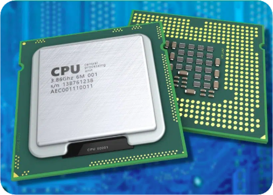
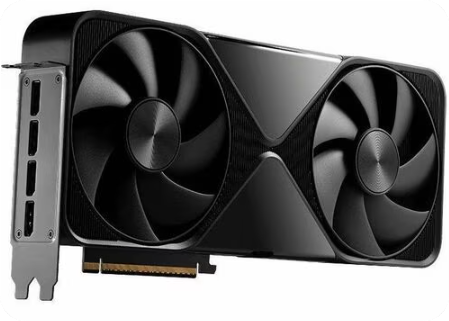
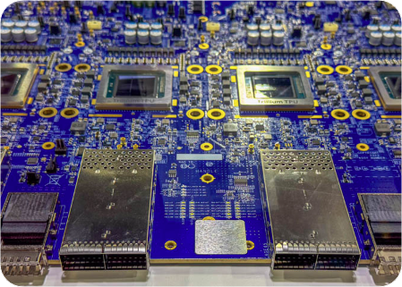
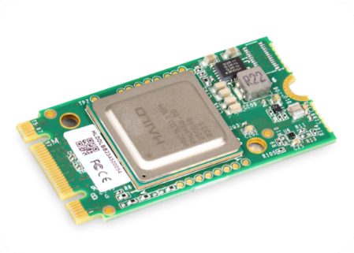

# 第2章：GPU 硬件、网络与并行策略 {-}

*理解分布式 AI 的硬件拓扑与并行策略*

> 创新不仅仅关乎芯片，更关乎整个技术栈。
- 黄仁勋（Jensen Huang）

**Code Summary**

- `nvidia-smi`：用于监控 GPU 状态和利用率的命令行工具
- `torch.cuda.device_count()`：获取可用 CUDA 设备的数量
- `torch.cuda.get_device_name()`：获取 CUDA 设备的名称
- `torch.cuda.is_available()`：检查 CUDA 是否可用
- `torch.distributed.get_world_size()`：获取分布式组中的进程总数
- `torch.distributed.get_rank()`：获取当前进程的 rank
- `torch.distributed.get_backend()`：获取后端名称（如 'nccl'、'gloo'）
- `nvidia-ml-py`：用于查询 NVIDIA GPU 信息的 Python 库
- `ibstat`：用于检查 InfiniBand 适配器状态的命令

## 算力：AI 集群与度量指标

在第 1 章中，我们阐明了为什么分布式 AI 是必不可少的——模型已经超出了单 GPU 的容量，而模型需求与硬件能力之间的算力鸿沟还在持续扩大。现在我们需要理解让分布式训练成为可能的硬件基础。在深入 GPU 细节之前，让我们退一步，理解我们真正在构建的东西：能够提供海量算力的 AI 集群。这里的数字很重要——当你训练一个 70B 参数的模型时，你用的不只是几块 GPU，而是在编排成百上千块 GPU，而它们之间的连接方式决定了你的训练任务是几天完成还是几周完成。

### 什么是算力？

算力（compute capacity）衡量的是一个系统每秒能执行多少次运算。对于 AI 工作负载，我们关心的是 __每秒浮点运算次数（FLOPS）__。其规模是指数级的：一块现代 GPU（如 H200）在 FP16 运算上大约能提供 1,000 TFLOPS（teraFLOPS，即每秒 $10^{12}$ 次运算）。一个拥有 1000 块这样的 GPU 的集群大约能给你 1,000 PFLOPS（petaFLOPS，每秒 $10^{15}$ 次运算），即 1 EFLOPS（exaFLOPS，每秒 $10^{18}$ 次运算）：1000 块 GPU × 1000 TFLOPS = $10^{6}$ TFLOPS = 1000 PFLOPS = 1 EFLOPS。

但问题在于：原始的 FLOPS 数字并不能说明全部情况。峰值吞吐量取决于精度——传统 HPC 用 FP64，训练基线用 FP32，现代 AI 训练用 FP16/BF16，推理和量化用 FP8 及更低精度（见第~\ref{chap:introduction-to-modern-distributed-ai}章的精度格式表）。当有人说"这个集群能提供 500 PFLOPS"时，要问清楚是在什么精度下：HPC 集群可能引用的是 FP64，而 AI 集群引用的是 FP16 或 BF16。同一套硬件，取决于你测量的是哪种格式，可以显示出差异巨大的数字。


AI 对算力需求的增长令人瞠目。大型语言模型所需的算力资源在几年内会增长几个数量级（取决于工作负载和模型规模的扩展），而硬件能力在同一时期只增长约 3 倍。正是这个鸿沟决定了分布式训练不是可选项——它是在合理时间内训练现代模型的 __唯一途径__。

如 @fig:computational-growth-gap 所示，模型的内存需求呈指数级增长，而单 GPU 的内存容量增长得更为缓慢。这一不断扩大的鸿沟使得分布式训练不仅仅是有益的，而是在合理时间框架内训练现代大规模模型所必需的。[^computational-gap-data]

{#fig:computational-growth-gap .block width=90%}

[^computational-gap-data]: GPU 线（蓝色实线）：按部署年份的主流单 GPU HBM——A100 40GB（2020）、A100 80GB（2021）、H100 80GB（2022–2023）、H200 141GB（2024）、B200 192GB（2025–2026）。黄色虚线（开放权重）：每个发布年份公开发布的最大开放权重模型——GPT-2 1.5B（约 3GB）、GPT-J 6B（约 12GB）、BLOOM 176B（约 352GB）、Grok-1 314B（约 628GB；来自 @tbl:model-comparison）、LLaMA 3 405B（约 810GB）、DeepSeek-V3 671B（约 1342GB）、DeepSeek-V4-Pro 1.6T（约 3200GB）。红色实线（前沿）：@tbl:model-comparison 中每个发布年份的最大模型，包括近似（~）条目——GPT-3 175B、MT-NLG 530B、PaLM 540B、Gemini-1 1.6T（约 3200GB）、GPT-4V 约 1.8T（约 3600GB）、GPT-5 约 2T（约 4000GB；下界约 2–5T）、Claude Mythos 5 约 10T（约 20000GB）。所有模型值均为 BF16 权重（每参数 2 字节）。所示数值仅为模型权重；训练还需要梯度、优化器状态和激活值，这进一步凸显了分布式训练的必要性。

[^h100-te]: NVIDIA, "NVIDIA H100 Tensor Core GPU Architecture," whitepaper, 2022, https://resources.nvidia.com/en-us-hopper-architecture （带 FP8 的 Transformer Engine；在 transformer 模型上相较 A100 有高达 6× 的训练吞吐量）。关于大型语言模型训练的独立审计结果，见 NVIDIA, "Breaking MLPerf Training Records with NVIDIA H100 GPUs," Technical Blog, 2023, https://developer.nvidia.com/blog/breaking-mlperf-training-records-with-nvidia-h100-gpus/ （MLPerf Training 3.0；使用 Transformer Engine 和 FP8 的 GPT-3 175B 和 BERT）。

### 为什么需要集群？

单块 GPU，即便是高端型号，也不足以应对现代 AI 工作负载。一个 70B 参数、FP16 权重的模型仅存储模型本身就需要约 140 GB。再加上梯度、优化器状态和激活值，每个训练步骤就要占用 500 GB 以上。这超出了任何单块 GPU 的容量。

**集群（cluster）** 是一组由高速网络连接、作为单一系统协同工作的计算机（节点）。每个节点通常拥有多块 GPU、CPU、内存和存储。关键的洞见在于，通过在众多节点间协调工作，你可以：

- **扩展内存**：将模型参数、梯度和优化器状态分布到多块 GPU 上
- **扩展算力**：通过并行化工作来处理更大的批次或更快地训练
- **扩展存储**：处理无法放入单台机器的数据集


如 @fig:ai-cluster 所示，一个 AI 集群由多个节点组成，每个节点包含多块 CPU 和 GPU（现代系统通常每节点 8 块 GPU）。节点内部，GPU 通过 NVSwitch 连接，以 NVLink 速度提供全互联（all-to-all）连接（在 Ampere–Hopper 系统上每块 GPU 300-900 GB/s，Blackwell B200 上高达 1.8 TB/s；所有数字均为每块 GPU 的双向聚合带宽）。节点之间，GPU 通过 InfiniBand（每条链路 200-400 Gb/s）等高速网络通信，从而实现跨整个集群的分布式训练和推理。这种架构使得工作可以在所有可用资源之间协调。图中展示的集群演示了如何通过将模型参数、梯度和优化器状态分布到多块 GPU 上来扩展内存，同时通过在节点间并行化工作负载来扩展算力。每个节点作为一台拥有自己的 CPU、内存和存储的独立服务器运行，但高速网络连接（节点内 NVSwitch、节点间 InfiniBand）使它们能够作为一个统一系统协同处理大规模 AI 工作负载。

{#fig:ai-cluster .block width=100% align=top-right}

集群并不是新事物——它们在高性能计算（HPC）领域已经使用了几十年。对 AI 而言不同的是通信模式。HPC 工作负载通常做大规模、不频繁的数据交换。而 AI 训练做的是频繁、较小的交换（每一步都做梯度同步），这使得网络带宽和延迟变得至关重要。我们将在第~\ref{chap:running-distributed-training-with-slurm}章讨论如何在 SLURM 管理的集群上运行分布式训练任务。

### AI 集群：为训练和推理而生

**AI 集群** 是专门为 AI 工作负载设计的集群。与处理各种工作负载的通用云数据中心不同，AI 集群针对深度学习的独特特征进行了优化：

**对于训练**，AI 集群需要：

- **高带宽互连**：梯度同步在每个训练步骤都会发生。如果通信慢，GPU 就会闲置等待梯度。节点内的 NVLink（Ampere–Hopper 上每块 GPU 300-900 GB/s，Blackwell B200 上高达 1.8 TB/s）和节点间的 InfiniBand（每条链路 200-400 Gb/s）是标准配置。
- **大聚合内存**：模型参数、梯度和优化器状态被分片到多块 GPU 上。一个 70B 模型即使使用 FSDP 之类的技术（见第~\ref{chap:scaling-with-fully-sharded-data-parallel-fsdp}章），也可能需要 8-16 块 GPU 才能放入内存。
- **快速存储**：训练数据集很大（ImageNet 有 150 GB，文本数据集可达 TB 级）。你需要节点间的快速并行文件系统或对象存储，外加每节点的快速本地 NVMe（见下文的 CPU 搭配）。

**对于推理**，需求发生了转变（见第~\ref{chap:distributed-inference-fundamentals-and-vllm}章和第~\ref{chap:production-llm-serving-stack}章）：

- **更低延迟的网络**：训练关心带宽，而推理关心延迟。用户期待毫秒级而非秒级的响应。
- **高效的内存使用**：注意力机制的 KV 缓存会消耗大量内存。你需要在缓存大小（以支持更长上下文）与内存限制之间取得平衡。
- **负载均衡**：推理工作负载具有突发性。你需要高效地在 GPU 之间路由请求并处理流量峰值。

硬件拓扑——GPU 在节点内如何连接、节点间如何连接——直接影响哪些并行策略可行。所有 GPU 通过 NVSwitch 连接（全互联）的集群可以有效地使用张量并行。而 GPU 仅通过 PCIe 连接的集群在通信密集型策略上会力不从心。

### AI 集群的关键度量指标

当你评估或优化一个 AI 集群时，你需要具体的度量指标。原始 FLOPS 数字是营销话术——真正重要的是你使用硬件的效率有多高。以下是真正重要的指标：

**模型 FLOPS 利用率（MFU）** 是训练效率最重要的指标。它衡量你实际使用了峰值硬件 FLOPS 的百分之多少：

```bash
MFU = (每次迭代的模型 FLOPs / 迭代时间) / 峰值 FLOPS
```

MFU 告诉你是受计算限制还是受其他因素限制。一个优化良好的集群在大型模型上可能达到 40-60% 的 MFU。如果 MFU 很低（比如 20%），你很可能遇到了内存带宽限制、通信瓶颈或低效的内核启动。

对于一个在 H100 GPU 上训练的 70B 参数 transformer 模型，你可能会看到：

- **每次迭代的理论 FLOPs**：约 860 TFLOP（取决于批大小、序列长度）
- **迭代时间**：约 2.0 秒
- **实际每秒 FLOPS**：约 860 TFLOP / 2.0 s ≈ 430 TFLOPS
- **H100 峰值 FLOPS**：约 989 TFLOPS（BF16）
- **MFU**：430/989 ≈ 43%

这让你处于许多团队在大型模型上力争的 40-60% 区间内。如果 MFU 低得多（比如 20%），你很可能遇到了内存带宽限制、通信开销，或批次太小以致 GPU 无法保持忙碌。

你可以在自己的训练任务上做同样的检查。先从每一步涉及多少 token 开始——在单块 GPU 上通常是微批大小乘以序列长度；如果你想算整个集群，就乘以数据并行宽度。对于稠密 transformer，一个可行的 FLOP 估算大约是每个 token 参数量的六倍（前向和反向合计）[^mfu-flops]。你的训练器日志会给出步骤时间；用这些 FLOPs 除以挂钟秒数，再除以数据手册中你训练所用精度下的峰值矩阵乘法速率——H100 上是 BF16 或 FP16，而不是营销幻灯片上的 FP8 数字。上面的 70B 演算就是把这些部分代入一行公式。

[^mfu-flops]: Chowdhery et al., "PaLM: Scaling Language Modeling with Pathways," *Journal of Machine Learning Research* 24 (2023): 1–113, 附录 B（每 token 6N 矩阵乘法 FLOPs 和模型 FLOPs 利用率）。Kaplan et al., "Scaling Laws for Neural Language Models," arXiv:2001.08361, 2020.

**线性扩展性（Linear scaling）** 衡量性能随集群规模扩展的好坏。其公式为：

```bash
线性扩展性 = (多 GPU 吞吐量) / (单 GPU 吞吐量 × GPU 数量)
```

完美的扩展会给你 1.0（100%）。实践中，优化良好的集群会看到 0.7-0.9。如果扩展性降到 0.5 以下，你就有通信瓶颈了。

**GPU 利用率** 更简单——它是 GPU 花在计算而非等待上的时间百分比。你可以用以下命令检查：

```bash
nvidia-smi --query-gpu=utilization.gpu --format=csv,noheader
```

高利用率（90% 以上）是好的，但它不能告诉你是否使用了正确的内核，或通信是否在阻塞计算。MFU 提供的信息更多。

**通信效率** 衡量你使用网络带宽的好坏：

```bash
通信效率 = 实际带宽 / 理论带宽
```

对于 InfiniBand HDR（200 Gb/s），你可能达到 180 Gb/s 的实际带宽，即 90% 的效率。如果效率低，你可能有拓扑问题、丢包或次优的通信模式。

**吞吐量（Throughput）**（每秒样本数或每秒 token 数）是你为训练速度所关心的。有两种测量方式：

**集群吞吐量**（所有 GPU 每秒处理的总 token 数）：
```bash
Throughput_cluster = (全局批大小 × 序列长度) / 总训练时间
```

**每 GPU 吞吐量**（每块 GPU 每秒 token 数）：
```bash
Throughput_per_GPU = (全局批大小 × 序列长度) / (总训练时间 × GPU 数量)
```

吞吐量越高越好，但你需要将其与收敛性平衡——更大的批次每次迭代可能训练更快，但需要更多迭代才能收敛。

**资源利用率** 分解了时间花在何处：

- **GPU 计算时间**：实际的矩阵乘法
- **内存传输时间**：在 CPU 和 GPU 之间，或在 GPU 之间移动数据
- **通信时间**：梯度同步、AllReduce 操作
- **空闲时间**：等待数据、同步或其他瓶颈

一个优化良好的集群将 70-80% 的时间花在计算上，10-20% 花在通信上，闲置时间极少。

**能效** 对大型集群很重要。**每瓦 FLOPS（FLOPS per Watt）** 衡量计算效率：

```bash
FLOPS/Watt = 总 FLOPS / 总功耗
```

H100 在 FP16 下大约提供 1.4 TFLOPS/Watt。越高越好——这意味着用同样的电费获得更多算力。

**PUE（电源使用效率）** 衡量数据中心的效率：

```bash
PUE = 设施总功率 / IT 设备功率
```

PUE 为 1.0 意味着所有电力都用于 IT 设备（实践中不可能）。真实的数据中心能达到 1.2-1.5。越低越好——这意味着浪费在制冷和开销上的电力越少。

**可靠性指标** 在你运行长达一周的训练任务时很重要：

- **MTBF（平均无故障时间）**：系统故障之间的平均时间。对于一个 10,000 GPU 的集群，你可能每隔几小时就会遇到故障。
- **可用性（Availability）**：系统正常运行的时间百分比。目标：生产集群 99% 以上。
- **MTTR（平均恢复时间）**：从故障中恢复的平均时间。好的集群在几分钟而非几小时内恢复。

**通信延迟** 对分布式训练至关重要。AllReduce 延迟应该是：

- **节点内（NVLink）**：对于典型梯度大小，< 1 ms
- **节点间（InfiniBand）**：节点间通信 < 5 ms
- **P99 延迟**：第 99 百分位的延迟比平均值更重要——一个慢节点就能拖住整个训练任务

当你对集群进行基准测试时，在不同规模下测量这些指标：8 块 GPU、64 块 GPU、512 块 GPU、2048 块 GPU。随规模退化的指标（如线性扩展性或通信效率）会告诉你瓶颈在哪里。

有了这个基础，让我们来审视使集群工作的硬件组件。我们从编排整个系统的 CPU 开始，然后转到实际进行计算的 GPU，接着是其他加速器、互连技术，最后是如何根据集群拓扑选择并行策略。

## 中央处理器（CPU）

{#fig:cpu-icon .wrap width=15% align=top-right vspaces=40pt}

虽然 GPU 在分布式训练中承担了繁重的工作，但 CPU 扮演着关键的支撑角色。理解 CPU 架构有助于你优化数据加载、管理 GPU 协调以及调试性能瓶颈。

### CPU 架构基础

CPU 围绕 **冯·诺依曼架构** 构建：一个中央处理单元，包含算术逻辑单元（ALU）、控制单元（CU）和存储单元（寄存器）。与为吞吐量优化的 GPU 不同，CPU 为延迟优化——快速的单线程执行加上复杂的控制逻辑。

关键区别在于：CPU 把大部分硅片面积用于控制逻辑和缓存，而不是计算单元。一颗现代 CPU 可能有 8-64 个核心，每个都具备复杂的乱序执行、分支预测和多级缓存。GPU 则拥有数千个为并行工作负载优化的简单核心。

对于分布式训练，CPU 负责：

- **数据加载和预处理**：从磁盘读取、解码图像、对文本分词
- **编排**：启动 GPU 内核、管理进程组、处理通信
- **系统管理**：内存分配、进程调度、网络栈

如果 CPU 成为瓶颈，GPU 就会闲置等待数据。这就是为什么数据加载流水线很重要——你需要足够的 CPU 核心和快速的存储来喂饱 GPU。

### CPU-GPU 交互

{#fig:cpu-gpu-interaction .wrap width=60% align=top-right}

当你运行分布式训练时，会发生以下事情：

1. **CPU 启动 GPU 内核**：你的 Python 代码（运行在 CPU 上）调用 PyTorch，后者生成 CUDA 内核。CPU 通过 PCIe 将这些发送给 GPU。
2. **CPU 管理内存**：CPU 分配 GPU 内存，将数据从 CPU RAM 传输到 GPU 内存，并协调多 GPU 通信。
3. **CPU 处理通信**：对于多节点训练，CPU 进程处理网络通信（InfiniBand、以太网）并与 NCCL 协调 GPU 集合操作。

如 @fig:cpu-gpu-interaction 所示，CPU 和 GPU 之间的 PCIe 连接常常是瓶颈。PCIe Gen 4 x16 每个方向约 31.5 GB/s（双向约 63 GB/s），而 GPU 之间的 NVLink 在 Ampere–Hopper 上每块 GPU 提供 300-900 GB/s（Blackwell B200 上高达 1.8 TB/s），为双向聚合带宽。这就是为什么你希望 GPU 通过 NVLink 直接通信，而不是经过 CPU。


### NUMA 与 CPU 亲和性

现代服务器有多个 CPU 插槽（NUMA 节点）。每个插槽有自己的内存控制器和 PCIe 通道。连接到不同插槽的 GPU 有不同的内存访问模式。

你可以检查 NUMA 拓扑：

```bash
numactl --hardware
```

对于分布式训练，尽量让进程与其 GPU 保持在同一个 NUMA 节点上。这可以减少内存访问延迟。PyTorch 不会自动做这件事——你可能需要在启动任务时手动设置 CPU 亲和性或使用 `numactl`。

### 分布式训练的 CPU 需求

对于一台典型的 8 GPU 服务器：

- **CPU 核心**：为数据加载和编排，你希望每块 GPU 至少有 2-4 个 CPU 核心。一个 8 GPU 系统至少应有 16-32 个 CPU 核心。
- **内存**：CPU RAM 应为 GPU 内存的 1.5-2 倍，以用于数据暂存。对于 8×80GB 的 GPU，你希望至少有 1 TB 的 CPU RAM。
- **PCIe 通道**：每块 GPU 需要 PCIe x16。一个 8 GPU 系统需要 128 条 PCIe 通道，这通常意味着双插槽 CPU（AMD EPYC 或 Intel Xeon）。
- **NVMe 存储**：对于一个 8 GPU 训练节点，目标是本地 NVMe 达到 **约 10–20 GB/s 的聚合顺序读取**（例如两到四块 PCIe Gen4/Gen5 硬盘，通常做 RAID-0），这样数据加载器和检查点 I/O 就不会拖住 GPU。TB 级数据集通常存放在集群并行文件系统上；本地 NVMe 对每节点的缓存和临时空间仍然重要。

CPU 不需要是最新一代——它不做计算。但它需要足够的核心和 PCIe 带宽来保持 GPU 忙碌。现在让我们转到承担繁重工作的组件：GPU。


## 图形处理器（GPU）

{#fig:gpu-icon .wrap width=15% align=right}

当你构建分布式训练系统时，GPU 架构很重要。NVIDIA 自 2010 年以来一直在迭代 GPU 设计，每一代都带来影响你如何设计训练流水线的变化。以下是关于你可能遇到的 GPU 需要了解的内容。

### 理解 GPU 内存与计算架构

GPU 是为吞吐量而非延迟构建的。与为快速单线程执行优化的 CPU 不同，GPU 塞入了数千个简单核心并优先考虑高带宽内存访问。当你训练大型模型时，这种设计会有回报——但这也意味着你需要以不同的方式思考内存和计算。

内存层次结构很重要。寄存器最快但非常小。共享内存（L1 缓存）快但有限。L2 缓存位于共享内存和设备 DRAM（你的主 GPU 内存）之间。当你看到"内存不足"错误时，通常是设备 DRAM 满了，而不是缓存。

{#fig:gpu-memory-hierarchy .block width=60% align=top-right lines=8}

如 @fig:gpu-memory-hierarchy 所示，GPU 内存层次结构由多个级别组成，每个级别有不同的特性：寄存器提供最高带宽和最低延迟，但容量极小；L1/共享内存提供快速访问，但每个流式多处理器（SM）的容量有限；L2 缓存提供更大的共享缓存和中等带宽；VRAM（HBM/GDDR）提供最大容量，但相对于较小的内存级别有更高的延迟和更低的带宽。这一层次结构反映了内存设计中的基本权衡：更高的带宽和更低的延迟以减少容量为代价，而更大的容量则需要接受更高的延迟和更低的带宽。

有一件事让人容易栽跟头：内存带宽常常在计算之前就成为瓶颈。如果你的内核是内存受限的，增加更多计算并无帮助。你可以通过性能剖析发现这一点——如果 GPU 利用率低但内存带宽已经打满，你就是内存受限的。

要了解你手头的硬件，检查你的 GPU 规格：

```bash
nvidia-smi \
  --query-gpu=name,memory.total,pcie.link.gen.max,pcie.link.width.max \
  --format=csv
```

以下是你在不同系统上可能看到的内容。一个带 8 块 GPU 的 H200 系统：

```
$ nvidia-smi --query-gpu=name,memory.total,pcie.link.gen.max,pcie.link.width.max --format=csv
name, memory.total [MiB], pcie.link.gen.max, pcie.link.width.max
NVIDIA H200, 143771 MiB, 5, 16
NVIDIA H200, 143771 MiB, 5, 16
...
```

那是 PCIe Gen 5 加 16 条通道——每个方向大约 64 GB/s。将其与消费级的 RTX 4090 比较：

```
NVIDIA GeForce RTX 4090, 24564 MiB, 4, 16
```

PCIe Gen 4，同样 16 条通道，但每个方向只有约 31.5 GB/s（双向约 63 GB/s）。PCIe 连接是你的 GPU 用来与 CPU 通信的，但对于多 GPU 通信，你想要更快的东西。

但 PCIe 只是故事的一部分。对于多 GPU 通信，你想要 NVLink——完全绕过 CPU 的 GPU 到 GPU 直连。要查看你的系统实际拥有什么，运行：

```bash
nvidia-smi topo -m
```

这会显示拓扑矩阵。输出可能很密集，但以下是要看的内容：

如果你在 GPU 之间看到 `NV18`、`NV12` 或 `NV4`，说明你有 NVLink。那很好——那些链路在 Ampere–Hopper 上给你每块 GPU 300-900 GB/s（Blackwell B200 上高达 1.8 TB/s）的双向聚合带宽，远快于 PCIe。在配置良好的系统（如 DGX 或 HGX 机箱）中，你会看到所有 GPU 通过 NVSwitch 用 NVLink 连接，意味着每块 GPU 都能以全速与其他每块 GPU 通信。

如果你在 GPU 之间看到 `PIX` 或 `PXB`，它们仅通过 PCIe 连接。那也能工作，但你会更快地遇到带宽限制。你可能还会看到 `NODE` 或 `SYS`，这意味着连接跨越了 NUMA 边界——另一件会拖慢速度的事情。

以下是一个带 NVSwitch 的 H200 系统的真实例子。所有 8 块 GPU 彼此之间都显示 `NV18` 连接：

```
GPU0    GPU1    GPU2    GPU3    GPU4    GPU5    GPU6    GPU7
GPU0     X      NV18    NV18    NV18    NV18    NV18    NV18    NV18
GPU1    NV18     X      NV18    NV18    NV18    NV18    NV18    NV18
...
```

那是理想的配置。每块 GPU 都能以 NVLink 速度与其他每块 GPU 通信。在标准服务器中，你可能会看到一些 GPU 仅通过 `PIX` 或 `PXB` 连接，这意味着它们经过 PCIe。那仍然能工作，但对于通信密集型操作，你需要更谨慎地选择配对哪些 GPU。

还有一件事：注意 CPU 亲和性列。GPU 0-3 可能在 NUMA 节点 0 上，而 GPU 4-7 在 NUMA 节点 1 上。如果你在做多节点训练，尽可能让进程保持在同一个 NUMA 节点上——跨 NUMA 通信会增加延迟。

### 关键架构里程碑

**直到 Pascal（2016）：** Fermi 和 Pascal 确立了 CUDA 和用于多 GPU 系统的早期 NVLink——今天你在生产 AI 集群中不太可能见到它们。

**Volta 和 Ampere（2017–2020）：** Volta 引入了 Tensor Core；A100（Ampere）增加了 TF32/BF16、NVLink 3.0（每块 GPU 600 GB/s）和 NVSwitch。A100 在推理和较旧的训练机群中仍然常见，但新的大规模训练构建已经转向别处。

**Hopper（2022）** 是当前分布式训练的主力。H100 带来了 FP8、用于动态精度切换的 Transformer Engine 和 NVLink 4.0（每块 GPU 900 GB/s 双向聚合）。H200 保持相同的计算能力，但增加了 HBM3e 容量（141 GB，而 H100 为 80 GB）——当模型状态和激活值主导内存时很重要。

**Blackwell（2024）** 如果你今天要构建新集群，它是 NVIDIA 的高端训练一代。路线图已经命名了 Vera Rubin 等后继者，所以在你做出承诺之前，请向你的供应商或云服务商核对 SKU 列表和交货周期。B200 将 NVLink 带宽翻倍到每块 GPU 1.8 TB/s（双向聚合），使用双芯片封装（每模块两个芯片），并将 HBM 带宽提升到每块 GPU 8 TB/s——在规模上大约是 H100 的 2 倍 transformer 训练吞吐量。在同一代内，更高内存的 Blackwell 变体（如 B300 级 GPU）为超大型模型增加了 HBM 容量；它们通常以更高的功耗和更严格的散热要求换取额外的余量。

### 这些数字对训练意味着什么

当你为分布式训练选择 GPU 时，你关心三件事：

**内存容量和带宽**：一个 70B 参数、FP16 权重的模型仅模型本身就需要约 140 GB。加上梯度、优化器状态（Adam 使用 2 倍模型大小）和激活值，每个训练步骤就要占用 500 GB 以上。H100 有 80 GB HBM3，H200 有 141 GB，B200 有 192 GB（更高内存的 Blackwell 变体如 B300 级 GPU 有 288 GB）。更多内存意味着更大的批次或需要更少的 GPU。

HBM 带宽也很重要。A100 有 2 TB/s，H100 有 3 TB/s，B200 有 8 TB/s（均为每块 GPU）。然而，互连带宽（NVLink/InfiniBand）通常是跨 GPU 梯度同步的主要瓶颈。HBM 带宽主要影响本地操作，如 reduce 内核和融合算子——更高的 HBM 带宽意味着更快的本地归约和内存受限操作。

**计算吞吐量**：这是 Tensor Core 大放异彩的地方。H100 在 FP16 下提供约 1 PFLOP，而 B200 达到 2.25 PFLOP。但原始 FLOPS 不能说明全部——你需要看你实际使用的是什么精度。FP8 训练可以比 FP16 快 2 倍，但并非所有模型都能在 FP8 下训练良好。Hopper 的 Transformer Engine（在 Blackwell 上得以延续）在训练期间自动在 FP8 和 FP16 之间切换；NVIDIA 的 H100 架构白皮书报告说，当启用 FP8 和 Transformer Engine 时，**在 transformer 工作负载上相较 A100 有高达 6× 的训练吞吐量**[^h100-te]——这并不是对每个模型或技术栈的保证。

**互连带宽**：NVLink 带宽（每块 GPU，双向聚合）决定了 GPU 同步梯度的速度。A100 有 600 GB/s，H100 有 900 GB/s，B200 有 1.8 TB/s（均为每块 GPU，双向聚合）。当你做数据并行时，你每一步都在做 AllReduce 操作。更快的 NVLink 意味着更少的通信开销。

### 图形处理器（GPU）产品系列

NVIDIA 根据你的需求以不同的外形规格出货 GPU：

**HGX（Hyperscale GPU eXchange）** 是 OEM 厂商集成到服务器中的基板模块。一个 HGX H100 有 8 块通过 NVSwitch 连接的 H100 GPU，给你总共 640 GB HBM、每块 GPU 900 GB/s 的 NVLink，以及跨基板约 3.6 TB/s 的 NVSwitch 对分带宽。你从 Dell、Supermicro 或浪潮等服务器供应商处购买，他们加上 CPU、存储和网络。

**DGX（Deep GPU Xceleration）** 是 NVIDIA 的完整系统。一个 DGX H100 是预集成的服务器，带 8 块 H100、AMD EPYC CPU、NVMe 存储和 InfiniBand 网络。它更贵，但配有优化的软件栈和支持。DGX 系统是大多数 AI 公司用于训练的东西——它们经过测试、有文档，开箱即用。

**SuperPOD** 扩展到单台服务器之外。一个 DGX SuperPOD 通过 InfiniBand 连接多个 DGX 系统（通常 32-64 个节点），创建一个拥有数千块 GPU 的集群。GB200 SuperPOD 连接 8 个 GB200 NVL72 单元（每个 72 块 GPU，根据 NVIDIA 规格，每机架约 130 TB/s NVLink 容量），总共 576 块 GPU，机架之间还有额外的 NVLink 交换。

GB200 NVL72 很有意思——它是一个液冷机架单元，带 36 个 GB200 超级芯片（共 72 块 GPU），通过 NVLink 连接。NVIDIA 将其营销为"单个巨型 GPU"，因为 NVLink 以极高带宽将机架捆绑在一起——但那是营销，而非编程模型。你仍然要用显式的并行（TP/PP/DP、集合操作和刻意的张量放置）运行 72 块 GPU；框架为你分片模型。不要期待像 CPU NUMA 那样透明的统一内存。好处是为万亿参数训练提供快速的机架内通信，而不是一个没有分布式代码的逻辑设备。

### 选择合适的 GPU

对于大多数分布式训练，你将在 H100、H200 或 B200 之间选择。以下是决策树：

- **H100**：仍然是主力。80 GB 内存，3 TB/s 带宽，900 GB/s NVLink。性能和可用性的良好平衡。如果你现在要构建集群并需要经过验证的硬件，用这个。

- **H200**：与 H100 相同的计算能力，但 141 GB 内存。如果你受内存限制——更大的模型、更长的序列，或当你想要更大的批次时，用这个。额外的内存花费更多，但可以减少你需要的 GPU 数量。

- **B200**：用于训练的旗舰 Blackwell——192 GB HBM，8 TB/s 内存带宽，每块 GPU 1.8 TB/s NVLink。当你需要最大吞吐量并且能拿到产能时用它；双芯片设计给你大约 2× 的 H100 计算能力，但价格高昂，可用性因季度和地区而异。

有一件事要留意：**可用性** 和规格表一样重要。需求激增和产品换代常常让较旧的 GPU 留在生产中，而较新的 SKU 正在爬产，因此交货周期、云配额以及哪一代最容易买到可能每个季度都会翻转。在你冻结设计之前，向供应商或云服务商核实任何积压传闻——在过去的周期中，高需求部件曾出现过数月的等待，而随着新芯片出货这种情况会缓解或再次出现。Blackwell 之后的路线图公告可能重新洗牌你实际能采购到的东西，所以当你准备购买时再核对一次。

对于推理，算法不同。B200 的 FP4 性能（20 PFLOP）使其对高吞吐量推理有吸引力，但每个请求的成本比峰值 FLOPS 更重要。许多推理部署仍然使用 A100 甚至消费级 GPU，因为它们更便宜且够用。

### 重要的架构特性

**Tensor Core** 是秘密武器。它们是专门的单元，做矩阵乘法比 CUDA 核心快 10-100 倍。每个现代训练框架（PyTorch、TensorFlow、JAX）都通过 cuBLAS 和 cuDNN 自动使用它们。你不需要写特殊代码——只要确保你使用 FP16/BF16/FP8 精度。

**Transformer Engine**（Hopper 和 Blackwell）在训练期间自动在 FP8 和 FP16 之间切换。它监控激活统计信息，在安全时使用 FP8，在需要精度时使用 FP16——这是上面引用的高达 6× transformer 训练声明的来源[^h100-te]。

**MIG（多实例 GPU）** 在 A100 和 H100 上让你将单块 GPU 分区为多个虚拟 GPU。每个分区获得专用的内存和计算。这对想要将 GPU 时间租给多个客户的云服务商很有用，但对训练大型模型，你会想要完整的 GPU。

**NVLink-C2C** 在 Grace Hopper 系统中以 900 GB/s 带宽（双向聚合）连接 CPU 和 GPU。这让 GPU 直接访问 CPU 内存，对不适合 GPU 内存的模型很有用。Grace CPU 有 512 GB LPDDR5X，所以一个 GH200 系统给你总共 608 GB 可寻址内存（96 GB GPU + 512 GB CPU）。

当你设计分布式系统时，这些架构细节决定了你的并行策略。高 NVLink 带宽意味着张量并行可行。大内存意味着你可以放入更大的模型或使用更少的 GPU。快速的 HBM 意味着你可以处理更大的批次而不触及内存带宽限制。

虽然 NVIDIA GPU 主导着分布式训练的格局，但了解其他加速器也是值得的。Google 的张量处理单元（TPU）提供了一种专门为神经网络优化的不同架构方法，而神经处理单元（NPU）代表了另一种领域专用选项。理解这些替代方案有助于在选择硬件或在平台之间移植代码时做出决策。

## 张量处理单元（TPU）

{#fig:tpu-icon .wrap width=15% align=right}

Google 的张量处理单元（TPU）提供了与 GPU 不同的架构方法。TPU 是从头开始为神经网络工作负载设计的专用集成电路（ASIC）。如果你在 Google 工作或使用 Google Cloud，你会遇到 TPU。理解它们与 GPU 的区别有助于在选择硬件或在平台之间移植代码时做出决策。

### 为什么 TPU 存在

Google 在 2013 年开始设计 TPU，当时他们意识到在 CPU 上运行神经网络太昂贵了。他们的预测是：如果人们每天用基于神经网络的语音识别做 3 分钟语音搜索，他们就需要将数据中心容量翻倍。CPU 无法以经济高效的方式扩展，而当时（2013 年）的 GPU 也没有为神经网络优化。

TPU v1 于 2016 年出货——从设计到部署只用了 15 个月。对一颗芯片来说那很快。第一版硅片无需任何掩膜更改就能工作，这很罕见。关键洞见是：神经网络不需要 CPU 或 GPU 的灵活性。它们主要是矩阵乘法，所以你可以构建一颗把一件事做到极致的芯片。

### TPU 架构：脉动阵列

TPU 的核心是 **矩阵乘法单元（MXU）**，它使用 **脉动阵列（systolic array）** 架构。与使用数千个带寄存器和缓存的 CUDA 核心的 GPU 不同，脉动阵列是一个由处理单元（PE）组成的网格，数据像心跳一样流过阵列——因此称为"脉动"。

它是这样工作的：数据不是把中间结果存在寄存器中稍后取回，而是直接从一个 PE 流到下一个。每个 PE 将两个值相乘并将结果传递给邻居。这消除了大多数内存访问，因为数据在流过阵列时被重用。对于矩阵乘法，这极其高效——你只读取每个输入值一次并多次重用它。

TPU v1 有一个 256×256 的脉动阵列（65,536 个 PE），运行在 700 MHz，为 INT8 运算提供约 92 TOPS。TPU v2 及以后使用 128×128 的阵列，但每颗芯片有多个 MXU。脉动设计意味着 TPU 在稠密矩阵乘法上表现卓越，但在其他运算上不如 GPU 灵活。

### TPU 各代

Google 的产品线经历了几次跳跃，这些至今仍出现在论文和 pod 设计中：**v1（2016）** 仅用于推理（通过 PCIe 的 INT8）；**v2** 增加了 BF16 训练、HBM 和芯片间链路；**v4** 增加了用于嵌入的 **Sparse Core**、数千芯片规模的 **3D 环面（torus）** pod，以及 **光路交换（OCS）**。早期各代已不再在 GCP 上提供，但这些里程碑解释了旧文章中的术语。

在 Google Cloud 上，当前相关的公开 TPU 系列包括 **v5e/v5p**、**Trillium**、**TPU7x/Ironwood**，以及较新的第八代 **TPU 8t/8i** 系列，尽管可用性取决于地区、配额和部署模式。峰值 FLOPS、每芯片内存、pod 大小和地区可用性每一代都在变化，但技术栈保持不变：**通过 XLA 的 JAX 或 TensorFlow**，用 `jax.jit` 和 pod 分片，如下文所述。查看 [Google Cloud TPU 文档](https://cloud.google.com/tpu/docs) 了解你可以绑定哪些 SKU。

### TPU Pod 架构

**TPU Pod** 是 Google 对 TPU 集群的称呼。与使用 InfiniBand 交换机的 GPU 集群不同，TPU Pod 使用定制互连。较新的各代扩展了 pod 大小和网络细节；以下想法来自 v2–v4 设计，但仍描述了环面上流量倾向于如何流动：

- **2D 环面**（早期 pod）：芯片在网格上，每个有四个邻居（边缘环绕）。本地带宽好；远距离配对需要更多跳数。

- **3D 环面**（从 v4 开始）：每个芯片六个邻居（带环绕的 3D 网格）。对相同芯片数，直径比 2D 更短——在 pod 规模下很重要。

- **光路交换（OCS）**：在 v4 规模引入——MEMS 光学交换机在芯片间以更少的转换损耗路由光。路由可以为容错而重新配置。

环面拓扑与 GPU 集群的 Clos/胖树网络不同。环面更便宜（更少的交换机、更简单的布线），对本地通信延迟更低，但在扩展和负载均衡方面不够灵活。Clos 网络是无阻塞的（任何输入可以同时以全带宽与任何输出通信），而环面网络可能有拥塞。

### TPU vs GPU：何时用哪个

**如果符合以下情况，使用 TPU：**

- 你在 Google 或使用 Google Cloud Platform
- 你的工作负载主要是稠密矩阵乘法（transformer、CNN）
- 你想为特定模型获得最大性能（Google 为其模型优化了 TPU 软件栈）
- 你在 Google 规模训练（数千块芯片）

**如果符合以下情况，使用 GPU：**

- 你需要灵活性（不同的模型架构、研究）
- 你使用 PyTorch（TPU 支持存在，但 GPU 是一等公民）
- 你需要在本地或多云运行
- 你的工作负载有稀疏运算或不规则模式
- 你需要实用的调试——晦涩的 XLA 错误、比 NVIDIA Nsight 弱的性能分析器，以及除非你是大型 Google/GCP 客户否则很少的公开社区支持

**性能特征：**

- TPU 在稠密矩阵运算上表现卓越。每芯片峰值 FLOPS 因代而异（v4 约为 275 TFLOPS BF16；Trillium、Ironwood 和第八代 SKU 更高——见 GCP 规格）——在 v4 时代大致相当于每芯片 Ampere 级，而非 H100 级（约 990 TFLOPS BF16/FP16 稠密）。当 XLA 和工作负载与技术栈匹配时，端到端的 transformer 训练在 pod 规模下仍然有竞争力。
- GPU 更通用。它们更好地处理稀疏运算、自定义内核和混合工作负载。
- TPU 软件栈（XLA 编译器）高度优化但不够灵活。你将模型编译为 XLA，编译器生成优化的代码。对于支持的运算，这可能比 GPU 更快，但更难调试。

**调试和工具**：在 GPU 上你得到成熟的工具（`nvidia-smi`、Nsight、PyTorch 性能分析器）和庞大的社区。在 TPU 上，故障常常表现为 **晦涩的 XLA 编译错误**（长长的编译器日志，很少的行级上下文），性能分析不够成熟，帮助主要来自 **GCP/Google 渠道**——而非 Stack Overflow 那样的深度。对于学习分布式训练的团队，除了 FLOPS 和每小时价格之外，这种摩擦是一项真实的成本。

**成本和可用性：**

- TPU 只在 Google Cloud 上可用。你买不到它们。
- GPU 定价因云服务商和可用性而异。H100 很贵但可从多个供应商获得。
- TPU 在 GCP 上按小时计费。对于大规模训练，如果你的工作负载合适，TPU 可以很划算。

### TPU 编程模型

TPU 通过 **XLA（加速线性代数）** 运行。你写 TensorFlow 或 JAX 代码；XLA 将其降级为 TPU 指令。这与 GPU 的工作流程不同，在 GPU 上你通常依赖 CUDA 内核和 cuDNN 等库，而不是整个程序的编译步骤。

代价是启动时间。第一次运行会编译整个计算图，可能需要几分钟；之后的运行重用已编译的二进制文件，快得多。GPU 通常启动更快，但可能带有更多的每步运行时开销。

对于多芯片训练，TensorFlow 分布策略仍然常见。在 JAX 中，使用 **带分片注解的 `jax.jit`**——在设备网格上用 `PartitionSpec` 和 `NamedSharding`——来描述张量如何跨 pod 映射；当你需要显式的每芯片逻辑时使用 `jax.shard_map`。放置在环面上仍然重要：分片张量使大部分流量保持在邻居之间，让 XLA 优化其余部分。糟糕的布局在调试时仍然会表现为慢步骤或令人困惑的错误。

### Sparse Core（自 v4 起）

**Sparse Core** 在 TPU v4 上首次亮相，并仍然是后续面向训练各代的一部分（包括嵌入密集的 **TPU 8t** 工作负载）。嵌入层将离散 ID 映射到稠密向量；访问是不规则的，不适合纯脉动矩阵乘法。Sparse Core tile 用专用的 HBM 路径获取和处理这些查找——这是 GPU 通常在软件中处理的算法-硬件协同设计。

如果你训练推荐模型或带有大型嵌入表的模型，检查你的 GCP SKU 是否包含 Sparse Core。对于仅有 transformer 的工作负载，它没那么重要。

除了 GPU 和 TPU，另一类加速器已经出现：神经处理单元（NPU），它代表了更广泛的一类领域专用 AI 芯片。虽然在大规模训练中不太常见，但 NPU 值得了解，因为它们代表了灵活性与效率之间的另一种权衡。

## 神经处理单元（NPU）

{#fig:npu-icon .wrap width=15% align=right}

**神经处理单元（NPU）** 代表了另一种方法：为 AI 工作负载优化的领域专用架构（DSA）芯片。NPU 是从头开始为神经网络运算设计的 ASIC（专用集成电路），以通用灵活性换取效率。

### 是什么让 NPU 与众不同

NPU 围绕 **AI 核心** 构建——为矩阵乘法、卷积和其他神经网络原语优化的专门单元。早期 GPU 源自图形；如今的训练 GPU 依赖类似的专门模块（Tensor Core、矩阵单元），所以历史上的"GPU vs NPU"故事，与其说关乎根本不同的芯片，不如说更多关乎 **软件和市场策略**。

架构权衡是一个有用的思维模型，而非硬性边界：

- **CPU** — 通用控制和编排。
- **GPU** — 面向吞吐量的并行处理器，带有庞大的软件栈。
- **NPU** — AI 优先的设计，以灵活性换取效率。

**融合：** 这些界限正在模糊。现代数据中心 GPU 每一代都越来越不像"图形芯片"——NVIDIA **Tensor Core** 是用于训练和推理的领域专用矩阵引擎，AMD **MI300X**（CDNA3）将大部分芯片面积用于矩阵单元和 HBM，方式非常像 NPU。纯 NPU 在软件上仍然不同（专有栈、边缘侧重），但当你选择硬件时，你通常比较的是 **专门化程度**，而非三个独立的物种。生态系统（CUDA/ROCm、PyTorch、NCCL）仍然比幻灯片上的标签更重要。

你仍然会遇到一个混合的部署格局。**华为昇腾（Ascend）**（910C 及以后）将数据中心 NPU 与定制互连上的机架级 **SuperPoD** 系统配对——在中国和一些出口市场常见。**AWS Trainium** 是亚马逊在 EC2 上的训练 ASIC，从 **Trainium2** 实例到多机架集群。**Google 的 Edge TPU** 是一个独立的低功耗系列，用于边缘推理，而非上一节的云 TPU pod。**寒武纪 MLU** 等区域供应商在其技术栈和供应链适合你的工作负载时很重要。规格和 SKU 变化很快——在锁定硬件之前查看供应商文档。

### NPU 架构：AI 核心和内存

NPU 架构以 **AI 核心** 为中心——用于神经网络运算的专用计算单元。每个 AI 核心通常包括：

- **矩阵乘法单元**：为 GEMM（通用矩阵乘法）运算优化
- **向量处理单元**：用于逐元素运算、激活、归一化
- **专门单元**：用于池化、卷积、注意力等运算

内存层次结构很关键。NPU 使用类似 GPU 的高带宽内存（HBM），但内存子系统通常更简单——更少的缓存级别、通向计算单元的更直接路径。这减少了延迟，但需要仔细的内存管理。

如今面向训练的数据中心 NPU 通常每颗芯片配备 **64–128+ GB HBM**，以及 **数百 TFLOPS** 的 BF16/FP16 峰值（因供应商而异——远高于早期的 200–300 TFLOPS 级别）。架构仍然以每芯片多个 AI 核心和矩阵密集的执行为中心。

### 训练 vs 推理 NPU

和 GPU 一样，NPU 有训练和推理变体：

**训练 NPU** 需要：

- 高精度支持（FP32、BF16、FP16）以进行稳定的梯度计算
- 大内存容量用于模型参数、梯度和优化器状态
- 高带宽互连用于多芯片训练
- 支持各种模型架构的灵活性

**推理 NPU**（如 Edge TPU）优先考虑：

- 更低精度（INT8、INT4）以提高效率
- 更低功耗用于边缘部署
- 更低延迟用于实时应用
- 成本效率用于大规模部署

同一颗芯片很少在两者上都表现卓越。训练需要灵活性和精度；推理需要效率和低成本。

### NPU 软件栈

NPU 软件栈通常比 GPU 生态系统更专有。每个供应商提供自己的框架和运行时（如 MindSpore、CANN）。与在所有 NVIDIA GPU 上都能工作的 CUDA 不同，NPU 软件通常是供应商特定的。

这带来了锁定风险：为一个供应商的 NPU 编写的代码，不经过大量移植就无法在其他 NPU 上运行。与 CUDA 在 GPU 领域的主导地位相比，生态系统是碎片化的。

不过，一些框架正在尝试抽象这一点。PyTorch 对一些 NPU 后端有实验性支持，ONNX Runtime 可以针对多个 NPU 供应商。但这种体验不如 GPU 开发那样无缝。

### NPU vs GPU：何时选择哪个

**如果符合以下情况，选择 NPU：**

- 你有 NPU 为之优化的特定工作负载（某些模型类型或运算）
- 你在构建边缘设备，功耗效率比灵活性更重要
- 你与提供 NPU 优化解决方案的供应商合作
- 你需要 NVIDIA GPU 的替代品用于特定用例

**如果符合以下情况，选择 GPU：**

- 你需要灵活性（研究、不同的模型架构）
- 你想要最大的生态系统（PyTorch、TensorFlow、JAX 都有一等的 GPU 支持）
- 你需要在多云或本地运行
- 你做的是通用 ML 工作，而不只是特定的 NPU 优化工作负载

**性能比较**：对于它们为之优化的特定工作负载，NPU 可以匹配或超过 GPU。对某些模型，训练性能可以与 A100 相当。但 GPU 有更广泛的模型支持和更好的软件生态系统。

**成本**：NPU 定价因供应商和地区而异。GPU 生态系统的成熟度常常使 GPU 成为大多数用例的更好选择，但 NPU 对特定工作负载或地区可以很划算。

### NPU 互连和扩展

和 GPU 一样，NPU 需要高带宽互连用于分布式训练。NPU 供应商使用定制的集合通信服务和互连。NPU 集群可以扩展到数千块芯片，类似于 GPU 集群。

互连拓扑很重要。NPU 系统通常使用分层架构，包含芯片到芯片、节点到节点和集群级互连。理解这一拓扑有助于设计分布式训练策略。

一个挑战是：NPU 互连通常是专有的。与作为开放标准的 InfiniBand 不同，NPU 互连是供应商特定的。这可能使多供应商集群变得困难。

### NPU 格局

NPU 看起来不像 GPU。NVIDIA 仍然主导全球 GPU 训练；NPU 分散在超大规模厂商、地区和短暂的产品周期中。特斯拉已经收缩了 Dojo；Graphcore 被软银收购，不再是独立的比较对象。你实际会遇到的是 **超大规模厂商的技术栈**——AWS 上的 **Trainium**、华为云上的 **Ascend SuperPoD**——以及像 **Google 的 Edge TPU** 这样的边缘部件，每个都有自己的集合操作和编译器。

对于分布式训练，在供应商技术栈与你的框架和地区匹配的地方，NPU 是可行的，但预期会有 **比 CUDA/NCCL 更多的移植工作**。GPU 仍然是多云和研究灵活性的默认选择；在特定部署中，NPU 可以在 **成本、本地性或调优过的工作负载** 上胜出。

现在我们已经涵盖了计算硬件（CPU、GPU、TPU 和 NPU），我们需要理解这些组件如何通信。互连技术——芯片之间如何对话——常常是分布式训练的瓶颈。快速的互连使高效的梯度同步和数据移动成为可能，而慢速的互连无论你的计算硬件多么强大都会拖垮性能。

## 高速互连：网络骨干

GPU 有几种连接方式，哪一种重要取决于你说的是节点内还是节点间通信。

**在单台服务器内：**

**PCIe** 是你默认得到的。每块 GPU 通过 PCIe 连接到 CPU，如果没有 NVLink，GPU 之间也通过 CPU 对话。它能工作，但是最慢的选项——取决于 PCIe 代数，通常 16-64 GB/s。延迟也更高，因为一切都经过 CPU。

**NVLink** 是 NVIDIA 的 GPU 到 GPU 直接互连。当两块 GPU 之间有 NVLink 时，它们可以在不涉及 CPU 的情况下直接对话。带宽高得多——在 Ampere–Hopper 上每块 GPU 300-900 GB/s（Blackwell B200 上高达 1.8 TB/s），双向聚合。问题是不是所有系统都有它，即使有，也不是所有 GPU 配对都可能连接。

**NVSwitch** 是你在 DGX 或 HGX 机箱等高端系统中看到的。它本质上是一个通过 NVLink 连接所有 GPU 的交换机，给你全互联连接。每块 GPU 可以同时以全 NVLink 速度与其他每块 GPU 对话。这就是你在节点内做大规模分布式训练想要的。

**跨多台服务器：**

**InfiniBand** 是多节点 GPU 集群的标准。当你跨多台服务器运行分布式训练时，不同节点上的 GPU 需要通信，这就是 InfiniBand 的用武之地。它提供高带宽、低延迟的网络——通常每端口 200-400 Gb/s（25-50 GB/s），亚微秒级延迟。现代系统使用 InfiniBand HDR（200 Gb/s）或 NDR（400 Gb/s）。

使 InfiniBand 快速的关键特性是 **RDMA（远程直接内存访问）**。RDMA 允许网络适配器直接读写内存，无需涉及 CPU 或内核。InfiniBand 从头开始设计就原生支持 RDMA——它内建于协议中。当你使用 InfiniBand 时，你默认获得 RDMA。

你会在 `nvidia-smi topo -m` 的输出中看到 InfiniBand 网卡——那些是将你的服务器连接到集群网络的网络接口卡。当 NCCL 做多节点通信时，它使用 **GPUDirect RDMA**，这是 NVIDIA 将 RDMA 扩展到 GPU 内存的实现。这允许数据直接从一个节点的 GPU 内存传输到另一个节点的 GPU 内存，完全绕过 CPU 和系统 RAM。这就是它如此快速的原因。

**以太网** 是多节点网络的另一个选项。有两种风格：

标准以太网（TCP/IP）能工作，但更慢。你看到的是每端口 10-100 Gb/s，延迟更高，因为一切都经过内核网络栈。对于小型集群或关注成本时，它可以工作，但随着规模扩大你会看到性能下降。

**RoCE（融合以太网上的 RDMA）** 是有趣的那个。顾名思义，它是以太网上的 RDMA 而非 InfiniBand。所以 RDMA 并非 InfiniBand 独有——它是一种可以在不同网络技术上实现的能力。RoCE v2 给你相同的 RDMA 好处（GPU 到 GPU 直接内存访问，绕过 CPU），但在标准以太网基础设施上。带宽相当——取决于网卡 100-400 Gb/s——但延迟通常高于 InfiniBand，并且你需要正确的交换机配置（DCB/PFC）以避免负载下的丢包。

实际区别在于：InfiniBand 是为 HPC 工作负载专门构建的，在规模上往往更可靠。RoCE 在你已经使用以太网基础设施时能工作，但你需要仔细调优（DCB/PFC、无损网络）。

对于大多数本地集群，InfiniBand 仍然是默认选择。如果你反而有现成的以太网基础设施，RoCE 是一个可行的替代方案。在规模上，带宽和延迟仍然主导梯度同步，所以要对你的环境实际提供的东西做基准测试。

如果你在购买硬件，DGX 系统是预集成的——NVIDIA 给你发一个带 GPU、CPU、网络（包括 InfiniBand）和软件栈的完整系统。HGX 更模块化——它是 OEM 用来构建定制服务器的基板设计。两者都可以包含用于节点内通信的 NVSwitch 和用于节点间的 InfiniBand。

要实际测量你的互连带宽，你可以使用 NCCL 测试或写一个简单的基准。`code/bandwidth_test.py` 脚本给你一个基本的单 GPU 测试。对于多 GPU 节点内，你会想用 `nccl-tests`。对于节点间集群，NCCL 测试会向你显示 InfiniBand 带宽。

理解硬件只是故事的一半。要写高效的分布式训练代码，你还需要理解芯片是如何编程的。编程模型（你如何写代码）和执行模型（硬件如何运行它）是不同的层，了解两者有助于调试性能或在平台之间移植代码。

## 芯片编程系统：SPMD 和 CUDA

理解芯片如何编程有助于你写高效的分布式训练代码。编程模型（你如何写代码）和执行模型（硬件如何运行它）是不同的层，了解两者有助于调试性能或在平台之间移植代码。

### 编程模型 vs 执行模型

**编程模型** 是给开发者的抽象。它们定义你如何组织代码、使用什么概念（线程、块、内核），以及如何表达并行性。你使用编程模型来写代码。

**执行模型** 描述硬件实际如何运行你的代码。硬件可能执行 SIMD 指令，但你使用线程来编程它。编译器弥合了这个差距。

对于分布式训练，你通常在编程模型层面工作（PyTorch、TensorFlow、JAX），但理解执行模型有助于事情出错时或需要优化时。

### SPMD：单程序，多数据

**SPMD（单程序，多数据）** 是 CUDA 使用的编程模型。想法是：你写一个程序（内核），它在多个线程上运行，每个线程处理不同的数据。

这是一个简单的 CUDA 内核，将两个向量相加：

```python
__global__ void vectorAdd(float *A, float *B, float *C, int N) {
    int i = blockIdx.x * blockDim.x + threadIdx.x;
    if (i < N) {
        C[i] = A[i] + B[i];
    }
}
```

你用以下方式启动它：

```c
vectorAdd<<<numBlocks, threadsPerBlock>>>(A, B, C, N);
```

每个线程执行相同的代码（`vectorAdd`），但 `threadIdx.x` 给每个线程一个唯一的 ID，所以它们处理不同的数组元素。这就是 SPMD：一个程序，多个数据元素。

SPMD 不同于 SIMD（单指令，多数据）。SIMD 是一种执行模型——硬件同时对多个数据元素执行一条指令。SPMD 是一种编程模型——你把代码写得好像每个线程都是独立的，即使硬件可能以 SIMD 方式执行它们。

### CUDA 的执行模型：SIMT

NVIDIA GPU 使用 **SIMT（单指令，多线程）** 执行 SPMD 程序。它是这样工作的：

**线程层次结构**：CUDA 将线程组织成一个层次结构：

- **线程（Thread）**：最小单位。每个线程有自己的寄存器，可以独立执行。
- **线程束（Warp）**：一组 32 个一起执行的线程。这是硬件调度单位。
- **块（Block）**：一组线程（通常 128-1024 个），可以共享内存并同步。
- **网格（Grid）**：执行相同内核的块的集合。

**Warp 执行**：当你启动一个内核时，GPU 将线程分组为 warp。一个 warp 中的所有 32 个线程同时执行相同的指令（SIMD 风格），但每个线程操作不同的数据。如果一个 warp 中的线程走不同的分支（发散），warp 会顺序执行两条路径，这会损害性能。

**细粒度多线程（FGMT）**：GPU 使用 FGMT 来隐藏内存延迟。当一个 warp 在等待内存时，调度器切换到另一个准备好执行的 warp。这即使在单个 warp 停顿时也能保持执行单元忙碌。

这就是为什么 GPU 利用率很重要。如果你有足够的 warp，GPU 可以通过在它们之间切换来隐藏延迟。如果你没有足够的并行性，warp 就会闲置等待内存，利用率下降。

### 为什么用 SIMT 而非 SIMD？

SIMT（GPU 使用的）比传统 SIMD（CPU 用于向量化的）更灵活：

**数据对齐**：SIMD 要求数据对齐且连续。SIMT 不要求——每个线程可以独立访问不同的内存位置。这使得不规则的内存模式更容易处理。

**分支发散**：在 SIMD 中，如果一个元素走不同的分支，你要执行两条路径并掩盖结果。SIMT 更优雅地处理这个——线程可以发散，尽管它仍然损耗性能。

**编程模型**：SIMT 让你写标量代码（一个线程，一个元素），它被编译为 SIMD 执行。你不需要手动向量化或考虑向量宽度。

**动态分组**：SIMT 硬件动态地将线程分组为 warp。你写代码时不需要知道 warp 大小——硬件处理它。

### CUDA 线程索引

理解线程索引对写正确的 CUDA 内核至关重要。每个线程有标识符：

- `threadIdx.x/y/z`：线程在其块内的位置（0 到 blockDim.x-1）
- `blockIdx.x/y/z`：块在网格内的位置
- `blockDim.x/y/z`：每块的线程数（启动时设置）
- `gridDim.x/y/z`：网格中的块数

计算 1D 网格的全局线程 ID：

```c
int i = blockIdx.x * blockDim.x + threadIdx.x;
```

对于 2D 网格（图像处理常见）：

```c
int row = blockIdx.y * blockDim.y + threadIdx.y;
int col = blockIdx.x * blockDim.x + threadIdx.x;
```

关键洞见是：你用这些索引来确定每个线程处理哪些数据。如果你有 N 个元素并启动 M 个线程，线程 i 处理元素 i（带边界检查）。

### CUDA 中的内存层次结构

CUDA 暴露一个映射到硬件的内存层次结构：

- **寄存器**：最快，每个线程私有。数量有限（通常每个 SM 64KB）。
- **共享内存**：快，在一个块内共享。用于通信和缓存。通常每个 SM 48KB 或 96KB。
- **全局内存**：慢但大。所有线程都能访问。这是 GPU DRAM（HBM）。
- **常量内存**：只读，有缓存。适合不变的值。
- **纹理内存**：有缓存，为 2D 访问模式优化。

对于分布式训练，你主要使用全局内存（模型权重、激活值、梯度）。但理解共享内存有助于写自定义内核或优化数据加载。

### 框架如何使用 CUDA

当你写像这样的 PyTorch 代码：

```python
output = torch.matmul(input, weight)
```

PyTorch 不会即时生成 CUDA 内核。相反，它调用来自 cuBLAS（用于矩阵乘法）或 cuDNN（用于卷积）等库的预编译内核。这些库高度优化，使用如下技术：

- **内核融合**：将多个运算合并到一个内核中以减少内存流量
- **基于 tile 的算法**：将大矩阵分解为适合共享内存的 tile
- **Tensor Core 使用**：在可用时自动使用 Tensor Core

你很少为分布式训练直接写 CUDA 内核。但理解 CUDA 如何工作在以下情况有帮助：

- 调试性能问题（为什么我的 GPU 利用率低？）
- 编写自定义运算（也许你需要一个融合内核）
- 理解框架限制（为什么 PyTorch 不能做 X？）

### 分布式训练中的 SPMD

SPMD 自然地扩展到分布式训练。每块 GPU 运行相同的程序（你的训练脚本），但处理不同的数据：

- **数据并行**：每块 GPU 得到不同的批次。相同的模型，不同的数据。
- **模型并行**：每块 GPU 得到不同的模型层。相同的数据，不同的模型部分。

通信原语（AllReduce、AllGather 等）在 GPU 之间协调，但每块 GPU 仍然执行相同的程序结构。

这就是为什么分布式训练框架（DDP，见第~\ref{chap:distributed-training-with-pytorch-ddp}章；FSDP，见第~\ref{chap:scaling-with-fully-sharded-data-parallel-fsdp}章）感觉类似于单 GPU 训练——你仍然在写 SPMD 代码，只是加上了通信。

### AMD 和其他替代方案

AMD GPU 使用不同的执行模型。AMD 的 CDNA 架构（MI300X）使用 **SIMD 执行单元** 而非 SIMT。每个计算单元（CU）有 4 个 SIMD 单元，调度器挑选使用哪个 SIMD 单元。

ROCm（AMD 的 CUDA 替代品）提供类似 CUDA 的编程接口，但硬件执行不同。这可能导致性能差异——为 NVIDIA GPU 优化的代码在 AMD GPU 上可能运行得不那么好。

对于分布式训练，如果可能，坚持用 NVIDIA。生态系统（CUDA、cuDNN、NCCL）成熟且优化良好。AMD 正在追赶，但 NVIDIA 在软件支持上仍有优势。

现在我们理解了单个芯片如何工作以及如何编程，我们需要理解多个芯片在分布式训练期间如何通信。通信模式和原语决定了梯度和数据在 GPU 之间流动的效率。

## 分布式通信：模式与原语

第~\ref{chap:introduction-to-modern-distributed-ai}章定义了 Broadcast、AllReduce、AllGather、ReduceScatter 及其余原语，配有图表和可运行的演示。那些调用描述了 rank 之间 *必须* 发生什么；在生产中，**NCCL**（PyTorch 的默认 GPU 后端，`backend="nccl"`）在上述互连之上实现它们。仅 CPU 或调试任务可能改用 Gloo。你将在后续章节再次看到的训练映射：**AllReduce** 用于 DDP 梯度同步（第~\ref{chap:distributed-training-with-pytorch-ddp}章）；**ReduceScatter** 和 **AllGather** 用于 FSDP 式分片（第~\ref{chap:scaling-with-fully-sharded-data-parallel-fsdp}章）；张量并行中每一层都做 **AllGather**（见下文）。

900 GB/s 的 NVLink 或 400 Gb/s 的 InfiniBand 端口是一个上界，不是你的 AllReduce 吞吐量。集合操作增加了启动延迟，NCCL 可能根据消息大小和拓扑选择环形或树形算法。框架也隐藏了一部分成本：DDP 将梯度分桶，使 AllReduce 可以与反向计算重叠（第~\ref{chap:distributed-training-with-pytorch-ddp}章）。这就是为什么互连一节以 NCCL 基准结束——限制训练的是有效的集合带宽，而不是幻灯片上的峰值数字。

NCCL 发现的拓扑与你用 `nvidia-smi topo -m` 检查的相同（下文实操）：GPU 之间是 NVLink 还是 PCIe，节点间流量用哪些网卡。当通信慢或挂起时，在你改变并行策略之前先试试这些：

- **`NCCL_DEBUG=INFO`** — 打印 NCCL 选择了哪些路径和算法（NVLink、PCIe、InfiniBand）。运行一个短任务；对长时间生产运行则关闭。
- **`NCCL_IB_DISABLE=1`** — 禁用 InfiniBand/RoCE，使流量退回到 TCP 套接字。有助于隔离糟糕的 IB 设置；在应该通过 IB 训练的集群上使用 `NCCL_IB_DISABLE=0`（或不设置）。
- **`NCCL_TOPO_FILE=/path/to/topo.xml`** — 当可见性错误时（容器、奇怪的 PCIe 树、部分 GPU 集），覆盖自动发现的拓扑。罕见；关于 XML 格式见 NCCL 文档。

在多节点集群上，设置 **`NCCL_SOCKET_IFNAME`**（如 `ib0`），使 NCCL 使用互连一节中的高速网卡，而不是管理用的以太网端口。更多标志将在第~\ref{chap:distributed-training-with-pytorch-ddp}章的 DDP 故障排除中介绍。

本章末尾的实操闭合了循环：在 `topo -m` 之后，用 `torchrun` 运行 `code/allreduce_microbench.py`（与第~\ref{chap:introduction-to-modern-distributed-ai}章的 `distributed_basic_test.py` 相同的启动模式），在你的真实链路上测量 AllReduce。将打印出的总线带宽与上面的 NVLink 和 InfiniBand 范围比较——那个差距告诉你并行策略能买来多少余量。

有了链路、集合操作和 NCCL 行为的铺垫，下一个问题是如何将模型和批次拆分到 GPU 上：接下来的并行策略。

## 并行：核心策略

有几种在 GPU 之间拆分工作的方式。每种都有权衡，你常常会组合它们。但首先，让我们把术语搞清楚——关于什么算作"模型并行"与"数据并行"，有很多混淆。

关键区别很简单：**你分片的是计算还是状态？** 如果单个样本的前向传播需要多块 GPU 才能完成，那就是模型并行。如果每块 GPU 独立处理样本，你只是同步梯度或分片优化器状态，那就是数据并行。

### 并行分类表

下表提供了大模型训练和推理中使用的所有并行化和扩展技术的规范分类。分类基于 **被分片的是什么**——计算、模型状态或数据。

| 并行方式 | 类别 | 子类别 | 阶段 | 实现 |
| ----------------------- | ---------------- | -------------------------------- | ------------- | -------------------- |
| 数据并行（DP） | 数据 | 复制模型，数据分片 | 训练 | PyTorch DDP（第~\ref{chap:distributed-training-with-pytorch-ddp}章）/ Horovod |
| 完全分片数据并行（FSDP） | 状态 | 完全状态分片 | 训练 | PyTorch FSDP（第~\ref{chap:scaling-with-fully-sharded-data-parallel-fsdp}章） |
| ZeRO-1 | 状态 | 优化器状态分片 | 训练 | DeepSpeed（第~\ref{chap:beyond-state-sharding-with-deepspeed-and-megatron}章） |
| ZeRO-2 | 状态 | 优化器 + 梯度分片 | 训练 | DeepSpeed（第~\ref{chap:beyond-state-sharding-with-deepspeed-and-megatron}章） |
| ZeRO-3 | 状态 | 参数 + 梯度 + 优化器分片 | 训练 | DeepSpeed（第~\ref{chap:beyond-state-sharding-with-deepspeed-and-megatron}章） |
| 张量并行（TP） | 计算 | 层内（隐藏维/头）拆分 | 训练 / 推理 | Megatron-LM（第~\ref{chap:beyond-state-sharding-with-deepspeed-and-megatron}章） |
| 序列并行 | 计算 | 序列长度维度拆分 | 训练 | Megatron-LM（第~\ref{chap:beyond-state-sharding-with-deepspeed-and-megatron}章） |
| 上下文并行 | 计算 | 长上下文注意力/KV 拆分 | 推理 | vLLM（第~\ref{chap:distributed-inference-fundamentals-and-vllm}章）/ SGLang（第~\ref{chap:cross-request-optimization-with-sglang}章） |
| 流水线并行（PP） | 计算 | 层间/阶段拆分 | 训练 / 推理 | GPipe / DeepSpeed PP（第~\ref{chap:beyond-state-sharding-with-deepspeed-and-megatron}章） |
| 专家并行（MoE EP） | 计算 | 稀疏条件计算 | 训练 / 推理 | DeepSpeed-MoE（第~\ref{chap:beyond-state-sharding-with-deepspeed-and-megatron}章） |
| 算子/算子内并行 | 计算 | 通用算子级分片（SPMD） | 训练 / 推理 | XLA SPMD / JAX `jit`+分片 / PyTorch DTensor |

### 判定并行方式的三个问题

要对任何并行技术分类，问三个问题：

1. **它拆分计算吗？** 前向/反向传播本身是否被划分到多个设备上，还是只有模型状态（参数、梯度、优化器状态）？

2. **单个样本必须跨设备吗？** 处理一个样本是否需要多个设备，还是每个设备可以独立处理样本？

3. **它引入新的设备到设备协作吗？** 它是否需要新的通信模式，还是使用像 AllReduce 这样的现有原语？

**答案告诉你什么：**

- **模型并行**（计算类别）：问题 1 和 2 回答"是"。例子：TP、PP、EP、序列、上下文并行。

- **状态分片**（状态类别）：问题 1 和 2 回答"否"，问题 3 回答"是"。例子：FSDP（第~\ref{chap:scaling-with-fully-sharded-data-parallel-fsdp}章）、ZeRO（第~\ref{chap:beyond-state-sharding-with-deepspeed-and-megatron}章）。这些 **不是** 模型并行——它们分片状态但不拆分计算。

- **数据并行**（数据类别）：问题 1 和 2 回答"否"，问题 3 回答"是"。例子：DDP（第~\ref{chap:distributed-training-with-pytorch-ddp}章）。每块 GPU 独立处理不同的样本。

### 数据并行：复制式与分片式

**复制式数据并行（DDP）**（见第~\ref{chap:distributed-training-with-pytorch-ddp}章）是最简单的。你在每块 GPU 上复制整个模型，并将批次拆分到 GPU 上。每块 GPU 独立处理不同的数据样本，然后你用 AllReduce 同步梯度。它易于实现，当你的模型适合单块 GPU 时效果很好。缺点是你在每块 GPU 上存储完整模型，所以内存使用随 GPU 数量增长。

**分片式数据并行（FSDP/ZeRO）** 不复制模型。相反，你将参数、梯度和优化器状态分片到 GPU 上。FSDP（见第~\ref{chap:scaling-with-fully-sharded-data-parallel-fsdp}章）分片全部三者。ZeRO（见第~\ref{chap:beyond-state-sharding-with-deepspeed-and-megatron}章）有多个阶段——阶段 1 分片优化器状态，阶段 2 加上梯度，阶段 3 加上参数。两者都让你用相同数量的 GPU 训练大得多的模型。

FSDP 和 ZeRO **不是模型并行**——它们分片状态，而非计算。每块 GPU 仍然独立处理样本。你只是不在每块 GPU 上存储完整的模型状态。

### 模型并行：计算分片

模型并行意味着单个样本的计算被拆分到多块 GPU 上。有几种方式做到这一点：

**张量并行（TP）** 将单个层拆分到 GPU 上。你不是复制一个层，而是拆分权重矩阵。例如，如果你有一个 4096×4096 权重矩阵的线性层，你可能把它拆成两块 GPU 上的两个 4096×2048 矩阵。在前向传播期间，每块 GPU 计算输出的一部分，然后你 AllGather 来组合结果。这让你能放入更大的层，但通信每层都会发生，这可能很昂贵。

**序列并行** 沿序列长度维度拆分计算。不同的 GPU 处理同一序列中不同的 token 位置。这在 Megatron-LM（见第~\ref{chap:beyond-state-sharding-with-deepspeed-and-megatron}章）等系统中常与张量并行结合。它对注意力计算成为瓶颈的超长序列很有用。

**上下文并行** 类似于序列并行，但专门用于长上下文场景。它将注意力计算和 KV 缓存管理拆分到 GPU 上，让你能处理不适合单块 GPU 的上下文窗口。这对长提示的推理特别重要（见第~\ref{chap:distributed-inference-fundamentals-and-vllm}章）。

**流水线并行（PP）** 按深度拆分模型。GPU 0 处理层 0-10，GPU 1 处理层 11-20，以此类推。你将微批次流水线化通过各阶段以保持所有 GPU 忙碌。挑战是流水线气泡——当一个阶段在下一个准备好之前完成时，GPU 会闲置。把调度搞对很重要。

**专家并行（EP）** 用于 MoE（混合专家）模型。你将不同的专家分布到 GPU 上，token 被路由到正确的专家。如果你有 64 个专家和 8 块 GPU，每块 GPU 可能持有 8 个专家。棘手的部分是负载均衡——某些专家得到的流量比其他的多，所以你需要好的路由。这仍然是模型并行，因为单个样本的前向传播可能需要多块 GPU（不同 token 用不同专家）。


### 组合策略

实践中，你会组合这些。一个 70B 模型的常见配置可能是：FSDP（第~\ref{chap:scaling-with-fully-sharded-data-parallel-fsdp}章）用于内存效率，加上一些张量并行（第~\ref{chap:beyond-state-sharding-with-deepspeed-and-megatron}章）用于最大的层，如果你有足够的 GPU 再加上流水线并行。对于 MoE 模型，你可能做专家并行加上跨专家组的数据并行。

### 组合模式（混合并行）

下表显示常见的组合模式。这些是原始策略的组合，而非新的原语本身：

| 组合模式 | 构成原语 | 典型用例 | 代表系统 |
| ------------------- | ---------------------- | ---------------- | ---------------------- |
| DP + TP | 数据 + 计算 | 大型稠密 LLM 训练 | Megatron-LM（第~\ref{chap:beyond-state-sharding-with-deepspeed-and-megatron}章） |
| DP + PP | 数据 + 计算 | 内存有限的深层模型 | GPipe + DDP（第~\ref{chap:distributed-training-with-pytorch-ddp}章） |
| DP + TP + PP | 数据 + 计算 | 数千 GPU 训练 | Megatron-DeepSpeed（第~\ref{chap:beyond-state-sharding-with-deepspeed-and-megatron}章） |
| DP + EP | 数据 + 计算 | 稀疏 MoE 模型 | DeepSpeed-MoE（第~\ref{chap:beyond-state-sharding-with-deepspeed-and-megatron}章） |
| FSDP + TP | 状态 + 计算 | 内存高效的大型 LLM | PyTorch FSDP（第~\ref{chap:scaling-with-fully-sharded-data-parallel-fsdp}章）+ Megatron（第~\ref{chap:beyond-state-sharding-with-deepspeed-and-megatron}章） |
| ZeRO-3 + PP | 状态 + 计算 | 极大规模模型 | DeepSpeed（第~\ref{chap:beyond-state-sharding-with-deepspeed-and-megatron}章） |
| TP + 上下文并行 | 计算 + 计算 | 长上下文推理 | vLLM（第~\ref{chap:distributed-inference-fundamentals-and-vllm}章）/ SGLang（第~\ref{chap:cross-request-optimization-with-sglang}章） |

大多数人不从头实现这些——你会使用 PyTorch 的 DDP（第~\ref{chap:distributed-training-with-pytorch-ddp}章）/FSDP（第~\ref{chap:scaling-with-fully-sharded-data-parallel-fsdp}章）、DeepSpeed 的 ZeRO（第~\ref{chap:beyond-state-sharding-with-deepspeed-and-megatron}章），或像 Megatron-LM（第~\ref{chap:beyond-state-sharding-with-deepspeed-and-megatron}章）这样处理张量并行细节的库。但理解底层发生的事情在出错时有帮助。

## 策略选择：选对方法

下面有一种系统的思考方式。

### 训练策略决策树

图~\ref{fig:training-strategy-tree} 提供了一个系统的决策树来指导你的训练策略选择。

__第 1 步：完整的模型副本能放入一个设备吗？__

如果能，使用 **复制式数据并行（DDP）**（见第~\ref{chap:distributed-training-with-pytorch-ddp}章）。它很简单，只要通信不占主导，你会获得良好的加速。这是大多数模型的起点。

如果不能，转到分片式数据并行。

__第 2 步：使用分片式数据并行（FSDP/ZeRO）__

FSDP（见第~\ref{chap:scaling-with-fully-sharded-data-parallel-fsdp}章）或 ZeRO-3（见第~\ref{chap:beyond-state-sharding-with-deepspeed-and-megatron}章）分片参数、梯度和优化器状态。仅这一点可能就够了——在添加模型并行之前先试试它。

__第 3 步：一个样本的计算跨设备拆分吗？__

如果你仍然受内存限制或想要更好的吞吐量，你可能需要拆分计算。这是真正的模型并行登场的地方。

__第 4 步：计算如何拆分？__

- **张量/头/隐藏维度**：使用 **张量并行**（见第~\ref{chap:beyond-state-sharding-with-deepspeed-and-megatron}章）。适合不适合单块 GPU 的大层。需要快速互连（NVLink 或高带宽 InfiniBand），因为通信每层都发生。
- **序列长度**：使用 **序列并行**（见第~\ref{chap:beyond-state-sharding-with-deepspeed-and-megatron}章）。对于超长序列常与张量并行结合。
- **层/阶段**：使用 **流水线并行**（见第~\ref{chap:beyond-state-sharding-with-deepspeed-and-megatron}章）。适合你有足够 GPU 来拆分层的深层模型。当心流水线气泡。
- **专家/稀疏路由**：使用 **专家并行**（见第~\ref{chap:beyond-state-sharding-with-deepspeed-and-megatron}章）。仅用于 MoE 模型。需要好的负载均衡。

__第 5 步：混合组合__

大多数大型模型使用组合：

- **DP + TP**：节点间数据并行，节点内张量并行
- **DP + PP**：数据并行加上流水线阶段
- **DP + TP + PP**：三者组合用于超大型模型
- **DP + EP**：数据并行加上用于 MoE 的专家并行

__第 6 步：系统级优化__

如果内存仍然不足：

- **激活重计算**：在反向传播期间重新计算激活值（几乎总是与 FSDP 一起使用，见第~\ref{chap:scaling-with-fully-sharded-data-parallel-fsdp}章）
- **CPU/NVMe 卸载**：将优化器状态或参数移出 GPU（更慢但支持更大的模型）

{#fig:training-strategy-tree}

### 训练的关键考量

**网络拓扑很重要。** 如果你在一个某些 GPU 配对通过 NVLink 连接、其他通过 PCIe 连接的系统上，尽量把通信密集型操作（如张量并行）保持在 NVLink 连接的配对上。PyTorch 和大多数框架不会自动这样做，所以你可能需要手动设置进程组或设备放置。

**互连速度决定什么可行。** 张量并行需要每层通信，所以你需要快速互连（节点内 NVLink，节点间 InfiniBand）。如果你只有 PCIe，避免张量并行——坚持用 FSDP/ZeRO 或流水线并行。

**内存 vs 吞吐量权衡。** FSDP/ZeRO 最大化内存效率但不一定提高吞吐量。张量并行可以提高吞吐量（通过拆分大层）但每块 GPU 使用更多内存。如果你有足够的 GPU 并能保持流水线充满，流水线并行可以提高吞吐量。

**从简单开始，仅在需要时增加复杂性。** 大多数模型只用 DDP 或 FSDP 就能训练。每增加一种并行策略都会增加复杂性和潜在的故障模式。

### 推理策略决策树

推理与训练有不同的约束（见第~\ref{chap:distributed-inference-fundamentals-and-vllm}章和第~\ref{chap:production-llm-serving-stack}章）。你不需要存储梯度或优化器状态，但你确实需要处理注意力的 KV 缓存，并且在许多情况下延迟比吞吐量更重要。图~\ref{fig:inference-strategy-tree} 提供了一个系统的决策树来指导你的推理策略选择。

__第 1 步：你是在扩展单个请求还是多个请求？__

如果你在服务多个请求，从 **请求级并行**（见第~\ref{chap:cross-request-optimization-with-sglang}章）开始：

- **批处理**：将多个请求分组为批次以获得更好的 GPU 利用率
- **多个模型副本**：运行模型的多个副本以服务更多并发请求
- **负载均衡服务**：在副本间分发请求

如果你在扩展单个请求（如超大型模型或长上下文），转到模型并行。

__第 2 步：模型计算能放入一个设备吗？__

如果能，使用带优化内核的 **单 GPU 推理**：

- **FlashAttention**：减少内存并提高速度的优化注意力内核
- **量化**：INT8/INT4 量化以减少内存并提高吞吐量
- **内核融合**：组合运算以减少内核启动开销

如果不能，你需要模型并行推理。

{#fig:inference-strategy-tree}

__第 3 步：计算如何拆分？__

- **张量/头/隐藏维度**：使用 **张量并行**。在 vLLM（见第~\ref{chap:distributed-inference-fundamentals-and-vllm}章）和 TensorRT-LLM 等推理系统中常见。需要快速互连。
- **长上下文/KV**：使用 **上下文并行**（见第~\ref{chap:distributed-inference-fundamentals-and-vllm}章）。对上下文窗口不适合单块 GPU 的长上下文推理至关重要。将注意力计算和 KV 缓存拆分到 GPU 上。
- **层/阶段**：使用 **流水线并行**。在推理中比训练中少见，但对你想保持低延迟的超大型模型有用。
- **专家**：使用 **专家并行**。仅用于 MoE 模型。将 token 路由到不同 GPU 上的专家。

__第 4 步：内存或 KV 缓存是瓶颈吗？__

对于推理，KV 缓存可能是主要的内存瓶颈，特别是长上下文和许多并发请求时。使用系统级服务技术：

- **KV 缓存分页 / PagedAttention**：虚拟化 KV 缓存内存，让你能服务比 GPU 内存容量更多的并发请求。用于 vLLM（见第~\ref{chap:distributed-inference-fundamentals-and-vllm}章）。
- **KV 缓存解耦**：将 KV 缓存存储在单独的设备或 CPU 内存中，按需获取。对超长上下文有用（见第~\ref{chap:distributed-inference-fundamentals-and-vllm}章）。
- **CPU/NVMe 卸载**：将模型参数或 KV 缓存移出 GPU。更慢但支持服务更大的模型或更多并发请求（见第~\ref{chap:production-llm-serving-stack}章）。


### 推理的关键考量

- **延迟 vs 吞吐量。** 服务关心 TTFT 和每 token 延迟；模型并行每层增加通信——仅在需要时使用（第~\ref{chap:distributed-inference-fundamentals-and-vllm}章、第~\ref{chap:production-llm-serving-stack}章）。
- **KV 缓存。** 与训练不同，在长上下文和高并发下内存由 KV 缓存主导；PagedAttention 及相关技术至关重要（第~\ref{chap:distributed-inference-fundamentals-and-vllm}章）。
- **批处理和副本。** 在动用 TP 之前先复制并批处理请求（第~\ref{chap:distributed-inference-fundamentals-and-vllm}章、第~\ref{chap:cross-request-optimization-with-sglang}章、第~\ref{chap:production-llm-serving-stack}章）。
- **量化。** INT8/INT4 常常无需重新训练就能把模型放入一块 GPU（第~\ref{chap:distributed-inference-fundamentals-and-vllm}章）。
- **从简单开始。** 在 TP/PP 之前，先用带量化和融合内核的单 GPU（第~\ref{chap:distributed-inference-fundamentals-and-vllm}章）。

### 实用技巧

- **优化前先剖析。** 用 `nvidia-smi` 观察内存使用，用 PyTorch 的性能分析器看时间花在哪里。你可能以为通信是瓶颈，但它可能是数据加载或别的什么。

- **GPU 集合操作用 NCCL。** 它经过优化并自动处理 NVLink。其他后端（GLOO、MPI）更慢。

- **混合精度有帮助。** FP16 或 BF16 将内存和带宽减半。大多数模型用它训练良好，加速显著。

- **当心 NUMA。** 如果你在多插槽系统上，尽量让进程保持在同一个 NUMA 节点上。跨 NUMA 通信增加延迟。

- **先在小规模测试。** 在扩展到多节点之前，先让你的并行策略在 2-4 块 GPU 上工作。在小规模调试容易得多。

\fancydividerwithicon[center]{python.png}

## 实操：硬件检查与带宽测试

在设计分布式训练策略之前，理解你的硬件拓扑和带宽特征至关重要。本实操部分带你检查 GPU 硬件、测量内存带宽以及对 GPU 间通信进行基准测试。

### 环境设置

代码示例在 `code/` 目录中。如果你还没有，克隆仓库：

```bash
git clone https://github.com/PacktPublishing/Distributed-AI-Systems
pip install torch torchvision numpy distai # 关于安装细节见 README.md
cd Distributed-AI-Systems/chapter2-gpu-hardware-networking-and-parallelism-strategies
```

你需要一台至少有一块 GPU（最好是多块）的机器来运行这些示例。对于多 GPU 测试，你需要 2 块或更多通过 NVLink 或 PCIe 连接的 GPU。

### 第 1 步：检查 GPU 硬件

先验证你的 GPU 设置并收集基本硬件信息。运行 `check_cuda.py` 脚本（预期 **远不到一秒**）：

```bash
python code/check_cuda.py
```

这个脚本显示基本的 GPU 信息：

```python
#LINENUM
import torch
print(f"CUDA available: {torch.cuda.is_available()}") #HL
print(f"Number of GPUs: {torch.cuda.device_count()}") #HL
for i in range(torch.cuda.device_count()):
    props = torch.cuda.get_device_properties(i) #HL
    vram_gb = props.total_memory / (1024**3) #HL
    print(f"GPU {i}: {props.name}")
    print(f"  Total memory: {vram_gb:.1f} GB")
    print(f"  Compute capability: {props.major}.{props.minor}")
    print(f"  Multiprocessors: {props.multi_processor_count}")
```
CODE_EXPLAIN_START:

- 2: 检查系统上是否可用 CUDA
- 3: 获取 GPU 的总数
- 5: 获取每块 GPU 的属性
- 6: 将内存从字节转换为 GB
CODE_EXPLAIN_END

H100 系统上的示例输出：

```
CUDA available: True
CUDA version: 12.1
Number of GPUs: 8

GPU 0: NVIDIA H100
  Total memory: 80.0 GB
  Compute capability: 9.0
  Multiprocessors: 132
...
```

这确认你的 GPU 被检测到，并显示内存容量、计算能力和多处理器数量。计算能力（H100 为 9.0）指示支持哪些 CUDA 特性。

### 第 2 步：检查硬件拓扑

要理解你的 GPU 如何连接，用 `nvidia-smi` 检查拓扑（**瞬间**运行——无需训练任务）：

```bash
nvidia-smi topo -m
```

这显示一个连接矩阵，显示 GPU 如何彼此连接。查找：

- **`NV18`、`NV12`、`NV4`**：NVLink 连接（好——高带宽）
- **`PIX` 或 `PXB`**：PCIe 连接（更慢，但仍然可用）
- **`NODE` 或 `SYS`**：跨越 NUMA 边界（增加延迟）

显示 NVLink 连接的示例输出：

```
        GPU0    GPU1    GPU2    GPU3    GPU4    GPU5    GPU6    GPU7
GPU0     X      NV18    NV18    NV18    NV18    NV18    NV18    NV18
GPU1    NV18     X      NV18    NV18    NV18    NV18    NV18    NV18
...
```

所有 GPU 显示 `NV18` 连接意味着每块 GPU 可以以 NVLink 速度与其他每块 GPU 通信——对张量并行和其他通信密集型策略是理想的。

你也可以检查 PCIe 代数和宽度：

```bash
nvidia-smi --query-gpu=name,memory.total,pcie.link.gen.max,pcie.link.width.max --format=csv
```

这显示 PCIe Gen 4/5 和 x16 宽度，它决定 CPU-GPU 带宽（每个方向约 31-64 GB/s）。

### 第 3 步：测量单 GPU 内存带宽

在测试 GPU 间通信之前，通过测量单 GPU 内存带宽建立基线。这告诉你每块 GPU 的最大内存吞吐量：

```bash
python code/bandwidth_test.py
```

在现代 GPU 上预期 **几秒钟**（在 64 MB 张量上进行 200 次预热式迭代）。

这个脚本通过在 GPU 内存内复制数据来测量带宽。每次 `copy_` 读取 `a` 并写入 `b`，所以我们每次迭代计算 **2×** 张量大小（读+写合计流量）：

```python
#LINENUM
import torch
import time
size_mb = 64
iterations = 200
nbytes = size_mb * 1024 * 1024
a = torch.randn(nbytes // 4, device='cuda')
b = torch.empty_like(a) #HL
# 预热
for _ in range(10):
    b.copy_(a) #HL
torch.cuda.synchronize()
# 基准测试
t0 = time.time()
for _ in range(iterations):
    b.copy_(a)
torch.cuda.synchronize()
t1 = time.time()
bytes_moved = 2 * nbytes * iterations  # 每次迭代读 a + 写 b
bandwidth_gb_per_s = bytes_moved / (1024**3) / (t1 - t0)
print(f"Effective bandwidth (read+write): {bandwidth_gb_per_s:.2f} GB/s")
```
CODE_EXPLAIN_START:

- 6: 在 GPU 上创建张量（float32 = 每元素 4 字节）
- 7: 创建相同大小的空张量
- 10: 在 GPU 内存内复制数据
- 18: 每次复制移动 2× nbytes（从 `a` 读，向 `b` 写）
CODE_EXPLAIN_END

示例结果（依赖硬件）：

```
GPU Memory Bandwidth Test
Data size: 64 MB
Iterations: 200
Effective bandwidth (read+write): 1980.45 GB/s
```

典型的有效复制带宽（读+写合计）：

- **H100**：2-3 TB/s（2000-3000 GB/s）
- **A100**：1.5-2 TB/s（1500-2000 GB/s）
- **H200**：2-3 TB/s（2000-3000 GB/s）

如果你测量的带宽明显更低，你可能有内存带宽饱和或其他瓶颈。这个基线帮助你理解内存带宽是否在限制你的训练性能。

### 第 4 步：对 GPU 间通信进行基准测试

对于分布式训练，GPU 间通信带宽常常比单 GPU 内存带宽更关键。`allreduce_microbench.py` 脚本测量跨多块 GPU 的 AllReduce 性能——用 `torchrun` 启动，方式与你在第~\ref{chap:introduction-to-modern-distributed-ai}章运行 `distributed_basic_test.py` 相同。使用下面的默认值（100 MB 张量，50 次迭代），在 2–4 块 GPU 上预期 **大约几秒到几十秒**——而非几分钟。

```bash
torchrun --nproc_per_node=2 code/allreduce_microbench.py
```

对于 4 块 GPU：

```bash
torchrun --nproc_per_node=4 code/allreduce_microbench.py
```

这个脚本对 `dist.all_reduce` 计时并报告两个带宽数字。**算法带宽（Algorithm bandwidth）** 是 NCCL 基准使用的：每个 rank 持有 `size_mb`，所有 `n` 个 rank 参与，所以有用吞吐量是 `n × size / time`。**总线带宽（Bus bandwidth）** 根据环形 AllReduce 中实际跨越互连的数据量进行调整——在 `n` 个 rank 的每一个上大约是每 rank 张量大小的 `2×(n−1)/n`，或每次迭代 **总共 `2×(n−1)×size`**：

```python
#LINENUM
import torch.distributed as dist
size = size_mb * 1024 * 1024 // 4  # 每块 GPU 的 float32 元素数
tensor = torch.ones(size, device=f'cuda:{local_rank}') #HL
for _ in range(warmup):
    dist.all_reduce(tensor, op=dist.ReduceOp.SUM) #HL
torch.cuda.synchronize()
start = time.time()
for _ in range(iterations):
    dist.all_reduce(tensor, op=dist.ReduceOp.SUM)
torch.cuda.synchronize()
elapsed = time.time() - start
size_bytes = size_mb * 1024 * 1024
n = world_size
alg_bytes = size_bytes * n * iterations
bus_bytes = size_bytes * 2 * (n - 1) * iterations  # 环形：每 rank 2*(n-1)/n × n 个 rank
alg_bw_gb_s = alg_bytes / (1024**3) / elapsed
bus_bw_gb_s = bus_bytes / (1024**3) / elapsed  # 等于 alg_bw * 2*(n-1)/n
```
CODE_EXPLAIN_START:

- 3: 每块 GPU 上以 float32 元素为单位的张量大小
- 5: AllReduce 跨所有 rank 求和张量
- 15: 环形 AllReduce 每次迭代在网络上移动约 2×(n−1)×size 字节（NCCL 可能改选树形）
CODE_EXPLAIN_END

带 NVLink 的 2 块 GPU 的示例输出（数字因硬件和驱动而异）：

```
AllReduce Benchmark Results
World size: 2 GPUs
Tensor size: 100 MB per GPU
Iterations: 50
Total time: 0.248 seconds
Algorithm bandwidth: 40322.58 MB/s (39.38 GB/s)
Bus bandwidth (ring estimate): 40322.58 MB/s (39.38 GB/s)
```

对于 `n = 2`，环形因子 `2×(n−1)/n` 为 1，所以算法带宽和总线带宽重合。对于 4 块 GPU，在环形模型下总线带宽是算法带宽的 `1.5×`。

预期的 **AllReduce 总线带宽**（依赖消息大小；100 MB 在合理范围内）：

- **NVLink 连接的 GPU**：常常是几十 GB/s 到低百 GB/s
- **仅 PCIe 的 GPU 配对**：常常约 10–50 GB/s

这些是有效的集合吞吐量数字，不是数据手册中引用的 **峰值 NVLink 链路** 规格（Ampere–Hopper 上每块 GPU 300–900 GB/s，Blackwell B200 上高达 1.8 TB/s）。如果你看到的 AllReduce 带宽远低于上面的范围，用 `nvidia-smi topo -m` 检查拓扑。仅通过 PCIe 连接的 GPU 会显示明显更低的带宽，这影响哪些并行策略可行。

### 第 5 步：分析结果

将你测量的带宽与理论值比较：

| 指标 | 你的系统 | 预期范围 | 备注 |
|--------------|------|----------------|-----------|
| 单 GPU HBM | ? GB/s | H100: 2-3 TB/s<br>A100: 1.5-2 TB/s | 较低的值表示内存瓶颈 |
| GPU 间 AllReduce（NVLink） | ? GB/s | 几十到低百 GB/s（总线） | 来自第 4 步；依赖消息大小 |
| GPU 间 AllReduce（PCIe） | ? GB/s | 约 10–50 GB/s（总线） | 远慢于 NVLink |

__这些数字意味着什么：__

- **高 HBM 带宽但低 GPU 间带宽**：你的系统适合单 GPU 工作负载，但会在通信密集型并行（张量并行、频繁 AllReduce）上力不从心。优先选择 FSDP/ZeRO 或流水线并行。

- **高 GPU 间带宽（NVLink）**：你的系统可以高效使用张量并行和其他通信密集型策略。所有 GPU 通过 NVSwitch 连接是理想的。

- **低 GPU 间带宽（仅 PCIe）**：避免张量并行——通信开销会占主导。坚持用通信不那么频繁的 FSDP/ZeRO 或流水线并行。

这些测量帮助你为你的硬件选择正确的并行策略。在后续章节中，我们会看到 DDP、FSDP 和其他框架如何使用这些通信原语，但理解底层的带宽特征在调试性能问题时有帮助。

对于真实工作负载，你会使用 PyTorch 或 DeepSpeed 中的高级 API，但理解底层发生的事情在事情不如预期时有帮助。

有了这个硬件基础，我们准备好开始构建分布式训练系统。在第~\ref{chap:distributed-training-with-pytorch-ddp}章，我们将深入 PyTorch DDP（DistributedDataParallel），这是做复制式数据并行最常见的方式。DDP 是分布式训练的主力——它是大多数生产训练流水线所使用的，理解它如何工作对构建可扩展的 AI 系统至关重要。我们将涵盖设置、常见陷阱、调试技术，以及如何为你的工作负载优化它。

<!-- include: exercises/torch_zh.md if include_math -->
<!-- include: exercises/torch_zh.md if include_torch -->
