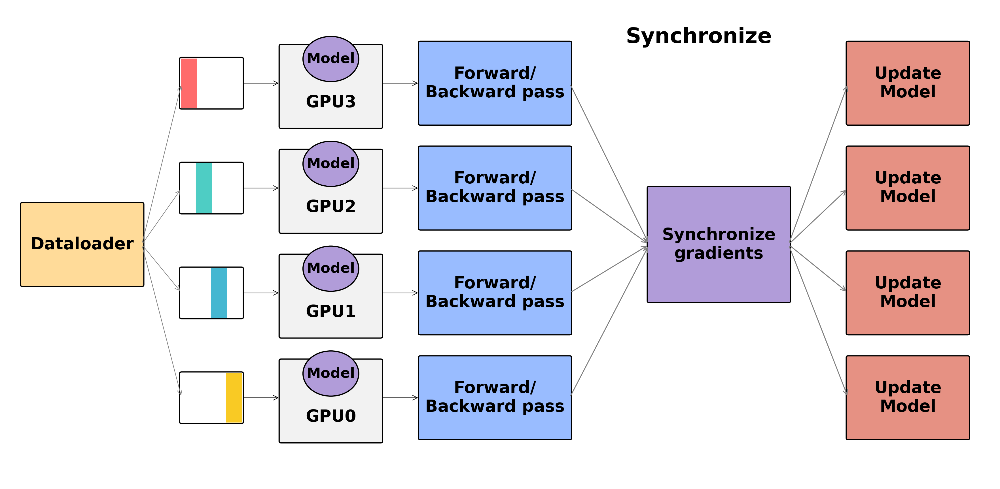
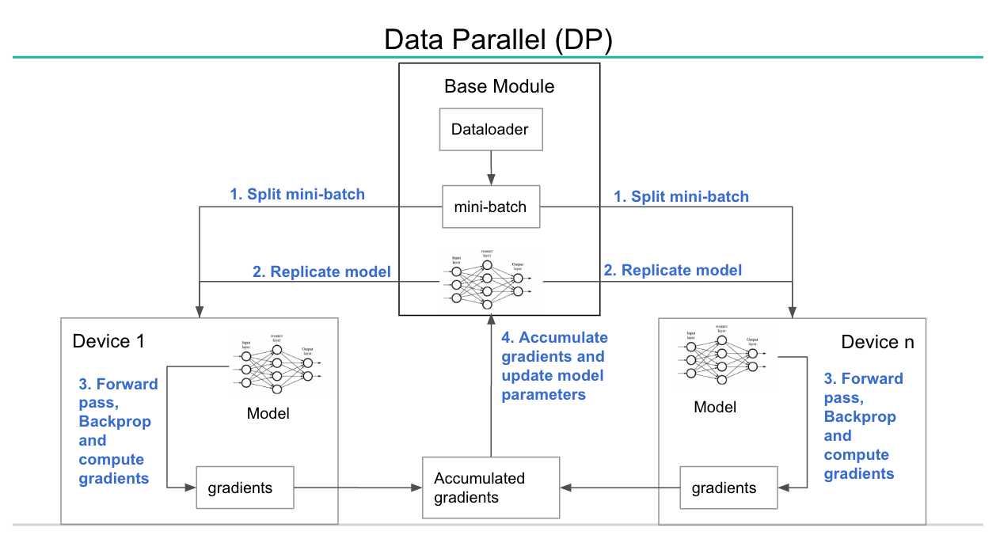
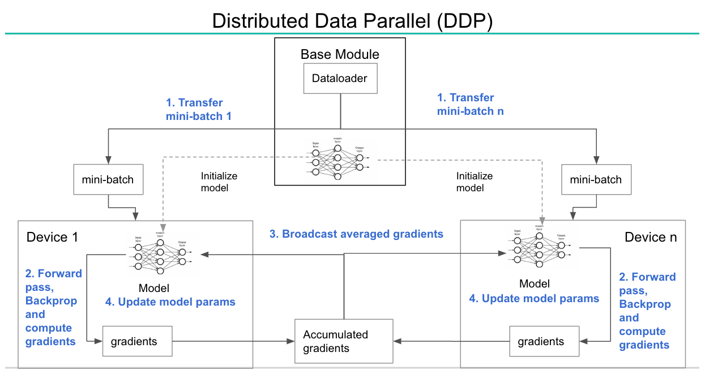
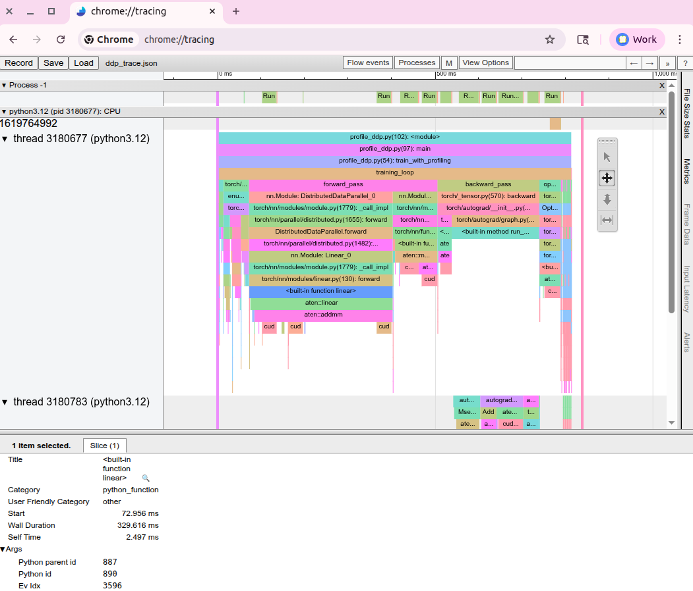

# 第 3 章：基于 PyTorch DDP 的分布式训练 {-}

*使用 DistributedDataParallel 实现多 GPU 高效横向扩展*

> 对终极算法的探索，本质上是对规模（Scale）的探索。  
> —— 理查德·萨顿（Richard Sutton，《苦涩的教训》作者）

**核心代码速查**

- `torch.distributed.init_process_group()`：初始化分布式通信进程组
- `DistributedDataParallel`：PyTorch 数据并行分布式训练核心封装类
- `DistributedSampler`：将数据集均匀切分并分发给多进程的数据采样器
- `torch.distributed.all_reduce()`：跨所有 Rank 对张量执行求和等归约的集合通信原语
- `torch.distributed.barrier()`：在当前进程组内设置同步阻塞屏障
- `torch.distributed.get_rank()`：获取当前进程的全局 Rank 编号
- `torch.distributed.get_world_size()`：获取分布式集群中的总进程数（World Size）
- `torchrun`：PyTorch 官方推荐的标准分布式训练多进程拉起工具
- `torch.nn.parallel.DistributedDataParallel`：DDP 核心模型包装器
- `torch.distributed.destroy_process_group()`：销毁并清理分布式进程组


## DDP 底层运行原理解析

在第~\ref{chap:gpu-hardware-networking-and-parallelism-strategies} 章中，我们探讨了支撑分布式训练的硬件底座与并行策略全景。现在，我们将切入工业界最成熟、应用最广泛的实战基石：**DistributedDataParallel（DDP，分布式数据并行）**。无论你的 GPU 位于同一台物理机内，还是分散在跨机架的大型集群中，DDP 都是实现数据并行横向扩展的工业标准方案。

DDP 的核心设计理念极其优雅：**在每张 GPU 上各复制一份完整的模型副本，将训练数据分片切分给各卡独立计算；在每次反向传播结束时，通过高效的底层集合通信跨卡同步平均梯度，从而驱动所有副本同步更新参数**。这种模式确保了所有 GPU 上的模型状态严格保持一致，同时算力吞吐随卡数增加实现近乎线性的扩展。

{#fig:ddp-workflow .block width=100% align=top-center}

@fig:ddp-workflow 清晰展示了 DDP 的完整工作闭环：数据从 DataLoader 通过 `DistributedSampler` 分流给每张 GPU 独立的前向与反向传播计算；在反向传播过程中，DDP 自动捕获各层参数梯度，利用底层硬件通信原语（如 AllReduce）执行跨卡梯度聚合，最终所有 GPU 使用完全一致的平均梯度更新参数权重。

### DDP 单步训练标准流程

对照 @fig:ddp-workflow，一个标准的 DDP 训练迭代包含以下关键步骤：

1. **前向传播（Forward Pass）**：每个进程在其专属的数据分片上独立执行前向计算。所有进程上的模型初始权重完全相同，但通过 `DistributedSampler` 确保每张卡看到的 Batch 数据各不相同。
2. **反向传播（Backward Pass）**：各进程在本地独立计算损失关于各层参数的梯度。此时 DDP 的底层机制介入——DDP 并不等待整个反向传播全部执行完毕，而是在局部梯度计算就绪时即刻启动捕获。
3. **梯度同步（Gradient Synchronization）**：DDP 调用底层通信库（GPU 上默认使用 NCCL）执行 **AllReduce** 操作，将所有进程的对应参数梯度求和并除以 `world_size`，使得每张卡都能获得全局平均梯度——其数学等价性与在单卡上使用超大 Global Batch 训练完全一致。
4. **参数更新（Parameter Update）**：各进程的优化器（Optimizer）使用同步后的全局平均梯度更新本地参数。由于各卡初始参数一致且应用的更新量完全相同，各副本在更新后依然保持严格同步。

这就是经典的**数据并行（Data Parallelism）**范式：模型被完整复制，数据被分片切分。每个 GPU 处理不同的 Batch 并通过梯度平均实现协同。在后续章节中，我们将进一步接触**模型并行（Model Parallelism）**——即将模型权重本身切分到不同 GPU 的高级范式。

### DataParallel (DP) vs DistributedDataParallel (DDP) 深度对比

在 DDP 诞生之前，PyTorch 最早提供了 `DataParallel`（DP）。尽管 DP 至今仍保留在官方代码库中，但在现代深度学习中已被全面弃用；**PyTorch 官方强烈推荐即使在单机多卡场景下也必须使用 DDP**。

DP 基于**单进程多线程（Single-Process Multi-Thread）**架构，其致命缺陷包括：
- **Python 全局解释器锁（GIL）瓶颈**：多线程无法真正利用多核 CPU，导致调度严重受限；
- **主卡（GPU 0）单点瓶颈**：前向传播前主卡必须将数据分发（Scatter）到各卡，反向传播后所有梯度必须汇总（Gather）到 GPU 0 计算更新，再广播（Broadcast）回各卡。GPU 0 的显存与 PCIe 带宽被严重挤占，造成严重的负载不均衡；
- **无法跨机器扩展**：DP 仅能在单台物理机内部通过 PCIe 工作，完全不具备多机集群扩展能力。

<!--  -->

相比之下，**DistributedDataParallel (DDP)** 从根本上重构了系统架构：
- **多进程隔离（Multi-Process Architecture）**：每个 GPU 独占一个独立的 Python 进程，彻底摆脱 Python GIL 束缚；
- **全对称对等通信（P2P / AllReduce）**：消除中心化主卡，所有 GPU 均等参与 Ring AllReduce 或 Tree AllReduce 通信，通信负载被完美分摊；
- **原生多机扩展支持**：统一抽象单机多卡与多机多卡拓扑，支持成百上千张 GPU 跨机协同；
- **计算与通信重叠（Overlap）**：在反向传播计算前序层梯度的同时，异步在后台启动已就绪后续层梯度的通信同步，极大掩盖通信开销。

<!--  -->

### 梯度分桶机制（Gradient Bucketing）的核心价值

如果 DDP 对模型中的每个参数张量都单独触发一次 AllReduce，系统将会发射成千上万次细碎的通信调用。每次通信都会引入不可忽视的物理延迟、CUDA Kernel 发射开销和同步等待。

为了彻底消除细碎通信的开销，DDP 引入了**梯度分桶（Gradient Bucketing）**机制：DDP 按照模型参数在反向传播中被求导的逆序，将多个相邻的小梯度张量打包归拢到一个连续的内存缓冲区（Bucket，默认大小为 **25 MB**）中。当一个分桶内的所有梯度计算就绪后，DDP 仅触发**一次大张量 AllReduce**。

{#fig:gradient-bucketing .block width=85% align=center}

如 @fig:gradient-bucketing 所示，分桶大小存在一个经典的系统权衡（Trade-off）：
- **分桶过大**：通信调用次数少，但必须等待桶内所有参数全部算完才能启动通信，导致通信与计算的重叠时间窗口被大幅压缩；
- **分桶过小**：通信能更早启动，但频繁的小报文传输会导致网络开销急剧上升。

在绝大多数主流模型中，PyTorch 默认的 25 MB 分桶大小已经取得了极佳的平衡；开发者亦可通过 `bucket_cap_mb` 参数针对特定模型进行微调。

### 通信与计算重叠（Overlap）的工程实现

DDP 获得极高线性扩展效率的核心杀手锏在于**将梯度 AllReduce 通信完美隐藏在反向传播计算之后**。

{#fig:comm-compute-overlap .block width=85% align=center}

如 @fig:comm-compute-overlap 所示，DDP 通过以下底层机制实现重叠：
1. **Autograd Hook 捕获**：DDP 在模型的所有可训练参数上注册底层 Hook 回调函数。当反向传播计算出某个参数的梯度时，Hook 立即将其标记为就绪；
2. **异步通信 Stream**：DDP 为 NCCL 通信分配了独立的 CUDA Stream。当一个分桶集齐完毕，DDP 立即在通信 Stream 上异步发射 AllReduce 操作；
3. **并行执行流水线**：在通信 Stream 搬运当前分桶梯度的同时，主计算 Stream 继续在本地执行前序网络层的反向传播求导。

若模型本身计算量足够充沛，跨卡通信的大部分耗时将被完全掩盖在计算耗时之内。

### AllReduce 核心集合通信原语

如第~\ref{chap:introduction-to-modern-distributed-ai} 章所述，AllReduce 是实现去中心化梯度同步的核心原语。在现代 GPU 集群中，NCCL 会根据网络拓扑自动在 **Ring AllReduce** 与 **Tree AllReduce** 之间进行智能选择。

{#fig:ring-allreduce .block width=50% align=right-top}

如 @fig:ring-allreduce 所示，在经典的 **Ring AllReduce** 算法中，所有参与通信的 Rank 逻辑上组成一个闭合单向环：
1. **Reduce-Scatter 阶段**：每个 Rank 将自身数据切分为 $N$ 块，顺时针向相邻下一个 Rank 传递并累加。经过 $N-1$ 步后，每个 Rank 各自持有一个切片的全局累加和；
2. **All-Gather 阶段**：每个 Rank 顺时针广播自身持有的完整切片。经过 $N-1$ 步后，所有 Rank 均获得完整的全局规约结果。

Ring AllReduce 具有**网络带宽最优（Bandwidth-Optimal）**的数学特性：不论参与卡数 $N$ 有多大，每张卡实际在物理链路上传输的数据总量恒为 **$2 \times \frac{N-1}{N} \times \text{TensorSize}$**（当 $N$ 较大时趋近于 $2 \times \text{TensorSize}$），这彻底避免了传统广播架构中随卡数线性膨胀的网络拥塞。

### 混合精度与梯度缩放（Gradient Scaling）

在 **FP16** 混合精度训练中，由于 FP16 的动态范围较小（指数位仅 5 bit），细微的梯度值极易发生下溢（Underflow）归零。标准解决方案是引入 **`GradScaler`（梯度缩放器）**：在前向传播计算出 Loss 后，首先乘以一个较大的放大因子（Scale Factor），使反向传播计算出的梯度脱离下溢危险区；在优化器更新前，再将梯度除以该因子还原。而在采用 **BF16** 时，由于其具备与 FP32 完全相同的 8 bit 指数位动态范围，下溢概率极低，通常直接使用 `autocast(dtype=torch.bfloat16)` 即可，无需配置 `GradScaler`。

{#fig:amp-ddp-flow .block width=90% align=center}

如 @fig:amp-ddp-flow 所示，在 DDP 体系下，**AllReduce 同步的是各卡已缩放（Scaled）的梯度**。跨卡通信求和完成后，各进程再各自执行解缩放（Unscale）与梯度合法性检查（检测是否含 Inf/NaN），最后驱动优化器安全更新参数。

### 模型 Buffer 同步机制（BatchNorm）

除了带有梯度的参数（`_parameters`）之外，PyTorch 模型还包含非参数的状态缓存（`_buffers`），典型代表是 **BatchNorm 的滑动均值（running_mean）与滑动方差（running_var）**。

在默认情况下（`broadcast_buffers=True`），DDP 会在每次前向传播开始前，自动将 Rank 0 的 Buffer 广播给所有其他 Rank，以确保全局统计量的一致性。

---

## 单机多卡 DDP 环境搭建与实战

单机多卡（Single-Node Multi-GPU）是分布式开发与中小规模模型训练最标准的开发基准。

### 使用 `torchrun` 启动训练（推荐标准）

现代 PyTorch 统一使用 `torchrun` 作为多进程拉起与管理的官方工具。`torchrun` 会自动解析硬件拓扑，为每个 GPU 分配一个独立进程，并自动注入所需的环境变量。

以下是单机多卡 DDP 的标准极简示例代码（见本章 `code/train_ddp_single_mini.py`）：

```python
import os
import torch
import torch.distributed as dist
import torch.nn as nn
from torch.nn.parallel import DistributedDataParallel as DDP
from torch.utils.data.distributed import DistributedSampler

def setup():
    """初始化分布式进程组并绑定本地 GPU 设备。"""
    # torchrun 会自动在环境变量中注入这些关键信息
    rank = int(os.environ['RANK'])
    local_rank = int(os.environ['LOCAL_RANK'])
    world_size = int(os.environ['WORLD_SIZE'])
    # 严格将当前进程绑定至其专属的 local_rank GPU
    torch.cuda.set_device(local_rank)
    device = torch.device(f'cuda:{local_rank}')
    # 初始化 NCCL 进程组
    dist.init_process_group(backend='nccl')
    return rank, local_rank, world_size, device

def cleanup():
    """销毁进程组，释放系统与网络资源。"""
    dist.destroy_process_group()

def main():
    rank, local_rank, world_size, device = setup()
    # 构建模型并转移至指定 GPU
    model = nn.Linear(10, 1).to(device)
    model = DDP(model, device_ids=[local_rank])
    # 构造模拟输入张量
    data = torch.randn(64, 10).to(device)
    target = torch.randn(64, 1).to(device)
    # 标准训练流水线
    optimizer = torch.optim.SGD(model.parameters(), lr=0.01)
    loss_fn = nn.MSELoss()
    for epoch in range(10):
        optimizer.zero_grad()
        output = model(data)
        loss = loss_fn(output, target)
        loss.backward()
        optimizer.step()
        if rank == 0:
            print(f'Epoch {epoch}, Loss: {loss.item():.4f}')
    cleanup()

if __name__ == '__main__':
    main()
```

在终端中执行以下命令拉起 4 卡训练：

```bash
torchrun --nproc_per_node=4 code/train_ddp_single_mini.py
```

### 核心环境变量解析

{#fig:ddp-env-vars .block width=70% align=center}

如 @fig:ddp-env-vars 所示，`torchrun` 会自动为每个子进程注入以下环境变量：
- **`RANK`**：当前进程在**全局集群**中的唯一编号（范围：`0` 至 `WORLD_SIZE - 1`）；
- **`LOCAL_RANK`**：当前进程在**本物理节点内部**的编号（范围：`0` 至 `单机 GPU 数 - 1`），**必须用此变量绑定 GPU 设备**；
- **`WORLD_SIZE`**：整个分布式作业的总进程数；
- **`MASTER_ADDR`** 与 **`MASTER_PORT`**：主节点 IP 与通信握手端口（单机模式下默认设为 `127.0.0.1`）。

### 数据分片中枢：`DistributedSampler`

在数据并行中，必须确保各进程加载互不重复的数据样本。`DistributedSampler` 通过对数据集索引进行确定性步长切分来实现这一点。

{#fig:distributed-sampler .block width=80% align=center}

如 @fig:distributed-sampler 所示，对于包含 $N$ 个样本的数据集，Rank 0 获得索引 $[0, 4, 8, \dots]$，Rank 1 获得 $[1, 5, 9, \dots]$，各卡分片互斥且并集覆盖全量数据。

```python
#LINENUM
from torch.utils.data import DataLoader, Dataset
from torch.utils.data.distributed import DistributedSampler

class MyDataset(Dataset):
    def __init__(self, size=1000):
        self.data = torch.randn(size, 10)
        self.labels = torch.randn(size, 1)
    def __len__(self):
        return len(self.data)
    def __getitem__(self, idx):
        return self.data[idx], self.labels[idx]

def get_dataloader(rank, world_size, batch_size=32):
    dataset = MyDataset(size=1000)
    # 创建 DistributedSampler
    sampler = DistributedSampler(
        dataset,
        num_replicas=world_size,
        rank=rank,
        shuffle=True,   # 每个 Epoch 进行洗牌
        drop_last=True  # 丢弃末尾不完整 Batch，避免进程步数不均引发死锁
    )
    # DataLoader 绑定 sampler（注意：此时 DataLoader 内禁止再传 shuffle=True）
    dataloader = DataLoader(
        dataset,
        batch_size=batch_size,
        sampler=sampler,
        num_workers=4,
        pin_memory=True # 开启锁页内存，加速 CPU 到 GPU 的异步搬运
    )
    return dataloader, sampler

def train():
    rank, local_rank, world_size, device = setup()
    dataloader, sampler = get_dataloader(rank, world_size)
    model = create_model().to(device)
    model = DDP(model, device_ids=[local_rank])
    for epoch in range(10):
        # 核心关键：每个 Epoch 必须调用 set_epoch 重新洗牌！
        # 否则每个 Epoch 看到的数据顺序将完全相同
        sampler.set_epoch(epoch)
        for batch_idx, (data, target) in enumerate(dataloader):
            data = data.to(device)
            target = target.to(device)
            # 训练逻辑...
            pass
    cleanup()
```

### DataLoader 底层多进程预取流水线

{#fig:dataloader-workers .block width=100% align=center}

如 @fig:dataloader-workers 所示，当配置 `num_workers > 0` 时，主进程通过索引队列分发 Batch 任务，各独立 Worker 进程在后台并发解码与增强数据，并将准备好的张量推入结果队列。主进程在计算当前 Batch 的同时，Worker 已经在后台预取（Prefetch）下一个 Batch，从而完全消除了 I/O 阻塞。

---

## 多机多卡 DDP 集群搭建与网络配置

当模型规模或训练数据量进一步扩大时，必须跨越多台物理节点组建多机 DDP 集群。

### 多机多卡拓扑架构与环境变量映射

{#fig:multi-node-env-vars .block width=100% align=center}

如 @fig:multi-node-env-vars 所示，在 2 台节点（每台 2 卡，共 4 卡）的集群中：
- **Node 0（主节点，`NODE_RANK=0`）**：运行全局 `RANK 0`（`LOCAL_RANK 0`）与 `RANK 1`（`LOCAL_RANK 1`）；
- **Node 1（工作节点，`NODE_RANK=1`）**：运行全局 `RANK 2`（`LOCAL_RANK 0`）与 `RANK 3`（`LOCAL_RANK 1`）。

### 手动多机拉起命令（`torchrun`）

在 **Node 0（主节点）** 上执行：

```bash
torchrun --nnodes=2 --nproc_per_node=2 --node_rank=0 \
  --master_addr=192.168.1.100 --master_port=29500 code/train_ddp_multi_mini.py
```

在 **Node 1（工作节点）** 上执行：

```bash
torchrun --nnodes=2 --nproc_per_node=2 --node_rank=1 \
  --master_addr=192.168.1.100 --master_port=29500 code/train_ddp_multi_mini.py
```

### 基于 SLURM 调度器的集群作业提交

在标准超算集群中，通常使用 SLURM 提交作业脚本（详见第~\ref{chap:running-distributed-training-with-slurm} 章）：

```bash
#!/bin/bash
#SBATCH --job-name=ddp_multi_node
#SBATCH --nodes=2
#SBATCH --ntasks-per-node=2
#SBATCH --gres=gpu:2
#SBATCH --time=24:00:00
#SBATCH --partition=gpu

# 动态提取主节点 IP
export MASTER_ADDR=$(scontrol show hostnames $SLURM_JOB_NODELIST | head -n 1)
export MASTER_PORT=29500

srun torchrun --nnodes=$SLURM_NNODES --nproc_per_node=2 \
  --node_rank=$SLURM_NODEID --master_addr=$MASTER_ADDR --master_port=$MASTER_PORT \
  code/train_ddp_multi_mini.py
```

---

## 生产级调试与故障排查指南

分布式训练系统极其精密，任何微小的不一致都会导致系统发生死锁挂起或训练发散。

### 1. 死锁挂起（Hangs）诊断

**现象**：作业启动后卡在 `init_process_group` 或首个 Step 的反向传播处不再推进。

**核心排查清单**：
- **条件分支导致集合通信缺失**：**绝对禁止在 `if rank == 0:` 分支内部调用 `all_reduce` 或 `barrier`！** 集合通信必须由全体 Rank 严格按照相同顺序同步调用，任意一个 Rank 缺席都会导致其余所有卡永久死锁等待。
- **跨机网络端口阻塞**：确认防火墙已放行 `MASTER_PORT`（默认 29500 附近），可通过 `telnet <master_ip> 29500` 快速探测连通性。
- **网卡绑定错误**：多网卡机器上 NCCL 可能误绑定到管理以太网口。必须显式指定高速集群网卡：`export NCCL_SOCKET_IFNAME=ib0`。
- **开启 NCCL 超时与死锁堆栈追踪**：
  ```bash
  export TORCH_NCCL_ASYNC_ERROR_HANDLING=1
  export TORCH_NCCL_BLOCKING_WAIT=1
  export NCCL_DEBUG=INFO
  export NCCL_DEBUG_SUBSYS=INIT,COLL
  ```

### 2. 梯度不一致与 Loss 发散诊断

**核心排查清单**：
- **遗漏 `sampler.set_epoch(epoch)`**：导致模型在每个 Epoch 学习到完全相同顺序的数据，破坏数据随机性；
- **各 Rank 随机数种子未统筹**：使用统一的 `set_seed(42 + rank)` 逻辑，确保数据增强具备独立性但网络初始化受控；
- **学习率未按 Global Batch Size 线性缩放**：单卡 Batch 为 $B$ 时学习率为 $\eta$；扩展至 $N$ 卡后 Global Batch 扩大为 $N \times B$，基础学习率通常需相应放大（如线性缩放规则 $\eta' = N \times \eta$ 或平方根缩放）。

### 3. 显存溢出（CUDA OOM）优化

- **显存分摊核算**：DDP 为每张卡分配的是本地 Batch（Per-GPU Batch Size）。若全局 Batch 设定为 128，4 卡训练时每张卡的数据量应设为 $128 / 4 = 32$。
- **梯度累加（Gradient Accumulation）**：通过累加多个 Micro-batch 模拟大 Batch，并配合 `with model.no_sync():` 禁用中间步的跨卡 AllReduce 通信。
- **激活值重计算（Activation Checkpointing）**：以 20%–30% 的额外重计算时间为代价，削减 60%–70% 的前向激活值显存占用。

---

## DDP 性能 Profiling 与可视化分析 {#sec:ddp-profiling}

在对 DDP 训练进行优化前，必须使用性能分析工具精确诊断耗时分布。

### 使用 `torch.profiler` 捕获 Chrome Trace

```python
from torch.profiler import profile, record_function, ProfilerActivity

with profile(
    activities=[ProfilerActivity.CPU, ProfilerActivity.CUDA],
    record_shapes=True,
    profile_memory=True,
    with_stack=True
) as prof:
    with record_function("training_step"):
        optimizer.zero_grad()
        output = model(data)
        loss = criterion(output, target)
        loss.backward()
        optimizer.step()

# 导出 Chrome 格式跟踪日志
prof.export_chrome_trace("ddp_trace.json")
```

### 在 Perfetto / Chrome Tracing 中分析时序图

{#fig:ddp-tracing-chrome .block width=90% align=center}

在浏览器中打开 [https://ui.perfetto.dev/](https://ui.perfetto.dev/) 并加载 `ddp_trace.json`，核心观察以下要点（如 @fig:ddp-tracing-chrome 所示）：
1. **CUDA Stream 层次**：DDP 在主计算 Stream 上执行反向传播 Kernel（如 `ConvolutionBackward`），并在独立的 NCCL 通信 Stream 上发射 `ncclKernel_AllReduce`。
2. **重叠健康度判定**：
   - **优秀**：通信 Stream 上的 AllReduce 块与主 Stream 上的反向求导计算块在时间轴上大幅度重叠，Step 末尾几乎没有纯通信空白；
   - **瓶颈明显**：反向传播计算早已结束，GPU 陷入长段单纯等待 NCCL 通信的空白期（通信耗时占比 $> 40\%$）。

---

## 性能调优进阶技巧

### 1. 混合精度与 BF16 原生支持

在 Ampere 及以上架构（A100/H100/H200/B200）上，优先推荐使用 BF16 精度：

```python
with torch.autocast(device_type='cuda', dtype=torch.bfloat16):
    output = model(data)
    loss = criterion(output, target)
loss.backward()
optimizer.step()
```

### 2. 梯度累加与 `no_sync()` 通信掩码

在梯度累加场景中，前 $K-1$ 次 Micro-batch 求导无需执行跨卡同步，只有在第 $K$ 次更新时才触发全局 AllReduce：

```python
accumulation_steps = 4
optimizer.zero_grad()
for i, (data, target) in enumerate(dataloader):
    output = model(data)
    loss = criterion(output, target) / accumulation_steps
    # 前 3 个 Micro-batch 禁用跨卡 AllReduce
    if (i + 1) % accumulation_steps != 0:
        with model.no_sync():
            loss.backward()
    else:
        loss.backward()
        optimizer.step()
        optimizer.zero_grad()
```

### 3. 静态图优化（`static_graph=True`）

若模型内部不包含动态条件控制分支（计算图完全静态），开启 `static_graph=True` 可使 DDP 缓存参数依赖与通信调度图，彻底消除每次反向传播重构通信图的 CPU 开销：

```python
model = DDP(model, device_ids=[local_rank], static_graph=True)
```

---

## 分布式检查点（Checkpointing）与断点续训

在长周期分布式任务中，规范的 Checkpoint 保存与恢复策略是保证系统鲁棒性的生命线。

### 标准规范：仅 Rank 0 负责存盘并执行原子写入

```python
import os
import torch
import torch.distributed as dist

def save_checkpoint(model, optimizer, epoch, filepath):
    rank = dist.get_rank()
    if rank == 0:
        temp_filepath = filepath + ".tmp"
        checkpoint = {
            'epoch': epoch,
            'model_state_dict': model.module.state_dict(), # 核心：必须使用 model.module 提取纯净模型字典
            'optimizer_state_dict': optimizer.state_dict(),
            'rng_state': torch.get_rng_state(),
            'cuda_rng_state': torch.cuda.get_rng_state_all(),
        }
        # 先写临时文件再重命名，保证磁盘写入的原子性（防止断电损坏）
        torch.save(checkpoint, temp_filepath)
        os.rename(temp_filepath, filepath)
        print(f"Rank 0 成功保存检查点: {filepath}")
    
    # 阻塞所有卡，确保 Rank 0 存盘完毕后其他卡再继续
    dist.barrier()

def load_checkpoint(model, optimizer, filepath):
    rank = dist.get_rank()
    checkpoint = torch.load(filepath, map_location=f'cuda:{rank}')
    model.module.load_state_dict(checkpoint['model_state_dict'])
    optimizer.load_state_dict(checkpoint['optimizer_state_dict'])
    torch.set_rng_state(checkpoint['rng_state'])
    torch.cuda.set_rng_state_all(checkpoint['cuda_rng_state'])
    return checkpoint['epoch'] + 1
```

---

## 弹性与容错数据并行（Elastic DDP） {#sec:elastic-data-parallelism}

在大规模集群或云上抢占式实例（Spot Instances）环境中，节点硬件故障或算力被回收是常态。**弹性数据并行（Torch Distributed Elastic / TDE）** 赋予了训练任务在节点发生故障时自动重启、动态重连并恢复训练的工业级容错能力。

通过 `torchrun` 的 `--max-restarts`、`--rdzv-id`、`--rdzv-backend=c10d` 以及动态节点范围配置 `--nnodes=MIN:MAX`，当任意 Rank 崩溃时，弹性代理（Elastic Agent）会自动捕获异常并暂停全体节点，重新执行 **Rendezvous（节点汇合握手）**，重新分配全局 Rank 并拉起新进程组。各卡在启动后从最新保存的 Checkpoint 恢复状态，实现无缝断点续训。

```bash
# 2-4 节点动态伸缩容错启动命令
torchrun --nnodes=2:4 --nproc_per_node=8 --max_restarts=3 \
    --rdzv_id=elastic_training_job --rdzv_backend=c10d \
    --rdzv_endpoint=192.168.1.100:29400 \
    code/train_elastic_checkpoint.py
```

---

## 本章小结

本章系统剖析了 PyTorch DDP 的内部机理与生产实战范式。我们深入探讨了：
- DDP 基于多进程架构与 Ring/Tree AllReduce 的底层优势；
- 梯度分桶（Bucketing）与 Autograd Hook 驱动的计算-通信重叠（Overlap）原理；
- `torchrun` 与 `DistributedSampler` 在单机与多机环境下的标准工程实践；
- 基于 Perfetto / Chrome Tracing 的通信性能瓶颈诊断方法；
- 生产级断点续训、梯度累加掩码与弹性容错（Elastic DDP）系统构建。

然而，数据并行的本质是将完整模型完整驻留在每张 GPU 上。**当模型参数规模突破数十亿（如 7B/70B/405B），单张卡连模型权重本身都无法容纳时，单纯的 DDP 将彻底受阻**。在下一章中，我们将正式迈入大模型时代的并行利器——**全分片数据并行（FSDP, Fully Sharded Data Parallel）**，探索如何将参数、梯度与优化器状态全面切分至全集群显存池中。

<!-- include: exercises/torch_zh.md if include_math -->
<!-- include: exercises/torch_zh.md if include_torch -->
