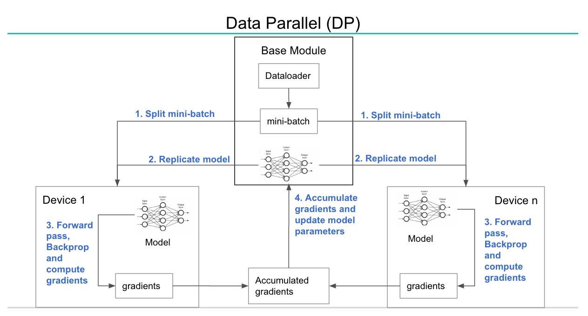
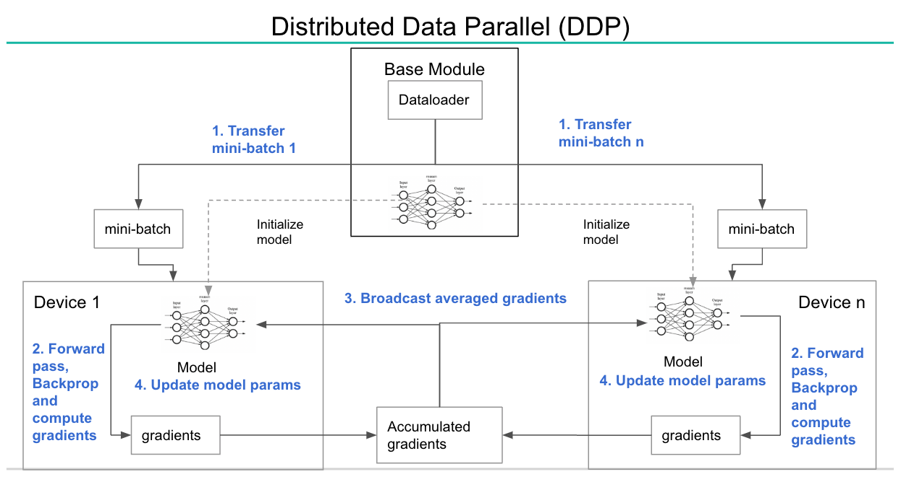
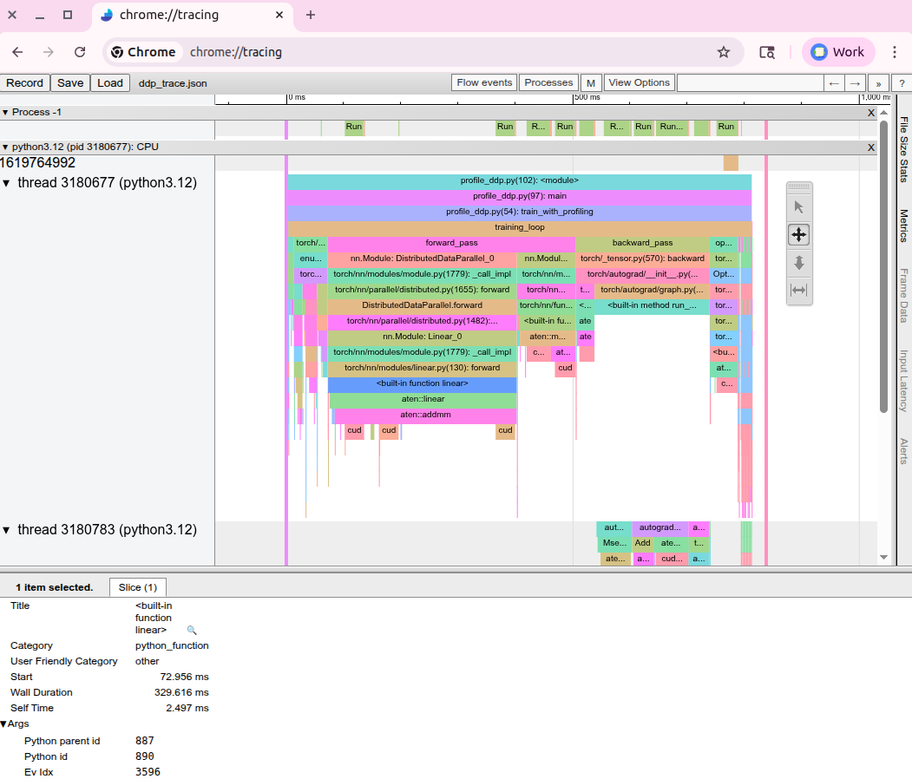

# 第3章：使用 PyTorch DDP 进行分布式训练 {-}

*用 DistributedDataParallel 将训练扩展到多块 GPU*

> 对终极算法的追寻，就是对规模的追寻。
- Richard Sutton

**Code Summary**

- `torch.distributed.init_process_group()`：初始化用于分布式通信的进程组
- `DistributedDataParallel`：用于数据并行分布式训练的 PyTorch 包装器
- `DistributedSampler`：跨多个进程对数据集进行分区的采样器
- `torch.distributed.all_reduce()`：跨所有 rank 求和张量的集合操作
- `torch.distributed.barrier()`：同步组中的所有进程
- `torch.distributed.get_rank()`：获取当前进程的 rank
- `torch.distributed.get_world_size()`：获取进程总数
- `torchrun`：用于分布式训练的 PyTorch 启动器
- `torch.nn.parallel.DistributedDataParallel`：DDP 包装类
- `torch.distributed.destroy_process_group()`：清理进程组

## DDP 的内部工作原理

在第~\ref{chap:gpu-hardware-networking-and-parallelism-strategies}章，我们探索了使分布式训练成为可能的硬件基础和并行策略。现在我们转向实际实现：**DistributedDataParallel（DDP）**，PyTorch 用于数据并行分布式训练的标准方法。DDP 是你实际将训练扩展到多块 GPU 的方式——无论它们是在单台机器中还是分散在一个集群上。


核心思想很优雅：在每块 GPU 上复制你的模型，将数据分片到 GPU 上，并在每次反向传播后同步梯度。每块 GPU 处理不同批次的数据，独立计算梯度，然后所有 GPU 一起平均它们的梯度。这确保每个模型副本保持同步，同时利用并行计算。

{#fig:ddp-workflow .block width=100% align=top-center}

图~\ref{fig:ddp-workflow} 展示了完整的 DDP 训练工作流程。数据从数据加载器流向每块 GPU 的数据分片，经过前向和反向传播，然后在更新模型参数之前跨所有 GPU 同步梯度。魔法发生在反向传播期间——DDP 使用高效的集合通信原语（如 AllReduce）自动聚合来自所有进程的梯度，并确保每个进程都有相同的更新后参数。

### 基本流程

按照图~\ref{fig:ddp-workflow} 所示的工作流程，以下是使用 DDP 的单个训练步骤中发生的事情：

1. **前向传播**：每个进程在自己的数据分片上运行前向。模型在所有进程上是相同的，但得益于 `DistributedSampler`，每个进程看到不同的数据。如图所示，数据从数据加载器流向每块 GPU 的数据分片，然后通过模型进行前向计算。
2. **反向传播**：每个进程在本地计算梯度。这是 DDP 介入的地方——不是每个进程独立更新其模型，而是 DDP 收集所有梯度。反向传播跨所有 GPU 并行地为每个参数计算梯度。
3. **梯度同步**：DDP 使用 AllReduce（在 GPU 上通过 NCCL）跨所有进程求和梯度，然后除以 `world_size`，使每个 rank 持有平均梯度——与你用全局批次在单块 GPU 上得到的更新相同。这是图~\ref{fig:ddp-workflow} 中心所示的关键同步步骤，来自所有 GPU 的梯度在此聚合。
4. **参数更新**：每个进程使用同步后的梯度应用优化器步骤。由于所有进程从相同的参数开始并应用相同的梯度，它们最终得到相同的参数。最后一步用同步后的梯度更新每个模型副本，保持所有进程之间的一致性。

这就是 **数据并行**：模型被复制，但数据被分片。每块 GPU 处理不同的批次，梯度被平均。将这与 **模型并行**（在后续章节介绍）比较，后者模型本身被拆分到 GPU 上。

### 数据并行（DP）vs 分布式数据并行（DDP）

在 DDP 之前，PyTorch 有 `DataParallel`（DP），它仍然可用，但不再推荐，转而支持 DDP——官方文档甚至对单节点多 GPU 训练也推荐 `DistributedDataParallel`。DP 使用单进程、多线程的方法，运行在单台机器上。它有几个限制：Python 的 GIL 阻止了真正的并行，所有梯度同步都发生在 GPU 0 上造成瓶颈，并且它无法跨多台机器扩展。

<!--  -->

**DistributedDataParallel（DDP）** 解决了这些限制。

DDP 使用多进程架构而非多线程。每块 GPU 在自己的进程中运行，这避免了 Python 的 GIL 限制并实现真正的并行。与 DP 不同，DDP 可以跨通过网络连接的多台机器扩展。你不局限于单台机器中的 GPU——你可以在跨集群的成百上千块 GPU 上训练。

通信也更高效。DDP 使用优化的集合通信原语，如 Ring AllReduce 和树形算法。这些将工作分布到所有 GPU 上，而不只是 GPU 0。不是一块 GPU 做所有工作，而是每块 GPU 都参与梯度同步。这消除了困扰 DP 的单 GPU 瓶颈。

<!--  -->

DDP 还将梯度同步与计算重叠。当一个桶的梯度正在同步时，下一个桶可以开始计算。这隐藏了通信延迟，使整体训练更快。所有 GPU 平等地参与梯度同步，在整个系统中创建了均衡的工作负载。

由于这些原因，DDP 是分布式训练的标准——即使在单台机器上也用它。

### 梯度分桶：为什么它重要

如果 DDP 单独同步每个梯度张量，你就会有数千个小的 AllReduce 操作。每个 AllReduce 都有开销——网络延迟、内核启动开销、同步成本。解决方案是 **梯度分桶（gradient bucketing）**：DDP 将小的梯度张量分组到桶中，并对整个桶执行 AllReduce。

它是这样工作的：DDP 分析你的模型参数顺序（它们在 `model.parameters()` 中出现的顺序）。它根据大小将连续的参数分组到桶中。当反向传播到达桶边界时，DDP 为那个桶触发一个 AllReduce。默认桶大小是 25 MB，但你可以用 `bucket_cap_mb` 调整它。

{#fig:gradient-bucketing .block width=85% align=center}

图~\ref{fig:gradient-bucketing} 显示了参数段和桶边界。分桶减少了通信开销，但有一个权衡：更大的桶意味着更少的 AllReduce 调用（更少开销）但更晚的同步（梯度直到桶准备好才可用）。更小的桶意味着更早的同步但更多的开销。对大多数模型，默认的 25 MB 效果良好，但对非常大或非常小的模型你可能会调整它。

### 通信-计算重叠

真正的性能收益来自 **重叠通信和计算**。当 DDP 正在为一个桶做 AllReduce 时，你的反向传播可以继续为下一个桶计算梯度。这将通信延迟隐藏在计算之后。

{#fig:comm-compute-overlap .block width=85% align=center}

图~\ref{fig:comm-compute-overlap} 展示了重叠。DDP 通过以下方式实现重叠：

- 异步启动 AllReduce 操作
- 使用 CUDA 流将通信内核与计算内核重叠
- 按桶准备好的顺序处理它们（不一定是参数顺序）

要让重叠工作，你需要在桶边界之间有足够的计算。如果你的模型参数非常少或层非常小，可能没有足够的工作来重叠。在那种情况下，你会看到通信时间占主导，重叠帮助不大。

你可以通过性能剖析检查重叠是否在工作。如果你看到 AllReduce 操作与反向计算并发发生，重叠就在工作。如果 AllReduce 在所有梯度计算完之后顺序发生，重叠就没有发生（也许你的模型太小，或者有一个同步点在阻塞它）。


### AllReduce 操作

AllReduce 是使 DDP 工作的核心集合操作。如第~\ref{chap:introduction-to-modern-distributed-ai}章详述（见"集合操作"一节），AllReduce 从所有进程获取梯度，求和它们，并将结果分发回所有进程。在 GPU 上，DDP 使用 NCCL（NVIDIA 集合通信库）通过 __ring AllReduce__ 和 __tree AllReduce__ 等算法高效实现 AllReduce，NCCL 会根据你的硬件拓扑自动选择。

{#fig:ring-allreduce .block width=50% align=right-top}

图~\ref{fig:ring-allreduce} 显示了 **环形拓扑**：rank 排列成一个逻辑环，数据沿一个方向流动（如顺时针）。在 ring AllReduce 中，每个 rank 持有完整张量的一个块。在第一阶段（reduce-scatter），每个 rank 将其块发送给下一个 rank 并从上一个接收，累积部分和，使得在 $N-1$ 步之后（对 $N$ 个 rank），每个 rank 拥有一个块的完整和。在第二阶段（all-gather），rank 交换这些归约后的块，直到每个 rank 都有完整的归约结果。环形算法是 **带宽最优的**：无论 $N$ 多少，它只移动张量大小的 $2 \cdot (N-1)/N$ 倍，并高效地使用环中的每条链路。当 NCCL 检测到树形布局延迟更低或更适合物理互连（如 NVLink vs PCIe vs 网络）的拓扑时，它可能改选 **tree AllReduce**（或其他变体）。

理解正在使用哪种算法在调试性能时有帮助。如果梯度同步慢，可能的原因包括：（1）NCCL 选了一个不匹配你拓扑的算法（如在不是物理环的网络上用环）；（2）网络或互连带宽饱和；（3）小消息大小无法摊销集合操作的固定成本。你可以通过 `NCCL_DEBUG=INFO` 或 PyTorch 性能分析器检查 NCCL 的选择和时序；将 AllReduce 时间与理论环形成本（张量大小除以每链路带宽）比较，可以告诉你是受带宽限制还是受延迟限制。

### 混合精度与梯度缩放

使用 **FP16** 混合精度时，梯度可能下溢（变为零），因为 FP16 有狭窄的指数范围。解决方案是 **梯度缩放（gradient scaling）**：在反向之前将损失乘以一个缩放因子，然后在优化器步骤之前对梯度反缩放。**BF16** 与 FP32 共享指数范围，所以下溢很少见，`GradScaler` 通常没必要——在支持的硬件上，`autocast(dtype=torch.bfloat16)` 常常就够了。

{#fig:amp-ddp-flow .block width=90% align=center}

图~\ref{fig:amp-ddp-flow} 显示了流水线。DDP 与 PyTorch 的自动混合精度（AMP）配合工作。下面的流程针对 **带 `GradScaler` 的 FP16**：

1. 缩放损失：`loss = loss * scale`
2. 反向：`loss.backward()`（梯度也被缩放）
3. DDP AllReduce：同步缩放后的梯度
4. 反缩放：在优化器步骤之前将梯度除以 scale
5. 更新 scale：根据梯度溢出检测调整缩放因子

关键点是 DDP 在梯度被缩放 **之后** 同步它们。每个进程缩放自己的梯度，然后 DDP 求和缩放后的梯度。AllReduce 之后，所有进程都有相同的缩放后梯度，然后在优化器步骤之前反缩放。

如果你在 DDP 中使用 FP16 AMP，使用 `GradScaler`：在用 DDP 包装模型之前创建它，并在每个进程（不只是 rank 0）上调用 `scaler.step()` 和 `scaler.update()`。对于 BF16 训练，你通常省略 scaler。

### 缓冲区同步

DDP 不只同步梯度——它还同步 **缓冲区（buffers）**。缓冲区是不需要梯度的模型参数，如 BatchNorm 的运行均值和方差。在前向传播期间，DDP 将缓冲区从 rank 0 广播到所有其他 rank 以确保一致性。

这自动发生，但有一个性能考量：缓冲区同步增加了通信开销。如果你的模型有许多缓冲区或大缓冲区，这可能减慢训练。你可以用 `broadcast_buffers=False` 禁用它，但只有当你确定缓冲区不需要同步时（如你不使用 BatchNorm，或你手动同步缓冲区）。

对大多数模型，保持 `broadcast_buffers=True`（默认）是正确的选择。BatchNorm 和类似的层需要同步的统计信息才能在分布式训练中正确工作。

### DDP 前向传播实现细节

理解 DDP 如何在前向传播期间维持模型一致性在调试时有帮助。在 PyTorch 中，所有模型都继承自 `torch.nn.Module`，它维护两个关键字典：

- **`_parameters`**：需要梯度的网络参数
- **`_buffers`**：持久化的非参数数据（如 BatchNorm 的运行均值和方差）

DDP 通过 `_sync_module_states` 确保模型一致性，它跨所有进程同步 `_parameters` 和 `_buffers`。这发生在两个地方：

1. **在 DDP 初始化期间**：当你创建一个 DDP 模型时，它将初始参数和缓冲区从 rank 0 同步到所有其他 rank。

2. **在每次前向传播之前**：如果 `broadcast_buffers=True`（默认），DDP 在前向传播之前同步缓冲区以确保所有进程有相同的缓冲区值。

这种同步确保所有进程从相同的模型状态开始，这对训练期间维持一致性至关重要。

### DDP 计算-通信重叠实现

DDP 中的重叠机制使用 autograd 钩子、参数分桶和一个 reducer 组件实现。它是这样工作的：

**Autograd 钩子**：DDP 在模型参数上注册钩子。这些钩子在反向传播期间计算梯度时被触发。钩子函数将参数梯度标记为"准备好"归约。

**参数分桶**：reducer 根据 `bucket_cap_mb` 设置将参数梯度组织到桶中。参数大致按 `model.parameters()` 的逆序分配到桶中（逆序是因为梯度在反向传播期间以逆序计算）。这确保同一桶中的梯度大约同时准备好。

**Reducer**：当一个桶中的所有梯度都准备好时，reducer 为那个桶启动一个异步 AllReduce 操作。当 AllReduce 进行中时，反向传播继续为下一个桶计算梯度，实现重叠。

**未使用的参数**：如果一个参数在前向传播中未被使用（如在条件模型中），它的梯度永远不会准备好，导致桶永远等待。设置 `find_unused_parameters=True` 告诉 DDP 分析计算图以识别未使用的参数并将它们标记为准备好，而无需等待它们的梯度。这增加了开销但防止挂起。

关键洞见是：DDP 不在开始通信之前等待所有梯度。相反，它一旦桶准备好就通信梯度，将通信与正在进行的计算重叠。

## 设置单节点 DDP

最简单的 DDP 设置是单节点多 GPU：一台机器有多块 GPU。这是大多数人开始的地方，也是你用于开发和较小规模训练的。

### 使用 torchrun（推荐）

启动 DDP 训练的现代方式是用 `torchrun`（在旧版 PyTorch 中是 `torch.distributed.run`）。`torchrun` 处理进程创建、环境变量设置和错误处理。它是大多数情况的推荐启动器。

这是一个最小示例。将它保存为脚本，或使用本章目录中提供的 `code/train_ddp_single_mini.py`。

```python
import os
import torch
import torch.distributed as dist
import torch.nn as nn
from torch.nn.parallel import DistributedDataParallel as DDP
from torch.utils.data.distributed import DistributedSampler

def setup():
    """Initialize process group and set device."""
    # torchrun sets these environment variables automatically
    rank = int(os.environ['RANK'])
    local_rank = int(os.environ['LOCAL_RANK'])
    world_size = int(os.environ['WORLD_SIZE'])
    # Set device for this process
    torch.cuda.set_device(local_rank)
    device = torch.device(f'cuda:{local_rank}')
    # Initialize process group
    dist.init_process_group(backend='nccl')
    return rank, local_rank, world_size, device

def cleanup():
    """Clean up process group."""
    dist.destroy_process_group()

def main():
    rank, local_rank, world_size, device = setup()
    # Create model and move to device
    model = nn.Linear(10, 1).to(device)
    model = DDP(model, device_ids=[local_rank])
    # Create dummy data
    data = torch.randn(64, 10).to(device)
    target = torch.randn(64, 1).to(device)
    # Training step
    optimizer = torch.optim.SGD(model.parameters(), lr=0.01)
    loss_fn = nn.MSELoss()
    for epoch in range(10):
        # DistributedSampler would go here for real data
        optimizer.zero_grad()
        output = model(data)
        loss = loss_fn(output, target)
        loss.backward()
        optimizer.step()
        if rank == 0:
            print(f'Epoch {epoch}, Loss: {loss.item():.4f}')
    cleanup()

if __name__ == '__main__':
    main()
```

用以下命令启动它（从章节目录，或传入脚本路径）：

```bash
torchrun --nproc_per_node=4 code/train_ddp_single_mini.py
```

这启动 4 个进程，每块 GPU 一个（假设你有 4 块 GPU）。`torchrun` 自动设置 `RANK`、`LOCAL_RANK`、`WORLD_SIZE`、`MASTER_ADDR` 和 `MASTER_PORT` 环境变量。示例输出如下：

```
Epoch 0, Loss: 1.3706
Epoch 1, Loss: 1.3595
Epoch 2, Loss: 1.3488
Epoch 3, Loss: 1.3386
Epoch 4, Loss: 1.3287
Epoch 5, Loss: 1.3193
Epoch 6, Loss: 1.3103
Epoch 7, Loss: 1.3016
Epoch 8, Loss: 1.2932
Epoch 9, Loss: 1.2852
```


### 理解环境变量


使用 `torchrun` 时，这些环境变量被 __自动__ 设置：

{#fig:ddp-env-vars .block width=70% align=center}

图~\ref{fig:ddp-env-vars} 显示了单节点四块 GPU 的 RANK 和 LOCAL_RANK（如上面的 `torchrun --nproc_per_node=4` 示例）。变量：

- **RANK**：此进程的全局 rank（0 到 WORLD_SIZE-1）
- **LOCAL_RANK**：此节点内的本地 rank（0 到每节点 GPU 数 - 1）
- **WORLD_SIZE**：进程总数
- **MASTER_ADDR**：主节点的 IP 地址（对单节点，这是 localhost）
- **MASTER_PORT**：进程组初始化的端口（torchrun 挑选一个空闲端口）

对于单节点训练，你通常只关心 `LOCAL_RANK`（用于设置此进程使用哪块 GPU）和 `RANK`（用于识别主进程以进行日志/检查点记录）。

### 使用 DistributedSampler

数据并行的关键是确保每个进程看到不同的数据。`DistributedSampler` 通过跨进程分片数据集来做到这一点。

{#fig:distributed-sampler .block width=80% align=center}

图~\ref{fig:distributed-sampler} 展示了完整数据集如何被拆分为连续、不重叠的分片：每个 rank 接收一段不同的索引（如四个 rank 和 N 个样本时，rank 0 得到索引（$0 \ldots \lceil N/4 \rceil - 1$），rank 1 得到接下来的四分之一，以此类推），所以没有样本被多个进程看到，且所有分片的并集覆盖整个数据集。


```python
#LINENUM
from torch.utils.data import DataLoader, Dataset
from torch.utils.data.distributed import DistributedSampler

class MyDataset(Dataset):
    def __init__(self, size=1000):
        self.data = torch.randn(size, 10)
        self.labels = torch.randn(size, 1)
    def __len__(self):
        return len(self.data)
    def __getitem__(self, idx):
        return self.data[idx], self.labels[idx]

def get_dataloader(rank, world_size, batch_size=32):
    dataset = MyDataset(size=1000)
    # Create DistributedSampler
    sampler = DistributedSampler(
        dataset,
        num_replicas=world_size,
        rank=rank,
        shuffle=True,  # Shuffle data each epoch
        drop_last=True  # avoids DDP sync issues
    )
    # Create DataLoader with sampler
    dataloader = DataLoader(
        dataset,
        batch_size=batch_size,
        sampler=sampler,
        num_workers=4,
        pin_memory=True  # Faster CPU->GPU transfer
    )
    return dataloader, sampler

def train():
    rank, local_rank, world_size, device = setup()
    dataloader, sampler = get_dataloader(rank, world_size)
    model = create_model().to(device)
    model = DDP(model, device_ids=[local_rank])
    for epoch in range(10):
        # CRITICAL: Set epoch for DistributedSampler
        # This ensures different shuffling each epoch
        sampler.set_epoch(epoch)
        for batch_idx, (data, target) in enumerate(dataloader):
            data = data.to(device)
            target = target.to(device)
            # Training step...
            pass
    cleanup()
```

这个模式的可运行版本在 `code/train_ddp_sampler.py`。从章节目录运行：

```bash
$ export CUDA_VISIBLE_DEVICES=0,1,2,3
$ torchrun --nproc_per_node=4 code/train_ddp_sampler.py
```

示例输出：

```
Epoch 0 avg loss: 1.2798
Epoch 1 avg loss: 1.2930
Epoch 2 avg loss: 1.2105
Epoch 3 avg loss: 1.2596
Epoch 4 avg loss: 1.0808
Epoch 5 avg loss: 1.0864
Epoch 6 avg loss: 1.0570
Epoch 7 avg loss: 1.0612
Epoch 8 avg loss: 1.0212
Epoch 9 avg loss: 0.9214
Done.
```

`DistributedSampler` 为每个进程分配数据集的一个不相交子集。例如，用 4 个进程和 1000 个样本，每个进程接收 250 个样本。洗牌由采样器控制：在采样器上设置 `shuffle=True`，并保持 DataLoader 的 `shuffle` 为默认值（或省略它），因为采样器已经决定了索引的顺序。

在每个 epoch 开始时你必须调用 `sampler.set_epoch(epoch)`。这用 epoch 索引为采样器的洗牌播种，使每个 epoch 看到不同的顺序。如果你省略此调用，每个 epoch 都会以相同的顺序遍历数据。

`drop_last` 参数对同步很重要。当它为 `True` 时，采样器丢弃最后一个不完整的批次，使每个 rank 执行相同数量的步骤；那避免了一个 rank 跑在前面并在集合调用中阻塞。如果你设置 `drop_last=False`（例如为了使用小数据集中的每个样本），一些 rank 可能有一个额外的批次。在那种情况下，训练循环应使用 DDP 的 `join()` 上下文，使提前完成的 rank 等待其他 rank；否则进程可能死锁。

### 分布式训练的 DataLoader 内部机制

理解 `DataLoader` 内部如何工作有助于优化数据加载性能。当你用 `num_workers > 0` 创建一个 `DataLoader` 时，PyTorch 使用多进程数据加载。

**单进程 vs 多进程**：

`DataLoader` 根据 `num_workers` 参数在 `_SingleProcessDataLoaderIter`（对 `num_workers=0`）和 `_MultiProcessDataLoaderIter`（对 `num_workers > 0`）之间选择。

{#fig:dataloader-workers .block width=100% align=center}

图~\ref{fig:dataloader-workers} 展示了 `num_workers > 0` 时的执行流程。
主进程将批次索引入队到索引队列。
每个 worker 进程维护自己的数据集副本，从队列取出批次索引，加载并预处理相应的数据，并将结果批次张量入队到结果队列。
主进程然后从结果队列消费批次用于训练。注解"while workers prefetch"强调当前批次的训练与 worker 准备后续批次重叠，实现数据加载和计算之间的流水线并行。这种设计通过进程间队列将数据加载与模型计算解耦，减少输入流水线瓶颈。

**多进程数据加载** 如下工作：

1. **主进程**：创建一个索引队列和一个结果队列。它还生成 worker 进程。
2. **Worker 进程**：每个 worker 进程：

   - 从索引队列读取索引
   - 从数据集获取相应的数据
   - 应用变换/预处理
   - 将处理后的数据放入结果队列
3. **预取**：当主进程正在使用当前批次进行训练时，worker 已经在加载下一批次。这将数据加载与计算重叠。
4. **固定内存**：如果 `pin_memory=True`，一个单独的线程异步地将数据从 CPU 复制到 GPU 内存，进一步将数据传输与计算重叠。

**DistributedSampler 集成**：使用 `DistributedSampler` 时，每个进程的 `DataLoader` 只看到分配给那个进程的索引。采样器确保进程之间无数据重叠。

**性能技巧**：

- 按 rank 设置 `num_workers`（每个进程生成自己的 worker，所以节点总共运行 `num_workers × world_size` 个 worker）。一个实用的起点是每个 rank 上 `min(8, cpu_cores_per_node / gpus_per_node / 2)`
- 使用 `pin_memory=True` 以加快 CPU 到 GPU 的传输
- 设置 `prefetch_factor=2`（默认）以提前预取批次
- 使用 `persistent_workers=True` 在 epoch 之间保持 worker 存活（减少启动开销）

### 设备选择最佳实践

设置 DDP 时，你需要将每个进程分配给一块 GPU。标准方法：

```python
local_rank = int(os.environ['LOCAL_RANK'])
torch.cuda.set_device(local_rank)
device = torch.device(f'cuda:{local_rank}')
```

这确保进程 0 使用 GPU 0，进程 1 使用 GPU 1，等等。始终使用 `LOCAL_RANK` 进行设备选择——不要使用 `RANK`（它跨所有节点是全局的）。

你也可以在启动前设置 `CUDA_VISIBLE_DEVICES` 来限制哪些 GPU 可见：

```bash
CUDA_VISIBLE_DEVICES=0,1,2,3 torchrun --nproc_per_node=4 code/train_ddp_multi_mini.py
```

这使只有 GPU 0-3 可见，`LOCAL_RANK` 将映射到这些 GPU（LOCAL_RANK 0 → GPU 0，LOCAL_RANK 1 → GPU 1，等等）。

### 一个完整的单节点示例

这是一个用 DDP 在 CIFAR-10 上训练小型 CNN 的完整示例。它使用 **torchrun**（如前面），所以 rank 和 world size 来自环境：

```python
import torch
import torch.nn as nn
import torch.distributed as dist
import torch.optim as optim
from torch.nn.parallel import DistributedDataParallel as DDP
from torch.utils.data.distributed import DistributedSampler
import torchvision
import torchvision.transforms as transforms
import os

def setup():
    rank = int(os.environ['RANK'])
    local_rank = int(os.environ['LOCAL_RANK'])
    world_size = int(os.environ['WORLD_SIZE'])
    dist.init_process_group(backend='nccl')
    torch.cuda.set_device(local_rank)
    return rank, local_rank, world_size

def cleanup():
    dist.destroy_process_group()

class Net(nn.Module):
    def __init__(self):
        super().__init__()
        self.conv1 = nn.Conv2d(3, 6, 5)
        self.pool = nn.MaxPool2d(2, 2)
        self.conv2 = nn.Conv2d(6, 16, 5)
        self.fc1 = nn.Linear(16 * 5 * 5, 120)
        self.fc2 = nn.Linear(120, 84)
        self.fc3 = nn.Linear(84, 10)
    
    def forward(self, x):
        x = self.pool(torch.relu(self.conv1(x)))
        x = self.pool(torch.relu(self.conv2(x)))
        x = x.view(-1, 16 * 5 * 5)
        x = torch.relu(self.fc1(x))
        x = torch.relu(self.fc2(x))
        x = self.fc3(x)
        return x

def get_dataloader(rank, world_size, batch_size=128):
    transform = transforms.Compose([
        transforms.ToTensor(),
        transforms.Normalize((0.5, 0.5, 0.5), (0.5, 0.5, 0.5))
    ])
    trainset = torchvision.datasets.CIFAR10(
        root='./data', train=True, download=True, transform=transform
    )
    sampler = DistributedSampler(
        trainset, num_replicas=world_size, rank=rank, shuffle=True
    )
    trainloader = torch.utils.data.DataLoader(
        trainset, batch_size=batch_size, sampler=sampler,
        num_workers=4, pin_memory=True
    )
    return trainloader, sampler

def main():
    rank, local_rank, world_size = setup()
    device = torch.device(f'cuda:{local_rank}')
    model = Net().to(device)
    model = DDP(model, device_ids=[local_rank])
    criterion = nn.CrossEntropyLoss()
    optimizer = optim.SGD(model.parameters(), lr=0.001, momentum=0.9)
    trainloader, sampler = get_dataloader(rank, world_size)
    for epoch in range(10):
        sampler.set_epoch(epoch)
        model.train()
        for batch_idx, (data, target) in enumerate(trainloader):
            data, target = data.to(device), target.to(device)
            optimizer.zero_grad()
            output = model(data)
            loss = criterion(output, target)
            loss.backward()
            optimizer.step()
            if rank == 0 and batch_idx % 100 == 0:
                print(f'Epoch {epoch}, Batch {batch_idx}, Loss: {loss.item():.4f}')
    if rank == 0:
        print('Training finished')
    cleanup()

if __name__ == '__main__':
    main()
```

一个可运行版本在 `code/train_ddp_cifar10.py`。从章节目录运行：

```bash
torchrun --nproc_per_node=4 code/train_ddp_cifar10.py
```

用你的 GPU 数量代替 `4`；要限制使用哪些设备，在命令前设置 `CUDA_VISIBLE_DEVICES`。首次运行时，CIFAR-10 被下载到 `./data`（相对于当前工作目录）。只有 rank 0 打印损失和最终消息；其他 rank 静默运行。示例使用固定的 10 个 epoch；对于生产，应通过配置或命令行让 epoch 数量（及其他超参数）可配置。与最小示例相同的模式：一个入口点，环境变量由 torchrun 设置。

## 设置多节点 DDP

多节点 DDP 在多台机器上每块 GPU 运行一个进程。你既获得规模（不适合单节点的模型，或用许多 GPU 更快训练），又获得清晰的布局：每台机器是一个 *节点*，进程总数是 *world size*。

### 多节点架构

{#fig:multi-node-env-vars .block width=100% align=center}

图~\ref{fig:multi-node-env-vars} 显示了两个节点各两块 GPU 的布局：WORLD_SIZE 4，RANK 0–3。节点 0 运行 RANK 0 和 1 的进程（各有 LOCAL_RANK 0 和 1）；节点 1 运行 RANK 2 和 3（同样在该节点上是 LOCAL_RANK 0 和 1）。相同的模式可扩展——如 4 节点 × 每节点 8 GPU 给出 world size 32，每节点 8 个进程。

通信成本遵循那个布局。同一节点上的 GPU 使用 NVLink（几百 GB/s）；不同节点上的 GPU 使用 InfiniBand 或以太网，每链路更慢（几十 GB/s），但仍能产生高聚合带宽。NCCL 利用这一点，先在每个节点内归约，然后跨节点，再将结果广播回来——保持跨节点流量低。

### 启动多节点训练

多节点训练要求每个进程就在哪里汇合以及有多少个进程达成一致。这意味着指定：主节点的地址和端口、节点总数以及每个节点的 rank。一种方式是在每个节点上运行 `torchrun` 并将这些作为标志传入；torchrun 然后为你设置 `MASTER_ADDR`、`MASTER_PORT`、`WORLD_SIZE`、`NODE_RANK` 和 `NNODES`（以及每进程的 `RANK`、`LOCAL_RANK`）。像 SLURM（见下文）这样的作业调度器是另一种常见方式——它们从作业布局设置相同的变量。

对于上面的 2 节点 × 2 GPU 布局，在每个节点上运行以下命令。在主节点（节点 0）上：

```bash
torchrun --nnodes=2 --nproc_per_node=2 --node_rank=0 \
  --master_addr=<master_ip> --master_port=29500 code/train_ddp_multi_mini.py
```

在工作节点（节点 1）上：

```bash
torchrun --nnodes=2 --nproc_per_node=2 --node_rank=1 \
  --master_addr=<master_ip> --master_port=29500 code/train_ddp_multi_mini.py
```

用主节点的实际 IP 替换 `<master_ip>`。你可以用以下命令找到它：

```bash
hostname -I
```

或者如果你有多个接口：

```bash
ip addr show | grep inet
```

对于更大的运行（如 4 节点 × 8 GPU），使用相同的模式并设置 `--nnodes=4`、`--nproc_per_node=8`，在相应节点上设 `--node_rank=0,1,2,3`。

#### 使用 SLURM 进行多节点启动

大多数 HPC 集群使用 SLURM 进行作业调度。我们在第~\ref{chap:running-distributed-training-with-slurm}章详细介绍 SLURM 和多节点启动；以下是上面使用的相同 2 节点 × 2 GPU 布局的最小示例：

```bash
#!/bin/bash
#SBATCH --job-name=ddp_train
#SBATCH --nodes=2
#SBATCH --ntasks-per-node=2
#SBATCH --gres=gpu:2
#SBATCH --time=24:00:00
#SBATCH --partition=gpu
# Get node list
export MASTER_ADDR=$(scontrol show hostnames $SLURM_JOB_NODELIST | head -n 1)
export MASTER_PORT=29500
export WORLD_SIZE=$SLURM_NTASKS
export RANK=$SLURM_PROCID
export LOCAL_RANK=$SLURM_LOCALID
# Launch training
srun python code/train_ddp_multi_mini.py
```

或者用 `torchrun` 配合 SLURM：

```bash
#!/bin/bash
#SBATCH --job-name=ddp_train
#SBATCH --nodes=2
#SBATCH --ntasks-per-node=2
#SBATCH --gres=gpu:2
#SBATCH --time=24:00:00
export MASTER_ADDR=$(scontrol show hostnames $SLURM_JOB_NODELIST | head -n 1)
export MASTER_PORT=29500
srun torchrun --nnodes=$SLURM_NNODES --nproc_per_node=2 \
  --node_rank=$SLURM_NODEID --master_addr=$MASTER_ADDR --master_port=$MASTER_PORT code/train_ddp_multi_mini.py
```

对于更大的作业（如 4 节点 × 8 GPU），在 torchrun 变体中设置 `--nodes=4`、`--ntasks-per-node=8`、`--gres=gpu:8` 和 `--nproc_per_node=8`。

### 网络配置

对于多节点训练，网络带宽和延迟很重要。InfiniBand 比以太网更受青睐，因为：

- 更高带宽：每链路 200-400 Gb/s，而以太网 10-100 Gb/s
- 更低延迟：亚微秒级 vs 微秒级
- RDMA 支持：GPU 到 GPU 直接内存访问

如果你使用 InfiniBand，确保：

- 所有节点在同一个 InfiniBand 子网上
- NCCL 能检测到 InfiniBand 接口（如需要设置 `NCCL_IB_DISABLE=0`）
- 防火墙允许主端口（或对集群网络禁用防火墙）

你可以如下测试连接性。原始 InfiniBand 带宽（`ib_write_bw`）是可选的；[nccl-tests](https://github.com/NVIDIA/nccl-tests)（如 `all_reduce_perf`）更接近 DDP 使用的，因为它在你的网络上运行 NCCL 集合操作：

```bash
# Optional: raw IB bandwidth
ib_write_bw          # on node 0
ib_write_bw <node0_ip>  # on node 1
# Recommended: NCCL collective benchmark (after building nccl-tests)
# ./build/all_reduce_perf -b 8 -e 128M -f 2 -g <gpus_per_node>
```

### 多节点的环境变量

多节点使用与单节点相同的变量——`RANK`、`LOCAL_RANK`、`WORLD_SIZE`、`MASTER_ADDR` 和 `MASTER_PORT`——都由 torchrun 或你的作业启动器设置（见"理解环境变量"）。在多节点上，`MASTER_ADDR` 必须是主节点的真实 IP 地址，而非 localhost，并且每个节点必须使用相同的 `MASTER_PORT`（在主节点上挑一个空闲端口——在紧接的作业间重用 `29500` 可能会在套接字处于 `TIME_WAIT` 时遇到"address already in use"）。Torchrun 还设置 `NODE_RANK`（此节点从 0 到 num_nodes−1 的索引）和 `NNODES`。当你用 SLURM 启动时，你通常从 `$SLURM_NODEID` 和 `$SLURM_NNODES` 将节点索引和节点数传入 torchrun。

在你第一次多节点运行之前，验证几个集群基础项，否则会产生挂起或神秘的慢任务：

- **匹配的软件栈**：CUDA 驱动、NCCL 和 PyTorch 构建应在每个节点上匹配。一个在旧驱动上的 rank——或不同的 PyTorch 构建——是 `init_process_group` 挂起和晦涩 NCCL 错误的常见来源。
- **`MASTER_ADDR` 是 IP，而非主机名**：每个节点必须在集群网络上到达相同的地址。每个节点解析不同的主机名（或只在主节点上解析）会破坏汇合，即使启动命令看起来正确。
- **选择正确的网络接口**：在有多个网卡的机器上（管理以太网加 InfiniBand），NCCL 可能绑定到错误的那个。将 `NCCL_SOCKET_IFNAME` 设置为集群网络接口（如 `ib0`；用 `ip addr` 检查）。在调试慢速跨节点 AllReduce 时见性能问题一节的示例。

### 一个完整的多节点示例

同一个训练脚本可用于单节点和多节点；只有启动命令改变。一个可运行版本在 `code/train_ddp_multi_mini.py`。其结构如下：

```python
import os
import torch
import torch.distributed as dist
import torch.nn as nn
from torch.nn.parallel import DistributedDataParallel as DDP

def setup():
    """Initialize process group. Works for both single-node and multi-node (torchrun sets env vars)."""
    rank = int(os.environ['RANK'])
    local_rank = int(os.environ['LOCAL_RANK'])
    world_size = int(os.environ['WORLD_SIZE'])
    torch.cuda.set_device(local_rank)
    dist.init_process_group(backend='nccl')
    return rank, local_rank, world_size

def main():
    rank, local_rank, world_size = setup()
    if rank == 0:
        print(f'Initialized process group: world_size={world_size}')
        print(f'Master: {os.environ.get("MASTER_ADDR")}:{os.environ.get("MASTER_PORT")}')
    # Create model
    model = nn.Linear(10, 1).to(local_rank)
    model = DDP(model, device_ids=[local_rank])
    # Training loop...
    # (same as single-node example)
    dist.destroy_process_group()

if __name__ == '__main__':
    main()
```

为多节点启动（2×2 布局）。在每个节点上，设置环境变量然后运行 torchrun（在节点 0 上用 `NODE_RANK=0`，在节点 1 上用 `NODE_RANK=1`）：

```bash
export MASTER_ADDR=<master_ip>   # IP of node 0
export MASTER_PORT=29500
export NODE_RANK=0               # 0 on master, 1 on worker node
torchrun --nnodes=2 --nproc_per_node=2 --node_rank=$NODE_RANK \
  --master_addr=$MASTER_ADDR --master_port=$MASTER_PORT code/train_ddp_multi_mini.py
```

## 调试与故障排除

DDP 训练可能以多种方式失败。大多数失败落入几类：挂起、错误结果、内存不足错误或性能问题。让我们逐类讨论常见原因和修复。

### 挂起：最常见的问题

DDP 挂起通常由不匹配的集合操作引起。每个进程必须以相同的顺序调用相同的集合操作。如果一个进程调用 `all_reduce` 而另一个在等待别的东西，一切都会挂起。

**症状**：训练开始但在特定点挂起，常常在 `init_process_group` 期间或第一次反向传播期间。

**常见原因**：

1. **不匹配的 WORLD_SIZE**：如果进程有不同的 `WORLD_SIZE` 值，初始化会挂起。

```python
# WRONG: Different processes see different world_size
world_size = torch.cuda.device_count()  # Might differ per node
# RIGHT: Use environment variable set by launcher
world_size = int(os.environ['WORLD_SIZE'])
```

2. **条件集合操作**：如果一些进程跳过集合调用，其他进程会等待挂起。

```python
# WRONG: Only rank 0 calls all_reduce
if rank == 0:
    dist.all_reduce(tensor)
# RIGHT: All processes call all_reduce
dist.all_reduce(tensor)
```

3. **防火墙阻塞端口**：如果 `MASTER_PORT` 被阻塞，进程无法通信。

```bash
# Test if port is accessible
telnet <master_ip> <master_port>
# Or use a different port
export MASTER_PORT=29501
```

4. **进程组 / NCCL 超时**：PyTorch 的进程组看门狗超时在 Python 中设置，而非通过 `NCCL_TIMEOUT` 环境变量（PyTorch 不读取那个名字）。默认是 30 分钟。对于慢速集群或大型作业，向 `init_process_group` 传入更大的 `timeout`：

```python
from datetime import timedelta

dist.init_process_group(
    backend='nccl',
    timeout=timedelta(minutes=60),  # default is 30 minutes
)
```

对于 NCCL 后端，只有启用阻塞等待时该超时才在集合操作上强制执行。在 `init_process_group` 之前设置这些（PyTorch 2.2+ 的名字；旧版本使用不带 `TORCH_` 前缀的 `NCCL_ASYNC_ERROR_HANDLING` 和 `NCCL_BLOCKING_WAIT`）：

```bash
export TORCH_NCCL_ASYNC_ERROR_HANDLING=1
export TORCH_NCCL_BLOCKING_WAIT=1
```

对于挂起调试，添加有针对性的 NCCL 日志（冗长但可读）：

```bash
export NCCL_DEBUG=INFO
export NCCL_DEBUG_SUBSYS=INIT,COLL
```

**调试挂起**：

添加日志以查看每个进程卡在哪里：

```python
import logging
logging.basicConfig(level=logging.INFO)

def setup():
    rank = int(os.environ['RANK'])
    local_rank = int(os.environ['LOCAL_RANK'])
    logging.info(f'Rank {rank}: Starting setup')
    torch.cuda.set_device(local_rank)
    logging.info(f'Rank {rank}: Set device')
    dist.init_process_group(backend='nccl')
    logging.info(f'Rank {rank}: Initialized process group')
    return rank
```

先用一个进程运行以测试基本正确性：

```bash
# Test single-process first
CUDA_VISIBLE_DEVICES=0 python code/train_ddp_multi_mini.py  # Should work without DDP
# Then test with torchrun
torchrun --nproc_per_node=1 code/train_ddp_multi_mini.py  # Single process with DDP
# Then scale up
torchrun --nproc_per_node=2 code/train_ddp_multi_mini.py
```

### 错误结果或不一致的梯度

两个问题常被混淆。**损失不下降或发散** 通常表示真正的 bug（数据分片、全局批次缩放后的学习率、缺失 `set_epoch()` 等）。**相同命令的不同运行之间损失值不同** 常常是正常的——除非你启用慢速确定性模式，CUDA 和 NCCL 不完全确定。

**症状**：

- 损失不下降或发散 → 当作 bug 处理（见下面的 **当损失停滞或发散时**）。
- 相同种子的不同运行上曲线不同 → 常常是预期的；只在回归测试时追求位级可复现性。

**当损失停滞或发散时**，检查以下内容：

1. **缺失 DistributedSampler.set_epoch()**：没有这个，所有 epoch 以相同顺序看到数据。

```python
# WRONG: Same data order every epoch
for epoch in range(10):
    for data, target in dataloader:
        # Training...
# RIGHT: Shuffle data each epoch
for epoch in range(10):
    sampler.set_epoch(epoch)  # CRITICAL
    for data, target in dataloader:
        # Training...
```

2. **各 rank 不同的随机种子**：如果每个进程以不同方式为 RNG 播种，rank 会不一致，训练可能看起来错误。在每个 rank 上使用相同的种子设置：

```python
# Set seeds on all processes
def set_seed(seed):
    torch.manual_seed(seed)
    torch.cuda.manual_seed_all(seed)
    np.random.seed(seed)
    random.seed(seed)
# Call this after setup(), before creating model
set_seed(42)
```

3. **数据泄漏**：如果 `DistributedSampler` 使用不正确，进程可能看到重叠的数据。

```python
# WRONG: Using shuffle=True in DataLoader with DistributedSampler
dataloader = DataLoader(dataset, shuffle=True, sampler=sampler)  # Conflict!
# RIGHT: Shuffle in sampler, not DataLoader
sampler = DistributedSampler(dataset, shuffle=True)
dataloader = DataLoader(dataset, sampler=sampler)  # No shuffle=True here
```

**当不同运行有差异但损失仍然看起来健康时**，那通常是 CUDA/NCCL 非确定性，而非 DDP bug。为回归测试收紧可复现性（训练更慢）：

```python
torch.backends.cudnn.deterministic = True
torch.backends.cudnn.benchmark = False
torch.use_deterministic_algorithms(True)
```

**验证正确性**：

用相同的全局批大小和学习率比较单 GPU 与多 GPU 的 **损失趋势**。它们不必逐步匹配；大的系统性差距（如 4 块 GPU 损失差 4 倍）暗示设置 bug，如错误的每 GPU 批大小或梯度被求和而非平均。

### CUDA 内存不足

扩展到多块 GPU 时 OOM 错误很常见。问题是 DDP 在每块 GPU 上复制模型，所以内存使用随 GPU 数量增长。

**症状**：训练期间 `RuntimeError: CUDA out of memory`。

**常见原因**：

1. **批大小太大**：即使用 DDP，每 GPU 批大小也很重要。

```python
# If global batch size is 128 and you have 4 GPUs
# Per-GPU batch size should be 32, not 128
global_batch_size = 128
per_gpu_batch_size = global_batch_size // world_size
```

2. **梯度累积**：如果你在做梯度累积，确保将梯度清零。

```python
# WRONG: Gradients accumulate across accumulation steps
for i, (data, target) in enumerate(dataloader):
    loss = model(data, target)
    loss.backward()  # Gradients accumulate!
    if (i + 1) % accumulation_steps == 0:
        optimizer.step()
# RIGHT: Zero gradients at the start of accumulation
optimizer.zero_grad()
for i, (data, target) in enumerate(dataloader):
    loss = model(data, target)
    loss = loss / accumulation_steps  # Scale loss
    loss.backward()
    if (i + 1) % accumulation_steps == 0:
        optimizer.step()
        optimizer.zero_grad()
```

3. **大激活值**：一些模型（如长序列的 transformer）有大的激活内存。

**解决方案**：

- **减小批大小**：降低每 GPU 批大小
- **梯度检查点**：通过重新计算激活值以计算换内存

```python
from torch.utils.checkpoint import checkpoint
# Replace
output = model(x)
# With
output = checkpoint(model, x)
```

- **混合精度**：使用 FP16/BF16 将内存使用减半

```python
from torch.cuda.amp import autocast, GradScaler
scaler = GradScaler()
for data, target in dataloader:
    optimizer.zero_grad()
    with autocast():
        output = model(data)
        loss = criterion(output, target)
    scaler.scale(loss).backward()
    scaler.step(optimizer)
    scaler.update()
```

- **清空缓存（仅在作业间）**：`torch.cuda.empty_cache()` 将预留但未使用的内存返还给驱动；它 **不** 降低活跃训练步骤期间的峰值内存。在训练循环内调用它会强制同步并减慢训练——在单独的作业或进程之间使用它，而非每次迭代。

### 性能问题

如果训练运行但慢，瓶颈通常是通信、数据加载或低效的内核。

**症状**：GPU 利用率低，或训练比预期慢。

**常见原因**：

1. **数据加载瓶颈**：如果 CPU 跟不上 GPU，GPU 会闲置。

```python
# Increase num_workers
dataloader = DataLoader(dataset, num_workers=8, pin_memory=True)
# Or use prefetching
from torch.utils.data import DataLoader
dataloader = DataLoader(dataset, num_workers=8, prefetch_factor=2)
```

2. **批大小小**：如果批大小太小，GPU 未被充分利用。

```python
# Increase batch size (if memory allows)
batch_size = 128  # Instead of 32
```

3. **通信开销**：如果模型小或通信慢，AllReduce 占主导。

```python
# Profile to see where time is spent
with torch.profiler.profile(
    activities=[torch.profiler.ProfilerActivity.CPU, torch.profiler.ProfilerActivity.CUDA],
    record_shapes=True,
) as prof:
    # Training step
    pass

print(prof.key_averages().table(sort_by="cuda_time_total"))
```

4. **低效的 NCCL 拓扑**：NCCL 可能挑选了次优的算法或错误的网络接口（见设置多节点 DDP 下的多节点检查清单）。

```bash
# Set NCCL debug to see what algorithm is used
export NCCL_DEBUG=INFO
# Force specific algorithm (advanced, usually not needed)
export NCCL_IB_DISABLE=0
export NCCL_SOCKET_IFNAME=ib0  # cluster fabric NIC, not management Ethernet
```

**调试性能**：

使用 PyTorch 性能分析器识别瓶颈：

```python
from torch.profiler import profile, record_function, ProfilerActivity
with profile(
    activities=[ProfilerActivity.CPU, ProfilerActivity.CUDA],
    record_shapes=True,
    profile_memory=True,
) as prof:
    with record_function("training_step"):
        # Your training step
        output = model(data)
        loss = criterion(output, target)
        loss.backward()
        optimizer.step()
# Print results
print(prof.key_averages().table(sort_by="cuda_time_total", row_limit=20))
```

检查 GPU 利用率：

```bash
# Monitor GPU utilization
watch -n 1 nvidia-smi
# Or use dstat
dstat -cdngy
```

### 网络调试

对于多节点训练，网络问题很常见。使用 NCCL 调试：

```bash
# Enable NCCL debug logging
export NCCL_DEBUG=INFO
export NCCL_DEBUG_SUBSYS=INIT,COLL
# Test NCCL connectivity
python -c "import torch; torch.distributed.init_process_group('nccl'); print('OK')"
```

检查 InfiniBand 连接性：

```bash
# List InfiniBand devices
ibdev2netdev
# Optional: raw IB bandwidth
ib_write_bw  # On one node
ib_write_bw <other_node_ip>  # On another node
# Recommended for DDP: NCCL collective tests (nccl-tests)
```

关于何时优先选择 [nccl-tests](https://github.com/NVIDIA/nccl-tests) 而非原始 `ib_write_bw`，见上面的网络配置一节。

## 剖析 DDP 性能 {#sec:ddp-profiling}

在优化 DDP 之前，你需要理解时间花在哪里。PyTorch 的性能分析器提供对 DDP 计算-通信重叠、梯度同步开销和数据加载瓶颈的详细洞察。

### 使用 torch.profiler.profile 进行 DDP 分析

`torch.profiler.profile` 上下文管理器捕获 CPU 和 CUDA 操作的详细时序信息。对于 DDP，你想剖析：

- 前向传播时间
- 反向传播时间（梯度计算）
- AllReduce 通信时间
- 计算和通信之间的重叠
- 数据加载时间

这是一个剖析 DDP 训练的完整示例：

```python
import torch
import torch.nn as nn
from torch.nn.parallel import DistributedDataParallel as DDP
from torch.profiler import profile, record_function, ProfilerActivity
import torch.distributed as dist

def train_with_profiling(model, dataloader, optimizer, criterion, num_iterations=10):
    """Train with profiling to analyze DDP performance."""
    rank = dist.get_rank()
    local_rank = int(os.environ.get("LOCAL_RANK", rank))
    # Create profiler
    with profile(
        activities=[ProfilerActivity.CPU, ProfilerActivity.CUDA],
        record_shapes=True,
        profile_memory=True,
        with_stack=True,  # Enable stack traces for deeper analysis
    ) as prof:
        with record_function("training_loop"):
            for i, (data, target) in enumerate(dataloader):
                if i >= num_iterations:
                    break
                data = data.cuda(local_rank, non_blocking=True)
                target = target.cuda(local_rank, non_blocking=True)
                # Forward pass
                with record_function("forward_pass"):
                    output = model(data)
                    loss = criterion(output, target)
                # Backward pass (where DDP communication happens)
                with record_function("backward_pass"):
                    loss.backward()
                # Optimizer step
                with record_function("optimizer_step"):
                    optimizer.step()
                    optimizer.zero_grad()
    # Print profiling results (only on rank 0 to avoid duplicate output)
    if rank == 0:
        # Print key averages sorted by CUDA time
        print("=" * 20)
        print("DDP Performance Profile - Key Averages")
        print("=" * 20)
        print(prof.key_averages().table(
            sort_by="cuda_time_total",
            row_limit=30
        ))
        # Print events sorted by self CUDA time (excludes child operations)
        print("\n" + "=" * 80)
        print("Top Operations by Self CUDA Time")
        print("=" * 20)
        print(prof.key_averages().table(
            sort_by="cuda_time_total",
            row_limit=20
        ))
        # Export to Chrome trace format for visualization
        prof.export_chrome_trace("ddp_trace.json")
        print("\nChrome trace exported to ddp_trace.json")
        print("Open chrome://tracing or https://ui.perfetto.dev/ to visualize")
    return prof
```

一个可运行脚本在 `code/profile_ddp.py`。从章节目录运行（使用 2 块或更多 GPU，或如果你有多块 GPU 则省略 `CUDA_VISIBLE_DEVICES`）：

```bash
CUDA_VISIBLE_DEVICES=0,1 torchrun --nproc_per_node=2 code/profile_ddp.py
```

Rank 0 打印关键性能剖析表并将 `ddp_trace.json` 写入当前工作目录。

PyTorch 的 `export_chrome_trace()` 产生一个 Chrome trace JSON 文件——CPU 和 CUDA 事件的时间线。图~\ref{fig:ddp-tracing-chrome} 显示了一个有代表性的 DDP 运行。这些查看器足以发现 AllReduce 重叠和数据加载器间隙；对于内核级 NCCL 分析或多 GPU 和多节点运行的跨 rank 可见性，改用 NVIDIA Nsight Systems（`nsys`）（见第~\ref{chap:distributed-benchmarking-and-performance-optimization}章）。

要检查时间线：

1. 在 `chrome://tracing` 打开 Chrome，或在任何浏览器中打开 [ui.perfetto.dev](https://ui.perfetto.dev/)
2. 加载导出的 `.json` 文件（在 Perfetto 中，将文件拖到页面上）

Chrome 和 Perfetto 按 **流（stream）** 对 CUDA 事件分组。DDP 在默认流上运行反向计算，并在单独的通信流上启动 NCCL AllReduce（见本章前面的重叠机制）。在不同流行上时间上重叠的条表示重叠；同一流上的事件顺序运行，无论水平对齐如何。

在时间线中，查找：

- **AllReduce 操作**：`nccl:all_reduce` 或类似——跨 rank 的梯度同步。
- **重叠指标**：反向计算内核（如 `ConvolutionBackward0`、`LinearBackward`）与不同流上的 AllReduce 并发运行。
- **通信开销**：AllReduce 时间占总步骤时间的份额——低于 20% 是好的，20–40% 可接受，超过 40% 暗示瓶颈。这些区间取决于模型大小和集群拓扑（NVLink 上的小模型可能接近 5%；以太网上的大模型可能接近 50% 仍然是预期的）。
- **桶边界**：反向传播期间多个 AllReduce 操作——每个梯度桶一个。
- **数据加载**：`DataLoader` 间隙；如果显著，增加 `num_workers` 或优化预处理。

{#fig:ddp-tracing-chrome .block width=90% align=center}

### 分析计算-通信重叠

DDP 性能的关键指标是通信是否与计算重叠。在 trace 中，查找通信流上的 AllReduce 与计算流上的反向内核并发运行——而不仅仅是同一行上相邻的方框。

这是一个专注于剖析反向传播以分析重叠的示例：

```python
def analyze_ddp_overlap(model, loss):
    """Analyze computation-communication overlap in DDP backward pass."""
    rank = dist.get_rank()
    with profile(
        activities=[ProfilerActivity.CUDA],
        record_shapes=True,
        with_stack=True,
    ) as prof:
        with record_function("backward_with_ddp"):
            loss.backward()
    if rank == 0:
        # Look for AllReduce operations
        events = prof.key_averages()
        # Filter for NCCL AllReduce operations
        allreduce_ops = [e for e in events if 'nccl' in e.key.lower() and 'allreduce' in e.key.lower()]
        backward_ops = [e for e in events if 'backward' in e.key.lower() or 'gradient' in e.key.lower()]
        print("=" * 20)
        print("DDP Overlap Analysis")
        print("=" * 20)
        print(f"AllReduce operations found: {len(allreduce_ops)}")
        print(f"Backward operations found: {len(backward_ops)}")
        # Check if AllReduce overlaps with backward compute
        total_allreduce_time = sum(e.cuda_time_total for e in allreduce_ops)
        total_backward_time = sum(e.cuda_time_total for e in backward_ops)
        print(f"\nTotal AllReduce time: {total_allreduce_time / 1000:.2f} ms")
        print(f"Total backward compute time: {total_backward_time / 1000:.2f} ms")
        # If backward time >> AllReduce time, overlap is working
        if total_backward_time > total_allreduce_time * 1.5:
            print("✓ Good overlap: Computation time exceeds communication time")
            print("  This indicates AllReduce is happening concurrently with gradient computation")
        else:
            print("⚠ Limited overlap: Communication time is significant")
            print("  Consider: larger bucket size, faster interconnects, or larger models")
        # Export trace for detailed visualization
        prof.export_chrome_trace("ddp_overlap_trace.json")
```

一个只做这个重叠分析的可运行脚本在 `code/profile_ddp_overlap.py`。从章节目录运行：

```
torchrun --nproc_per_node=2 code/profile_ddp_overlap.py
```

Rank 0 打印 AllReduce 与反向时间并写入 `ddp_overlap_trace.json`。用脚本的最小模型（单个线性层），反向计算可忽略不计，所以你通常会看到 "Total backward compute time: 0.00 ms" 和 "Limited overlap"——那是预期的；用更大的模型，反向时间占主导，重叠变得可见。

示例输出：

```
DDP Overlap Analysis
=====================
AllReduce operations found: 1
Backward operations found: 1
Total AllReduce time: 1.06 ms
Total backward compute time: 0.00 ms
⚠ Limited overlap: Communication time is significant
  Consider: larger bucket size, faster interconnects, or larger models
...
```

### 剖析多节点 DDP

对于多节点训练，你想将节点间通信与节点内通信分开剖析：

```python
def profile_multi_node_ddp(model, dataloader, optimizer, criterion):
    """Profile DDP with focus on inter-node vs intra-node communication."""
    rank = dist.get_rank()
    local_rank = rank % torch.cuda.device_count()
    with profile(
        activities=[ProfilerActivity.CPU, ProfilerActivity.CUDA],
        record_shapes=True,
    ) as prof:
        # Training step
        for data, target in dataloader:
            data = data.cuda(local_rank)
            target = target.cuda(local_rank)
            output = model(data)
            loss = criterion(output, target)
            loss.backward()
            optimizer.step()
            optimizer.zero_grad()
            break  # Profile just one iteration
    if rank == 0:
        events = prof.key_averages()
        # Analyze NCCL operations
        nccl_ops = [e for e in events if 'nccl' in e.key.lower()]
        print("=" * 20)
        print("Multi-Node DDP Communication Analysis")
        print("=" * 20)
        for op in nccl_ops[:10]:  # Top 10 NCCL operations
            print(f"{op.key}: {op.cuda_time_total / 1000:.2f} ms")
        # Export for detailed analysis
        prof.export_chrome_trace(f"ddp_multinode_rank{rank}.json")
```

一个可运行脚本在 `code/profile_ddp_multinode.py`。从章节目录运行：

```bash
torchrun --nproc_per_node=2 code/profile_ddp_multinode.py
```

Rank 0 打印前 10 个 NCCL 操作并写入 `ddp_multinode_rank0.json`。

示例输出：

```
Multi-Node DDP Communication Analysis
====================================
nccl:all_reduce: 0.18 ms
ncclKernel_AllReduce_Sum_f32_RING_LL: 0.18 ms
...
```

### 示例：在 CIFAR-10 上剖析 ResNet50

要练习剖析一个更大的模型，使用 `code/profile_ddp_resnet50.py` 中的脚本。它在性能分析器下用 DDP 在 CIFAR-10 上运行 ResNet50 共 5 次迭代。Rank 0 打印一个顶级操作表（按 CUDA 时间）并在当前工作目录导出 `resnet50_ddp_trace.json`。CIFAR-10 在首次运行时下载到 `./data`。从章节目录运行：

```bash
torchrun --nproc_per_node=2 code/profile_ddp_resnet50.py
```

在 [chrome://tracing](chrome://tracing) 或 [Perfetto UI](https://ui.perfetto.dev/) 打开 `resnet50_ddp_trace.json`，使用与之前相同的检查清单：查找 AllReduce 操作、它们是否与反向计算重叠，以及通信时间与总步骤时间的比较。用 ResNet50，你应该看到比之前脚本中的最小线性模型更多的反向计算和更清晰的重叠画面。

## 优化 DDP 性能

一旦你剖析并识别了瓶颈，按此顺序优化：当内存或有效批大小是限制时用混合精度和梯度累积；数据加载器调优和重叠卫生（`no_sync()`、避免反向中的阻塞同步）；`bucket_cap_mb` 最后，当剖析显示通信受限的反向传播时。

### 混合精度训练

混合精度（FP16 或 BF16）减少内存使用并可提高吞吐量。PyTorch 的自动混合精度（AMP）提供了一种直接的使用方式：

```python
from torch.cuda.amp import autocast, GradScaler
scaler = GradScaler()
for epoch in range(10):
    for data, target in dataloader:
        optimizer.zero_grad()
        # Forward pass in mixed precision
        with autocast():
            output = model(data)
            loss = criterion(output, target)
        # Backward pass with scaling
        scaler.scale(loss).backward()
        # Optimizer step with unscaling
        scaler.step(optimizer)
        scaler.update()
```

`GradScaler` 在反向之前缩放损失，使小梯度不下溢；它还检测溢出（inf 或 NaN），在检测到溢出时跳过优化器步骤，并随时间调整缩放因子。FP16 使用 5 位指数和 10 位尾数，容易下溢。BF16 使用 8 位指数（与 FP32 相同）和 7 位尾数，所以更稳定，精度损失更少。对于训练，BF16 常被首选；对于推理，FP16 常被使用且可能更快。在硬件支持时使用 BF16：

```python
# Use BF16 (if supported)
with autocast(dtype=torch.bfloat16):
    output = model(data)
```

对于 DDP，scaler 应在用 DDP 包装模型之前创建，并且 `scaler.step()` 和 `scaler.update()` 必须在每个进程上调用。scaler 在检测到溢出时跳过优化器步骤。

### 梯度累积

梯度累积在不增加内存使用的情况下模拟更大的批大小：参数只每几步更新一次，而梯度在那些步骤上累积。模式如下：

```python
accumulation_steps = 4
optimizer.zero_grad()
for i, (data, target) in enumerate(dataloader):
    output = model(data)
    loss = criterion(output, target) / accumulation_steps
    # AllReduce only on the last micro-batch in each window
    if (i + 1) % accumulation_steps != 0:
        with model.no_sync():
            loss.backward()
    else:
        loss.backward()
        optimizer.step()
        optimizer.zero_grad()
# If the epoch ends mid-window, step the remaining gradients once
if (i + 1) % accumulation_steps != 0:
    optimizer.step()
    optimizer.zero_grad()
```

它在期望的批大小不适合内存时、当需要更大的有效批大小以获得训练稳定性时，或当数据集大小不能被每步批大小整除时有用。对于 DDP，`backward()` 默认触发 AllReduce，所以将中间的微批次包装在 `model.no_sync()` 中，只在每个累积窗口的最后一次反向上运行 AllReduce——否则你每个优化器步骤要付 `accumulation_steps` 次集合操作而非一次。

### 通信重叠优化

DDP 设计为将通信（AllReduce）与反向计算重叠，使梯度同步不将其全部成本加到步骤时间上。实现多少重叠取决于训练循环和数据流水线如何设置。以下三个方面值得注意。

1. **避免反向中的阻塞操作**：不要在反向传播期间调用 `synchronize()` 或阻塞操作。

```python
# WRONG: Blocks and prevents overlap
loss.backward()
torch.cuda.synchronize()  # Blocks!
optimizer.step()
# RIGHT: Let DDP handle synchronization
loss.backward()
optimizer.step()  # DDP synchronizes automatically
```

2. **使用异步数据加载**：保持数据加载流水线繁忙：

```python
dataloader = DataLoader(
    dataset,
    batch_size=batch_size,
    num_workers=8,  # Parallel data loading
    pin_memory=True,  # Faster CPU->GPU transfer
    prefetch_factor=2  # Prefetch batches
)
```

3. **剖析以验证重叠**：使用性能分析器查看 AllReduce 是否与计算重叠：

```python
with torch.profiler.profile(
    activities=[ProfilerActivity.CUDA],
    record_shapes=True,
) as prof:
    loss.backward()
# Check if AllReduce overlaps with backward compute
print(prof.key_averages().table())
```

### 调整桶大小

DDP 将梯度分组到桶中用于 AllReduce。默认桶大小是 25 MB，但你可以调整它：

```python
model = DDP(
    model,
    device_ids=[local_rank],
    bucket_cap_mb=50  # Increase from default 25 MB
)
```

更大的桶意味着更少的 AllReduce 调用和更低的通信开销，但梯度在反向传播中更晚同步。更小的桶更早同步，可以在慢速互连上改善重叠，代价是更多的 AllReduce 调用。更大的桶往往对大型模型、对 NVLink 等快速互连，或当剖析显示通信占主导时效果良好。更小的桶更适合小型模型、慢速或跨节点链路，或当通信缓冲区的内存有限时。

一个合适的值可以通过剖析几个选择（如 10、25、50 和 100 MB）、对每个运行一小段训练并比较吞吐量来找到。默认的 25 MB 对大多数设置是合理的起点。

```python
bucket_sizes = [10, 25, 50, 100]  # MB
for bucket_size in bucket_sizes:
    model = DDP(model, device_ids=[local_rank], bucket_cap_mb=bucket_size)
    # Run training for a few iterations
    # Measure throughput
    # Record results
```

### 查找未使用的参数

默认情况下，DDP 假设所有参数都接收梯度。如果一些参数不接收（如在条件模型中），DDP 会挂起等待永远不来的梯度。

启用 `find_unused_parameters=True`：

```python
model = DDP(
    model,
    device_ids=[local_rank],
    find_unused_parameters=True  # Slower but handles unused params
)
```

设置 `find_unused_parameters=True` 会增加开销，因为 DDP 必须遍历计算图以确定哪些参数接收梯度；最好只在模型确实有未使用的参数时启用它。可能的话，构造模型使每个参数都接收梯度可以避免这个成本；对于条件模型，那可能需要一些重构。

### 静态图优化

当计算图在迭代之间不变时，将 `static_graph` 启用为 `True` 允许 DDP 优化通信：

```python
model = DDP(
    model,
    device_ids=[local_rank],
    static_graph=True  # Graph structure is static
)
```

使用 `static_graph=True`，DDP 假设使用和未使用的参数集是固定的，且图结构每次迭代都相同；它然后可以相应地优化通信模式。这自然适用于没有条件逻辑的模型，或任何已验证图为静态的模型。一个给定模型是否可以使用静态图可以在几次训练迭代后通过 DDP 的内部日志检查：

```python
# After training for a few iterations
ddp_logging_data = model._get_ddp_logging_data()
can_set_static_graph = ddp_logging_data.get("can_set_static_graph", False)
if can_set_static_graph:
    print("Can enable static_graph=True")
```

## 分布式作业的检查点与恢复

优化你的 DDP 训练后，你会想定期保存进度。长时间训练作业需要检查点，而用 DDP，你需要正确地保存和恢复模型状态、优化器状态和随机数生成器状态。下面的模式使用仅 rank 0 的 `torch.save`，这适合复制式的 DDP 权重；在更大规模下，将完整状态收集到一个 rank 会成为写入瓶颈。对于并行分片保存，PyTorch 提供了 `torch.distributed.checkpoint`（DCP）——每个 rank 写自己的分片——在第~\ref{chap:scaling-with-fully-sharded-data-parallel-fsdp}章介绍。

### 保存检查点

只有 rank 0 应该写检查点以避免竞态条件：

```python
def save_checkpoint(model, optimizer, epoch, loss, filepath):
    rank = dist.get_rank()
    if rank == 0:
        checkpoint = {
            'epoch': epoch,
            'model_state_dict': model.module.state_dict(),  # Note: .module
            'optimizer_state_dict': optimizer.state_dict(),
            'loss': loss,
        }
        # Save scaler state if using AMP
        if scaler is not None:
            checkpoint['scaler_state_dict'] = scaler.state_dict()
        torch.save(checkpoint, filepath)
        print(f'Checkpoint saved: {filepath}')
    # All processes wait for rank 0 to finish
    dist.barrier()
```

保存 DDP 模型状态时，状态字典必须通过 `model.module.state_dict()` 从底层模块获取，而非从 DDP 包装器本身（`model.state_dict()`），因为 DDP 包装器将真实模型作为其 `.module` 属性暴露。

### 加载检查点

每个进程加载相同的检查点文件，使所有副本从相同的状态恢复：

```python
def load_checkpoint(model, optimizer, filepath, scaler=None):
    rank = dist.get_rank()
    # All processes load from the same file
    checkpoint = torch.load(filepath, map_location=f'cuda:{rank}')
    # Load model state
    model.module.load_state_dict(checkpoint['model_state_dict'])
    # Load optimizer state
    optimizer.load_state_dict(checkpoint['optimizer_state_dict'])
    # Load scaler state if using AMP
    if scaler is not None and 'scaler_state_dict' in checkpoint:
        scaler.load_state_dict(checkpoint['scaler_state_dict'])
    start_epoch = checkpoint['epoch'] + 1
    best_loss = checkpoint['loss']
    if rank == 0:
        print(f'Checkpoint loaded: {filepath}')
        print(f'Resuming from epoch {start_epoch}')
    return start_epoch, best_loss
```

### 保存 RNG 状态以实现可复现性

完全可复现的恢复需要保存和恢复随机数生成器状态（PyTorch、CUDA，以及可选的 Python 和 NumPy）。以下将 RNG 状态存储在检查点中：

```python
def save_checkpoint_with_rng(model, optimizer, epoch, filepath):
    rank = dist.get_rank()
    if rank == 0:
        checkpoint = {
            'epoch': epoch,
            'model_state_dict': model.module.state_dict(),
            'optimizer_state_dict': optimizer.state_dict(),
            'rng_state': torch.get_rng_state(),
            'cuda_rng_state': torch.cuda.get_rng_state_all(),
        }
        # Also save Python and NumPy RNG if used
        import random
        import numpy as np
        checkpoint['python_rng_state'] = random.getstate()
        checkpoint['numpy_rng_state'] = np.random.get_state()
        torch.save(checkpoint, filepath)

def load_checkpoint_with_rng(model, optimizer, filepath):
    rank = dist.get_rank()
    checkpoint = torch.load(filepath, map_location=f'cuda:{rank}')
    model.module.load_state_dict(checkpoint['model_state_dict'])
    optimizer.load_state_dict(checkpoint['optimizer_state_dict'])
    # Restore RNG states
    torch.set_rng_state(checkpoint['rng_state'])
    torch.cuda.set_rng_state_all(checkpoint['cuda_rng_state'])
    import random
    import numpy as np
    random.setstate(checkpoint['python_rng_state'])
    np.random.set_state(checkpoint['numpy_rng_state'])
    return checkpoint['epoch']
```

### 原子检查点

如果进程在写入时崩溃，部分写入的文件可能损坏检查点。原子写入——写入临时文件然后将其重命名为最终路径——确保磁盘上的检查点要么完整要么不存在：

```python
import os
import tempfile

def save_checkpoint_atomic(model, optimizer, epoch, filepath):
    rank = dist.get_rank()
    if rank == 0:
        # Write to temporary file first
        temp_file = filepath + '.tmp'
        checkpoint = {
            'epoch': epoch,
            'model_state_dict': model.module.state_dict(),
            'optimizer_state_dict': optimizer.state_dict(),
        }
        torch.save(checkpoint, temp_file)
        # Atomic rename
        os.rename(temp_file, filepath)
        print(f'Checkpoint saved: {filepath}')
    dist.barrier()
```

### 检查点最佳实践

检查点应按固定计划写入（如每 N 个 epoch 或每 N 次迭代），并应保留多个检查点而非覆盖单个文件。只有 rank 0 应写入存储以避免竞态条件；在它完成后，`dist.barrier()` 确保所有进程在训练继续之前看到检查点。定期验证保存的检查点能正确加载，可避免在恢复或从故障恢复时出现意外。

相同的检查点模式（仅 rank 0 写入、屏障、原子保存、启动时加载）在容错和弹性训练中被重用，其中 worker 可能在故障后被重启；见第~\ref{sec:elastic-data-parallelism}节。

现在我们已经涵盖了 DDP 设置、调试、剖析、优化和检查点的要点，让我们探索 DDP 为专门用例提供的一些高级特性。

## DDP 高级特性

DDP 有几个用于专门用例的高级特性：梯度钩子、通信钩子和用于不均匀输入的 join()。这些特性在你需要自定义梯度同步或处理边缘情况时给你对 DDP 行为的细粒度控制。

### 梯度钩子

可以在参数上注册钩子以在反向传播期间检查或修改梯度。钩子接收梯度张量并必须返回一个梯度（相同的或修改后的）。因为模型被包装在 DDP 中，参数通过 `model.module.*` 访问：

```python
def gradient_hook(grad):
    # Inspect or modify gradient
    print(f'Gradient norm: {grad.norm().item()}')
    return grad  # Must return gradient
# Register hook on a parameter
model.module.fc.weight.register_hook(gradient_hook)
```

用以下命令运行一个小示例：

```
torchrun --nproc_per_node=2 code/ddp_gradient_hook.py
```

产生如下输出：

```
  [rank 0] gradient norm: 5.7640
Gradient hook ran during backward.
```

这类钩子常用于裁剪梯度、在训练期间记录或监控梯度范数，或在优化器更新权重之前应用其他的每参数修改。

### 通信钩子

通信钩子用自定义逻辑替换 DDP 的默认梯度同步。钩子每个桶被调用一次；它接收桶的缓冲区，执行任何期望的归约或变换，并必须返回一个以（可能修改后的）张量完成的 future，以便 DDP 可以继续。注册一个执行普通 AllReduce 的钩子如下：

```python
def allreduce_hook(state, bucket):
    """Custom hook that does AllReduce on gradient bucket."""
    tensor = bucket.buffer()
    # Custom AllReduce (e.g., with compression)
    dist.all_reduce(tensor, async_op=False)
    # Return future (DDP expects this)
    fut = torch.futures.Future()
    fut.set_result(tensor)
    return fut
# Register hook
model.register_comm_hook(state=None, hook=allreduce_hook)
```

一个可运行示例在 `code/ddp_comm_hook.py`。从章节目录运行：

```
$ torchrun --nproc_per_node=2 code/ddp_comm_hook.py
```

输出从钩子内部打印，随着每个桶被归约；例如：

```
  [rank 0] comm hook: AllReduce on bucket (numel=2048)
  [rank 0] comm hook: AllReduce on bucket (numel=1024)
  [rank 0] comm hook: AllReduce on bucket (numel=64)
```

典型应用包括梯度压缩（如量化或稀疏化）、自定义归约操作和梯度过滤。通信钩子是高级的：不正确的实现可能破坏 DDP 或导致错误的训练，所以最好只在充分理解同步语义时使用它们。

### 用 join() 处理不均匀输入

当不同进程有不同数量的数据（不均匀输入）时，一些 rank 在其他 rank 之前完成其迭代；DDP 然后挂起，因为剩余的进程仍在集合通信中等待。`join()` 上下文管理器通过让提前完成的进程参与虚拟 AllReduce 操作来避免这个，使它们与仍在训练的 rank 保持同步。训练循环用 `model.join()` 包装：

```python
from torch.nn.parallel import DistributedDataParallel as DDP

model = DDP(model, device_ids=[local_rank])
# Wrap training loop with join()
with model.join():
    for data, target in dataloader:
        # Training step
        output = model(data)
        loss = criterion(output, target)
        loss.backward()
        optimizer.step()
```

一个可运行示例在 `code/ddp_join_demo.py`：rank 0 有两个批次，rank 1 有三个，所以没有 `join()` 的话，当 rank 0 提前完成时运行会挂起。从章节目录：

```
$ torchrun --nproc_per_node=2 code/ddp_join_demo.py
```

示例输出：

```
Running with join(): rank 0 has 2 batches, rank 1 has 3 batches.
  [rank 0] step 1 done.
  [rank 0] step 2 done.
join() demo finished (no hang).
```

Rank 0 完成它的两个步骤，然后在两者退出之前参与 rank 1 第三步的虚拟 AllReduce。

`join()` 适合于数据集大小不能被 batch_size × world_size 整除时、当不同进程有不同数据集大小时，或使用动态批处理时。

## 最佳实践与常见模式

以下实践保持 DDP 训练可靠且高效——验证顺序、启动选择、可复现性、数据加载、剖析和检查点。

**始终先验证单进程。** 在扩展到多块 GPU 之前，应验证单 GPU 训练：

```bash
# Test without DDP first
CUDA_VISIBLE_DEVICES=0 python code/train_ddp_multi_mini.py
# Then test with DDP (single process)
torchrun --nproc_per_node=1 code/train_ddp_multi_mini.py
# Then scale up
torchrun --nproc_per_node=4 code/train_ddp_multi_mini.py
```

**用 torchrun 启动。** `torchrun` 是推荐的启动器：它处理进程创建和清理，设置所需的环境变量（如 `RANK`、`LOCAL_RANK`、`WORLD_SIZE`），产生比手动生成更清晰的错误消息，并在需要重启时支持弹性训练。手动进程生成只在启动器无法满足特定部署或调度需求时才必要。

**为可复现性设置种子。** 应在所有进程上设置随机种子：

```python
def set_seed(seed):
    torch.manual_seed(seed)
    torch.cuda.manual_seed_all(seed)
    np.random.seed(seed)
    random.seed(seed)
    torch.backends.cudnn.deterministic = True
set_seed(42)  # After setup(), before creating model
```

**优化前先剖析。** 猜测什么慢是不可靠的；剖析识别瓶颈：

```python
with torch.profiler.profile(
    activities=[ProfilerActivity.CPU, ProfilerActivity.CUDA],
    record_shapes=True,
) as prof:
    # Training step
    pass
print(prof.key_averages().table(sort_by="cuda_time_total"))
```

**监控 GPU 利用率。** GPU 利用率可以用 `watch -n 1 nvidia-smi` 或 `dstat` 之类的工具实时观察：

```bash
# Real-time monitoring
watch -n 1 nvidia-smi
# Or use dstat
dstat -cdngy
```

低利用率常常表示数据加载或通信瓶颈。

**使用混合精度。** 对大多数训练，混合精度（FP16/BF16）减少内存使用，常常以最小的代码更改将吞吐量翻倍；除非有特定理由不用，否则值得启用。

**保留检查点。** 长时间训练作业常常失败；应定期保存检查点并测试加载。

**尽早测试多节点。** 多节点训练有与单节点不同的故障模式（网络问题、不同的硬件）；如果计划多节点，应尽早测试。


## 弹性数据并行 {#sec:elastic-data-parallelism}

**弹性数据并行（Elastic data parallelism）** 用容错和可选的弹性扩展了数据并行训练。在标准 DDP 中，单个节点或进程故障会拖垮整个作业。在共享或可抢占集群上长时间运行或多日的训练往往负担不起：你希望运行能从故障中恢复，并且在某些环境中，随着节点加入或离开而扩大或缩小 worker 数量。弹性数据并行通过在 DDP 已经提供的相同梯度同步逻辑周围添加一个 *进程和容错* 层来解决这个问题。

在 PyTorch 中，这个进程层内置于 `torchrun`。它启动和监控 worker 进程，检测崩溃，并重新运行一个称为 **汇合（rendezvous）** 的协调步骤，使新的 worker 组可以形成——用相同或不同数量的节点。梯度同步仍由每个 worker 内部的 DDP 执行；弹性层不实现 AllReduce 或任何训练逻辑。它只管理进程生命周期和恢复。所以在实践中，弹性数据并行是 DDP（梯度同步）加上当你启用它时 torchrun 提供的容错进程管理。

你用一直使用的相同工具启动：`torchrun`。没有任何弹性或汇合选项时，它作为静态启动器行为，你的作业是普通 DDP。当你添加 `--max-restarts`、`--rdzv-id`、`--rdzv-backend` 和 `--rdzv-endpoint`——以及可选的节点范围如 `--nnodes=MIN:MAX`——你就启用了容错或弹性。如果一个 rank 崩溃，启动器停止所有 worker，再次运行汇合，重新生成 worker 组，并再次调用你的训练脚本。如果你的脚本加载和保存检查点，训练可以从上次保存的状态恢复；DDP 本身不知道重启。有两种模式可用：**容错**（固定数量的节点；worker 被重启最多 `--max-restarts` 次，world size 不变）和 **弹性**（`--nnodes=MIN:MAX`，所以节点可以离开或加入，world size 可以在运行之间改变）。关于完整 API、启动选项和实现细节，见官方 **Torch Distributed Elastic**（TDE）文档。[^tde]

[^tde]: <https://docs.pytorch.org/docs/stable/distributed.elastic.html>

### 弹性训练如何工作

Worker 通过 **汇合（rendezvous）** 形成。节点联系一个汇合端点（例如运行 c10d 后端的主机和端口）并等待直到达到所需数量的参与者——对弹性作业，是 MIN 和 MAX 之间的任何数量。汇合然后完成，每个进程接收一个全局 `RANK` 和 `WORLD_SIZE`。这些值在重启或成员变化后可以改变，所以训练脚本不能硬编码关于它们的假设；当 world size 改变时，有效全局批大小也改变（每 rank 批 × world size），这会改变梯度噪声和基于步骤的学习率调度——调整大小后紧接着的损失尖峰常常是这种动态，而非 DDP bug。每个节点运行一个 **弹性代理（elastic agent）**，它启动和监控本地 worker、参与汇合，并在节点故障或离开时重启 worker 组：代理停止所有 worker，运行新的汇合，并重启。代理通过 **汇合后端** 协调。**c10d** 后端使用 TCP store，不需要额外服务；你传入 `--rdzv-backend=c10d` 和 `--rdzv-endpoint=host:port`（端口默认 29400）。**etcd** 和 **etcd-v2** 后端使用 etcd 服务器（必须启用 v2 API）；优先 etcd-v2，因为 etcd 后端是遗留的，可能被移除。

### 启动弹性训练

在每个节点上运行相同的 `torchrun` 命令（或让你的作业调度器做）。在 **单节点** 上，容错训练可以直接运行，汇合端点在 localhost 上：

```bash
torchrun --nnodes=1 --nproc_per_node=2 --max_restarts=2 \
    --rdzv_id=elastic_one_node --rdzv_backend=c10d \
    --rdzv_endpoint=127.0.0.1:29400 \
    code/train_elastic_checkpoint.py
```

每块 GPU 启动一个进程；如果一个失败，启动器重启组最多 `--max_restarts` 次。脚本 `train_elastic_checkpoint.py` 加载和保存检查点，使重启后训练从上一个 epoch 恢复。

**多节点弹性**（2–4 个节点，每节点 2 块 GPU，最多 3 次重启）：在每个节点上运行相同的命令，将端点替换为主节点的主机名或 IP：

```bash
torchrun --nnodes=2:4 --nproc_per_node=2 --max_restarts=3 \
    --rdzv_id=my_job --rdzv_backend=c10d \
    --rdzv_endpoint=MASTER_HOST:29400 \
    code/train_elastic_checkpoint.py
```

`--rdzv_id` 在所有节点上必须相同；`--rdzv_endpoint` 是 c10d store 运行的主机和端口（主节点）。对于固定数量节点的 **容错** 模式（无弹性），使用 `--nnodes=2` 而非 `--nnodes=2:4`。

跨重启的进度只有在训练脚本做检查点时才被保留：启动时加载最新检查点（如果存在），训练，并定期保存（如每个 epoch）。只有 rank 0 应写入；使用临时文件然后重命名以进行原子写入（见本章前面的检查点一节）。上面命令中使用的脚本 `code/train_elastic_checkpoint.py` 遵循这个模式。为在 worker 失败时获得更清晰的错误摘要（包括回溯），入口点可以用 `torch.distributed.elastic.multiprocessing.errors` 的 `@record` 装饰。[^elastic-errors]

[^elastic-errors]: PyTorch Elastic 错误文档：<https://pytorch.org/docs/stable/elastic/errors.html>

### 何时使用弹性训练

弹性或容错训练适合于长时间运行的作业（几天或几周），它们负担不起单个节点故障丢失所有进度；适合于不可靠或共享的集群，其中节点故障或抢占频繁；或当节点数量必须在运行期间扩大或缩小时（仅弹性模式）。对于短作业或稳定的专用集群，用普通 `torchrun` 的标准 DDP 更简单，通常足够。

## 完整示例：带 Transformer 的 DDP

脚本 `code/train_transformer_ddp.py` 将 DDP 设置、带 `set_epoch()` 的 `DistributedSampler`、混合精度（autocast 和 GradScaler）以及 rank 0 上的每 epoch 检查点结合在一起，使用一个小的 GPT 风格 transformer（嵌入、位置编码、transformer 块、下一 token 预测）。它使用一个 **虚拟数据集**（随机 token ID），所以你可以在不下载真实数据的情况下运行它；当你换入真实数据集时，相同的接线适用。要尝试真实数据，你可以插入一个分词的语料库（如 NanoGPT 的数据流水线，[^nanogpt] 公共数据集如 C4 或 OpenWebText 的一小片，或任何返回整数 token 序列的 `Dataset`）。

[^nanogpt]: <https://github.com/karpathy/nanoGPT>

从章节目录，脚本可以用以下命令启动：

```
$ torchrun --nproc_per_node=8 code/train_transformer_ddp.py
```

在脚本中，虚拟数据集或模型可以替换为真实数据或更大的架构。DDP、AMP 和检查点逻辑保持不变。那个模式——单个入口点、用 `torchrun` 启动、以及加载和保存检查点的训练循环——是扩展到许多 GPU 并允许从故障恢复的关键，它直接延续到生产工作负载。

## 小结

DDP 是 PyTorch 中分布式训练的基础。贯穿本章，我们涵盖了 DDP 内部如何工作、如何为单节点和多节点训练设置它、如何调试常见问题、如何剖析和优化性能，以及如何处理检查点、异步训练和弹性扩展等高级场景。

理解 DDP 如何工作——梯度同步、分桶、重叠——有助于你写高效的训练代码并在问题出现时调试。我们探索的关键概念包括：

- **梯度同步**：DDP 使用 AllReduce 跨所有进程聚合梯度，确保模型一致性
- **计算-通信重叠**：DDP 将梯度同步与计算重叠以隐藏通信延迟
- **进程管理**：使用 `torchrun` 启动和管理 DDP 进程
- **数据分片**：使用 `DistributedSampler` 确保每个进程看到不同的数据
- **性能优化**：剖析、混合精度、梯度累积、重叠卫生和桶调整
- **容错**：为长时间运行的作业做检查点和弹性训练

DDP 成熟、优化良好，适合大多数分布式训练场景。然而，对于不适合单块 GPU 的超大型模型，你需要超越 DDP，转向 FSDP（完全分片数据并行）等技术，我们将在下一章介绍。FSDP 通过将模型参数分片到 GPU 上来扩展 DDP，使训练对任何单块 GPU 内存都太大的模型成为可能。


<!-- include: exercises/torch_zh.md if include_math -->
<!-- include: exercises/torch_zh.md if include_torch -->
