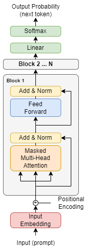
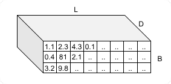
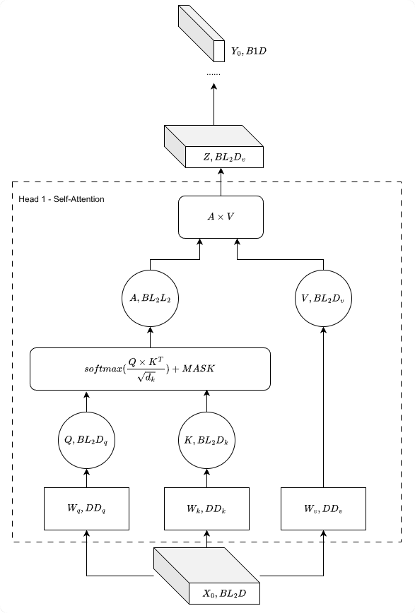
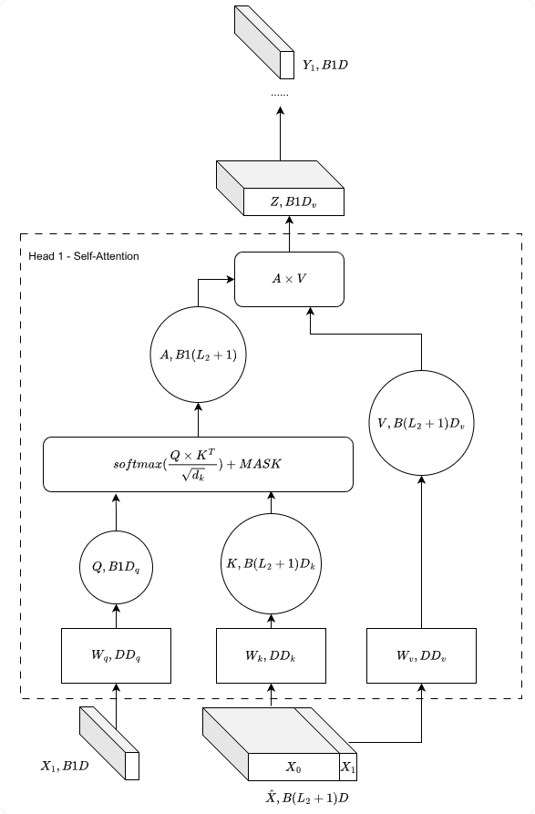
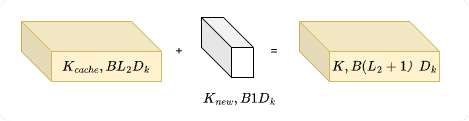
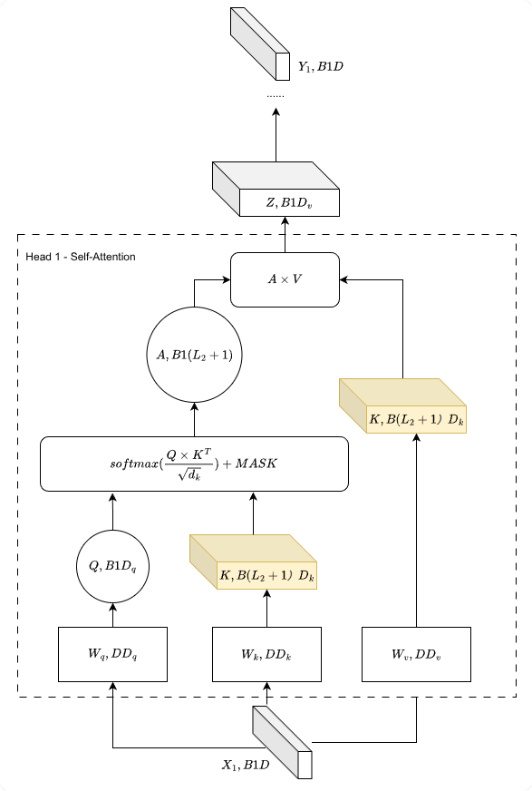
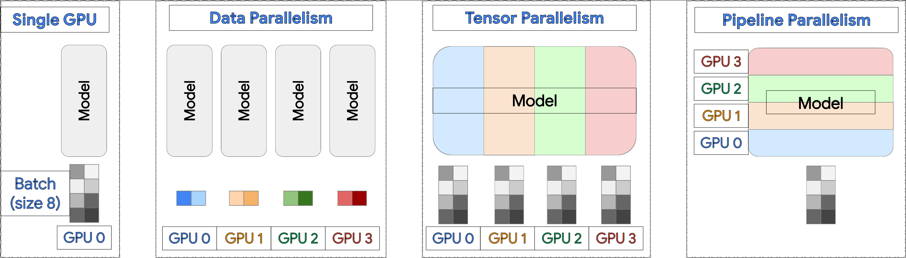
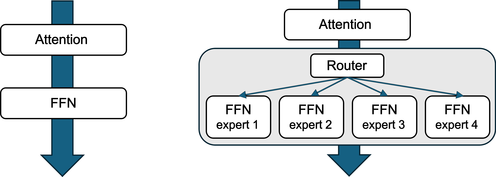

# Chapter 6: Distributed Inference Fundamentals and vLLM {-}

*Serving large language models at scale with high throughput and low latency*

> Inference is the new web app.
- Clayton Coleman, Distinguished Engineer at Google

**Code Summary**

- `vllm.LLM`: vLLM LLM class for model loading and inference
- `vllm.SamplingParams`: Configuration for text generation sampling
- `vllm.engine.LLMEngine`: Core vLLM inference engine
- `vllm.attention.PagedAttention`: PagedAttention implementation for KV cache management
- `vllm.worker.worker.Worker`: vLLM worker process for distributed inference
- `vllm.engine.arg_utils`: vLLM command-line argument utilities
- `vllm.distributed.parallel_state`: vLLM parallel state management
- `vllm.engine.async_llm_engine.AsyncLLMEngine`: Async inference engine for serving
- `vllm.sampling_params.SamplingParams`: Sampling parameters for generation
- `vllm.utils.random`: Random number generation utilities for sampling

## From Training to Inference

The previous chapters covered how to train large models across multiple GPUs—state sharding with ZeRO and FSDP, computation sharding with Megatron's tensor and pipeline parallelism. But training is only half the equation. Once you have a trained model, you need to serve it to users, and serving brings an entirely different set of challenges.

Training optimizes for throughput: process as many tokens as possible per second, amortized over long training runs. Inference optimizes for latency and throughput simultaneously: users expect responses in milliseconds, while the system must handle thousands of concurrent requests. Training processes fixed batch sizes; inference must handle variable-length requests arriving at unpredictable times. Training can checkpoint and restart; inference must be always available.

The memory characteristics also differ fundamentally. During training, memory is dominated by optimizer states (momentum, variance) and activation checkpoints. During inference, there are no optimizer states—memory is dominated by model weights and the **KV cache**, the key-value pairs stored from previous tokens to avoid recomputation during autoregressive generation. For long sequences, the KV cache can exceed the model weights in size.

This chapter introduces vLLM, the inference engine that pioneered many techniques now standard in LLM serving. We'll explore PagedAttention (which revolutionized KV cache management), continuous batching (which maximizes GPU utilization), and the distributed inference patterns that enable serving models too large for a single GPU.

## Introduction to vLLM

When researchers at UC Berkeley set out to build a better LLM serving system in 2023, they faced a fundamental question: why do existing systems waste so much GPU memory? The answer led them to create **vLLM** (virtual Large Language Model), an inference engine that revolutionized how we think about KV cache management.

The key insight was that traditional serving systems treat KV cache like a monolithic block—allocating contiguous memory for each request and hoping for the best. This approach, borrowed from training frameworks, works poorly for inference where requests arrive unpredictably, have wildly different lengths, and finish at different times. vLLM's breakthrough was to apply operating system concepts—specifically, virtual memory and paging—to KV cache management. The result is PagedAttention, which we'll explore in detail later in this chapter.

Today, vLLM has become the de facto standard for LLM serving, powering production deployments at companies ranging from startups to hyperscalers. Its combination of high throughput, memory efficiency, and ease of use makes it an excellent starting point for understanding distributed inference.

### Prerequisites

Before installing vLLM, ensure you have:

- **OS**: Linux (required for GPU support)
- **Python**: 3.10+
- **NVIDIA GPU**: With CUDA support (for CUDA-based installation)
- **CUDA**: Compatible CUDA version installed

### Installation

vLLM can be installed using several methods. **Docker is the quickest way to try vLLM** without installing dependencies locally.

#### Docker Setup

Docker provides the quickest way to get started with vLLM without installing dependencies locally. Pre-built images are available on the [vLLM Docker Hub page](https://hub.docker.com/r/vllm/vllm-openai).

vLLM supports three main types of models. Base models like `facebook/opt-125m` are pre-trained language models without instruction tuning, and they use the `/v1/completions` endpoint with a `prompt` parameter. Chat models such as `Qwen/Qwen2.5-0.5B-Instruct` are fine-tuned for conversational tasks and use `/v1/chat/completions` with a `messages` parameter. Embedding models like `sentence-transformers/all-MiniLM-L6-v2` generate vector representations and use `/v1/embeddings` with an `input` parameter.

The vLLM server exposes an OpenAI-compatible API with endpoints for completions, chat completions, embeddings, and more. For a complete list of endpoints with detailed descriptions and usage examples, see the **OpenAI-Compatible API Endpoints** section in the Appendix.

__Pull the Latest Image__

Pull the latest Docker image. The image requires approximately 8GB of disk space.

```bash
docker pull vllm/vllm-openai:latest
```

__Run the Docker Container__

The Docker image runs an OpenAI-compatible server. To serve a base model like `facebook/opt-125m`, run:

```bash
docker run --runtime nvidia --gpus all \
  -v $HOME/.cache/huggingface:/root/.cache/huggingface --env "HF_TOKEN=$HF_TOKEN" \
  -p 8000:8000 --ipc=host vllm/vllm-openai:latest \
  facebook/opt-125m
```

Here are some small models suitable for learning purposes:

| Model Name | Type | Parameter |
|-------------------------------------|------------|------|
| `facebook/opt-125m` | Base | 125M |
| `Qwen/Qwen2.5-0.5B-Instruct` | Chat/Instruct | 0.5B |
| `meta-llama/Llama-3.2-1B-Instruct` | Chat/Instruct | 1B |
| `meta-llama/Llama-3.2-1B` | Base | 1B |
| `microsoft/Phi-tiny-MoE-instruct` | MoE/Instruct | ~500M (active) |
| `sentence-transformers/all-MiniLM-L6-v2` | Embedding | 22M |

To use any of these models, replace the model name in the Docker command:

```bash
... vllm/vllm-openai:latest <MODEL_NAME>
```

For example:
```bash
... vllm/vllm-openai:latest meta-llama/Llama-3.2-1B-Instruct
```

The `--runtime nvidia --gpus all` flag enables GPU access. To use specific GPUs, replace `--gpus all` with `--gpus '"device=0"'` for a single GPU or `--gpus '"device=0,1"'` for multiple GPUs. You can also set `--env "CUDA_VISIBLE_DEVICES=0,1"` to limit visible GPUs.

The `-v $HOME/.cache/huggingface:/root/.cache/huggingface` volume mount shares your local Hugging Face cache with the container, avoiding repeated model downloads. The container path `/root/.cache/huggingface` assumes the container runs as root. Adjust this path if your container uses a different user, or set the `HF_HOME` environment variable to customize the cache location.

The `--ipc=host` flag allows the container to access the host's shared memory, which PyTorch uses for efficient data sharing during tensor parallel inference.

The model name is specified as a positional argument after the image tag. You can append additional vLLM engine arguments after the model name.

__Verify the Setup__

Once the container is running, verify it's working correctly. First, check that the server is responding:

```bash
curl http://localhost:8000/health
```

List the available models:

```bash
curl http://localhost:8000/v1/models
```

Test a base model completion:

```bash
curl http://localhost:8000/v1/completions \
  -H "Content-Type: application/json" \
  -d '{"model": "facebook/opt-125m", "prompt": "The result of 1+1 is", "max_tokens": 3}'
```

Test a chat model:

```bash
curl http://localhost:8000/v1/chat/completions \
  -H "Content-Type: application/json" \
  -d '{
    "model": "Qwen/Qwen2.5-0.5B-Instruct",
    "messages": [
      {"role": "user", "content": "Hello, how are you?"}
    ]
  }'
```

For deterministic output (same result every time), add `"temperature": 0`:

```bash
curl http://localhost:8000/v1/chat/completions \
  -H "Content-Type: application/json" \
  -d '{
    "model": "Qwen/Qwen2.5-0.5B-Instruct",
    "messages": [
      {"role": "user", "content": "Hello, how are you?"}
    ],
    "temperature": 0
  }'
```

**Note**: Setting `temperature=0` enables greedy sampling (always selects the highest probability token), which should produce the same output for the same input. However, vLLM does not guarantee complete reproducibility by default due to scheduling and batching optimizations. For fully deterministic results, you may need to set `VLLM_ENABLE_V1_MULTIPROCESSING=0` or enable batch invariance (see vLLM's reproducibility documentation).

Test an embedding model:

```bash
curl http://localhost:8000/v1/embeddings \
  -H "Content-Type: application/json" \
  -d '{
    "model": "sentence-transformers/all-MiniLM-L6-v2",
    "input": "This is a test sentence"
  }'
```

#### Install and Run from Package Manager (uv, conda, pip)

__Method 1: Using uv (Recommended)__

```bash
# Install uv (if not already installed)
curl -LsSf https://astral.sh/uv/install.sh | sh

# Create a new Python environment
uv venv --python 3.12 --seed
source .venv/bin/activate

# Install vLLM with automatic PyTorch backend detection
uv pip install vllm --torch-backend=auto
```

The `--torch-backend=auto` flag automatically selects the appropriate PyTorch index based on your CUDA driver version. You can also specify a specific backend (e.g., `--torch-backend=cu126` for CUDA 12.6).

Alternatively, use `uv run` to execute vLLM commands without creating a permanent environment:

```bash
uv run --with vllm vllm --help
```

__Method 2: Using conda__

```bash
# Create a conda environment
conda create -n vllm-env python=3.12 -y
conda activate vllm-env

# Install uv within conda (optional but recommended)
pip install --upgrade uv

# Install vLLM
uv pip install vllm --torch-backend=auto
```

__Method 3: Using pip directly__

```bash
# Create a virtual environment
python3.12 -m venv vllm-env
source vllm-env/bin/activate

# Install vLLM
pip install vllm
```

**Note**: When using pip directly, ensure you have the correct PyTorch version installed for your CUDA version.

__Verifying Installation__

After installation, verify that vLLM is correctly installed:

```bash
# Check vLLM version
python -c "import vllm; print(vllm.__version__)"

# Test basic functionality
vllm --help
```

#### Compile, Install, and Run from Local Source

To build vLLM from source, clone the repository and install:

```bash
# Clone the repository
git clone https://github.com/vllm-project/vllm.git
cd vllm

# Install from source
pip install -e .
```

For development installations with editable mode:

```bash
# Install in development mode
pip install -e ".[dev]"
```

**Note**: Building from source requires all build dependencies and may take longer than package manager installation.

#### Offline Inference

Test your installation with a simple offline inference example:

```python
from vllm import LLM, SamplingParams

# Initialize the model
llm = LLM(model="facebook/opt-125m")

# Define prompts and sampling parameters
prompts = ["Hello, my name is", "The capital of France is"]
sampling_params = SamplingParams(temperature=0.8, top_p=0.95)

# Generate outputs
outputs = llm.generate(prompts, sampling_params)

# Print results
for output in outputs:
    print(f"Prompt: {output.prompt!r}")
    print(f"Generated: {output.outputs[0].text!r}")
```

#### Online Inference

Start an OpenAI-compatible API server:

```bash
# Start the server with a chat model
vllm serve Qwen/Qwen2.5-0.5B-Instruct --port 8000
```

In another terminal, test the server:

```bash
# List available models
curl http://localhost:8000/v1/models

# Test chat completion (for instruction-tuned models)
curl http://localhost:8000/v1/chat/completions \
    -H "Content-Type: application/json" \
    -d '{
        "model": "Qwen/Qwen2.5-0.5B-Instruct",
        "messages": [
            {"role": "user", "content": "Hello, how are you?"}
        ]
    }'

# Test completion (for base models)
curl http://localhost:8000/v1/completions \
    -H "Content-Type: application/json" \
    -d '{
        "model": "facebook/opt-125m",
        "prompt": "The result of 1+1 is",
        "max_tokens": 3
    }'
```

## KV Cache

### Decoder-Only Transformer Architecture

{#fig:decoder-only .wrap width=30% align=top-right}

Before diving into KV cache, let's establish a clear picture of the architecture we're working with. Modern large language models—GPT, LLaMA, Qwen, and their variants—all share a common design: the decoder-only transformer. This architecture has proven remarkably effective for autoregressive language modeling, where the goal is to predict the next token given all previous tokens.

A decoder-only transformer consists of a stack of identical layers, typically 32 for a 7B model or 80+ for larger models. Each layer contains two main components: a self-attention sublayer with causal masking, and a feed-forward network (FFN). Residual connections and layer normalization tie everything together, ensuring stable training and inference.

The self-attention mechanism is where the magic happens—and where KV cache becomes essential. Attention uses three learned linear projections to transform the input: **Query (Q)**, **Key (K)**, and **Value (V)**. For each token at position $i$, the model computes:

$$Q_i = x_i \times W_Q, \quad K_i = x_i \times W_K, \quad V_i = x_i \times W_V$$

where $x_i$ is the token embedding (or hidden state from the previous layer) and $W_Q$, $W_K$, $W_V$ are learned weight matrices. The intuition is that Query represents "what am I looking for?", Key represents "what do I contain?", and Value represents "what information do I provide?". The attention mechanism then computes:

$$\text{Attention}(Q, K, V) = \text{softmax}\left(\frac{Q \times K^T}{\sqrt{d_k}}\right) \times V$$

The $Q \times K^T$ term computes similarity scores between all pairs of tokens—how relevant is each previous token to the current one? The softmax normalizes these scores into a probability distribution, and the result is used to weight the Value vectors. The $\sqrt{d_k}$ scaling factor prevents the dot products from growing too large, which would push the softmax into regions with vanishing gradients.

For autoregressive generation, we apply a causal mask that sets attention scores to $-\infty$ for future positions before the softmax. This ensures that when predicting token $i$, the model can only attend to tokens $0, 1, \ldots, i-1$—it cannot "peek" at future tokens that don't exist yet during generation.

Figure~\ref{fig:decoder-only} shows a typical decoder-only architecture. Each layer consists of two sub-layers: a masked multi-head self-attention mechanism and a position-wise feed-forward network (FFN). The masked attention ensures that position $i$ can only attend to positions $\leq i$, enforcing the autoregressive property. The FFN typically expands the hidden dimension by 4x (or uses SwiGLU with ~2.7x expansion in modern architectures like LLaMA), applies a non-linearity, and projects back. Residual connections and layer normalization stabilize training. Note that this diagram follows the original Transformer's "Add & Norm" order; modern LLMs like GPT and LLaMA use "Pre-Norm" (normalize before attention/FFN) for better training stability.

__Notation__

We use the following notation throughout this section:

- $B$: batch size
- $L_1$: length of an attending sequence (query); $l_1$: index of a position in this sequence
- $L_2$: length of a being attended sequence (key/value); $l_2$: index of a position in this sequence
- $D$: model hidden size (dimension of hidden states/tokens)
- $H$: number of attention heads
- $D_{qk}$: dimension of a query/key vector
- $D_v$: dimension of a value vector, and $D = D_v \times H$
- $L$: notation used when $L_1 = L_2$

### Text Generation Process: Prefill and Decode

{#fig:transformer-input .block width=40% align=top-left}

Figure~\ref{fig:transformer-input} illustrates the input tensor structure. When serving generation requests, we typically batch multiple prompts for higher throughput. The input has shape $B \times L_2 \times D$, where $B$ is the batch size, $L_2$ is the prompt length (number of tokens), and $D$ is the hidden dimension (e.g., 4096 for LLaMA-7B). Each token is represented as a $D$-dimensional embedding vector, and the entire prompt becomes a matrix that flows through the transformer layers.

Text generation occurs in two distinct phases, each with fundamentally different computational characteristics. Understanding these phases is essential for optimizing inference performance.

__Prefill Phase__

The first phase, called **prefill** (also known as the "prompt processing" or "context encoding" phase), processes the entire prompt sequence in parallel. This is where the model "reads" and "understands" the input before generating any output. During prefill, all $L_2$ prompt tokens are processed simultaneously through every transformer layer.

Figure~\ref{fig:prefill} shows the prefill stage in detail. The input $X_0$ (the embedded prompt tokens with shape $B \times L_2 \times D$) passes through all transformer layers. At each layer, the self-attention mechanism allows every token to attend to all other tokens in the prompt, building up contextual representations. The model produces logits for every position—a tensor of shape $B \times L_2 \times V$ where $V$ is the vocabulary size (e.g., 32,000 for LLaMA). However, we only care about the logits at the last position ($B \times 1 \times V$), as these give us the probability distribution over the vocabulary for the first generated token $Y_0$.

Crucially, during prefill we also compute and store the Key and Value projections for all prompt tokens at every layer. For a model with $N$ layers, we cache $2N$ tensors (one K and one V per layer), each of shape $B \times L_2 \times D_k$ where $D_k$ is the per-head dimension times the number of heads. This **KV cache** will be reused in subsequent decoding steps, avoiding redundant computation of these projections. The prefill stage is compute-bound: we process $L_2$ tokens in parallel, performing $O(L_2^2)$ attention operations per layer (each token attends to all $L_2$ tokens).

The prefill stage has high arithmetic intensity—the ratio of compute operations to memory accesses is favorable because we're doing dense matrix multiplications over many tokens. For a batch of long prompts, the GPU's tensor cores are kept busy with large matrix operations, achieving high utilization. This is similar to the forward pass during training, where we also process sequences in parallel.

{#fig:prefill .block width=100% align=center}


### The Decode Phase and Its Inefficiency

After prefill completes, the model enters the **decode** phase. Here, tokens are generated one at a time in an autoregressive loop: generate token $Y_0$, feed it back as input, generate $Y_1$, and so on until an end-of-sequence token or maximum length is reached.

Consider generating the first new token after the prompt. The input to the query projection is $X_1 = Y_0$ (the newly generated token), but for attention to work correctly, the Key and Value projections need the full context—the original prompt $X_0$ concatenated with the new token $X_1$, resulting in shape $B \times (L_2 + 1) \times D$.

{#fig:decode-no-cache .block width=90% align=center}

Figure~\ref{fig:decode-no-cache} illustrates this naive approach. The query needs to attend to the entire context so far. For example, if our prompt $X_0$ is "Time flies" and $Y_0$ is "like", we use "like" to query the context "Time flies like" and predict the next token, probably "an". Then we use "an" to query "Time flies like an" and get "arrow". This process continues: each newly generated token must attend to all previous tokens (both the original prompt and all previously generated tokens) to maintain context and generate coherent text. However, at each step, we need to recompute the Key and Value vectors for the entire sequence history, even though most of these computations were already performed in previous steps.

From above figure, we can easily see the inefficiency arises because we need to construct $\hat{X} = [X_0, X_1]$ and multiply it with $W_K$ and $W_V$, even though __the $X_0$ part has already been multiplied with these weight matrices during the prefill phase__. This duplication occurs at every generation step, requiring recomputation of $Key$ and $Value$ vectors for all previous tokens through the entire transformer stack.

Without caching, this naive approach has time complexity $O(L_{\text{total}}^2)$ per step, where $L_{\text{total}}$ is the total sequence length $L_2 + L_t$ including prompt and generated tokens. For long sequences, this becomes computationally prohibitive.

### KV Cache Solution

KV cache solves this inefficiency by storing precomputed Key and Value vectors for all previously processed tokens. Instead of concatenating and recomputing, we can simply use $X_1$ as input for $K$ and $V$ calculation, as long as we cache the previous results. Take $Key$ vector as an example, we only calucate $K_{new}$ which has shape of $B1D_k$ and the time complexity reduced dramatically.

{#fig:cache-grow .block width=85% align=center}

Figure~\ref{fig:cache-grow} shows how the KV cache grows with each generated token. With KV cache, the decoding stage becomes much more efficient.

The input shape is $B \times 1 \times D$ and output shape is also $B \times 1 \times D$. The key insight is that only the new token needs attention computation, while all previous tokens reuse their cached $K$ and $V$ vectors.

__Time Complexity Analysis:__

With KV cache, the computational complexity changes dramatically:

- **Prefill phase**: Processes all $L_2$ prompt tokens in parallel. The attention computation has complexity $O(L_2^2 \cdot D)$ for the self-attention over the prompt sequence. This is a one-time cost.

- **Decode phase (per token)**: 
  - **Without KV cache**: $O(L_{\text{total}}^2 \cdot D)$ per step, where $L_{\text{total}} = L_2 + L_t$ grows with each generated token. For $T$ generated tokens, total complexity is $O(T \cdot L_{\text{total}}^2 \cdot D)$, which becomes $O(T^3 \cdot D)$ when $L_t \gg L_2$.
  
  - **With KV cache**: Only compute $K$ and $V$ for the new token (shape $B \times 1 \times D_k$), then perform attention with cached keys/values. The complexity per step is $O(L_{\text{total}} \cdot D)$ for the attention computation, where $L_{\text{total}}$ is the current sequence length. For $T$ generated tokens, total complexity is $O(T \cdot L_{\text{total}} \cdot D) \approx O(T^2 \cdot D)$ when $L_t \gg L_2$.

The key improvement is reducing the quadratic dependency on sequence length in the decode phase to linear, making long-sequence generation feasible. However, this comes at the cost of memory: KV cache requires $O(L_{\text{total}} \cdot D)$ memory to store all cached Key and Value vectors.

{#fig:decode-with-cache .block width=90% align=center}

Figure~\ref{fig:decode-with-cache} shows the decode phase with KV cache enabled. The decode phase has a fundamentally different compute profile than prefill. With only one token being processed, the matrix multiplications are essentially matrix-vector operations. The arithmetic intensity is low—we're memory-bound, spending most of the time loading model weights from GPU memory rather than computing. This is why batching multiple decode requests together (continuous batching, covered later) is crucial for efficiency.

__Summary of Inference Stages__

The following table summarizes the tensor shapes and operations during prefill and decoding phases:

| Stage | Shape | Notes |
|-------|-------|-------|
| **Prefill Phase** | | |
| Input $X_{\text{prompt}}$ | $B \times L_2 \times D$ | Prompt sequence |
| Process all tokens | Parallel | Same as training |
| Cache $K$, $V$ | $B \times L_2 \times D_{qk/v}$ | For reuse |
| **Decoding Phase** | | |
| Input $x_t$ | $B \times 1 \times D$ | Single new token |
| $Q_t = x_t W^Q$ | $B \times 1 \times D_{qk}$ | Query for new token |
| $K_{\text{cached}}$ | $B \times (L_2 + t) \times D_{qk}$ | All previous keys |
| $V_{\text{cached}}$ | $B \times (L_2 + t) \times D_v$ | All previous values |
| Attention scores | $B \times 1 \times (L_2 + t)$ | New token attends to all previous |
| Attention $A_t$ | $B \times 1 \times (L_2 + t)$ | Upper triangular |
| Output $Z_t$ | $B \times 1 \times D_v$ | |
| Concat heads | $B \times 1 \times (H \cdot D_v)$ | |
| Final output | $B \times 1 \times D$ | Single generated token |

## PagedAttention: Solving KV Cache Fragmentation

While KV cache dramatically improves computational efficiency, it introduces a critical challenge in production serving systems: **memory fragmentation**. When serving multiple concurrent requests, each with different sequence lengths that grow dynamically, traditional memory allocation strategies lead to significant waste and limit throughput.

vLLM's breakthrough innovation is **PagedAttention**, a memory management algorithm inspired by virtual memory paging in operating systems. PagedAttention is primarily designed to solve KV cache fragmentation in large-scale LLM serving by allocating the cache in fixed-size blocks. A crucial consequence of this block-based design is that attention computation no longer iterates over padded sequence ranges. Instead, it traverses only the blocks that actually exist for each request, thereby eliminating padding-related attention FLOPs.

### The KV Cache Fragmentation Problem

In production environments, serving systems must handle multiple concurrent requests simultaneously. Each request maintains its own KV cache that grows dynamically as tokens are generated during autoregressive decoding. Different prompts and generation lengths result in different cache sizes, creating a fundamental allocation challenge.

Traditional systems allocate contiguous memory blocks per request. When sequences finish or have different lengths, this approach leads to wasted space that cannot be efficiently reused. Consider a scenario where Request 1 finishes after 8 tokens, Request 2 is active with 4 tokens, and Request 3 is active with 10 tokens. The memory allocated for Request 1 sits unused but cannot be easily reclaimed for the other requests, leading to fragmentation.

```
Request 1: [========]  (8 tokens, finished)
Request 2: [====]      (4 tokens, active)
Request 3: [==========] (10 tokens, active)
           ↑ Memory fragmentation - can't reuse Request 1's space efficiently
```

Additionally, traditional batching introduces a less obvious but equally critical inefficiency: padding-induced attention computation waste. In batched decoding, different requests typically have different effective context lengths. Let the batch size be $B$, and let the cached context length for request $i$ be $(L_2^{(i)} + t^{(i)})$. To batch these requests together, conventional attention implementations must pad all sequences to a common maximum length:

$$(L_2 + t)_{\max} = \max_i (L_2^{(i)} + t^{(i)})$$

As a result, the cached keys and values used in attention have shape $K_{\text{cached}}, V_{\text{cached}} \in \mathbb{R}^{B \times (L_2 + t)_{\max} \times D_{qk/v}}$, and the attention scores for the decode step are computed as:

$$A_t = \text{softmax}\left(Q_t K_{\text{cached}}^T + \text{mask}\right), \qquad A_t \in \mathbb{R}^{B \times 1 \times (L_2 + t)_{\max}}$$

Although masking prevents padded positions from influencing the output, the dot products involving padded tokens are still fully computed. Consequently, a large fraction of attention FLOPs is spent on tokens that carry no semantic information, especially when the context lengths within a batch vary widely.

### How PagedAttention Works

To solve the fragmentation problem, PagedAttention must use fixed-size blocks. Continuous memory allocation inevitably leads to fragmentation when sequences have different lengths and finish at different times. The only viable approach is to partition the KV cache into fixed-size blocks that can be allocated and freed independently.

PagedAttention divides the KV cache into fixed-size blocks, typically 16 tokens per block (denoted as $B_{\text{size}}$), similar to memory pages in OS virtual memory. Each block contains the Key and Value vectors for a contiguous segment of tokens. For request $i$, the cached KV is represented as $N_i = \lceil (L_2^{(i)} + t^{(i)}) / B_{\text{size}} \rceil$ blocks, each block storing keys and values with shape $\text{Block} \in \mathbb{R}^{B_{\text{size}} \times D_{qk/v}}$.

Each request maintains a block table that maps logical sequence positions to physical block addresses, similar to page tables in OS virtual memory. This allows sequences to be logically continuous while physically stored in discrete blocks scattered across GPU memory. Blocks are allocated and freed as sequences grow or complete. When a request finishes, its blocks are immediately returned to a shared block pool. Freed blocks can be immediately reused by new requests, eliminating fragmentation and enabling near-100% memory utilization.

```
Block Pool: [Block0][Block1][Block2][Block3][Block4][Block5]...
            ↓        ↓        ↓
Request 1:  [Block0][Block1]  (finished, blocks returned to pool)
Request 2:  [Block2]          (active)
Request 3:  [Block3][Block4]   (active)
            ↑ No fragmentation - blocks can be reused immediately
```

### Eliminating Padding FLOPs

Once blocks exist, the iteration semantics of attention computation fundamentally change. This is a crucial consequence of the block-based design, not an additional optimization. With block-based storage, attention computation no longer assumes KV cache is a continuous sequence from position 1 to $(L_2 + t)_{\max}$. Instead, attention iterates over the block table, and tokens that do not exist simply do not have corresponding blocks.

During decoding, the attention computation for request $i$ iterates only over the blocks listed in its block table:

$$A_t^{(i)} = \text{softmax}\left(Q_t^{(i)} \cdot \bigcup_{b \in \mathcal{B}_i} K_b^T\right)$$

where $\mathcal{B}_i$ denotes the set of blocks owned by request $i$. Crucially, this computation depends only on $(L_2^{(i)} + t^{(i)})$, not on $(L_2 + t)_{\max}$. Tokens that do not exist for a given request are never visited by the attention kernel because the corresponding blocks do not exist in the block table.

With PagedAttention, padding tokens are not masked after computation—they are never part of the computation. The attention kernel does not launch dot products for padded positions. As a result, the number of attention FLOPs for each request is proportional to its true context length rather than the maximum context length in the batch. This property eliminates padding-related FLOPs entirely and is a key enabler for efficient continuous batching in large-scale LLM serving systems.

The performance improvement in vLLM comes from both effects working together. Fragmentation reduction allows more concurrent requests to be served simultaneously, while zero padding FLOPs increases the effective compute utilization of decode attention. These are two sides of the same block-based design decision.

Unlike OS page management that focuses on address mapping and access correctness, PagedAttention is optimized for efficient attention computation. Custom CUDA kernels read KV cache from non-contiguous blocks while maintaining coalesced memory access patterns, ensuring high GPU utilization. This attention-aware design means the system understands how attention operations access memory and optimizes accordingly.

The benefits are substantial. Memory efficiency improves dramatically because fragmentation waste from variable-length sequences is eliminated, enabling near-100% memory utilization. Production deployments can serve 2-4x more concurrent requests with the same GPU memory compared to traditional approaches. More importantly, padding overhead is completely eliminated, meaning zero FLOPs are wasted on padding. This dramatically improves throughput in real serving scenarios.

Flexible batching becomes possible because requests with different sequence lengths can be batched efficiently without padding. The system supports dynamic batching where batch composition changes every step, enabling efficient serving of highly variable workloads. Long context support is also enhanced, as the system efficiently handles variable-length contexts without pre-allocating maximum memory. Very long sequences of 100K+ tokens can be served by allocating blocks on-demand. The design handles high concurrency naturally, built for high-churn workloads with frequent request arrivals and completions.

### Connection to Distributed Inference

PagedAttention solves memory efficiency within a single GPU, but what happens when even an efficiently-managed single GPU isn't enough? This is where distributed inference becomes essential. When models exceed single GPU memory capacity, when throughput requirements exceed what one GPU can deliver, or when models are simply too large for a single node, we need to spread the workload across multiple devices.

The combination of PagedAttention for memory efficiency and distributed parallelism for scalability is what enables vLLM to serve the largest models in production. PagedAttention ensures we're not wasting memory on fragmentation, while tensor, data, and pipeline parallelism let us scale beyond single-GPU limits.

## Motivation: The "Out of Memory" Problem

As language models grow larger, a fundamental constraint emerges: they simply don't fit on a single GPU. DeepSeek R1 has 671 billion parameters. LLaMA 3.1 405B, as the name suggests, has 405 billion parameters. Even with an H100's 80GB of HBM, storing 405B parameters in FP16 (2 bytes per parameter) would require 810GB—ten times what a single GPU provides.

One approach is **quantization**: reducing precision from FP16 to FP8 or even INT4. This helps, but has limits. FP8 halves memory requirements, so our 405B model now needs "only" 405GB—still five H100s worth of memory. INT4 gets us to ~200GB, but introduces accuracy trade-offs that may not be acceptable for all applications. And we haven't even accounted for KV cache, which for long-context inference can exceed the model weights themselves.

The more scalable solution is to **distribute the model across multiple GPUs**. Rather than compressing the model to fit on one device, we spread it across many devices, each holding a portion of the weights and contributing to the computation. This is the domain of distributed inference, and vLLM provides three fundamental strategies: tensor parallelism, data parallelism, and pipeline parallelism.

## Overview of the vLLM Architecture

vLLM's architecture centers around a **scheduler-executor-worker** pattern, as shown in Figure~\ref{fig:vllm-arch}. This layered design cleanly separates concerns: request management, distributed coordination, and actual computation.

{#fig:vllm-arch .block width=70% align=center}

The **Scheduler** sits at the top of the hierarchy. It receives incoming requests, groups them into batches based on available memory and scheduling policy, and decides which requests to process in each iteration. The scheduler implements continuous batching—it doesn't wait for an entire batch to complete before admitting new requests. Instead, it dynamically adds new requests as slots become available, maximizing GPU utilization.

The **Executor** acts as the coordination layer between the scheduler and the actual compute resources. It manages the pool of workers and translates high-level scheduling decisions into distributed commands. vLLM supports multiple executor backends depending on the deployment scenario: a simple single-GPU executor for small models, a multi-processing executor for multi-GPU inference on a single node, and a Ray-based executor for distributed inference across multiple nodes. The executor broadcasts commands to all workers and collects their results.

**Workers** are the compute units, each associated with one GPU (or other accelerator). A worker holds a shard of the model weights, manages its local KV cache, and executes the actual forward passes. In tensor-parallel configurations, workers coordinate through NCCL to perform collective operations like all-reduce. Each worker runs the same model code but operates on different data or model shards depending on the parallelism strategy.

This architecture enables vLLM to scale from a single GPU to hundreds of GPUs across multiple nodes while maintaining the same programming model.

## Overview of Parallelism Strategies in vLLM

{#fig:vllm-parallelism .block width=90% align=center}

vLLM provides three fundamental parallelism strategies for distributing computation and memory across multiple GPUs. **Tensor Parallelism (TP)** shards individual layers across multiple GPUs within a node, with each GPU processing a portion of each layer and results synchronized through collective communication. **Data Parallelism (DP)** creates multiple complete replicas of the model, each processing different requests independently to increase throughput. **Pipeline Parallelism (PP)** splits the model's layers across multiple GPUs or nodes, with data flowing through stages sequentially like an assembly line.

Additionally, vLLM provides **Expert Parallelism (EP)** as a special modifier flag for Mixture-of-Experts (MoE) models. EP is not a standalone strategy—it modifies how MoE layers are distributed and must be combined with TP or DP. The `--enable-expert-parallel` flag changes communication patterns and expert distribution for MoE models.

The following sections explore each strategy in detail, then discuss how they can be combined for optimal performance.

## Tensor Parallelism (TP)

**Tensor Parallelism (TP)** shards model weights horizontally across multiple GPUs within a single node, allowing all GPUs to compute concurrently. Unlike pipeline parallelism (which we'll cover later), where GPUs process different layers sequentially, tensor parallelism has every GPU working on the same layer simultaneously—each handling a different slice of the computation. This follows the **SPMD (Single Program, Multiple Data)** paradigm: all GPUs run the same code, but on different portions of the data.

### The Linear Algebra Foundation

To understand tensor parallelism, we need to understand how matrix multiplications can be split across devices. There are two fundamental patterns: column parallelism and row parallelism.

**Column parallelism** splits the weight matrix along its columns. Consider a matrix multiplication $Y = X \times A$. If we partition $A$ into two column blocks $[A_1 | A_2]$, then the output naturally partitions as $Y = [X \times A_1 | X \times A_2]$. Each GPU computes one piece of the result independently. To reassemble the full output, we use an **all-gather** operation that concatenates the pieces from all GPUs.

**Row parallelism** takes a different approach. We split both the input $X$ and the weight matrix $A$ along their rows: $X = [X_1; X_2]$ and $A = [A_1; A_2]$. The output becomes $Y = X_1 \times A_1 + X_2 \times A_2$—each GPU computes a partial sum, and we use **all-reduce** to sum these partial results across all GPUs.

The key insight is that these two patterns can be chained cleverly to minimize communication. In a typical transformer MLP (the feed-forward network), we have an "up projection" followed by an activation function and a "down projection". If we apply column parallelism to the up projection, the output is naturally sharded across GPUs. We can then apply the activation function (element-wise, so no communication needed) and feed the sharded result directly into a row-parallel down projection. The only communication required is a single all-reduce at the end—no all-gather in between.

This pattern extends to attention as well. The Q, K, V projections can be column-parallel (each GPU handles a subset of attention heads), and the output projection can be row-parallel. Again, we need only one all-reduce per attention layer.

### Benefits of Tensor Parallelism

The most obvious benefit of tensor parallelism is **memory reduction**: each GPU stores only a fraction of the weights. A 140B parameter model that wouldn't fit on a single GPU can be split across two GPUs, with each holding ~70B parameters. But the benefits go deeper than just fitting larger models.

Consider what happens to KV cache capacity. On a single 160GB GPU serving a 140B model, you might have 140GB for weights and only 20GB left for KV cache. With TP=2, each GPU holds 70GB of weights, leaving 90GB for KV cache—a 4.5x increase in cache capacity per GPU, and 9x total across both GPUs. This super-linear scaling of KV cache is often the real motivation for tensor parallelism, even when a model technically fits on fewer GPUs.

Tensor parallelism also reduces latency by effectively multiplying memory bandwidth. During inference, especially in the decode phase, we're often memory-bound—waiting for weights to be loaded from HBM rather than waiting for computation. With TP=2, we're loading from two GPUs' worth of HBM simultaneously, doubling effective bandwidth.

The trade-off is communication overhead. Every layer requires an all-reduce operation, transferring data of size `batch_size × sequence_length × hidden_size`. On systems with NVLink (providing 600+ GB/s between GPUs), this overhead is manageable. On PCIe-only systems (32 GB/s), communication can dominate runtime for prefill-heavy workloads—sometimes consuming 60% or more of total time.

One additional constraint to keep in mind: the number of attention heads must be divisible by the tensor parallel size. If your model has 32 heads and you want TP=6, you'll need padding or a different TP size. Most modern models are designed with power-of-two head counts specifically to enable flexible TP configurations.

### When to Use Tensor Parallelism

Tensor parallelism is the right choice when your model doesn't fit on a single GPU and you have good interconnect (NVLink) available. It's particularly effective for latency-sensitive workloads where you want all GPUs contributing to each request. Be cautious with prefill-heavy workloads on PCIe-only systems—profile your specific workload to understand the communication-to-computation ratio before committing to a TP configuration.


## Data Parallelism (DP) for Throughput Scaling

Tensor parallelism splits a single model across GPUs to handle larger models or reduce latency. But what if your model already fits on one GPU (or a small TP group), and your bottleneck is simply serving more concurrent requests? This is where **Data Parallelism (DP)** comes in.

The concept is straightforward: instead of splitting one model across multiple GPUs, we create multiple complete copies of the model, each running independently on its own GPU (or TP group). Each replica handles different requests, and a load balancer distributes incoming traffic across them. There's no communication between replicas during inference—they're completely independent, like running multiple separate vLLM servers.

This independence is both DP's greatest strength and its limitation. Because replicas don't communicate, there's zero communication overhead—throughput scales linearly with the number of replicas. Add four replicas, get four times the throughput. But this also means each replica needs enough memory for a complete model copy, so DP doesn't help when the model itself is too large.

### Combining Data Parallelism with Other Strategies

In practice, DP is often combined with TP. Consider serving a 70B model on a system with 8 GPUs. The model requires TP=2 to fit, leaving us with 4 potential TP groups. We can run DP=4 to create four replicas, each using two GPUs with tensor parallelism. The total GPU count is `DP_size × TP_size = 4 × 2 = 8`.

```bash
vllm serve $MODEL --data-parallel-size 4 --tensor-parallel-size 2
```

For MoE models, the interaction between DP and expert parallelism is more nuanced. The attention layers can run in pure data-parallel mode (each replica has complete attention weights), while the expert layers use expert parallelism to distribute experts across the DP group. This requires synchronization: even if a DP rank has no requests in a given step, it must participate in the all-to-all communication for expert routing. vLLM handles this automatically, but it's worth understanding that MoE + DP isn't as "independent" as dense model DP.

### Deployment Modes

vLLM supports two deployment modes for data parallelism:

__Internal Load Balancing (Self-Contained)__

A single API endpoint with internal load balancing:

```bash
# Single node: DP=4, TP=2 (8 GPUs total)
vllm serve $MODEL --data-parallel-size 4 --tensor-parallel-size 2
```

**Multi-node example**:
```bash
# Node 0 (head node with API server)
vllm serve $MODEL --data-parallel-size 4 --data-parallel-size-local 2 \
                  --data-parallel-address 10.99.48.128 --data-parallel-rpc-port 13345

# Node 1 (worker node)
vllm serve $MODEL --headless --data-parallel-size 4 --data-parallel-size-local 2 \
                  --data-parallel-start-rank 2 \
                  --data-parallel-address 10.99.48.128 --data-parallel-rpc-port 13345
```

This mode provides a single HTTP endpoint with automatic load balancing based on queue lengths, making deployment simpler. The limitation is that the API server can become a bottleneck at large DP sizes—use `--api-server-count` to scale out API servers if needed.

__External Load Balancing__

Each DP rank is deployed as a separate vLLM instance with its own endpoint:

```bash
# Rank 0
CUDA_VISIBLE_DEVICES=0 vllm serve $MODEL --data-parallel-size 2 --data-parallel-rank 0 --port 8000

# Rank 1
CUDA_VISIBLE_DEVICES=1 vllm serve $MODEL --data-parallel-size 2 --data-parallel-rank 1 --port 8001
```

An external load balancer (e.g., nginx, HAProxy) routes requests to different ranks based on real-time telemetry (queue lengths, KV cache usage), request characteristics (prefix caching opportunities), and health status. This mode offers better scalability for large DP deployments, more sophisticated KV-cache-aware load balancing, and independent scaling of each rank.

### Benefits and Trade-offs

Data parallelism's appeal lies in its simplicity and effectiveness. Throughput scales linearly—double the replicas, double the throughput. Each replica maintains its own KV cache, so total cache capacity also scales linearly. If one replica fails, the others continue serving, providing natural fault tolerance. And because replicas don't communicate during inference, there's no communication overhead eating into your compute budget.

The trade-offs are equally clear. Memory efficiency suffers because each replica stores a complete copy of model weights. For a 70B model, four DP replicas means storing 280B parameters worth of weights across the system—versus 70B with tensor parallelism. Load balancing becomes important: a naive round-robin approach ignores the fact that different replicas may have different KV cache utilization, leading to suboptimal performance. And for MoE models, the "independence" of DP breaks down because expert routing requires cross-replica communication.

The decision framework is straightforward: use TP/PP first to make the model fit, then add DP to scale throughput. If your model fits on a single GPU and you need more throughput, DP is the simplest solution. If latency is your primary concern, TP (which reduces per-request latency by parallelizing computation) may be better than DP (which doesn't affect single-request latency at all).

## Pipeline Parallelism (PP)

When models grow beyond what a single node can hold—think DeepSeek R1 at 671B parameters or LLaMA 405B—we need to distribute layers across multiple machines. This is where **Pipeline Parallelism (PP)** comes in.

While tensor parallelism splits each layer horizontally (all GPUs work on the same layer simultaneously), pipeline parallelism splits the model vertically along layers. GPU 0 might hold layers 0-19, GPU 1 holds layers 20-39, and so on. Data flows through the pipeline sequentially: GPU 0 processes its layers and sends the output to GPU 1, which processes its layers and sends to GPU 2, and so forth.

The communication pattern is fundamentally different from TP. In tensor parallelism, every layer requires an all-reduce across all GPUs—high frequency, but the data stays within a node where NVLink provides fast interconnect. In pipeline parallelism, communication happens only at stage boundaries—much less frequent, but the data typically crosses node boundaries where network bandwidth is limited. This makes PP well-suited for multi-node deployments where inter-node bandwidth is the bottleneck.

### The Pipeline Bubble Problem

The sequential nature of pipeline parallelism creates an efficiency challenge. When GPU 0 is processing a batch, GPUs 1 and 2 sit idle waiting for input. When GPU 2 is processing, GPUs 0 and 1 are idle waiting for the next batch. In a naive implementation, each GPU is active only a fraction of the time—a massive waste of expensive hardware.

{#fig:pipeline-bubble .block width=85% align=center}

vLLM addresses this with **request groups** (also called virtual engines). Instead of processing one batch at a time, the system maintains multiple independent request streams. While GPU 2 is processing Group 1, GPU 1 can be processing Group 2, and GPU 0 can be processing Group 3. The pipeline stays full, and all GPUs stay busy.

The trade-off is that KV cache must be split among request groups. With 4 pipeline stages, each group gets roughly 1/4 of the total KV cache capacity. This limits the maximum batch size per group, which can reduce efficiency for memory-bound decode operations that benefit from larger batches.

### Chunked Prefill for Smoother Pipelines

Another source of pipeline bubbles is the mismatch between prefill and decode. Prefill processes many tokens in parallel and is compute-intensive; decode processes one token at a time and is memory-bound. A long prefill can take 10x longer than a decode step, creating bubbles as faster decode operations wait for slower prefills.

**Chunked prefill** solves this by breaking long prefills into smaller chunks that interleave with decode operations. Instead of processing a 4096-token prompt all at once, the system might process 512 tokens per iteration, spreading the prefill cost across multiple steps. This smooths out the pipeline and prevents any single long prefill from blocking other requests.

Chunked prefill is enabled by default in vLLM v1, but the chunk size may need tuning for your workload. Too large, and you get bubbles; too small, and you add overhead from the extra iterations. Profile your specific prefill-to-decode ratio to find the sweet spot.

## Expert Parallelism (EP): A Modifier Flag for MoE Models

Mixture-of-Experts (MoE) models like Mixtral, DeepSeek, and Phi-MoE present a unique parallelism challenge. Unlike dense models where every parameter is used for every token, MoE models route each token to only a subset of "experts"—typically 2 out of 8, 16, or even 256 total experts. This sparse activation pattern means the model has many more parameters than a dense model of equivalent compute cost, but those parameters are distributed across many experts that aren't all active simultaneously.

**Expert Parallelism (EP)** is vLLM's mechanism for distributing these experts across GPUs. Unlike TP, DP, and PP which are standalone strategies, EP is a modifier flag (`--enable-expert-parallel`) that changes how MoE layers behave when combined with TP or DP. You can't use EP alone—it requires `TP_SIZE × DP_SIZE > 1` to take effect.

To understand why EP matters, we need to first understand how MoE models work. Let's use Phi-tiny-MoE-instruct as a concrete example.

### Understanding MoE Architecture

In a standard transformer, the feed-forward network (FFN) after attention is a simple two-layer MLP. In an MoE model, this FFN is replaced with multiple expert networks—each expert is itself a complete MLP—plus a routing mechanism that decides which experts process each token. Figure~\ref{fig:moe-arch} illustrates this architecture.

{#fig:moe-arch .block width=85% align=center}

#### Decoder Layer Structure

In Phi-tiny, each decoder layer follows the standard Transformer architecture with attention and MoE components:

```python
class PhiMoEDecoderLayer(nn.Module):
    def __init__(self, config: PhiMoEConfig, layer_idx: int):
        super().__init__()
        self.self_attn = PHIMOE_ATTENTION_CLASSES[config._attn_implementation](config, layer_idx)
        self.block_sparse_moe = PhiMoESparseMoeBlock(config)
        self.input_layernorm = nn.LayerNorm(config.hidden_size, eps=config.rms_norm_eps)
        self.post_attention_layernorm = nn.LayerNorm(config.hidden_size, eps=config.rms_norm_eps)

    def forward(self, hidden_states, attention_mask=None, position_ids=None, 
                past_key_value=None, output_attentions=False, 
                output_router_logits=False, use_cache=False, **kwargs):
        residual = hidden_states
        hidden_states = self.input_layernorm(hidden_states)
        hidden_states, self_attn_weights, present_key_value = self.self_attn(
            hidden_states=hidden_states, attention_mask=attention_mask,
            position_ids=position_ids, past_key_value=past_key_value,
            output_attentions=output_attentions, use_cache=use_cache)
        hidden_states = residual + hidden_states
        
        residual = hidden_states
        hidden_states = self.post_attention_layernorm(hidden_states)
        hidden_states, router_logits = self.block_sparse_moe(hidden_states)
        hidden_states = residual + hidden_states
        
        return (hidden_states, self_attn_weights if output_attentions else None,
                present_key_value if use_cache else None, router_logits if output_router_logits else None)
```

The MoE layer (`block_sparse_moe`) is invoked after the post-attention layer normalization, replacing the standard FFN with a routing mechanism that selects and combines outputs from multiple experts.

#### Expert Structure

Each expert in Phi-tiny is a complete MLP with three linear projections:

```python
class PhiMoEBlockSparseTop2MLP(nn.Module):
    def __init__(self, config: PhiMoEConfig):
        super().__init__()
        self.ffn_dim = config.intermediate_size
        self.hidden_dim = config.hidden_size
        self.w1 = nn.Linear(self.hidden_dim, self.ffn_dim, bias=False)
        self.w2 = nn.Linear(self.ffn_dim, self.hidden_dim, bias=False)
        self.w3 = nn.Linear(self.hidden_dim, self.ffn_dim, bias=False)
        self.act_fn = ACT2FN[config.hidden_act]

    def forward(self, hidden_states):
        current_hidden_states = self.act_fn(self.w1(hidden_states)) * self.w3(hidden_states)
        current_hidden_states = self.w2(current_hidden_states)
        return current_hidden_states
```

The expert uses a gated activation pattern: `w1` projects to the intermediate dimension and is activated, `w3` provides a gating signal, and `w2` projects back to the hidden dimension. This structure is similar to standard Transformer FFNs but with multiple specialized experts.

#### Routing Mechanism

The `PhiMoESparseMoeBlock` implements the routing logic that selects which experts process each token:

```python
class PhiMoESparseMoeBlock(nn.Module):
    def __init__(self, config):
        super().__init__()
        self.hidden_dim = config.hidden_size
        self.num_experts = config.num_local_experts
        self.top_k = config.num_experts_per_tok
        self.gate = nn.Linear(self.hidden_dim, self.num_experts, bias=False)
        self.experts = nn.ModuleList([
            PhiMoEBlockSparseTop2MLP(config) for _ in range(self.num_experts)
        ])

    def forward(self, hidden_states):
        batch_size, sequence_length, hidden_dim = hidden_states.shape
        hidden_states = hidden_states.view(-1, hidden_dim)
        
        router_logits = self.gate(hidden_states)
        routing_weights, selected_experts = sparsemixer(
            router_logits, top_k=2, jitter_eps=self.router_jitter_noise, 
            training=self.training)
        
        final_hidden_states = torch.zeros(
            (batch_size * sequence_length, hidden_dim), 
            dtype=hidden_states.dtype, device=hidden_states.device)
        
        expert_mask = torch.nn.functional.one_hot(
            selected_experts, num_classes=self.num_experts).permute(2, 1, 0)
        
        for expert_idx in range(self.num_experts):
            expert_layer = self.experts[expert_idx]
            idx, top_x = torch.where(expert_mask[expert_idx])
            if top_x.shape[0] == 0:
                continue
            
            current_state = hidden_states[None, top_x.tolist()].reshape(-1, hidden_dim)
            current_hidden_states = expert_layer(current_state) * \
                routing_weights[top_x.tolist(), idx.tolist(), None]
            final_hidden_states.index_add_(0, top_x, current_hidden_states.to(hidden_states.dtype))
        
        return final_hidden_states.reshape(batch_size, sequence_length, hidden_dim), router_logits
```

The routing process has four steps. First, a gate layer computes routing logits for each token over all experts—essentially asking "which experts should handle this token?" Second, the top-k experts (typically k=2) are selected based on these logits, and routing weights are computed to determine how much each expert's output should contribute. Third, each selected expert processes its assigned tokens. Finally, the expert outputs are aggregated, weighted by the routing scores, to produce the final output for each token.

### How Expert Parallelism Modifies Behavior

Without the EP flag, vLLM handles MoE models by sharding each expert's weights across GPUs using tensor parallelism—every GPU has a piece of every expert. With EP enabled, the distribution changes: each GPU holds complete experts, but only a subset of them. The formula is straightforward: `EP_SIZE = TP_SIZE × DP_SIZE`, and each GPU holds `Total_Experts / EP_SIZE` complete experts.

Consider DeepSeek-R1 with its 256 routed experts. With `TP=8, DP=1` and EP enabled, each of the 8 GPUs holds 32 complete experts. With `TP=1, DP=8` and EP enabled, the same distribution occurs—32 experts per GPU—but the communication pattern changes. TP+EP uses all-reduce (same as TP without EP), while DP+EP uses all-to-all communication to route tokens to the GPUs holding their selected experts.

The choice between TP+EP and DP+EP has significant implications for KV cache. With TP+EP, KV cache is duplicated across all TP ranks (each GPU stores the full cache). With DP+EP, KV cache is partitioned—each GPU stores cache only for its assigned requests. For models using Multi-Latent Attention (MLA) or Multi-Query Attention (MQA) like DeepSeek, DP+EP is often essential because it avoids the memory overhead of duplicating the already-compressed KV cache.

When should you use EP? The flag provides benefits when expert activation density is high enough (>3%) that the all-to-all communication overhead is offset by memory bandwidth gains from distributing experts. For ultra-sparse models (<1% activation), EP may actually hurt performance. The EP flag also requires additional dependencies (DeepEP, pplx-kernels, DeepGEMM) and may not be stable for all model/quantization/hardware combinations—consult the vLLM documentation for your specific setup.

## Combining Parallelism Strategies

Real-world deployments rarely use a single parallelism strategy in isolation. A 405B model might use TP=8 within each node (leveraging NVLink's 600+ GB/s bandwidth) and PP=4 across nodes (where network bandwidth drops to 100-400 Gb/s). An MoE model might combine DP=4 for throughput scaling with EP enabled for efficient expert distribution. Understanding how these strategies interact—and which combinations make sense—is crucial for optimal deployment.

### TP + PP: The Standard Multi-Node Configuration

Tensor parallelism and pipeline parallelism operate along orthogonal axes: TP splits each layer horizontally, while PP splits the model vertically along layers. This orthogonality makes them naturally complementary. The standard pattern is to use TP within nodes and PP across nodes, matching each strategy to the interconnect it works best with.

This combination also reduces inter-node communication. With TP=4 within each node, the data transferred between pipeline stages is only `batch_size × sequence_length × hidden_size / 4`—each GPU sends only its shard, not the full tensor. For a model with hidden_size=8192, this means transferring 2048 elements per token instead of 8192.

```bash
--tensor-parallel-size 4 --pipeline-parallel-size 8
```

### Expert Parallelism Combinations

For MoE models, the choice between TP+EP and DP+EP depends on whether you're optimizing for latency or throughput.

TP+EP distributes experts across TP ranks using all-reduce communication, with KV cache duplicated on each rank. Every GPU contributes to every request, minimizing latency. This works well for latency-sensitive workloads with low to moderate concurrency. However, for models using Multi-Latent Attention (MLA) or Multi-Query Attention (MQA) like DeepSeek, TP+EP has limited benefits because the KV cache duplication wastes memory that could otherwise hold more requests.

DP+EP takes a different approach: it enables "DP Attention" where KV cache is partitioned across GPUs rather than duplicated. Each GPU holds cache only for its assigned requests, and experts are distributed across DP ranks using all-to-all communication. This is essential for MLA/MQA models and works well for high-concurrency, throughput-focused workloads.

```bash
# TP+EP: latency-sensitive, low concurrency
--tensor-parallel-size 8 --enable-expert-parallel

# DP+EP: throughput-focused, high concurrency
--data-parallel-size 8 --enable-expert-parallel
```

One important detail: using `--data-parallel-size` alone (without `--enable-expert-parallel`) for MoE models uses traditional DP with sharded experts, not DP Attention. The EP flag is required to enable the partitioned KV cache behavior.

### TP + DP: Scaling Both Ways

When a model needs both sharding (to fit) and replication (for throughput), you can combine TP and DP. Each DP rank contains a complete TP group, so the total GPU count is `DP_size × TP_size`. For example, `--tensor-parallel-size 4 --data-parallel-size 2` uses 8 GPUs: two replicas, each sharded across 4 GPUs.

For MoE models, you can add EP to this combination. The expert parallel size becomes `EP_SIZE = TP_SIZE × DP_SIZE`, and experts are distributed across all GPUs in the combined group. With `--tensor-parallel-size 4 --data-parallel-size 2 --enable-expert-parallel`, experts are distributed across all 8 GPUs.

### The EP Activation Constraint

One subtlety worth understanding: the EP flag only takes effect when `TP_SIZE × DP_SIZE > 1`. If you specify `--enable-expert-parallel` with TP=1 and DP=1, the flag is silently ignored. Additionally, the communication pattern depends on DP size: with DP=1 (TP-only configurations), vLLM uses all-reduce even when EP is enabled; with DP>1, it switches to all-to-all communication to enable the partitioned KV cache behavior.

## Hands-on Examples

This section provides practical examples for common deployment scenarios. Each example includes the key configuration options and explains when you might use that particular setup.

### Basic vLLM Setup with Tensor Parallelism

The simplest distributed setup uses tensor parallelism to spread a model across multiple GPUs within a single node. This is the go-to configuration when your model doesn't fit on a single GPU but fits within a single node's GPU memory.

```bash
# Serve a model with tensor parallelism on 4 GPUs
python -m vllm.entrypoints.api_server \
    --model meta-llama/Llama-2-70b-hf \
    --tensor-parallel-size 4 \
    --port 8000
```

With `--tensor-parallel-size 4`, vLLM shards the model weights across 4 GPUs. Each GPU holds approximately 17.5B parameters (70B / 4), plus its share of the KV cache. The GPUs communicate via all-reduce operations at each layer, so this configuration works best when you have fast interconnect like NVLink between the GPUs.

### Multi-Node with TP and PP

For very large models that exceed single-node capacity, combine tensor parallelism within nodes with pipeline parallelism across nodes. This example shows how to serve DeepSeek R1 (671B parameters) across multiple nodes.

```bash
# Serve DeepSeek R1 with combined parallelism
python -m vllm.entrypoints.api_server \
    --model deepseek-ai/DeepSeek-R1 \
    --tensor-parallel-size 4 \
    --pipeline-parallel-size 8 \
    --enable-chunked-prefill \
    --chunked-prefill-size 2048 \
    --port 8000
```

This configuration uses 32 GPUs total (4 TP × 8 PP). Each pipeline stage holds roughly 84B parameters (671B / 8), sharded across 4 GPUs within that stage. The `--enable-chunked-prefill` flag breaks long prompts into 2048-token chunks to prevent pipeline bubbles—without this, a single long prompt could block the entire pipeline while other requests wait.

### Custom Chunked Prefill Configuration

For offline batch inference or when you need fine-grained control over the engine configuration, use the Python API directly. This example shows how to configure chunked prefill programmatically.

```python
# vLLM configuration for optimal chunked prefill
from vllm import LLM, SamplingParams

llm = LLM(
    model="meta-llama/Llama-2-70b-hf",
    tensor_parallel_size=4,
    pipeline_parallel_size=2,
    enable_chunked_prefill=True,
    max_num_seqs=256,  # Adjust based on your KV cache
    chunked_prefill_size=1024,  # Tune based on workload
)

# Generate text
sampling_params = SamplingParams(temperature=0.8, top_p=0.95)
outputs = llm.generate(["Hello, how are you?"], sampling_params)
```

The `max_num_seqs` parameter limits concurrent sequences, which directly affects KV cache memory usage. With 256 sequences and a 4K context length, you need memory for 256 × 4K × (key_size + value_size) per layer. The `chunked_prefill_size` of 1024 means long prompts are processed in 1024-token chunks, interleaved with decode operations from other requests.

### Profiling with Nsight Systems

Before committing to a parallelism configuration, profile your workload to understand where time is spent. Nsight Systems captures GPU activity, CUDA kernels, and NCCL communication, revealing whether you're compute-bound or communication-bound.

```bash
# Profile vLLM to understand communication overhead
nsys profile \
    --trace=cuda,nvtx \
    --output=profile.qdrep \
    python -m vllm.entrypoints.api_server \
        --model meta-llama/Llama-2-70b-hf \
        --tensor-parallel-size 4

# Analyze results
nsys-ui profile.qdrep
```

In the Nsight Systems UI, look for NCCL operations (all-reduce, all-gather) and compare their duration to compute kernels. If communication dominates, consider reducing TP size or switching to PP. If compute dominates, you have room to increase TP for lower latency. The profile also reveals pipeline bubbles—gaps where GPUs sit idle—which indicate opportunities to tune chunked prefill or request group sizes.

### Best Practices

Before deploying, profile your workload with Nsight Systems to understand the communication-to-computation ratio. Tune the `chunked_prefill_size` based on your prefill-to-decode mix: larger chunks are more efficient for prefill-heavy workloads, while smaller chunks reduce latency for decode-heavy workloads. Consider your hardware: NVLink makes TP attractive, while PCIe-only systems may benefit from PP even within a single node. Calculate available KV cache space to determine optimal TP size—sometimes more parallelism means more cache capacity, which translates to higher throughput. And remember: what works for one deployment may not work for another. Experiment, measure, and iterate.

## Summary

This chapter covered the fundamentals of distributed inference with vLLM, from the memory management innovations that make efficient serving possible to the parallelism strategies that scale beyond single GPUs.

We started with PagedAttention, vLLM's breakthrough contribution to LLM serving. By treating KV cache like virtual memory—allocating fixed-size blocks that can be scattered across GPU memory and reclaimed when requests complete—PagedAttention eliminates the fragmentation that plagued earlier serving systems. The block-based design also eliminates padding FLOPs: attention kernels iterate only over blocks that exist, never wasting compute on padded positions. Together, these innovations enable 2-4x higher throughput compared to traditional approaches.

We then explored the three fundamental parallelism strategies. Tensor parallelism splits each layer horizontally across GPUs, reducing per-GPU memory requirements and latency at the cost of all-reduce communication every layer. Data parallelism replicates the model across GPUs, scaling throughput linearly with zero communication overhead, but requiring each replica to store complete weights. Pipeline parallelism splits the model vertically along layers, enabling multi-node deployments where inter-node bandwidth is limited, but introducing pipeline bubbles that must be mitigated with request groups and chunked prefill.

For MoE models, expert parallelism modifies how experts are distributed and how tokens are routed. The choice between TP+EP (all-reduce, duplicated KV cache) and DP+EP (all-to-all, partitioned KV cache) depends on whether you're optimizing for latency or throughput, and whether your model uses MLA/MQA attention.

The decision framework is straightforward: start with the minimum parallelism needed to fit your model (TP first, then PP for multi-node), then add DP to scale throughput. Profile your workload to understand the communication-to-computation ratio, and tune chunked prefill size based on your prefill-to-decode mix. Don't set parameters arbitrarily—measure, iterate, and optimize for your specific deployment.

Looking ahead, vLLM continues to evolve with disaggregated prefill/decode (separating the compute-bound prefill from memory-bound decode onto different hardware), improved EP stability across model/quantization/hardware combinations, and tighter integration with emerging hardware like AMD MI300X and Intel Gaudi.

vLLM's model parallelism approach excels for large models and high-throughput workloads. But what if you need ultra-low latency for interactive applications, or you want to handle thousands of concurrent requests with sophisticated routing and session persistence? The next chapter introduces SGLang, which takes a different approach: rather than focusing on model sharding, SGLang emphasizes request-level routing, prefix caching, and workload disaggregation to achieve different performance characteristics.

## References

__vLLM and PagedAttention__

- Efficient Memory Management for Large Language Model Serving with PagedAttention (2023). https://arxiv.org/abs/2309.06180
- vLLM Documentation: https://docs.vllm.ai/
- vLLM GitHub: https://github.com/vllm-project/vllm
- vLLM Roadmap: https://roadmap.vllm.ai

__Distributed Inference__

- vLLM Documentation - Parallelism and Scaling: https://docs.vllm.ai/en/stable/serving/parallelism_scaling/
- vLLM Documentation - Data Parallel Deployment: https://docs.vllm.ai/en/stable/serving/data_parallel_deployment.html
- vLLM Documentation - Distributed Serving: https://docs.vllm.ai/en/stable/serving/distributed_serving.html
- NVIDIA Dynamo KV Cache Manager: https://docs.nvidia.com/dynamo/archive/0.2.0/architecture/kv_cache_manager.html

__Research__

- When to Reason: Semantic Router for vLLM (2025). https://arxiv.org/abs/2510.08731
- Distributed Inference with vLLM (Red Hat, 2025). https://developers.redhat.com/articles/2025/02/06/distributed-inference-with-vllm
