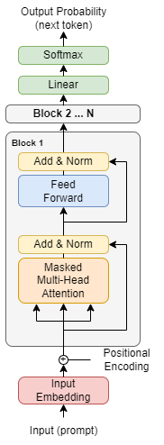
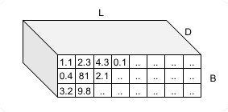
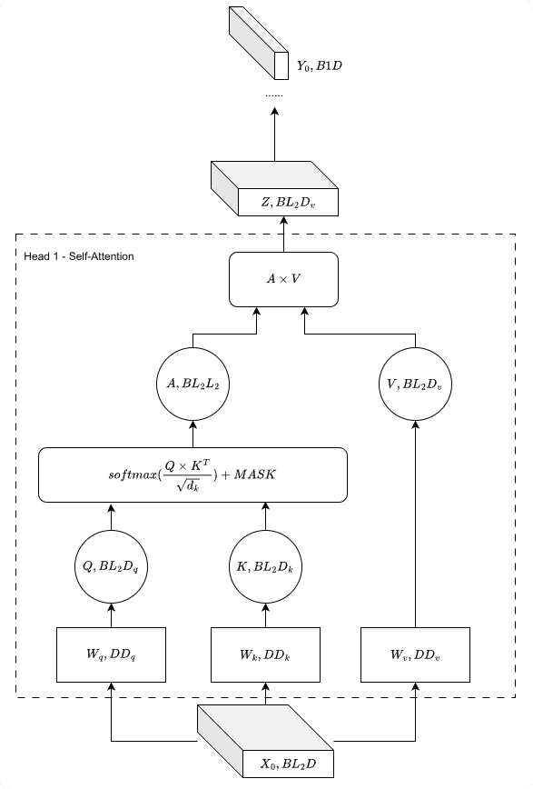
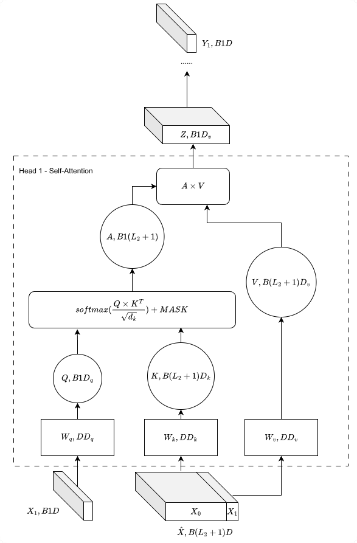
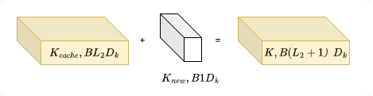
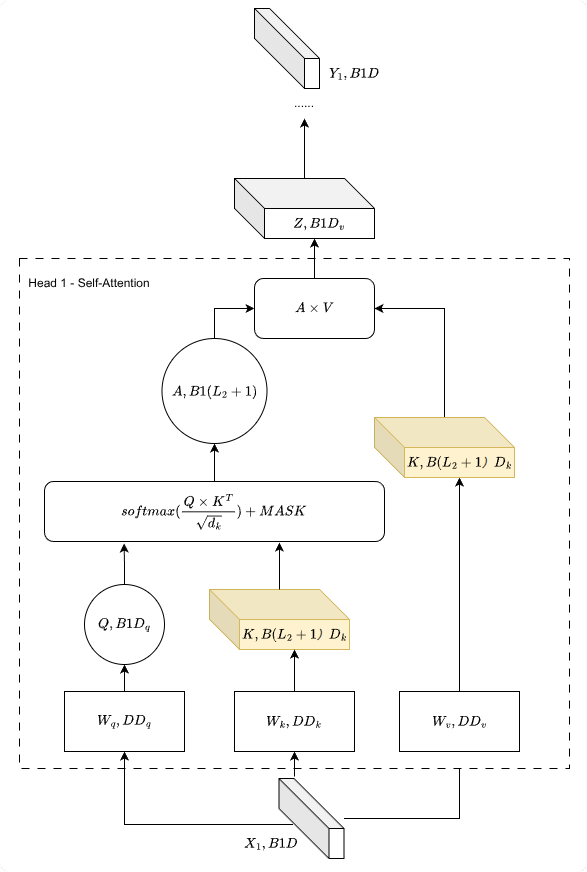
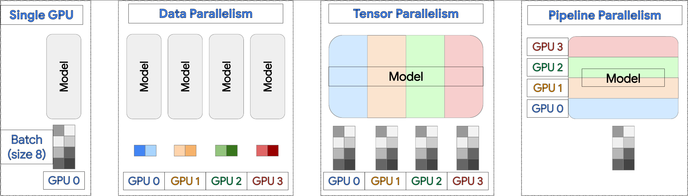
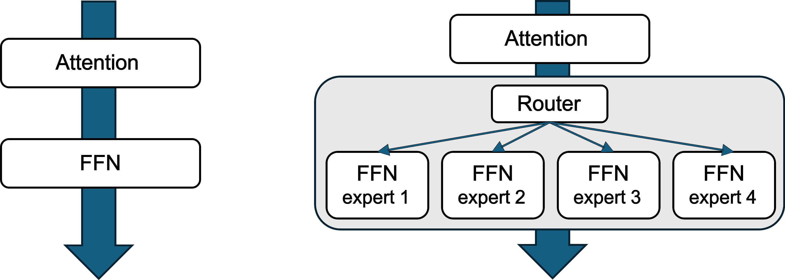

# 第6章：分布式推理与 vLLM {-}

*以高吞吐量和低延迟大规模服务大语言模型*

> 推理是新的 web 应用。
- Clayton Coleman，Google 杰出工程师

**Code Summary**

- `vllm.LLM`：用于模型加载和推理的 vLLM LLM 类
- `vllm.SamplingParams`：文本生成采样的配置
- `vllm.engine.LLMEngine`：核心 vLLM 推理引擎
- `vllm.worker.worker.Worker`：用于分布式推理的 vLLM 工作进程
- `vllm.engine.arg_utils`：vLLM 命令行参数工具
- `vllm.distributed.parallel_state`：vLLM 并行状态管理
- `vllm.engine.async_llm_engine.AsyncLLMEngine`：用于服务的异步推理引擎

## 从训练到推理

前面的章节涵盖了如何跨多块 GPU 训练大型模型——用 ZeRO 和 FSDP 的状态分片，用 Megatron 的张量和流水线并行的计算分片。但训练只是等式的一半。一旦你有了训练好的模型，你需要将它服务给用户，而服务带来了一整套完全不同的挑战。

训练为吞吐量优化：每秒处理尽可能多的 token，摊销在长时间的训练运行上。推理同时为延迟和吞吐量优化：用户期待毫秒级的响应，而系统必须处理数千个并发请求。训练处理固定的批大小；推理必须处理在不可预测时间到达的变长请求。训练可以做检查点并重启；推理必须始终可用。

内存特征也根本不同。训练期间，内存由优化器状态（动量、方差）和激活检查点主导。推理期间，没有优化器状态——内存由模型权重和 **KV 缓存** 主导，KV 缓存是从之前的 token 存储的键值对，用于避免自回归生成期间的重新计算。对于长序列，KV 缓存的大小可以超过模型权重。

本章介绍 vLLM，这个让 PagedAttention 和连续批处理成为生产 LLM 服务标准的推理引擎。我们将探索 PagedAttention 如何革新 KV 缓存管理、连续批处理如何在请求到达和完成时保持 GPU 忙碌，以及分布式推理模式如何让你服务超过单块 GPU 内存的模型。

## vLLM 简介

当 UC Berkeley 的研究人员在 2023 年着手构建更好的 LLM 服务系统时，他们面临一个根本问题：为什么现有系统浪费这么多 GPU 内存？答案引导他们创造了 **vLLM**（virtual Large Language Model），一个革新我们思考 KV 缓存管理方式的推理引擎。

关键洞见是传统服务系统将 KV 缓存视为一个单一整块——为每个请求分配连续内存并寄希望于最好的情况。这种从训练框架借来的方法对推理效果很差，因为推理中请求不可预测地到达、有极其不同的长度，并在不同时间完成。vLLM 的突破是将操作系统概念——特别是虚拟内存和分页——应用于 KV 缓存管理。结果是 PagedAttention，我们将在本章后面详细探讨。

如今，vLLM 已成为 LLM 服务的事实标准，为从初创公司到超大规模厂商的生产部署提供动力。它的高吞吐量、内存效率和易用性的结合使它成为理解分布式推理的极佳起点。

### 先决条件

vLLM 运行在带 Python 3.10 或更高版本的 Linux 上。你需要一块支持 CUDA 的 NVIDIA GPU——虽然 vLLM 也支持 AMD GPU 和其他加速器，但 NVIDIA 仍然是最常见的部署目标。确保你安装了兼容的 CUDA 版本；vLLM 的 pip 包通常捆绑必要的 CUDA 运行时，但有匹配的驱动至关重要。

### 安装

vLLM 可以用几种方法安装。**Docker 是尝试 vLLM 最快的方式**，无需在本地安装依赖。

#### Docker 设置

Docker 提供了最快的 vLLM 入门方式，无需在本地安装依赖。预构建镜像在 [vLLM Docker Hub 页面](https://hub.docker.com/r/vllm/vllm-openai) 上可用。

vLLM 支持广泛的模型架构。对于文本生成，你可以用像 `facebook/opt-125m` 这样的基础模型配合 `/v1/completions` 端点，或像 `Qwen/Qwen2.5-0.5B-Instruct` 这样的指令微调聊天模型配合 `/v1/chat/completions` 端点。vLLM 还支持嵌入模型和多模态模型——查看官方文档获取支持架构的完整列表[^vllm-models]。

[^vllm-models]: https://docs.vllm.ai/en/latest/models/supported_models.html

vLLM 服务器暴露一个 OpenAI 兼容的 API，带有 completions、chat completions、embeddings 等端点。关于带详细描述和使用示例的端点完整列表，见附录中的 **OpenAI 兼容 API 端点** 部分。

__拉取最新镜像__

拉取最新的 Docker 镜像。镜像需要约 8GB 磁盘空间。

```bash
docker pull vllm/vllm-openai:latest
```

__运行 Docker 容器__

Docker 镜像运行一个 OpenAI 兼容的服务器。要服务像 `facebook/opt-125m` 这样的基础模型，运行：

```bash
docker run --runtime nvidia --gpus all \
  -v $HOME/.cache/huggingface:/root/.cache/huggingface --env "HF_TOKEN=$HF_TOKEN" \
  -p 8000:8000 --ipc=host vllm/vllm-openai:latest \
  facebook/opt-125m
```

以下是一些适合学习目的的小模型：

| HF 中的模型名 | 模型类型 | 参数 |
|-------------------------------------------------|------------|--------|
| `facebook/opt-125m` | 基础 | 125M |
| `Qwen/Qwen2.5-0.5B-Instruct` | 聊天/指令 | 0.5B |
| `meta-llama/Llama-3.2-1B-Instruct` | 聊天/指令 | 1B |
| `meta-llama/Llama-3.2-1B` | 基础 | 1B |
| `microsoft/Phi-tiny-MoE-instruct` | MoE/指令 | ~500M（活跃） |
| `sentence-transformers/all-MiniLM-L6-v2` | 嵌入 | 22M |

要使用这些模型中的任何一个，替换 Docker 命令中的模型名：

```bash
... vllm/vllm-openai:latest <MODEL_NAME>
```

例如：
```bash
... vllm/vllm-openai:latest meta-llama/Llama-3.2-1B-Instruct
```

`--runtime nvidia --gpus all` 标志启用 GPU 访问。要使用特定的 GPU，将 `--gpus all` 替换为单块 GPU 的 `--gpus '"device=0"'` 或多块 GPU 的 `--gpus '"device=0,1"'`。你也可以设置 `--env "CUDA_VISIBLE_DEVICES=0,1"` 来限制可见的 GPU。

`-v $HOME/.cache/huggingface:/root/.cache/huggingface` 卷挂载将你的本地 Hugging Face 缓存与容器共享，避免重复的模型下载。容器路径 `/root/.cache/huggingface` 假设容器以 root 运行。如果你的容器使用不同的用户，调整这个路径，或设置 `HF_HOME` 环境变量以自定义缓存位置。

`--ipc=host` 标志允许容器访问主机的共享内存，PyTorch 在张量并行推理期间用它进行高效的数据共享。

模型名在镜像标签后作为位置参数指定。你可以在模型名后附加额外的 vLLM 引擎参数。

__验证设置__

一旦容器运行，你可以通过一系列 API 调用验证它正确工作。vLLM 服务器暴露一个 OpenAI 兼容的 REST API，这意味着你可以使用熟悉的端点和请求格式。先检查服务器健康且响应：

```bash
curl http://localhost:8000/health
```

你也可以列出可用的模型以确认服务器服务哪个模型：

```bash
curl http://localhost:8000/v1/models
```

要测试实际推理，尝试一个简单的文本补全请求。`/v1/completions` 端点接受一个提示并生成续写文本：

```bash
curl http://localhost:8000/v1/completions \
  -H "Content-Type: application/json" \
  -d '{"model": "facebook/opt-125m", "prompt": "The result of 1+1 is", "max_tokens": 3}'
```

对于聊天风格的模型（为对话交互设计的指令微调模型），改用 `/v1/chat/completions` 端点。这个端点期待一个带角色（system、user、assistant）的消息列表，而非原始提示：

```bash
curl http://localhost:8000/v1/chat/completions \
  -H "Content-Type: application/json" \
  -d '{
    "model": "Qwen/Qwen2.5-0.5B-Instruct",
    "messages": [
      {"role": "user", "content": "Hello, how are you?"}
    ]
  }'
```

如果你需要确定性输出（对相同输入每次都是相同结果），设置 `"temperature": 0` 以启用贪婪采样，它总是选择最高概率的 token：

```bash
curl http://localhost:8000/v1/chat/completions \
  -H "Content-Type: application/json" \
  -d '{
    "model": "Qwen/Qwen2.5-0.5B-Instruct",
    "messages": [
      {"role": "user", "content": "Hello, how are you?"}
    ],
    "temperature": 0
  }'
```

>NOTES: 设置 `temperature=0` 启用贪婪采样，但由于调度和批处理优化，vLLM 默认不保证完全可复现性。对于完全确定性的结果，你可能需要设置 `VLLM_ENABLE_V1_MULTIPROCESSING=0` 或启用批不变性（见 vLLM 的可复现性文档）。

>NOTEE

vLLM 还通过 `/v1/embeddings` 端点支持嵌入模型，它将文本转换为对语义搜索和检索应用有用的密集向量表示：

```bash
curl http://localhost:8000/v1/embeddings \
  -H "Content-Type: application/json" \
  -d '{
    "model": "sentence-transformers/all-MiniLM-L6-v2",
    "input": "This is a test sentence"
  }'
```

#### 从包管理器安装和运行（uv、conda、pip）

如果你不想用 Docker，你可以将 vLLM 直接安装到 Python 环境中。有几个包管理器可选，各有自己的优势。

__方法 1：使用 uv（推荐）__

`uv` 包管理器是 pip 的现代、快速替代品，更高效地处理依赖解析。如果你没有安装它，你可以用单个命令获取：

```bash
curl -LsSf https://astral.sh/uv/install.sh | sh
```

安装后，创建一个新的 Python 环境并安装 vLLM：

```bash
uv venv --python 3.12 --seed
source .venv/bin/activate
uv pip install vllm --torch-backend=auto
```

`--torch-backend=auto` 标志特别有用，因为它自动检测你的 CUDA 驱动版本并选择合适的 PyTorch 索引。如果你需要特定的 CUDA 版本，你可以显式指定它（如 CUDA 12.6 用 `--torch-backend=cu126`）。对于不创建永久环境的快速一次性命令，`uv run` 提供了方便的替代：

```bash
uv run --with vllm vllm --help
```

__方法 2：使用 conda__

如果你已经用 conda 进行环境管理，你可以为 vLLM 创建一个专用环境：

```bash
conda create -n vllm-env python=3.12 -y
conda activate vllm-env
pip install --upgrade uv
uv pip install vllm --torch-backend=auto
```

注意即使在 conda 环境中，我们仍然推荐用 `uv` 进行实际的包安装，因为它更可靠地处理 vLLM 的复杂依赖。

__方法 3：直接使用 pip__

对于传统的 Python 设置，你可以用 pip 配合标准虚拟环境：

```bash
python3.12 -m venv vllm-env
source vllm-env/bin/activate
pip install vllm
```

>NOTES: 直接使用 pip 时，确保你为你的 CUDA 版本安装了正确的 PyTorch 版本。版本不匹配可能导致晦涩的运行时错误。

>NOTEE

__验证安装__

无论你选择哪种安装方法，通过检查版本和测试命令行接口验证 vLLM 正确安装：

```bash
python -c "import vllm; print(vllm.__version__)"
vllm --help
```

#### 从本地源码编译、安装和运行

对于想修改 vLLM 源码或需要最新未发布特性的开发者，从源码构建是正确的选择。克隆仓库并以可编辑模式安装：

```bash
git clone https://github.com/vllm-project/vllm.git
cd vllm
pip install -e .
```

对于包括测试和 lint 工具的完整开发设置，使用 `dev` extras：

```bash
pip install -e ".[dev]"
```

>NOTES: 从源码构建需要所有构建依赖（包括 CUDA 工具包和 C++ 编译器），且比包管理器安装花费长得多的时间。这种方法主要用于贡献者和高级用户。

>NOTEE

#### 离线推理

安装了 vLLM 后，你可以用一个简单的离线推理示例测试它。以下脚本（`code/offline_inference.py`）演示基本使用模式：用模型名创建一个 `LLM` 实例，配置采样参数，并用你的提示调用 `generate()`：

```python
from vllm import LLM, SamplingParams

# Initialize the model
llm = LLM(model="facebook/opt-125m")

# Define prompts and sampling parameters
prompts = ["Hello, my name is", "The capital of France is"]
sampling_params = SamplingParams(temperature=0.8, top_p=0.95)

# Generate outputs
outputs = llm.generate(prompts, sampling_params)

# Print results
for output in outputs:
    print(f"Prompt: {output.prompt!r}")
    print(f"Generated: {output.outputs[0].text!r}")
```

用以下命令运行脚本：

```bash
python code/offline_inference.py
```

#### 在线推理

启动一个 OpenAI 兼容的 API 服务器：

```bash
# Start the server with a chat model
vllm serve Qwen/Qwen2.5-0.5B-Instruct --port 8000
```

在另一个终端，测试服务器：

```bash
# List available models
curl http://localhost:8000/v1/models

# Test chat completion (for instruction-tuned models)
curl http://localhost:8000/v1/chat/completions \
    -H "Content-Type: application/json" \
    -d '{
        "model": "Qwen/Qwen2.5-0.5B-Instruct",
        "messages": [
            {"role": "user", "content": "Hello, how are you?"}
        ]
    }'

# Test completion (for base models)
curl http://localhost:8000/v1/completions \
    -H "Content-Type: application/json" \
    -d '{
        "model": "facebook/opt-125m",
        "prompt": "The result of 1+1 is",
        "max_tokens": 3
    }'
```

## KV 缓存

在上一节，我们看到 vLLM 如何提供一个运行推理的高级接口。但是什么使 LLM 推理从根本上不同于其他深度学习工作负载？答案在于文本生成的自回归性质和一个称为 **KV 缓存** 的关键优化。

当语言模型生成文本时，它不是一次性产生整个输出。相反，它一次生成一个 token，每个新 token 依赖于它之前的所有 token。这种顺序依赖创造了一个独特的计算挑战：没有仔细的优化，模型需要为它生成的每一个 token 重新处理整个序列历史。KV 缓存是这个问题的解决方案——它存储中间计算，使它们可以被重用而非重新计算。

理解 KV 缓存对任何大规模处理 LLM 推理的人都至关重要。它解释了为什么在生成期间内存（而非计算）常常成为瓶颈。它是像 PagedAttention（我们稍后介绍）这样的技术能够大幅提高吞吐量的原因。它也是理解像张量并行这样的分布式推理策略如何影响内存需求的基础。

让我们从审视使 KV 缓存既必要又可能的架构开始。

### 仅解码器 Transformer 架构

{#fig:decoder-only .block width=30% align=top-right}

在深入 KV 缓存之前，让我们建立一个我们正在处理的架构的清晰画面。现代大语言模型——GPT、LLaMA、Qwen 及其变体——都共享一个共同设计：仅解码器 transformer。这种架构对自回归语言建模已被证明极其有效，其目标是给定所有之前的 token 预测下一个 token。

一个仅解码器 transformer 由一堆相同的层组成，7B 模型通常 32 层，更大的模型 80+ 层。每层包含两个主要组件：带因果掩码的自注意力子层和一个前馈网络（FFN）。残差连接和层归一化将一切系在一起，确保稳定的训练和推理。

自注意力机制是魔法发生的地方——也是 KV 缓存变得必不可少的地方。注意力使用三个学习的线性投影来变换输入：**查询（Q）**、**键（K）** 和 **值（V）**。对于位置 $i$ 的每个 token，模型计算：

$$Q_i = x_i \times W_Q, \quad K_i = x_i \times W_K, \quad V_i = x_i \times W_V$$

其中 $x_i$ 是 token 嵌入（或来自前一层的隐藏状态），$W_Q$、$W_K$、$W_V$ 是学习的权重矩阵。直觉是查询代表"我在找什么？"，键代表"我包含什么？"，值代表"我提供什么信息？"。注意力机制然后计算：

$$\text{Attention}(Q, K, V) = \text{softmax}\left(\frac{Q \times K^T}{\sqrt{d_k}}\right) \times V$$

$Q \times K^T$ 项计算所有 token 对之间的相似度分数——每个之前的 token 与当前的有多相关？softmax 将这些分数归一化为概率分布，结果用于加权值向量。$\sqrt{d_k}$ 缩放因子防止点积增长太大，那会将 softmax 推入梯度消失的区域。

对于自回归生成，我们应用一个因果掩码，在 softmax 之前将未来位置的注意力分数设为 $-\infty$。这确保在预测 token $i$ 时，模型只能关注 token $0, 1, \ldots, i-1$——它不能在生成期间"偷看"还不存在的未来 token。

图~\ref{fig:decoder-only} 显示一个典型的仅解码器架构。每层由两个子层组成：一个掩码多头自注意力机制和一个位置前馈网络（FFN）。掩码注意力确保位置 $i$ 只能关注位置 $\leq i$，强制自回归性质。FFN 通常将隐藏维度扩展 4 倍（或在像 LLaMA 这样的现代架构中用约 2.7 倍扩展的 SwiGLU），应用非线性，并投影回来。残差连接和层归一化稳定训练。注意这个图遵循原始 Transformer 的 "Add & Norm" 顺序；像 GPT 和 LLaMA 这样的现代 LLM 使用 "Pre-Norm"（在注意力/FFN 之前归一化）以获得更好的训练稳定性。

__记号__

我们在本节中使用以下记号：

- $B$：批大小
- $L_1$：关注序列（查询）的长度；$l_1$：这个序列中一个位置的索引
- $L_2$：被关注序列（键/值）的长度；$l_2$：这个序列中一个位置的索引
- $D$：模型隐藏大小（隐藏状态/token 的维度）
- $H$：注意力头的数量
- $D_{qk}$：查询/键向量的维度
- $D_v$：值向量的维度，且 $D = D_v \times H$
- $L$：当 $L_1 = L_2$ 时使用的记号

### 文本生成过程：预填充与解码

{#fig:transformer-input .block width=40% align=top-left}

图~\ref{fig:transformer-input} 展示了输入张量结构。服务生成请求时，我们通常为更高吞吐量批处理多个提示。输入有形状 $B \times L_2 \times D$，其中 $B$ 是批大小，$L_2$ 是提示长度（token 数），$D$ 是隐藏维度（如 LLaMA-7B 的 4096）。每个 token 表示为一个 $D$ 维嵌入向量，整个提示成为一个流经 transformer 层的矩阵。

文本生成分两个不同阶段发生，每个有根本不同的计算特征。理解这些阶段对优化推理性能至关重要。

__预填充阶段__

第一个阶段，称为 **预填充（prefill）**（也称为"提示处理"或"上下文编码"阶段），并行处理整个提示序列。这是模型在生成任何输出之前"读取"和"理解"输入的地方。预填充期间，所有 $L_2$ 个提示 token 同时通过每个 transformer 层被处理。

图~\ref{fig:prefill} 详细展示了预填充阶段。输入 $X_0$（形状为 $B \times L_2 \times D$ 的嵌入提示 token）通过所有 transformer 层。在每层，自注意力机制允许每个 token 关注提示中所有其他 token，建立上下文表示。模型为每个位置产生 logits——一个形状为 $B \times L_2 \times V$ 的张量，其中 $V$ 是词汇表大小（如 LLaMA 的 32,000）。然而，我们只关心最后位置的 logits（$B \times 1 \times V$），因为它们给我们第一个生成的 token $Y_0$ 在词汇表上的概率分布。

关键的是，预填充期间我们还计算并存储每层所有提示 token 的键和值投影。对于一个有 $N$ 层的模型，我们缓存 $2N$ 个张量（每层一个 K 和一个 V），每个形状为 $B \times L_2 \times D_{qk}$（或值的 $D_v$）。这个 **KV 缓存** 将在后续解码步骤中被重用，避免这些投影的冗余计算。预填充阶段是计算受限的：我们并行处理 $L_2$ 个 token，每层执行 $O(L_2^2)$ 次注意力操作（每个 token 关注所有 $L_2$ 个 token）。

预填充阶段有高算术强度——计算操作与内存访问的比率有利，因为我们在许多 token 上做密集矩阵乘法。对于一批长提示，GPU 的张量核心被大矩阵操作保持忙碌，实现高利用率。这类似于训练期间的前向传播，在那里我们也并行处理序列。

{#fig:prefill .block width=100% align=center}


### 解码阶段及其低效

预填充完成后，模型进入 **解码（decode）** 阶段。这里，token 在一个自回归循环中一次生成一个：生成 token $Y_0$，将它作为输入反馈，生成 $Y_1$，以此类推，直到到达序列结束 token 或最大长度。

考虑生成提示后的第一个新 token。查询投影的输入是 $X_1 = Y_0$（新生成的 token），但为了注意力正确工作，键和值投影需要完整上下文——原始提示 $X_0$ 与新 token $X_1$ 拼接，产生形状 $B \times (L_2 + 1) \times D$。

{#fig:decode-no-cache .block width=100% align=center}

图~\ref{fig:decode-no-cache} 展示了这种天真方法。查询需要关注到目前为止的整个上下文。例如，如果我们的提示 $X_0$ 是 "Time flies" 而 $Y_0$ 是 "like"，我们用 "like" 查询上下文 "Time flies like" 并预测下一个 token，可能是 "an"。然后我们用 "an" 查询 "Time flies like an" 并得到 "arrow"。这个过程继续：每个新生成的 token 必须关注所有之前的 token（原始提示和所有之前生成的 token）以维持上下文并生成连贯文本。然而，在每一步，我们需要为整个序列历史重新计算键和值向量，即使这些计算大部分已经在之前的步骤中执行过。

从上图，我们可以容易地看到低效来自于我们需要构造 $\hat{X} = [X_0, X_1]$ 并将它与 $W_K$ 和 $W_V$ 相乘，即使 __$X_0$ 部分已经在预填充阶段与这些权重矩阵相乘过__。这种重复在每个生成步骤发生，需要通过整个 transformer 栈为所有之前的 token 重新计算 $Key$ 和 $Value$ 向量。

没有缓存，这种天真方法每步有时间复杂度 $O(L_{\text{total}}^2)$，其中 $L_{\text{total}}$ 是包括提示和生成 token 的总序列长度 $L_2 + L_t$。对于长序列，这变得计算上难以承受。

### KV 缓存解决方案

KV 缓存通过存储所有之前处理的 token 的预计算键和值向量来解决这种低效。我们不是拼接和重新计算，而是可以简单地用 $X_1$ 作为 $K$ 和 $V$ 计算的输入，只要我们缓存之前的结果。以 $Key$ 向量为例，我们只计算形状为 $B \times 1 \times D_{qk}$ 的 $K_{new}$，时间复杂度大幅减少。

{#fig:cache-grow .block width=100% align=center}

图~\ref{fig:cache-grow} 展示了 KV 缓存如何随每个生成的 token 增长。有了 KV 缓存，解码阶段变得高效得多。

输入形状是 $B \times 1 \times D$，输出形状也是 $B \times 1 \times D$。关键洞见是只有新 token 需要注意力计算，而所有之前的 token 重用它们缓存的 $K$ 和 $V$ 向量。

__时间复杂度分析：__

有了 KV 缓存，计算复杂度大幅改变：

- **预填充阶段**：并行处理所有 $L_2$ 个提示 token。对提示序列的自注意力，注意力计算有复杂度 $O(L_2^2 \cdot D)$。这是一次性成本。

- **解码阶段（每 token）**：

  - **无 KV 缓存**：每步 $O(L_{\text{total}}^2 \cdot D)$，其中 $L_{\text{total}} = L_2 + L_t$ 随每个生成的 token 增长。对于 $T$ 个生成的 token，总复杂度是 $O(T \cdot L_{\text{total}}^2 \cdot D)$，当 $L_t \gg L_2$ 时变成 $O(T^3 \cdot D)$。
  
  - **有 KV 缓存**：只为新 token 计算 $K$ 和 $V$（形状 $B \times 1 \times D_{qk}$），然后用缓存的键/值执行注意力。每步注意力计算的复杂度是 $O(L_{\text{total}} \cdot D)$，其中 $L_{\text{total}}$ 是当前序列长度。对于 $T$ 个生成的 token，总复杂度是 $O(T \cdot L_{\text{total}} \cdot D) \approx O(T^2 \cdot D)$，当 $L_t \gg L_2$ 时。

关键改进是将解码阶段对序列长度的二次依赖减少到线性，使长序列生成可行。然而，这以内存为代价：KV 缓存需要 $O(L_{\text{total}} \cdot D)$ 内存来存储所有缓存的键和值向量。

{#fig:decode-with-cache .block width=100% align=center}

图~\ref{fig:decode-with-cache} 显示启用 KV 缓存的解码阶段。解码阶段有与预填充根本不同的计算特征。只有一个 token 被处理，矩阵乘法本质上是矩阵-向量操作。算术强度低——我们是内存受限的，大部分时间花在从 GPU 内存加载模型权重而非计算上。这就是为什么将多个解码请求批处理在一起（连续批处理，稍后介绍）对效率至关重要。

__推理阶段总结__

下表总结了预填充和解码阶段的张量形状和操作：

| 阶段 | 形状 | 备注 |
|-------|-------|-------|
| **预填充阶段** | | |
| 输入 $X_{\text{prompt}}$ | $B \times L_2 \times D$ | 提示序列 |
| 处理所有 token | 并行 | 与训练相同 |
| 缓存 $K$、$V$ | $B \times L_2 \times D_{qk/v}$ | 用于重用 |
| **解码阶段** | | |
| 输入 $x_t$ | $B \times 1 \times D$ | 单个新 token |
| $Q_t = x_t W^Q$ | $B \times 1 \times D_{qk}$ | 新 token 的查询 |
| $K_{\text{cached}}$ | $B \times (L_2 + t) \times D_{qk}$ | 所有之前的键 |
| $V_{\text{cached}}$ | $B \times (L_2 + t) \times D_v$ | 所有之前的值 |
| 注意力分数 | $B \times 1 \times (L_2 + t)$ | 新 token 关注所有之前的 |
| 注意力 $A_t$ | $B \times 1 \times (L_2 + t)$ | 上三角 |
| 输出 $Z_t$ | $B \times 1 \times D_v$ | |
| 拼接头 | $B \times 1 \times (H \cdot D_v)$ | |
| 最终输出 | $B \times 1 \times D$ | 单个生成的 token |

## PagedAttention：解决 KV 缓存碎片化

虽然 KV 缓存大幅提高计算效率，它在生产服务系统中引入一个关键挑战：**内存碎片化**。服务多个并发请求时，每个有动态增长的不同序列长度，传统内存分配策略导致显著浪费并限制吞吐量。

vLLM 的突破性创新是 **PagedAttention**，一个受操作系统中虚拟内存分页启发的内存管理算法。PagedAttention 主要设计用于通过将缓存分配为固定大小的块来解决大规模 LLM 服务中的 KV 缓存碎片化。这种基于块的设计的一个关键后果是注意力计算不再遍历填充的序列范围。相反，它只遍历每个请求实际存在的块，从而消除填充相关的注意力 FLOPs。

### KV 缓存碎片化问题

在生产环境中，服务系统必须同时处理多个并发请求。每个请求维护它自己的 KV 缓存，随着自回归解码期间生成 token 而动态增长。不同的提示和生成长度导致不同的缓存大小，造成一个根本的分配挑战。

传统系统为每个请求分配连续内存块。当序列完成或有不同长度时，这种方法导致无法高效重用的浪费空间。

{#fig:kv-cache-fragmentation .block width=85% align=center}

图~\ref{fig:kv-cache-fragmentation} 展示了这个问题。请求 1 在生成 8 个 token 后完成，而请求 2（4 个 token）和请求 3（10 个 token）仍然活跃。原本为请求 1 分配的内存现在闲置——但为什么不能重用它？问题是请求 2 和请求 3 各需要它们的 KV 缓存存储在 *连续* 内存中以进行高效的注意力计算。请求 1 释放的 8-token 块可能对需要 12 个 token 的新请求太小，或对只需要 3 个 token 的太大。即使大小匹配，释放的块也可能不与现有请求的缓存相邻，所以它不能扩展那个请求的序列。同时，请求 2 和请求 3 各为它们可能永远不会生成的 token 保留空间。来自完成请求的释放块常常未被使用；活跃请求持有它们可能永远填不满的内存。在高并发服务中，综合浪费可以达到 GPU 内存的 60-80%——这是 PagedAttention 论文报告的范围。[^paged-attention]

[^paged-attention]: Kwon et al., "Efficient Memory Management for Large Language Model Serving with PagedAttention," 2023. https://arxiv.org/abs/2309.06180

除了内存浪费，传统批处理引入一个不那么明显但同样关键的低效：填充引起的注意力计算浪费。在批处理解码中，不同请求通常有不同的有效上下文长度。设批大小为 $B$，请求 $i$ 的缓存上下文长度为 $(L_2^{(i)} + t^{(i)})$。要将这些请求批处理在一起，传统注意力实现必须将所有序列填充到一个共同的最大长度：

$$(L_2 + t)_{\max} = \max_i (L_2^{(i)} + t^{(i)})$$

因此，注意力中使用的缓存键和值有形状 $K_{\text{cached}}, V_{\text{cached}} \in \mathbb{R}^{B \times (L_2 + t)_{\max} \times D_{qk/v}}$，解码步骤的注意力分数计算为：

$$A_t = \text{softmax}\left(Q_t K_{\text{cached}}^T + \text{mask}\right), \qquad A_t \in \mathbb{R}^{B \times 1 \times (L_2 + t)_{\max}}$$

虽然掩码防止填充位置影响输出，涉及填充 token 的点积仍然被完全计算。因此，大部分注意力 FLOPs 花在不携带语义信息的 token 上，特别是当批内上下文长度差异很大时。

### PagedAttention 如何工作

要解决碎片化问题，PagedAttention 必须使用固定大小的块。当序列有不同长度并在不同时间完成时，连续内存分配不可避免地导致碎片化。唯一可行的方法是将 KV 缓存分区成可以独立分配和释放的固定大小块。

PagedAttention 将 KV 缓存划分为固定大小的块，通常每块 16 个 token（记为 $B_{\text{size}}$），类似于 OS 虚拟内存中的内存页。每个块包含一段连续 token 的键和值向量。对于请求 $i$，缓存的 KV 表示为 $N_i = \lceil (L_2^{(i)} + t^{(i)}) / B_{\text{size}} \rceil$ 个块，每个块存储形状为 $\text{Block} \in \mathbb{R}^{B_{\text{size}} \times D_{qk/v}}$ 的键和值。

每个请求维护一个块表，将逻辑序列位置映射到物理块地址，类似于 OS 虚拟内存中的页表。这允许序列逻辑上连续，而物理上存储在散布于 GPU 内存的离散块中。块随序列增长或完成而分配和释放。当一个请求完成时，它的块立即返还到一个共享块池。释放的块可以立即被新请求重用，消除碎片化并实现接近 100% 的内存利用率。

{#fig:paged-attention-blocks .block width=90% align=center}

图~\ref{fig:paged-attention-blocks} 展示了这种基于块的方法。顶部的块池包含所有可用的块。请求 1 已完成，它的块（Block 0、Block 1）返还到池，显示为空闲（黄色）。请求 2 使用 Block 2，请求 3 使用 Block 3 和 4。与连续分配不同，当请求 1 完成时，它的块立即对任何新请求可用——无论大小。一个需要 3 个块的新请求可以抓取 Block 0、Block 1 和 Block 5，无需它们相邻。


### 消除填充 FLOPs

一旦块存在，注意力计算的迭代语义就根本改变。这是基于块设计的关键后果，而非额外的优化。有了基于块的存储，注意力计算不再假设 KV 缓存是从位置 1 到 $(L_2 + t)_{\max}$ 的连续序列。相反，注意力遍历块表，不存在的 token 就是没有对应的块。

{#fig:padding-vs-paged .block width=100% align=center}

图~\ref{fig:padding-vs-paged} 对比了两种方法。在传统批处理（左）中，三个长度为 4、7 和 3 个 token 的请求必须都填充到最大长度 7。注意力内核在所有 21 个位置（7 × 3）上计算，但只有 14 个包含实际 token——7 个位置（33%）浪费在填充上。用 PagedAttention（右），每个请求的注意力计算只访问它的实际 token。不存在填充，所以所有 FLOPs 都贡献于有意义的计算。

解码期间，请求 $i$ 的注意力计算只遍历它块表中列出的块：

$$A_t^{(i)} = \text{softmax}\left(Q_t^{(i)} \cdot \bigcup_{b \in \mathcal{B}_i} K_b^T\right)$$

其中 $\mathcal{B}_i$ 表示请求 $i$ 拥有的块集合。关键的是，这个计算只依赖 $(L_2^{(i)} + t^{(i)})$，而非 $(L_2 + t)_{\max}$。对给定请求不存在的 token 永远不会被注意力内核访问，因为对应的块在块表中不存在。

用 PagedAttention，填充 token 不是在计算后被掩码——它们从来不是计算的一部分。注意力内核不为填充位置启动点积。因此，每个请求的注意力 FLOPs 数量与它的真实上下文长度成比例，而非批内的最大上下文长度。这个性质完全消除了填充相关的 FLOPs，是大规模 LLM 服务系统中高效连续批处理的关键推动因素。

vLLM 中的性能改进来自两种效应协同工作。碎片化减少允许更多并发请求同时被服务，而零填充 FLOPs 增加了解码注意力的有效计算利用率。这些是同一个基于块设计决策的两面。

与专注于地址映射和访问正确性的 OS 页管理不同，PagedAttention 为高效的注意力计算优化。自定义 CUDA 内核从非连续块读取 KV 缓存，同时维持合并的内存访问模式，确保高 GPU 利用率。这种注意力感知设计意味着系统理解注意力操作如何访问内存并相应地优化。

好处是显著的。内存效率大幅提高，因为变长序列的碎片化浪费被消除，实现接近 100% 的内存利用率。生产部署可以用相同的 GPU 内存服务比传统方法多 2-4 倍的并发请求。更重要的是，填充开销被完全消除，意味着零 FLOPs 浪费在填充上。这在真实服务场景中大幅提高吞吐量。

灵活批处理成为可能，因为不同序列长度的请求可以在没有填充的情况下高效批处理。系统支持批组成每步都改变的动态批处理，实现高度可变工作负载的高效服务。长上下文支持也得到增强，因为系统在不预分配最大内存的情况下高效处理变长上下文。100K+ token 的非常长的序列可以通过按需分配块来服务。这种设计自然地处理高并发，为频繁请求到达和完成的高流动工作负载而构建。

### 与分布式推理的联系

PagedAttention 在单块 GPU 内解决内存效率，但当即使高效管理的单块 GPU 也不够时会发生什么？这是分布式推理变得必不可少的地方。当模型超过单块 GPU 内存容量、当吞吐量需求超过一块 GPU 所能提供的，或当模型对单个节点就是太大时，我们需要将工作负载分散到多个设备上。

PagedAttention 用于内存效率和分布式并行用于可扩展性的结合，是使 vLLM 能在生产中服务最大模型的关键。PagedAttention 确保我们不在碎片化上浪费内存，而张量、数据和流水线并行让我们扩展到单 GPU 限制之外。

## 动机：“显存墙”的终极考验

随着大语言模型的体量持续膨胀，一个不可逾越的物理限制摆在面前：单张 GPU 的物理显存根本无法容纳整个模型。DeepSeek-V3/R1 拥有高达 6710 亿参数（671B）；而 Llama 3.1 405B 的参数量也达到了惊人的 4050 亿。即便是面对拥有 80GB HBM3 高速显存的顶级 NVIDIA H100 GPU，单以 FP16 精度（每个参数 2 字节）存储 405B 参数就需要高达 810GB 显存——这相当于 10 张 H100 显存容量的绝对总和。

工程上的常见应对手段之一是**权重量化（Quantization）**：将模型权重从 FP16 压缩至 FP8 乃至 INT4。量化虽然立竿见影，但存在明确的物理边界与精度代价。FP8 能够将静态显存需求减半，使得 405B 模型“只需” 405GB 显存——但这依然需要至少 5 张 80GB 卡联手才能放下；INT4 能够进一步将模型压缩至约 200GB，但往往会带来不可逆的精度衰减，在严肃商业应用中难以被轻易接受。更为关键的是，上述估算尚未包含动态的 KV 缓存（KV Cache），而在长上下文推理中，KV Cache 的显存峰值往往会轻易超越模型静态权重本身！

因此，更具扩展性的根本解法，是**将大模型切分并分布到多张 GPU 之间并行推理**。我们无需过分牺牲模型精度去迎合单卡显存，而是将庞大的模型横向拆分到多张计算卡上，让各卡分别维护一部分权重分片并协同推进矩阵前向传播。这正是分布式推理的核心战场。为此，vLLM 系统性地提供了三种基础并行策略：张量并行（Tensor Parallelism）、数据并行（Data Parallelism）与流水线并行（Pipeline Parallelism）。

## vLLM 架构概述

vLLM 的架构围绕一个 **调度器-执行器-工作进程（scheduler-executor-worker）** 模式，如图~\ref{fig:vllm-arch} 所示。这种分层设计干净地分离关注点：请求管理、分布式协调和实际计算。

{#fig:vllm-arch .block width=70% align=center}

**调度器（Scheduler）** 位于层次结构的顶部。它接收传入的请求，根据可用内存和调度策略将它们分组成批次，并决定每次迭代处理哪些请求。调度器实现 **连续批处理（continuous batching）**——Orca 风格的模式，在同一批次内接纳新请求并退役完成的请求，而非等待每个序列完成。这种动态调度最大化 GPU 利用率。

**执行器（Executor）** 充当调度器和实际计算资源之间的协调层。它管理工作进程池并将高级调度决策翻译成分布式命令。vLLM 根据部署场景支持多个执行器后端：小型模型的简单单 GPU 执行器、单节点多 GPU 推理的多进程执行器，以及跨多节点分布式推理的基于 Ray 的执行器。执行器向所有工作进程广播命令并收集它们的结果。

**工作进程（Workers）** 是计算单元，每个与一块 GPU（或其他加速器）关联。一个工作进程持有模型权重的一个分片、管理它的本地 KV 缓存，并执行实际的前向传播。在张量并行配置中，工作进程通过 NCCL 协调以执行 all-reduce 等集合操作。每个工作进程运行相同的模型代码，但根据并行策略在不同的数据或模型分片上操作。

这种架构使 vLLM 能从单块 GPU 扩展到跨多节点的数百块 GPU，同时维持相同的编程模型。

## vLLM 中的并行策略概述

{#fig:vllm-parallelism .block width=90% align=center}

vLLM 提供三种基本的并行策略，用于跨多块 GPU 分布计算和内存。**张量并行（TP）** 在节点内跨多块 GPU 分片单个层，每块 GPU 处理每层的一部分，结果通过集合通信同步。**数据并行（DP）** 创建模型的多个完整副本，每个独立处理不同的请求以增加吞吐量。**流水线并行（PP）** 将模型的层跨多块 GPU 或节点拆分，数据像装配线一样顺序流经各阶段。

此外，vLLM 为混合专家（MoE）模型提供 **专家并行（EP）** 作为一个特殊的修饰符标志。EP 不是独立策略——它修改 MoE 层如何分布，且必须与 TP 或 DP 结合。`--enable-expert-parallel` 标志改变 MoE 模型的通信模式和专家分布。

以下章节详细探讨每种策略，然后讨论它们如何为最佳性能组合。

## 张量并行（TP）

**张量并行（TP）** 在单个节点内跨多块 GPU 水平分片模型权重，允许所有 GPU 并发计算。与流水线并行（我们稍后介绍）不同，后者中 GPU 顺序处理不同的层，张量并行让每块 GPU 同时在同一层上工作——每块处理计算的不同片。这遵循 **SPMD（单程序，多数据）** 范式：所有 GPU 运行相同的代码，但在数据的不同部分上。

### 线性代数基础

要理解张量并行，我们需要理解矩阵乘法如何跨设备拆分。有两种基本模式：列并行和行并行。

**列并行** 沿列拆分权重矩阵。考虑一个矩阵乘法 $Y = X \times A$。如果我们将 $A$ 分区成两个列块 $[A_1 | A_2]$，那么输出自然地分区为 $Y = [X \times A_1 | X \times A_2]$。每块 GPU 独立计算结果的一部分。要重组完整输出，我们用一个 **all-gather** 操作拼接来自所有 GPU 的部分。

**行并行** 采取不同的方法。我们沿行拆分输入 $X$ 和权重矩阵 $A$：$X = [X_1; X_2]$ 和 $A = [A_1; A_2]$。输出变成 $Y = X_1 \times A_1 + X_2 \times A_2$——每块 GPU 计算一个部分和，我们用 **all-reduce** 跨所有 GPU 求和这些部分结果。

关键洞见是这两种模式可以巧妙地串联以最小化通信。在一个典型的 transformer MLP（前馈网络）中，我们有一个"上投影"，后接一个激活函数和一个"下投影"。如果我们对上投影应用列并行，输出自然地跨 GPU 分片。我们然后可以应用激活函数（逐元素，所以不需要通信）并将分片结果直接馈入一个行并行下投影。唯一需要的通信是最后的单个 all-reduce——中间没有 all-gather。

这种模式也扩展到注意力。Q、K、V 投影可以是列并行的（每块 GPU 处理一个注意力头子集），输出投影可以是行并行的。同样，每个注意力层我们只需要一个 all-reduce。

### 张量并行的好处

张量并行最明显的好处是 **内存减少**：每块 GPU 只存储权重的一部分。一个装不进单块 GPU 的 140B 参数模型可以跨两块 GPU 拆分，每块持有约 70B 参数。但好处比只是装下更大的模型更深。

考虑 KV 缓存容量会发生什么。假设一个 140B 模型在权重加载后在 141 GB 的 H200 上只留下约 20 GB 空闲。用 TP=2，每块 GPU 持有一半权重，为 KV 缓存释放大约 70 GB——常常是添加张量并行的真正原因，即使模型技术上可以塞进更少的 GPU。

张量并行还通过有效地倍增内存带宽来减少延迟。推理期间，特别是解码阶段，我们常常是内存受限的——等待权重从 HBM 加载而非等待计算。用 TP=2，我们同时从两块 GPU 的 HBM 加载，倍增有效带宽。

权衡是通信开销。每层需要一个 all-reduce 操作，传输大小为 `batch_size × sequence_length × hidden_size` 的数据。在带 NVLink（提供 GPU 之间 600+ GB/s）的系统上，这个开销可管理。在仅 PCIe 系统（32 GB/s）上，对预填充繁重的工作负载通信可以主导运行时——有时消耗总时间的 60% 或更多。

一个需要记住的额外约束：注意力头的数量必须能被张量并行大小整除。相同规则适用于分组查询和多查询模型中的 KV 头——如果计数不能均匀整除，vLLM 可能在内部复制 KV 头。如果你的模型有 32 个头，你想要 TP=6，你需要填充或不同的 TP 大小。大多数现代模型专门设计为 2 的幂的头数，以实现灵活的 TP 配置。

### 何时使用张量并行

当你的模型装不进单块 GPU 且你有好的互连（NVLink）可用时，张量并行是正确的选择。它对你想让所有 GPU 都贡献于每个请求的延迟敏感工作负载特别有效。对仅 PCIe 系统上预填充繁重的工作负载要谨慎——在提交到 TP 配置之前，剖析你的特定工作负载以理解通信与计算的比率。


## 用于吞吐量扩展的数据并行（DP）

张量并行跨 GPU 拆分单个模型以处理更大的模型或减少延迟。但如果你的模型已经装进一块 GPU（或一个小 TP 组），而你的瓶颈只是服务更多并发请求呢？这是 **数据并行（DP）** 的用武之地。

概念很直接：我们不是跨多块 GPU 拆分一个模型，而是创建模型的多个完整副本，每个在它自己的 GPU（或 TP 组）上独立运行。每个副本处理不同的请求，一个负载均衡器在它们之间分发传入流量。推理期间副本之间没有通信——它们完全独立，就像运行多个单独的 vLLM 服务器。

这种独立性既是 DP 最大的优势也是它的限制。因为副本不通信，没有通信开销——吞吐量随副本数量线性扩展。添加四个副本，得到四倍的吞吐量。但这也意味着每个副本需要足够的内存用于完整的模型副本，所以当模型本身太大时 DP 无济于事。

### 将数据并行与其他策略结合

实践中，DP 常常与 TP 结合。考虑在一个有 8 块 GPU 的系统上服务一个 70B 模型。模型需要 TP=2 才能装下，留给我们 4 个潜在的 TP 组。我们可以运行 DP=4 创建四个副本，每个用张量并行使用两块 GPU。总 GPU 数是 `DP_size × TP_size = 4 × 2 = 8`。

```bash
vllm serve $MODEL --data-parallel-size 4 --tensor-parallel-size 2
```

对于 MoE 模型，DP 和专家并行之间的交互更微妙。注意力层可以在纯数据并行模式运行（每个副本有完整的注意力权重），而专家层用专家并行跨 DP 组分布专家。这需要同步：即使一个 DP rank 在给定步骤没有请求，它也必须参与专家路由的 all-to-all 通信。vLLM 自动处理这个，但值得理解 MoE + DP 不像稠密模型 DP 那么"独立"。

### 部署模式

vLLM 为数据并行支持两种部署模式：

__内部负载均衡（自包含）__

一个带内部负载均衡的单个 API 端点：

```bash
# Single node: DP=4, TP=2 (8 GPUs total)
vllm serve $MODEL --data-parallel-size 4 --tensor-parallel-size 2
```

**多节点示例**：
```bash
# Node 0 (head node with API server)
vllm serve $MODEL --data-parallel-size 4 --data-parallel-size-local 2 \
                  --data-parallel-address 10.99.48.128 --data-parallel-rpc-port 13345

# Node 1 (worker node)
vllm serve $MODEL --headless --data-parallel-size 4 --data-parallel-size-local 2 \
                  --data-parallel-start-rank 2 \
                  --data-parallel-address 10.99.48.128 --data-parallel-rpc-port 13345
```

这种模式提供一个基于队列长度自动负载均衡的单个 HTTP 端点，使部署更简单。限制是 API 服务器在大 DP 大小时可能成为瓶颈——如需要用 `--api-server-count` 扩展 API 服务器。

__外部负载均衡__

每个 DP rank 作为一个带自己端点的单独 vLLM 实例部署：

```bash
# Rank 0
CUDA_VISIBLE_DEVICES=0 vllm serve $MODEL --data-parallel-size 2 --data-parallel-rank 0 --port 8000

# Rank 1
CUDA_VISIBLE_DEVICES=1 vllm serve $MODEL --data-parallel-size 2 --data-parallel-rank 1 --port 8001
```

一个外部负载均衡器（如 nginx、HAProxy）根据实时遥测（队列长度、KV 缓存使用）、请求特征（前缀缓存机会）和健康状态将请求路由到不同的 rank。这种模式为大型 DP 部署提供更好的可扩展性、更复杂的 KV 缓存感知负载均衡，以及每个 rank 的独立扩展。

### 好处与权衡

数据并行的吸引力在于它的简单性和有效性。吞吐量线性扩展——加倍副本，加倍吞吐量。每个副本维护它自己的 KV 缓存，所以总缓存容量也线性扩展。如果一个副本失败，其他继续服务，提供自然的容错。而且因为副本推理期间不通信，没有通信开销吃掉你的计算预算。

权衡同样清楚。内存效率受损，因为每个副本存储模型权重的完整副本。对于一个 70B 模型，四个 DP 副本意味着跨系统存储价值 280B 参数的权重——而张量并行是 70B。负载均衡变得重要：天真的轮询方法忽略了不同副本可能有不同 KV 缓存利用率的事实，导致次优性能。而对于 MoE 模型，DP 的"独立性"崩溃，因为专家路由需要跨副本通信。

决策框架很直接：先用 TP/PP 使模型装下，然后添加 DP 以扩展吞吐量。如果你的模型装进单块 GPU 且你需要更多吞吐量，DP 是最简单的解决方案。如果延迟是你的主要关切，TP（通过并行化计算减少每请求延迟）可能比 DP（完全不影响单请求延迟）更好。

## 流水线并行（PP）

当模型增长到超过单个节点所能容纳——想想 671B 参数的 DeepSeek R1 或 405B 的 LLaMA——我们需要跨多台机器分布层。这是 **流水线并行（PP）** 的用武之地。

虽然张量并行水平拆分每层（所有 GPU 同时在同一层上工作），流水线并行沿层垂直拆分模型。GPU 0 可能持有层 0-19，GPU 1 持有层 20-39，以此类推。数据顺序流经流水线：GPU 0 处理它的层并将输出发送给 GPU 1，后者处理它的层并发送给 GPU 2，以此类推。

通信模式与 TP 根本不同。在张量并行中，每层需要跨所有 GPU 的 all-reduce——高频率，但数据保持在节点内，NVLink 提供快速互连。在流水线并行中，通信只在阶段边界发生——频率低得多，但数据通常跨节点边界，那里网络带宽有限。这使 PP 很适合节点间带宽是瓶颈的多节点部署。

### 流水线气泡问题

流水线并行的顺序性质造成一个效率挑战。当 GPU 0 处理一个批次时，GPU 1 和 2 闲置等待输入。当 GPU 2 处理时，GPU 0 和 1 闲置等待下一个批次。在天真的实现中，每块 GPU 只在一部分时间活跃——昂贵硬件的巨大浪费。

{#fig:pipeline-bubble .block width=85% align=center}

图~\ref{fig:pipeline-bubble} 展示了这个问题。时间从左到右流动，每行代表流水线中的一块 GPU。彩色块显示每块 GPU 何时主动处理一个批次——GPU 0（第一阶段）先处理，然后将数据传给 GPU 1，后者处理并传给 GPU 2。彩色块之间的白色间隙是"流水线气泡"：一块 GPU 闲置的时期，因为它在等待前一阶段的数据或等待下一个批次到达。在处理单个批次的 3 阶段流水线中，每块 GPU 有 2/3 的时间闲置。用像每小时数千美元的 H100 这样的昂贵硬件，这种空闲时间直接转化为浪费的钱。

vLLM 用 **请求组（request groups）**（也称为虚拟引擎）解决这个问题。系统不是一次处理一个批次，而是维护多个独立的请求流。当 GPU 2 处理组 1 时，GPU 1 可以处理组 2，GPU 0 可以处理组 3。流水线保持充满，所有 GPU 保持忙碌。

权衡是 KV 缓存必须在请求组之间拆分。用 4 个流水线阶段，每组得到大约总 KV 缓存容量的 1/4。这限制每组的最大批大小，可能减少受益于更大批次的内存受限解码操作的效率。

### 用于更平滑流水线的分块预填充 {#sec:chunked-prefill}

流水线气泡的另一个来源是预填充和解码之间的不匹配。预填充并行处理许多 token 且计算密集；解码一次处理一个 token 且内存受限。一个长预填充可能比一个解码步骤长 10 倍，造成气泡，因为更快的解码操作等待更慢的预填充。

**分块预填充（Chunked prefill）** 通过将长预填充分成与解码操作交错的较小块来解决这个问题。系统不是一次处理一个 4096-token 提示，而是可能每次迭代处理 512 个 token，将预填充成本分散到多个步骤。这平滑了流水线，防止任何单个长预填充阻塞其他请求。

分块预填充在 vLLM v1 中默认启用，但块大小可能需要为你的工作负载调整。太大，你得到气泡；太小，你从额外迭代增加开销。剖析你的特定预填充与解码比率以找到最佳点。

## 专家并行（EP）：MoE 模型的修饰符标志

像 Mixtral、DeepSeek 和 Phi-MoE 这样的混合专家（MoE）模型呈现一个独特的并行挑战。与每个参数都用于每个 token 的稠密模型不同，MoE 模型将每个 token 只路由到"专家"的一个子集——通常在总共 8、16 甚至 256 个专家中的 2 个。这种稀疏激活模式意味着模型有比等效计算成本的稠密模型多得多的参数，但那些参数分布在许多不同时活跃的专家上。

**专家并行（EP）** 是 vLLM 跨 GPU 分布这些专家的机制。与作为独立策略的 TP、DP 和 PP 不同，EP 是一个修饰符标志（`--enable-expert-parallel`），当与 TP 或 DP 结合时改变 MoE 层的行为。你不能单独用 EP——它需要 `TP_SIZE × DP_SIZE > 1` 才能生效。

要理解为什么 EP 重要，我们需要先理解 MoE 模型如何工作。让我们用 Phi-tiny-MoE-instruct 作为具体例子。

### 理解 MoE 架构

在标准 transformer 中，注意力后的前馈网络（FFN）是一个简单的两层 MLP。在 MoE 模型中，这个 FFN 被替换为多个专家网络——每个专家本身是一个完整的 MLP——加上一个决定哪些专家处理每个 token 的路由机制。

{#fig:moe-arch .block width=85% align=center}

图~\ref{fig:moe-arch} 对比了这两种架构。左边显示一个标准稠密 transformer 层：注意力后接单个 FFN。右边显示一个 MoE 层：注意力后接一个路由器和多个 FFN 专家（这个例子中 4 个）。路由器检查每个 token 并决定哪些专家应该处理它——通常基于学习的路由权重选择 top-k 专家（如 top-2）。每个选定的专家独立处理 token，它们的输出被组合。这种稀疏激活意味着即使模型有 4 倍的 FFN 参数，每个 token 只激活它们的一部分，保持计算成本类似于稠密模型，同时增加模型容量。

#### 解码器层结构

在 Phi-tiny 中，每个解码器层遵循带注意力和 MoE 组件的标准 Transformer 架构：

```python
class PhiMoEDecoderLayer(nn.Module):
    def __init__(self, config: PhiMoEConfig, layer_idx: int):
        super().__init__()
        self.self_attn = PHIMOE_ATTENTION_CLASSES[config._attn_implementation](config, layer_idx)
        self.block_sparse_moe = PhiMoESparseMoeBlock(config)
        self.input_layernorm = nn.LayerNorm(config.hidden_size, eps=config.rms_norm_eps)
        self.post_attention_layernorm = nn.LayerNorm(config.hidden_size, eps=config.rms_norm_eps)

    def forward(self, hidden_states, attention_mask=None, position_ids=None, 
                past_key_value=None, output_attentions=False, 
                output_router_logits=False, use_cache=False, **kwargs):
        residual = hidden_states
        hidden_states = self.input_layernorm(hidden_states)
        hidden_states, self_attn_weights, present_key_value = self.self_attn(
            hidden_states=hidden_states, attention_mask=attention_mask,
            position_ids=position_ids, past_key_value=past_key_value,
            output_attentions=output_attentions, use_cache=use_cache)
        hidden_states = residual + hidden_states
        
        residual = hidden_states
        hidden_states = self.post_attention_layernorm(hidden_states)
        hidden_states, router_logits = self.block_sparse_moe(hidden_states)
        hidden_states = residual + hidden_states
        
        return (hidden_states, self_attn_weights if output_attentions else None,
                present_key_value if use_cache else None, router_logits if output_router_logits else None)
```

MoE 层（`block_sparse_moe`）在注意力后层归一化之后被调用，用一个选择并组合来自多个专家输出的路由机制替换标准 FFN。

#### 专家结构

Phi-tiny 中的每个专家是一个带三个线性投影的完整 MLP：

```python
class PhiMoEBlockSparseTop2MLP(nn.Module):
    def __init__(self, config: PhiMoEConfig):
        super().__init__()
        self.ffn_dim = config.intermediate_size
        self.hidden_dim = config.hidden_size
        self.w1 = nn.Linear(self.hidden_dim, self.ffn_dim, bias=False)
        self.w2 = nn.Linear(self.ffn_dim, self.hidden_dim, bias=False)
        self.w3 = nn.Linear(self.hidden_dim, self.ffn_dim, bias=False)
        self.act_fn = ACT2FN[config.hidden_act]

    def forward(self, hidden_states):
        current_hidden_states = self.act_fn(self.w1(hidden_states)) * self.w3(hidden_states)
        current_hidden_states = self.w2(current_hidden_states)
        return current_hidden_states
```

专家使用一个门控激活模式：`w1` 投影到中间维度并被激活，`w3` 提供一个门控信号，`w2` 投影回隐藏维度。这个结构类似于标准 Transformer FFN，但有多个专门的专家。

#### 路由机制

`PhiMoESparseMoeBlock` 实现选择哪些专家处理每个 token 的路由逻辑：

```python
class PhiMoESparseMoeBlock(nn.Module):
    def __init__(self, config):
        super().__init__()
        self.hidden_dim = config.hidden_size
        self.num_experts = config.num_local_experts
        self.top_k = config.num_experts_per_tok
        self.gate = nn.Linear(self.hidden_dim, self.num_experts, bias=False)
        self.router_jitter_noise = config.router_jitter_noise
        self.experts = nn.ModuleList([
            PhiMoEBlockSparseTop2MLP(config) for _ in range(self.num_experts)
        ])

    def forward(self, hidden_states):
        batch_size, sequence_length, hidden_dim = hidden_states.shape
        hidden_states = hidden_states.view(-1, hidden_dim)
        
        router_logits = self.gate(hidden_states)
        routing_weights, selected_experts = sparsemixer(
            router_logits, top_k=2, jitter_eps=self.router_jitter_noise, 
            training=self.training)
        
        final_hidden_states = torch.zeros(
            (batch_size * sequence_length, hidden_dim), 
            dtype=hidden_states.dtype, device=hidden_states.device)
        
        expert_mask = torch.nn.functional.one_hot(
            selected_experts, num_classes=self.num_experts).permute(2, 1, 0)
        
        for expert_idx in range(self.num_experts):
            expert_layer = self.experts[expert_idx]
            idx, top_x = torch.where(expert_mask[expert_idx])
            if top_x.shape[0] == 0:
                continue
            
            current_state = hidden_states[None, top_x.tolist()].reshape(-1, hidden_dim)
            current_hidden_states = expert_layer(current_state) * \
                routing_weights[top_x.tolist(), idx.tolist(), None]
            final_hidden_states.index_add_(0, top_x, current_hidden_states.to(hidden_states.dtype))
        
        return final_hidden_states.reshape(batch_size, sequence_length, hidden_dim), router_logits
```

路由过程有四个步骤。首先，一个门层为每个 token 在所有专家上计算路由 logits——本质上问"哪些专家应该处理这个 token？"。其次，基于这些 logits 选择 top-k 专家（通常 k=2），计算路由权重以确定每个专家的输出应贡献多少。第三，每个选定的专家处理它分配的 token。最后，专家输出被聚合，由路由分数加权，以产生每个 token 的最终输出。

### 专家并行如何修改行为

没有 EP 标志，vLLM 通过用张量并行跨 GPU 分片每个专家的权重来处理 MoE 模型——每块 GPU 都有每个专家的一部分。启用 EP 后，分布改变：每块 GPU 持有完整的专家，但只有它们的一个子集。公式很直接：`EP_SIZE = TP_SIZE × DP_SIZE`，每块 GPU 持有 `Total_Experts / EP_SIZE` 个完整专家。

考虑带 256 个路由专家的 DeepSeek-R1。用 `TP=8, DP=1` 并启用 EP，8 块 GPU 中的每一块持有 32 个完整专家。用 `TP=1, DP=8` 并启用 EP，发生相同的分布——每块 GPU 32 个专家——但通信模式改变。TP+EP 使用 all-reduce（与无 EP 的 TP 相同），而 DP+EP 使用 all-to-all 通信将 token 路由到持有它们选定专家的 GPU。

TP+EP 和 DP+EP 之间的选择也影响 KV 缓存布局。在标准多头或分组查询注意力下，张量并行按头分片 KV 缓存——每个 TP rank 只存储它的片。DP+EP 改为按请求分区缓存。MLA 和 MQA 模型不同：张量并行可以在每个 rank 上复制压缩的潜在缓存，这就是为什么 DP+EP 对像 DeepSeek 这样内存密集的 MoE 部署常常是更好的匹配。

你何时应该使用 EP？当专家激活密度足够高（>3%），使 all-to-all 通信开销被分布专家带来的内存带宽增益抵消时，标志提供好处。对于超稀疏模型（<1% 激活），EP 实际上可能损害性能。EP 标志还需要额外依赖（DeepEP、pplx-kernels、DeepGEMM），且可能对所有模型/量化/硬件组合不稳定——为你的特定设置查阅 vLLM 文档。

## 组合并行策略

真实世界的部署很少孤立地使用单一并行策略。一个 405B 模型可能在每个节点内用 TP=8（利用 NVLink 的 600+ GB/s 带宽），跨节点用 PP=4（那里网络带宽降到 100-400 Gb/s）。一个 MoE 模型可能将 DP=4 用于吞吐量扩展与启用 EP 用于高效专家分布结合。理解这些策略如何交互——以及哪些组合有意义——对最佳部署至关重要。

### TP + PP：标准的多节点配置

张量并行和流水线并行沿正交的轴运作：TP 水平拆分每层，而 PP 沿层垂直拆分模型。这种正交性使它们自然互补。标准模式是节点内用 TP，跨节点用 PP，将每种策略匹配到它工作最好的互连。

这种组合也减少节点间通信。用每个节点内 TP=4，流水线阶段之间传输的数据只是 `batch_size × sequence_length × hidden_size / 4`——每块 GPU 只发送它的分片，而非完整张量。对于一个 `hidden_size=8192` 的模型，这意味着每 token 传输 2048 个元素而非 8192。

```bash
--tensor-parallel-size 4 --pipeline-parallel-size 8
```

### 专家并行组合

对于 MoE 模型，TP+EP 和 DP+EP 之间的选择取决于你是为延迟还是吞吐量优化。

TP+EP 用 all-reduce 通信跨 TP rank 分布专家。每块 GPU 贡献于每个请求，这适合低到中等并发的延迟敏感工作负载。对于 MLA/MQA 模型，上面的 KV 缓存权衡通常反而青睐 DP+EP。

DP+EP 采取不同的方法：它启用"DP 注意力"，其中 KV 缓存跨 GPU 分区而非复制。每块 GPU 只为它分配的请求持有缓存，专家用 all-to-all 通信跨 DP rank 分布。这对 MLA/MQA 模型至关重要，且对高并发、以吞吐量为重点的工作负载效果良好。

```bash
# TP+EP: latency-sensitive, low concurrency
--tensor-parallel-size 8 --enable-expert-parallel

# DP+EP: throughput-focused, high concurrency
--data-parallel-size 8 --enable-expert-parallel
```

一个重要细节：对 MoE 模型单独使用 `--data-parallel-size`（不带 `--enable-expert-parallel`）使用带分片专家的传统 DP，而非 DP 注意力。EP 标志是启用分区 KV 缓存行为所必需的。

### TP + DP：双向扩展

当一个模型既需要分片（以装下）又需要复制（为吞吐量）时，你可以组合 TP 和 DP。每个 DP rank 包含一个完整的 TP 组，所以总 GPU 数是 `DP_size × TP_size`。例如，`--tensor-parallel-size 4 --data-parallel-size 2` 使用 8 块 GPU：两个副本，每个跨 4 块 GPU 分片。

对于 MoE 模型，你可以向这个组合添加 EP。专家并行大小变成 `EP_SIZE = TP_SIZE × DP_SIZE`，专家跨组合组中的所有 GPU 分布。用 `--tensor-parallel-size 4 --data-parallel-size 2 --enable-expert-parallel`，专家跨所有 8 块 GPU 分布。

### EP 激活约束

一个值得理解的微妙之处：EP 标志只在 `TP_SIZE × DP_SIZE > 1` 时生效。如果你用 TP=1 和 DP=1 指定 `--enable-expert-parallel`，标志被静默忽略。此外，通信模式取决于 DP 大小：用 DP=1（仅 TP 配置），即使启用 EP，vLLM 也使用 all-reduce；用 DP>1，它切换到 all-to-all 通信以启用分区 KV 缓存行为。

## 实操示例

本节为常见部署场景提供实用示例。每个示例包括关键配置选项并解释你何时可能使用那个特定设置。

### 带张量并行的基本 vLLM 设置

最简单的分布式设置用张量并行在单个节点内跨多块 GPU 分散模型。这是当你的模型装不进单块 GPU 但装进单个节点的 GPU 内存时的首选配置。

```bash
# Serve a model with tensor parallelism on 4 GPUs
python -m vllm.entrypoints.api_server \
    --model meta-llama/Llama-2-70b-hf \
    --tensor-parallel-size 4 \
    --port 8000
```

用 `--tensor-parallel-size 4`，vLLM 跨 4 块 GPU 分片模型权重。每块 GPU 持有大约 17.5B 参数（70B / 4），加上它那份 KV 缓存。GPU 在每层通过 all-reduce 操作通信，所以这个配置在你的 GPU 之间有像 NVLink 这样的快速互连时工作最好。

### 带 TP 和 PP 的多节点

对于超过单节点容量的非常大的模型，将节点内张量并行与跨节点流水线并行结合。这个示例展示如何跨多节点服务 DeepSeek R1（671B 参数）。

```bash
# Serve DeepSeek R1 with combined parallelism
python -m vllm.entrypoints.api_server \
    --model deepseek-ai/DeepSeek-R1 \
    --tensor-parallel-size 4 \
    --pipeline-parallel-size 8 \
    --enable-chunked-prefill \
    --max-num-batched-tokens 2048 \
    --port 8000
```

这个配置总共使用 32 块 GPU（4 TP × 8 PP）。每个流水线阶段持有大约 84B 参数（671B / 8），在那个阶段内跨 4 块 GPU 分片。分块预填充（`--enable-chunked-prefill`）将长提示与解码工作交错；`--max-num-batched-tokens 2048` 限制每步处理多少提示 token——没有这个，一个长提示可以在其他请求等待时阻塞流水线。

### 自定义分块预填充配置

对于离线批处理推理或当你需要对引擎配置的细粒度控制时，直接使用 Python API。这个示例展示如何以编程方式配置分块预填充。

```python
# vLLM configuration for optimal chunked prefill
from vllm import LLM, SamplingParams

llm = LLM(
    model="meta-llama/Llama-2-70b-hf",
    tensor_parallel_size=4,
    pipeline_parallel_size=2,
    enable_chunked_prefill=True,
    max_num_seqs=256,  # Adjust based on your KV cache
    max_num_batched_tokens=1024,  # Max tokens per scheduler step; tune for your prefill/decode mix
)

# Generate text
sampling_params = SamplingParams(temperature=0.8, top_p=0.95)
outputs = llm.generate(["Hello, how are you?"], sampling_params)
```

`max_num_seqs` 参数限制并发序列，这直接影响 KV 缓存内存使用。用 256 个序列和 4K 上下文长度，你每层需要 256 × 4K × (`key_size` + `value_size`) 的内存。设置 `max_num_batched_tokens=1024` 限制调度器一次预填充多少提示 token，所以长提示与来自其他请求的解码步骤交错。

### 用 Nsight Systems 剖析

在提交到一个并行配置之前，剖析你的工作负载以理解时间花在哪里。Nsight Systems 捕获 GPU 活动、CUDA 内核和 NCCL 通信，揭示你是计算受限还是通信受限。

```bash
# Profile vLLM to understand communication overhead
nsys profile \
    --trace=cuda,nvtx \
    --output=profile.qdrep \
    python -m vllm.entrypoints.api_server \
        --model meta-llama/Llama-2-70b-hf \
        --tensor-parallel-size 4

# Analyze results
nsys-ui profile.qdrep
```

在 Nsight Systems UI 中，查找 NCCL 操作（all-reduce、all-gather）并将它们的持续时间与计算内核比较。如果通信占主导，考虑减小 TP 大小或切换到 PP。如果计算占主导，你有空间增加 TP 以获得更低延迟。剖析还揭示流水线气泡——GPU 闲置的间隙——这指示调整分块预填充或请求组大小的机会。

### 最佳实践

部署前，用 Nsight Systems 剖析你的工作负载以理解通信与计算的比率。根据你的预填充与解码混合调整 `max_num_batched_tokens`：更大的值对预填充繁重的工作负载更高效，而更小的值为解码繁重的工作负载减少延迟。考虑你的硬件：NVLink 使 TP 有吸引力，而仅 PCIe 系统即使在单个节点内也可能受益于 PP。计算可用的 KV 缓存空间以确定最佳 TP 大小——有时更多并行意味着更多缓存容量，这转化为更高的吞吐量。记住：对一个部署有效的可能对另一个无效。实验、测量并迭代。

## 小结

本章涵盖了用 vLLM 进行分布式推理的基础，从使高效服务成为可能的内存管理创新到扩展到单 GPU 之外的并行策略。

我们从 PagedAttention 开始，vLLM 对 LLM 服务的突破性贡献。通过将 KV 缓存视为虚拟内存——分配可以散布于 GPU 内存并在请求完成时回收的固定大小块——PagedAttention 消除了困扰早期服务系统的碎片化。基于块的设计还消除了填充 FLOPs：注意力内核只遍历存在的块，从不在填充位置浪费计算。这些创新一起相比传统方法实现 2-4 倍更高的吞吐量。

我们然后探索了三种基本的并行策略。张量并行跨 GPU 水平拆分每层，减少每 GPU 内存需求和延迟，代价是每层的 all-reduce 通信。数据并行跨 GPU 复制模型，以零通信开销线性扩展吞吐量，但需要每个副本存储完整权重。流水线并行沿层垂直拆分模型，实现节点间带宽有限的多节点部署，但引入必须用请求组和分块预填充缓解的流水线气泡。

对于 MoE 模型，专家并行修改专家如何分布以及 token 如何路由。当你想要所有 GPU 都在每个请求上时（更低延迟）选择 TP+EP；当你想要请求分区的 KV 缓存和更高吞吐量时选择 DP+EP——特别是对 MLA/MQA 模型。

决策框架很直接：从装下你模型所需的最小并行开始（先 TP，然后多节点用 PP），然后添加 DP 以扩展吞吐量。剖析你的工作负载以理解通信与计算的比率，并根据你的预填充与解码混合调整 `max_num_batched_tokens`。不要任意设置参数——测量、迭代并为你的特定部署优化。

展望未来，vLLM 继续演进，带来解耦的预填充/解码（将计算受限的预填充与内存受限的解码分离到不同硬件上）、跨模型/量化/硬件组合改进的 EP 稳定性，以及与像 AMD MI300X 和 Intel Gaudi 这样新兴硬件的更紧密集成。

vLLM 的模型并行方法对大型模型和高吞吐量工作负载表现卓越。但如果你需要交互式应用的超低延迟，或你想用复杂的路由和会话持久性处理数千个并发请求呢？下一章介绍 SGLang，它采取不同的方法：与其专注于模型分片，SGLang 强调请求级路由、前缀缓存和工作负载解耦以实现不同的性能特征。

## 有用的链接

__vLLM 和 PagedAttention__

- Efficient Memory Management for Large Language Model Serving with PagedAttention (2023)：\url{https://arxiv.org/abs/2309.06180}
- vLLM 文档：\url{https://docs.vllm.ai/}
- vLLM GitHub：\url{https://github.com/vllm-project/vllm}
- vLLM 路线图：\url{https://roadmap.vllm.ai}

__分布式推理__

- vLLM 文档 - 并行与扩展：\url{https://docs.vllm.ai/en/stable/serving/parallelism_scaling/}
- vLLM 文档 - 数据并行部署：\url{https://docs.vllm.ai/en/stable/serving/data_parallel_deployment.html}
- vLLM 文档 - 分布式服务：\url{https://docs.vllm.ai/en/stable/serving/distributed_serving.html}
- NVIDIA Dynamo KV 缓存管理器：\url{https://docs.nvidia.com/dynamo/archive/0.2.0/architecture/kv_cache_manager.html}

__研究__

- When to Reason: Semantic Router for vLLM (2025)：\url{https://arxiv.org/abs/2510.08731}
- Distributed Inference with vLLM (Red Hat, 2025)：\url{https://developers.redhat.com/articles/2025/02/06/distributed-inference-with-vllm}

<!-- include: exercises/torch_zh.md if include_math -->
<!-- include: exercises/torch_zh.md if include_torch -->
