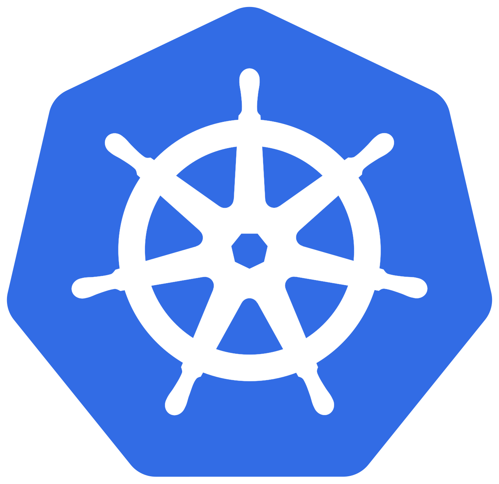
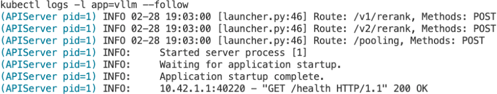
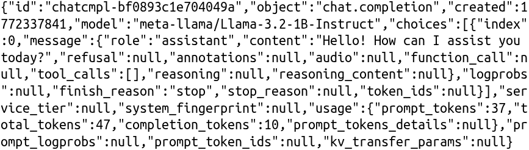

# Chapter 9: Production LLM Serving Stack {-}

*Building end-to-end production systems for reliable LLM serving*

> Everything fails all the time.
- Werner Vogels, CTO of Amazon

**Code Summary**

- `fastapi`: Python web framework for building API gateways
- `uvicorn`: ASGI server for running FastAPI applications
- `prometheus_client`: Prometheus metrics client for observability
- `opentelemetry`: OpenTelemetry for distributed tracing
- `kubernetes.client`: Kubernetes Python client for orchestration
- `httpx`: HTTP client library for service communication
- `redis`: Redis client for rate limiting and caching
- `pydantic`: Data validation library for API request/response models
- `grpc`: gRPC framework for high-performance service communication
- `docker`: Docker SDK for container management


## Anatomy of a Production LLM Serving System

In the previous chapters, we explored how to train large models at scale using distributed techniques like DDP, FSDP, DeepSpeed, and Megatron-LM. We also examined inference engines like vLLM and SGLang that optimize single-node and multi-node inference. Now it's time to put these pieces together into a complete production system.

AI model serving encompasses a broad spectrum of workloads. Traditional machine learning models—gradient boosted trees, linear models, and small neural networks—are typically served on CPUs with frameworks like TensorFlow Serving or Triton Inference Server. Computer vision models for image classification or object detection can also run efficiently on CPUs using optimized runtimes like ONNX Runtime, which has powered production CV workloads for years; GPUs are only necessary for the larger models or when throughput requirements are higher. These workloads have relatively predictable latency since input sizes are fixed. Diffusion models for image generation (Stable Diffusion, DALL-E) present unique challenges with their iterative denoising process, requiring careful batching strategies and often benefiting from techniques like classifier-free guidance caching.

LLM serving, however, has its own distinct characteristics that set it apart from these other workloads. The autoregressive nature of text generation means that output length is unpredictable—a simple "yes" or "no" question might generate 2 tokens, while a code generation request might produce 2,000. This variability makes batching and resource allocation fundamentally different from fixed-output models. The KV cache grows linearly with sequence length, creating memory pressure that doesn't exist in traditional ML serving. And the streaming nature of chat applications means users expect to see tokens as they're generated, not just a final response.

This chapter focuses specifically on LLM serving, building on the inference engines we covered in Chapters 6 and 7. The architectural patterns we discuss—routing, load balancing, observability—apply broadly to AI serving, but the specific implementations and trade-offs are tailored to the unique demands of large language models.

A production LLM serving system is more than just a model running on a GPU. It's a complex distributed system with multiple components working together to provide reliable, scalable, and cost-effective inference services. Understanding this architecture is essential before diving into specific deployment strategies.

A typical production serving stack includes the following components:

**API Gateway.** The gateway sits between clients and the backend services, handling request routing, authentication, rate limiting, and load balancing. It's the single entry point that abstracts away the complexity of multiple model runners and routing decisions.

**Model Runner.** This is the heart of the system: a stateful, GPU-backed inference engine that manages model loading, KV cache, and continuous batching. In production, you'll typically use vLLM or SGLang (covered in Chapters 6 and 7) as the model runner, but the architectural principles apply regardless of which engine you choose.

**Monitoring and Observability.** Production systems need visibility into what's happening. Rather than a standalone service, observability is typically integrated into each component through instrumentation libraries. This includes metrics collection (typically exported to Prometheus), distributed tracing (OpenTelemetry), and structured logging. Without observability, debugging production issues becomes nearly impossible.

**Tokenizer Service (optional).** A stateless, lightweight service that handles text tokenization and detokenization. Modern inference engines like vLLM handle tokenization internally, so a separate tokenizer service is less common. It can be useful for counting tokens before inference (for billing or rate limiting), validating input length, or when using custom inference backends.

{#fig:serving-architecture .block width=80% align=center}

Figure~\ref{fig:serving-architecture} shows how these components fit together. Clients send requests to the API Gateway, which routes them to the appropriate model runner based on the requested model and current load. All components report metrics and traces to the observability stack.


A simplified implementation is available in `code/basic/`. The examples use Qwen2.5-1.5B-Instruct as the default model, which runs comfortably on most GPUs with 8GB+ VRAM. For even smaller footprints, you can substitute Qwen2.5-0.5B-Instruct or TinyLlama-1.1B-Chat by modifying the model name in the code.

To try them out, first install the dependencies. We tested with the following versions in a conda environment:

```bash
conda create -n usao python=3.12
conda activate usao
pip install fastapi==0.133.1 uvicorn==0.35.0 httpx==0.28.1 \
    pydantic==2.12.5 transformers==4.57.3 vllm==0.15.1
```

Your environment may require different versions—adjust as needed for compatibility with your CUDA and PyTorch setup.

If you encounter a `401 Client Error` or `403 Forbidden` when downloading models, you need to set your Hugging Face token:

```bash
export HF_TOKEN=your_huggingface_token
```

You can get a token from [huggingface.co/settings/tokens](https://huggingface.co/settings/tokens). Some models require accepting license agreements on their model page before access is granted.

Start the model runner in one terminal (this will download and load the model):

```bash
cd code/basic
uvicorn model_runner:app --host 0.0.0.0 --port 8002
```

The model runner (`code/basic/model_runner.py`) is a FastAPI service that wraps vLLM for inference. It loads the model on startup and exposes a `/generate` endpoint. The model loading takes a minute or two on first run as it downloads weights and compiles CUDA graphs.

In another terminal, start the API gateway:

```bash
uvicorn api_gateway:app --host 0.0.0.0 --port 8000
```

The API gateway (`code/basic/api_gateway.py`) is the public-facing entry point. In this simplified example, it provides rate limiting and routes requests to the model runner. A production gateway would add authentication, load balancing across replicas, and request queuing.

You can then send requests to the gateway:

```bash
curl -X POST http://localhost:8000/generate \
  -H "Content-Type: application/json" \
  -d '{"prompt": "What is machine learning?", "max_tokens": 100}'
```

The `code/basic/` directory also includes a standalone tokenizer service (`tokenizer_service.py`) that demonstrates how to build a separate tokenization layer. While vLLM handles tokenization internally, a separate service is useful for diffusion models (which need CLIP tokenization), token counting for billing, or custom backends. The service loads two tokenizers on startup: the Qwen2.5-1.5B tokenizer for LLMs and the `openai/clip-vit-large-patch14` tokenizer for diffusion models like Stable Diffusion. To try it, start the service:

```bash
uvicorn tokenizer_service:app --host 0.0.0.0 --port 8001
```

On startup, the service loads two tokenizers: `Qwen/Qwen2.5-1.5B-Instruct` for LLMs and `openai/clip-vit-large-patch14` for diffusion models. Since tokenizers only load vocabulary files and run on CPU, no GPU is required—this service can run on any machine.

With the service running, you can tokenize text for LLMs:

```bash
curl -X POST http://localhost:8001/tokenize \
  -H "Content-Type: application/json" \
  -d '{"model": "qwen2.5-1.5b", "text": "Hello world"}'
```

For diffusion models like Stable Diffusion, the text prompt needs CLIP tokenization before the text encoder can process it. The same service handles this with a different model name:

```bash
curl -X POST http://localhost:8001/tokenize \
  -H "Content-Type: application/json" \
  -d '{"model": "stable-diffusion", "text": "a photo of a cat"}'
```

If you only need the token count—say, for billing or enforcing input length limits—the `/count` endpoint returns just the number without the full token list:

```bash
curl -X POST http://localhost:8001/count \
  -H "Content-Type: application/json" \
  -d '{"model": "qwen2.5-1.5b", "text": "How many tokens is this?"}'
```

The monitoring layer is not included in this basic example—we'll cover observability patterns in Section~\ref{sec:k8s-deployment}.

## Request Routing and Traffic Management

In production systems, you often need to serve multiple models simultaneously, route requests intelligently, and balance load across instances. Beyond basic routing, you also need strategies for safely rolling out new model versions and running experiments. This section covers the complete traffic management picture: routing, load balancing, canary deployments, and A/B testing.

### Routing Strategies

There are three common approaches to routing requests in multi-model deployments:

**Feature-based routing** examines the request content to determine which model is best suited. For example, code-related prompts might route to Code Llama, while general chat goes to a conversational model. This approach works well when different models have distinct strengths, but requires careful keyword matching or classification logic.

**A/B traffic splits** use consistent hashing to assign users to model variants. The key insight is using the user ID (or session ID) as the hash input, ensuring the same user always gets the same model. This consistency is crucial for meaningful A/B comparisons—if users bounced between models randomly, you couldn't attribute performance differences to the model itself.

**Dynamic model selection** considers runtime factors like current load, latency budgets, and cost constraints. A cost-sensitive request might route to a smaller, cheaper model, while a latency-critical request goes to the fastest available option. This approach requires tracking model performance metrics in real-time.

The implementation of all three strategies is available in `code/basic/routing.py`. The `FeatureBasedRouter`, `ABRouter`, and `DynamicRouter` classes demonstrate these patterns.

### Load Balancing

Once you've decided which model handles a request, you need to choose which instance of that model receives it. The three standard approaches are:

**Round-robin** distributes requests evenly across instances by cycling through them in order. It's simple and works well when instances have similar capacity and requests have similar cost.

**Least connections** routes to the instance with the fewest active requests. This naturally handles varying request durations—slow requests don't cause one instance to fall behind while others sit idle.

**Weighted balancing** assigns different capacities to instances, useful when you have heterogeneous hardware (e.g., some instances on A100s, others on H100s).

All three balancers, plus a health checker that integrates with them, are implemented in `code/basic/load_balancer.py` and `code/basic/health_check.py`.

### Canary Deployments and A/B Testing

Beyond routing to existing models, you need strategies for safely introducing new model versions. Canary deployments allow you to gradually roll out new models while monitoring for issues. A/B testing enables comparing model performance in production. Both techniques are essential for safe, data-driven model updates.

**Canary Deployment.** The idea behind canary deployment is simple: instead of switching all traffic to a new model at once, you start by sending a small percentage (say, 10%) to the new "canary" model while the rest continues to the stable version. You monitor both versions, comparing error rates and latency. If the canary performs well, you gradually increase its traffic share. If it performs poorly, you roll back immediately with minimal user impact. The key metrics to track are error rate and latency—a reasonable promotion policy might allow the canary to have up to 10% higher error rate and 20% higher latency than the stable version, with rollback triggered if the canary's error rate exceeds twice the stable version's rate.

**Traffic Shifting.** This is the mechanism for gradually moving users from stable to canary. A typical progression might be: 10% → 25% → 50% → 75% → 100%. At each step, you wait for enough requests to accumulate (statistical significance) before deciding whether to proceed or roll back.

**A/B Testing.** A/B testing differs from canary deployment in its goal: canaries are about safe rollouts, while A/B tests are about comparing alternatives to make data-driven decisions. An A/B test might compare two different models, two different prompt templates, or two different inference configurations. The critical requirement is consistent assignment—the same user must always see the same variant, achieved through consistent hashing of the user ID.

A sample implementation of canary deployment, traffic shifting, and A/B testing is available in `code/basic/canary.py`. Here's how to use these classes in practice:

```python
from canary import CanaryDeployment, TrafficShifter, ABTestFramework, ABTestConfig

# Example 1: Canary deployment for a new model version
canary = CanaryDeployment(
    stable_model="llama-2-7b-v1",
    canary_model="llama-2-7b-v2",
    traffic_percent=0.1  # Start with 10% to canary
)

# Route a request
model = canary.route({"prompt": "Hello"})  # Returns stable or canary model
# After getting response, record metrics
canary.record_metrics(model, latency=0.15, error=False)

# Check if canary should be promoted or rolled back
if canary.should_promote():
    print("Canary performing well, increase traffic")
elif canary.should_rollback():
    print("Canary failing, rolling back")

# Example 2: Gradual traffic shifting
shifter = TrafficShifter("model-v1", "model-v2")
shifter.increase_traffic()  # 0% -> 10%
shifter.increase_traffic()  # 10% -> 25%
# ... continue based on metrics

# Example 3: A/B testing two models
ab = ABTestFramework()
ab.register_test(ABTestConfig(
    test_name="model_comparison",
    variants={"llama-7b": 0.5, "mistral-7b": 0.5},
    metrics=["latency", "quality_score"]
))

# Assign user to variant (consistent across requests)
variant = ab.assign_variant("model_comparison", user_id="user123")
# Record metrics after serving
ab.record_metric("model_comparison", variant, "latency", 0.12)
# Get aggregated results
results = ab.get_results("model_comparison")
```

These patterns integrate with the API gateway—in production, you'd wire the routing logic into your request handling pipeline.

## Operations: Observability, Reliability, and Cost

Beyond traffic management, production systems require operational capabilities: monitoring system health, handling failures gracefully, and optimizing costs. These cross-cutting concerns apply to every component in the serving stack.

### Observability

In a distributed LLM serving system, a single request might touch the API gateway, tokenizer service, and model runner—without proper observability, debugging issues becomes nearly impossible. Production LLM serving requires three types of observability:

**Distributed tracing** with OpenTelemetry tracks requests as they flow through multiple services. Each service creates "spans" that record timing and metadata, linked together by a trace ID that propagates through HTTP headers. When a request is slow, you can see exactly which service contributed the latency.

**Metrics collection** with Prometheus tracks aggregate statistics: request counts, latency histograms, error rates, and resource utilization. Unlike traces (which are sampled), metrics capture every request, making them essential for alerting and SLO monitoring. Key metrics for LLM serving include requests per second by model, latency percentiles (p50, p95, p99), active request count, and GPU utilization.

**Structured logging** captures detailed information about individual requests in a machine-parseable format (typically JSON). Unlike traditional logs, structured logs can be queried and aggregated—for example, finding all requests for a specific user that took longer than 5 seconds.

A sample implementation of all three is available in `code/basic/observability.py`.

### Reliability and Fault Tolerance

**Cold start mitigation.** LLM inference has significant cold start latency—loading a model and warming up the GPU can take 30-60 seconds. Two strategies help: warmup on startup (sending dummy requests through the model immediately after loading) and keep-alive requests (periodic dummy requests to prevent the model from going cold during idle periods).

**Autoscaling.** Request-based autoscaling adjusts replica count based on traffic. Key parameters include target RPS, scale-up threshold (typically 120% of target), scale-down threshold (typically 50% of target), and cooldown period. For LLM serving, be conservative with scale-down—spinning up a new GPU instance takes minutes, so it's better to have slightly excess capacity than to be caught short.

**Backpressure.** When traffic exceeds capacity, a bounded request queue provides backpressure—when the queue is full, new requests are rejected immediately with a 503 error rather than timing out after a long wait. This gives clients a clear signal to retry later or route to a different backend.

### Cost Optimization

GPU instances are expensive, so cost optimization matters. **Spot instances** (or preemptible VMs) cost 60-90% less than on-demand but can be terminated with short notice—a typical strategy uses 50% spot instances for baseline capacity, with on-demand instances absorbing traffic when spot instances are preempted. **Model selection** routes cost-sensitive requests to smaller, cheaper models; a 7B model might cost half as much per token as a 13B model, and for many use cases the quality difference doesn't justify the cost.

A sample implementation of warmup, autoscaling, request queuing, and cost-optimized routing is available in `code/basic/fault_tolerance.py`.

## Deploying LLM Serving on Kubernetes {#sec:k8s-deployment}

{.wrap align=top-right width=20%}

The concepts we've covered so far—routing, load balancing, canary deployments, observability, and fault tolerance—are platform-agnostic patterns. You could implement them on bare metal servers, with Docker Compose, or on any cloud platform. However, Kubernetes (K8s) has emerged as the dominant platform for production LLM serving.

Kubernetes^[Kubernetes official site: \url{https://kubernetes.io/}] is an open-source container orchestration system originally developed by Google and now maintained by the Cloud Native Computing Foundation (CNCF). At its core, Kubernetes manages containerized workloads across a cluster of machines, handling scheduling, scaling, networking, and storage. You describe your desired state in YAML manifests—how many replicas of a service you want, how much CPU and memory each needs, how they should be exposed to the network—and Kubernetes continuously works to make the actual state match your desired state. This declarative model, combined with self-healing capabilities (automatically restarting failed containers, rescheduling workloads when nodes die), makes Kubernetes well-suited for production systems that need high availability.

For LLM serving specifically, Kubernetes provides native primitives for many of the patterns we've discussed:

| Concept | Kubernetes Primitive | In Practice |
|---------------|----------------------|---------------------------|
| Load Balancing | Services, Ingress | Model-aware routing via gateway |
| Autoscaling | HPA^[Horizontal Pod Autoscaler: \url{https://kubernetes.io/docs/tasks/run-application/horizontal-pod-autoscale/}], KEDA^[Kubernetes Event-driven Autoscaling: \url{https://keda.sh/}] | Scale on requests-per-second or queue depth |
| Health Checks | Liveness/Readiness Probes | `/health`, `/ready` endpoints |
| Canary Deployments | Ingress traffic splitting | Weighted routing between model versions |
| Observability | Prometheus, OpenTelemetry | Latency, throughput, GPU metrics |
| Fault Tolerance | Pod restart, PDB^[PodDisruptionBudget: \url{https://kubernetes.io/docs/tasks/run-application/configure-pdb/}] | Graceful shutdown with request draining |
| GPU Scheduling | Device plugin, requests/limits | `nvidia.com/gpu: 1` in pod spec |

{#fig:k8s-architecture .block width=90% align=center}

Figure~\ref{fig:k8s-architecture} illustrates how these primitives fit together in a typical setup. External traffic enters through an Ingress, which routes to a Service that load-balances across Deployments. Each Deployment manages multiple Pods running vLLM, with the Horizontal Pod Autoscaler (HPA) scaling replicas based on demand. The two Deployments (model-v1 and model-v2) enable canary deployments with weighted traffic splitting (90%/10%). At the bottom, GPU nodes schedule workloads using the NVIDIA device plugin.

Rather than implementing these patterns from scratch, Kubernetes lets you declare your desired state and handles the implementation details. This declarative approach—combined with a rich ecosystem of operators and tools—is why production LLM serving stacks like vLLM Production Stack and llm-d are built on Kubernetes.

We'll explore Kubernetes-based LLM serving in two steps. First, we'll set up a local development environment using k3d^[k3d - to run k3s (Rancher Lab’s minimal Kubernetes distribution) in docker: \url{https://k3d.io/}], a lightweight Kubernetes distribution that runs entirely in Docker. This gives us a safe playground to experiment with configurations before deploying to production. Then, we'll deploy llm-d^[llm-d - Production LLM Serving on Kubernetes: \url{https://llm-d.ai/}], a production-ready serving stack that implements all the patterns we've discussed—__routing, autoscaling, observability, and fault tolerance__—as Kubernetes-native resources.

### Local Development with k3d

k3d wraps k3s^[k3s - Lightweight Kubernetes: \url{https://k3s.io/}] (a lightweight Kubernetes distribution) inside Docker containers, giving you a fully functional Kubernetes cluster in minutes. It's lightweight (no VMs needed), supports GPU passthrough, and produces manifests that work unchanged on production clusters. This makes it ideal for developing and testing LLM serving configurations before deploying to production.

The complete k3d setup scripts are available in `code/k3d/`. The setup involves three main steps: installing prerequisites, building a custom GPU-enabled k3s image, and creating the cluster.

```bash
cd code/k3d
# Step 1: Install prerequisites (NVIDIA Container Toolkit, k3d)
./install-prerequisites.sh
# Step 2: Build custom k3s-cuda image
./build.sh
# Step 3: Create cluster with GPU support
./create-cluster.sh
```

The `install-prerequisites.sh` script checks for NVIDIA drivers, installs the NVIDIA Container Toolkit, and installs k3d. The `build.sh` script creates a custom k3s image with CUDA and NVIDIA runtime support—necessary because the default k3s image doesn't include GPU support.

The custom image combines k3s with CUDA and the NVIDIA Container Toolkit. The key files are `code/k3d/Dockerfile` and `code/k3d/device-plugin-daemonset.yaml`. The Dockerfile uses a multi-stage build to copy k3s binaries into an NVIDIA CUDA base image, then installs the container toolkit and configures containerd to use the NVIDIA runtime. The device plugin manifest is automatically deployed when the cluster starts, making GPUs visible to Kubernetes as `nvidia.com/gpu` resources.

The `build.sh` script auto-detects your local CUDA version and fetches the latest k3s release, so in most cases you can simply run it without arguments. If you need a specific version, override with environment variables:

```bash
# Use specific versions (check hub.docker.com/r/rancher/k3s and hub.docker.com/r/nvidia/cuda)
K3S_TAG=v1.32.0-k3s1 CUDA_TAG=13.0.0-base-ubuntu24.04 ./build.sh
```

The CUDA version must be compatible with your NVIDIA driver. Run `nvidia-smi` to see the maximum CUDA version your driver supports—you can use any version up to that number.

Figure~\ref{fig:k3d-architecture} shows the architecture of the resulting k3d GPU cluster. The host machine runs Docker Engine, which contains the k3d network with two nodes: a control plane (server-0) running Kubernetes control plane services, and a worker node (agent-0) running application workloads like vLLM pods. Both nodes use the custom k3s-cuda image and have GPU passthrough via `--gpus=all`. The NVIDIA device plugin runs as a DaemonSet, exposing physical GPUs to Kubernetes as `nvidia.com/gpu` resources.

{#fig:k3d-architecture .block width=90% align=center}

After running the three setup scripts, verify the cluster is working:

```bash
kubectl get nodes
# NAME                         STATUS   ROLES           AGE   VERSION
# k3d-mycluster-gpu-server-0   Ready    control-plane   41s   v1.35.1+k3s1
# k3d-mycluster-gpu-agent-0    Ready    <none>          37s   v1.35.1+k3s1
```

Then verify that GPUs are accessible to the cluster:

```bash
kubectl describe nodes | grep nvidia.com/gpu
```

{#fig:k-desc-node .wrap align=top-right}

Figure~\ref{fig:k-desc-node} shows a sample output from an 8-GPU A100 node (complete output available at `code/k3d/kubectl_describe_node.txt`). In the output, `Capacity` indicates total GPUs detected, `Allocatable` shows how many are available for pod scheduling, and `Allocated` displays current usage as requests/limits (zeros indicate no pods are using GPUs yet). Since k3d passes all host GPUs to each container, every node reports the same GPU count—this is expected behavior for local development. 


For cluster customization options such as mounting model directories or selecting specific GPUs, refer to `code/k3d/README.md`.

### Deploying vLLM on k3d

With the GPU cluster running, we can now deploy vLLM to serve LLM inference. The `code/k3d/vllm/` directory contains ready-to-use Kubernetes manifests for several models, so you don't need to write YAML from scratch.

Many popular models on Hugging Face are "gated," meaning you need to accept their license terms and authenticate to download them. Llama models fall into this category. If you're deploying a gated model, first create a Kubernetes secret using the `HF_TOKEN` environment variable we set earlier:

```bash
kubectl create secret generic hf-token-secret --from-literal=token="$HF_TOKEN"
```

Now you can deploy a model. In production, model selection depends on both your available GPU memory and business requirements such as latency, throughput, and output quality. For this demonstration, we use smaller models. Phi-tiny-MoE is a lightweight option that works well for testing on smaller GPUs, while Llama-3.2-1B offers better quality but requires approximately 8GB of GPU memory:

```bash
cd code/k3d/vllm
kubectl apply -f llama-3.2-1b.yaml
# or ./deploy-phi-tiny-moe.sh for smaller GPUs
```

The deployment manifests handle the details you'd otherwise need to configure manually: GPU resource requests so Kubernetes schedules the pod on a node with available GPUs, health probes with appropriate timeouts for model loading, volume mounts for caching downloaded weights, and Kubernetes services for network access. Watch the deployment progress with:

```bash
kubectl get pods -l app=vllm -w
# NAME                       READY   STATUS              RESTARTS   AGE
# vllm-llama-32-1b-pod-xxx   0/1     ContainerCreating   0          2m40s
```

The pod will initially show `ContainerCreating` while Kubernetes pulls the vLLM container image. This can take several minutes depending on your network speed. Once the status changes to `Running`, you can view the logs:

```bash
kubectl logs -l app=vllm --follow
```

{#fig:k-logs-follow .wrap width=70% align=right-top}

Figure~\ref{fig:k-logs-follow} shows typical log output during model startup. The logs display download progress if the model needs to be fetched from Hugging Face, followed by the model being loaded into GPU memory. Model loading typically takes 2-5 minutes depending on model size and whether the weights are already cached locally. Once the logs indicate "Application startup complete.", the server is ready to accept requests.

To test the API, forward the service port to your local machine and send a request:

```bash
kubectl port-forward svc/vllm-llama-32-1b-service 8000:8000 &

curl http://localhost:8000/v1/chat/completions \
  -H "Content-Type: application/json" \
  -d '{
    "model": "meta-llama/Llama-3.2-1B-Instruct",
    "messages": [{"role": "user", "content": "Hello!"}],
    "max_tokens": 50
  }'
```

{#fig:k-vllm-output .wrap width=65% align=right-top}

Figure~\ref{fig:k-vllm-output} shows a successful response from the vLLM server running in Kubernetes. The JSON response follows the OpenAI chat completions format, including the model name, generated content, and token usage statistics.

Looking at the deployment manifests (`code/k3d/vllm/llama-3.2-1b.yaml` and `code/k3d/vllm/phi-tiny-moe.yaml`), you'll notice several configuration patterns worth understanding. The `--gpu-memory-utilization 0.2` flag tells vLLM to reserve only 20% of GPU memory, which is conservative but useful when running multiple models on shared GPUs. For single-model deployments where you want maximum throughput, increase this to 0.8 or 0.9.

The health probes deserve special attention. Kubernetes uses liveness and readiness probes to determine if a pod is healthy, but LLM models take significant time to load into GPU memory—often several minutes for larger models. The manifests set `initialDelaySeconds` to 120-180 seconds to give the model time to load. Without this delay, Kubernetes would see the health check fail and restart the pod in an endless loop.

The volume mount at `/models` persists downloaded model weights across pod restarts. This is important because downloading a 7B parameter model from Hugging Face takes considerable time and bandwidth. Once cached, subsequent pod restarts load the model directly from disk.

Finally, the `/dev/shm` mount provides shared memory for tensor parallel inference. When vLLM shards a model across multiple processes or GPUs, it uses shared memory for efficient inter-process communication. Without sufficient shared memory, tensor parallel inference will fail.

For larger models that don't fit on a single GPU, you can shard the model by setting `--tensor-parallel-size` to the number of GPUs and updating the resource limits accordingly. The `code/k3d/README.md` file provides detailed guidance on multi-GPU configurations and troubleshooting common issues.

### Cleanup

When you're done experimenting, clean up the cluster to free resources:

```bash
k3d cluster delete mycluster-gpu
docker rmi k3s-cuda:<your-tag>  # optional, removes the custom image
```


### Multi-Model and Multi-Engine Serving

With a single vLLM deployment running successfully, we can now explore more sophisticated serving patterns. Production deployments rarely serve just one model---you might have different models for different tasks (a small model for simple queries, a larger one for complex reasoning), or you might want to A/B test different models or inference engines.

The `code/k3d/` directory provides two management scripts that automate these deployment patterns:

- `manage-cluster-multi-models.sh`: Deploys multiple models (Llama-3.2-1B + Phi-tiny-MoE) using a single engine (vLLM)
- `manage-cluster-multi-engines.sh`: Deploys the same model (Llama-3.2-1B) on multiple engines (vLLM + SGLang)

#### Multi-Model Routing

The key insight is that an API gateway can route requests based on the `model` field in the OpenAI-compatible request body. When a client sends a request specifying `"model": "meta-llama/Llama-3.2-1B-Instruct"`, the gateway looks up which Kubernetes service hosts that model and forwards the request accordingly. This creates a unified endpoint where clients don't need to know which backend server handles which model.

{#fig:multi-model-routing width=80%}

Figure~\ref{fig:multi-model-routing} illustrates this architecture. The easiest way to deploy it is using the management script:

```bash
cd code/k3d
./manage-cluster-multi-models.sh start
```

This script creates a `multi-models` namespace, deploys both vLLM models (Llama-3.2-1B and Phi-tiny-MoE), and sets up the API gateway. You can also deploy manually step by step:

```bash
# Create namespace
kubectl create namespace multi-models

# Deploy models
kubectl apply -f vllm/llama-3.2-1b.yaml -n multi-models
kubectl apply -f vllm/phi-tiny-moe.yaml -n multi-models

# Deploy API gateway
cd gateway && ./deploy-gateway.sh
```

The routing configuration (`gateway/routing-config.yaml`) maps model names to Kubernetes services:

```yaml
routing:
  - model: "meta-llama/Llama-3.2-1B-Instruct"
    service_name: "vllm-llama-32-1b-service.multi-models.svc.cluster.local"
  - model: "Phi-tiny-MoE-instruct"
    service_name: "vllm-phi-tiny-moe-service.multi-models.svc.cluster.local"
```

Test the gateway by sending requests with different model names:

```bash
kubectl port-forward svc/vllm-api-gateway 8080:8000 &

# Request routed to Llama
curl http://localhost:8080/v1/chat/completions \
  -H "Content-Type: application/json" \
  -d '{"model": "meta-llama/Llama-3.2-1B-Instruct", 
       "messages": [{"role": "user", "content": "Hello!"}]}'

# Request routed to Phi
curl http://localhost:8080/v1/chat/completions \
  -H "Content-Type: application/json" \
  -d '{"model": "Phi-tiny-MoE-instruct", 
       "messages": [{"role": "user", "content": "Hello!"}]}'
```

#### Multi-Engine Routing

Taking this further, we can deploy the same model on different inference engines (vLLM and SGLang) and route based on an `inference_server` field. This is useful for benchmarking engines or gradually migrating between them.

{#fig:multi-engine-routing width=80%}

As shown in Figure~\ref{fig:multi-engine-routing}, the gateway parses both `model` and `inference_server` fields to determine routing. Use the multi-engine management script:

```bash
cd code/k3d
./manage-cluster-multi-engines.sh start
```

This creates a `multi-engines` namespace and deploys Llama-3.2-1B on both vLLM and SGLang. The routing configuration includes engine-specific routes:

```yaml
routing:
  - model: "meta-llama/Llama-3.2-1B-Instruct"
    inference_server: "vllm"
    service_name: "vllm-llama-32-1b-service.multi-engines.svc.cluster.local"
  - model: "meta-llama/Llama-3.2-1B-Instruct"
    inference_server: "sglang"
    service_name: "sglang-llama-32-1b-service.multi-engines.svc.cluster.local"
  - model: "meta-llama/Llama-3.2-1B-Instruct"
    inference_server: null  # Default to vLLM
    service_name: "vllm-llama-32-1b-service.multi-engines.svc.cluster.local"
```

Now clients can explicitly select their preferred engine:

```bash
# Route to vLLM (default)
curl http://localhost:8080/v1/chat/completions \
  -H "Content-Type: application/json" \
  -d '{"model": "meta-llama/Llama-3.2-1B-Instruct",
       "messages": [{"role": "user", "content": "Hello!"}]}'

# Route to SGLang explicitly
curl http://localhost:8080/v1/chat/completions \
  -H "Content-Type: application/json" \
  -d '{"model": "meta-llama/Llama-3.2-1B-Instruct",
       "inference_server": "sglang",
       "messages": [{"role": "user", "content": "Hello!"}]}'
```

The gateway also aggregates the `/v1/models` endpoint, returning a combined list of all available models across all backends. For production deployments, you'll want to add authentication (API keys or OAuth tokens), rate limiting (per-client request quotas), and observability (request logging, latency metrics, error tracking). The `code/k3d/gateway/api-gateway.py` includes example middleware for these concerns.


## Kubernetes Deployment with llm-d

In the previous section, we built a local k3d cluster to experiment with vLLM deployments. While this approach offers flexibility and deep understanding of the underlying components, production deployments at scale often benefit from standardized solutions that handle the operational complexity of distributed inference.

Several Kubernetes-native frameworks exist for LLM serving. **KServe**[^kserve] provides enterprise-grade model serving with traffic governance (canary releases, A/B testing) and multi-model hosting, but requires Istio or Knative as dependencies. **KubeAI**[^kubeai] offers a lightweight operator with scale-from-zero and prefix-aware load balancing, requiring no external dependencies---ideal for simpler deployments. **vLLM production-stack**[^vllm-stack] is the official vLLM deployment solution with LMCache integration for KV cache sharing across instances.

This chapter focuses on **llm-d**[^llmd] because it provides a "batteries-included" deployment framework that assembles well-tested components (vLLM, Envoy, NIXL) into a cohesive system, offers production-ready Helm charts with minimal configuration, and supports advanced features like disaggregated prefill/decode and high-speed data transfer over InfiniBand RDMA. The choice between these frameworks depends on your specific requirements: KServe for enterprise traffic governance, KubeAI for lightweight zero-dependency deployments, vLLM production-stack for official vLLM support with KV cache sharing, and llm-d for deployments that need disaggregated inference or high-speed interconnects. A detailed comparison between the manual k3d approach and llm-d is provided in Table @tbl:k3d-llmd-comparison.

[^kserve]: KServe: \url{https://kserve.github.io/website/}
[^kubeai]: KubeAI: \url{https://www.kubeai.org/}
[^vllm-stack]: vLLM production-stack: \url{https://docs.vllm.ai/en/stable/deployment/integrations/production-stack.html}
[^llmd]: llm-d project: \url{https://github.com/llm-d/llm-d}

### What is llm-d?

Think of llm-d as a "batteries-included" deployment framework that assembles best-in-class open-source components into a cohesive system. At its core, llm-d uses vLLM[^vllm-llmd] as the model server---the same engine we deployed manually in the k3d section. But llm-d adds several layers of intelligence on top: the Inference Gateway (IGW)[^igw] acts as a smart request scheduler, Envoy Proxy[^envoy] handles load balancing and routing, and NIXL[^nixl] enables high-speed data transfer over fast interconnects like InfiniBand RDMA or TPU ICI. Kubernetes orchestrates all these components, ensuring they scale and recover gracefully.

[^vllm-llmd]: vLLM inference engine: \url{https://github.com/vllm-project/vllm}
[^igw]: Inference Gateway (IGW): \url{https://github.com/kubernetes-sigs/gateway-api-inference-extension}
[^envoy]: Envoy Proxy: \url{https://www.envoyproxy.io/}
[^nixl]: NIXL (NVIDIA Inference Xfer Library): \url{https://github.com/ai-dynamo/nixl}

### Key Features

**Intelligent Inference Scheduling.** One of llm-d's most valuable capabilities is its intelligent request routing. Traditional load balancers distribute requests round-robin or based on simple metrics like connection count. But LLM inference has unique characteristics: a request with a 10,000-token prompt behaves very differently from one with 100 tokens. llm-d's IGW understands this. It can predict request latency and route accordingly, ensuring that long requests don't block short ones. It also implements prefix-cache aware routing---if one vLLM instance already has the KV cache for a particular system prompt, subsequent requests with the same prefix get routed there, dramatically reducing time-to-first-token. For enterprise deployments, SLA-aware scheduling ensures premium customers get priority access to compute resources, while load-aware balancing distributes work based on each instance's current capacity rather than just counting connections.

**Prefill/Decode Disaggregation.** Perhaps the most innovative feature of llm-d is its support for disaggregated inference. In traditional LLM serving, a single GPU handles both the prefill phase (processing the input prompt) and the decode phase (generating output tokens one by one). These phases have very different computational profiles: prefill is compute-bound and parallelizable, while decode is memory-bandwidth-bound and sequential. By separating them onto different server pools, llm-d can optimize each independently. Prefill servers can use larger batch sizes and higher GPU utilization, while decode servers can be tuned for low latency. The challenge is transferring the KV cache between them---this is where NIXL shines, using RDMA to move gigabytes of cache data in milliseconds. A sidecar container coordinates these transfers, ensuring decode servers receive the KV cache exactly when they need it.

**Disaggregated Prefix Caching.** Building on vLLM's KVConnector abstraction, llm-d implements a sophisticated caching hierarchy. Independent caching (sometimes called N/S for North/South) offloads KV cache to local memory and NVMe storage, allowing a single instance to serve more concurrent requests than its GPU memory would normally allow. Shared caching (E/W for East/West) enables KV cache transfer between instances, so if one server has computed the cache for a common system prompt, others can retrieve it rather than recomputing. For the most demanding deployments, global indexing provides a cluster-wide view of cached prefixes, enabling optimal routing decisions at the cost of additional coordination overhead.

**Variant Autoscaling.** Traditional Kubernetes autoscaling (HPA) scales based on CPU or memory utilization, but LLM workloads need smarter scaling. llm-d's variant autoscaler measures the actual capacity of each model server instance---how many tokens per second it can generate given current memory pressure. It then analyzes recent traffic patterns: the mix of request sizes, quality-of-service requirements, and arrival rates. Based on this analysis, it calculates the optimal mix of prefill servers, decode servers, and instances reserved for latency-tolerant batch requests. This enables true SLO-level efficiency, scaling up before latency degrades rather than after.

__Hardware Support:__ One of llm-d's strengths is its broad hardware compatibility. The project directly tests and validates deployments on NVIDIA GPUs (A100, L4, and newer), AMD GPUs (MI250 and newer), Google TPUs (v5e and newer), and Intel Data Center GPU Max series (Ponte Vecchio). This multi-vendor support is increasingly important as organizations seek to avoid lock-in and optimize costs across different cloud providers.

### Deployment Architecture

{#fig:llmd-architecture width=80%}

Figure \ref{fig:llmd-architecture} illustrates the llm-d deployment architecture. Requests enter through an Envoy Proxy, which forwards them to the Inference Gateway (IGW). The IGW acts as an intelligent scheduler, routing requests to the appropriate model servers based on current load and request characteristics. In disaggregated inference mode, prefill servers handle prompt processing while decode servers generate tokens, with both sharing KV cache state through high-speed storage (NIXL over NVMe).


### Getting Started with llm-d

Deploying llm-d requires a production-grade Kubernetes cluster running version 1.29 or later. Unlike our local k3d experiments, llm-d is designed for environments with serious hardware: you'll need accelerators capable of running large models (think A100s or newer for 70B+ parameter models), and ideally fast interconnects like NVLink within nodes and InfiniBand or RoCE RDMA between nodes. For Google Cloud deployments, TPU ICI and DCN provide similar high-bandwidth connectivity.

The installation process leverages Helm, Kubernetes' package manager. After adding the llm-d repository, a single `helm install` command deploys the entire stack---vLLM model servers, the Inference Gateway, Envoy proxy, and all the supporting infrastructure. The beauty of Helm is that complex configurations become simple key-value pairs: enabling the inference gateway, specifying which model to serve, setting tensor parallelism for multi-GPU inference.

Configuration happens through a `values.yaml` file that reads almost like a specification document. You declare what you want---two IGW replicas with cache-aware routing, vLLM serving Llama 3.1 70B across four GPUs at 90% memory utilization, separate prefill and decode server pools with their own replica counts and GPU allocations---and Helm translates this into the dozens of Kubernetes resources needed to make it happen. The autoscaling section is particularly elegant: rather than scaling on CPU utilization (which means little for GPU workloads), you specify target queries per second, and llm-d's variant autoscaler handles the rest.

The accompanying code directory (`code/llmd/`) contains complete, tested deployment configurations. The `llm-d-multi-engine/` subdirectory demonstrates deploying the same model (Qwen2.5-0.5B-Instruct) with both vLLM and SGLang backends, showcasing llm-d's engine-agnostic routing. The `llm-d-multi-model/` subdirectory shows multi-model deployments with different Llama variants. Each directory includes deployment scripts, Helm values files, and troubleshooting guides---everything you need to replicate these setups in your own environment.

### Well-Lit Paths

The llm-d project uses the term "well-lit paths" to describe deployment patterns that have been thoroughly tested and benchmarked. Rather than leaving users to figure out optimal configurations through trial and error, these paths represent battle-tested recipes for common scenarios.

**Intelligent Inference Scheduling** is the starting point for most deployments. By placing vLLM behind the Inference Gateway, you immediately gain access to smarter load balancing than round-robin. The IGW predicts request latency based on prompt length and routes accordingly, preventing long requests from blocking short ones. It also tracks which vLLM instances have which prefixes cached, routing repeat requests to instances that can serve them faster. For teams just beginning their production LLM journey, this path offers the best balance of simplicity and performance improvement.

**Prefill/Decode Disaggregation** becomes valuable when serving large models with long prompts. Consider a 70B parameter model processing a 10,000-token document: the prefill phase (computing attention over all input tokens) is compute-intensive and parallelizable, while the decode phase (generating output tokens one by one) is memory-bandwidth-bound and sequential. By separating these onto different server pools, each can be optimized independently. Prefill servers can batch aggressively for throughput; decode servers can be tuned for minimal latency. The result is reduced time-to-first-token (TTFT) and more predictable time-per-output-token (TPOT). The catch is that KV cache must be transferred between servers, which requires fast interconnects---this path shines with InfiniBand or NVLink, but may not be worth the complexity on slower networks.

**Wide Expert-Parallelism** targets Mixture-of-Experts (MoE) models like Mixtral or DeepSeek. These models activate only a subset of parameters for each token, making them efficient at inference time but challenging to deploy. Expert parallelism distributes different experts across different GPUs, while data parallelism handles multiple requests simultaneously. llm-d coordinates this complex dance, routing tokens to the right experts while maximizing accelerator utilization. For organizations deploying MoE models at scale, this path can dramatically reduce latency and increase throughput.

### Monitoring and Observability

Production LLM serving demands visibility into system behavior. llm-d integrates with standard Kubernetes monitoring stacks---Prometheus for metrics collection, Grafana for visualization. Beyond generic metrics like CPU and memory, llm-d exposes LLM-specific telemetry: request latency distributions, tokens-per-second throughput, GPU utilization across the fleet, and crucially, KV cache hit rates. This last metric is particularly telling: high hit rates indicate that the prefix-aware routing is working effectively, while low hit rates suggest you might need cache warming strategies or routing policy adjustments.

### Choosing Your Path

For teams new to production LLM serving, the intelligent inference scheduling path offers the gentlest learning curve with immediate benefits. You can deploy it with minimal configuration changes from a basic vLLM setup, yet gain meaningful latency and throughput improvements from smarter routing.

As your deployment matures and you encounter specific bottlenecks, the other paths become relevant. If users complain about slow time-to-first-token on long documents, prefill/decode disaggregation can help---but only if you have the network bandwidth to transfer KV cache efficiently. If you're deploying MoE models and seeing suboptimal GPU utilization, expert parallelism may be the answer.

The key is to monitor your metrics and let them guide your evolution. Watch KV cache hit rates to assess routing effectiveness. Track TTFT and TPOT separately to understand where latency comes from. Monitor GPU utilization to identify underutilized capacity. And tune autoscaling parameters based on actual traffic patterns rather than theoretical estimates---set minimum replicas high enough to handle baseline load without cold starts, maximum replicas to accommodate peaks, and target QPS based on observed capacity per instance.

### Multi-Model Serving with llm-d

Figure \ref{fig:llmd-multi-model} illustrates how llm-d handles multi-model deployments. The architecture mirrors what we built manually with k3d, but with production-grade components: the Inference Gateway replaces our custom API gateway, InferencePool handles model-aware routing, and ModelService instances wrap vLLM pods with intelligent load balancing and prefix-cache awareness.

The `code/llmd/llm-d-multi-model/` directory contains complete deployment configurations for this pattern. Each model gets its own ModelService with a Helm values file specifying the model artifact location, GPU requirements, and replica count. The InferencePool automatically discovers these ModelService instances and routes requests based on the `model` field---no manual service mapping required. When a client requests `meta-llama/Llama-3.2-1B-Instruct`, the gateway knows exactly which backend to forward to.

What makes llm-d's approach superior for production is the intelligence built into every layer. The Inference Gateway doesn't just round-robin requests; it predicts latency based on prompt length and routes accordingly. It tracks which vLLM instances have which prefixes cached, sending repeat requests to instances that can serve them faster. The result is lower latency and higher throughput than a manually configured setup, with less operational overhead.

One limitation worth noting: llm-d follows a "vLLM-first" design philosophy. The Inference Gateway's intelligent features---prefix-cache aware routing, NIXL-based KV cache transfer, and the inference scheduler---are tightly integrated with vLLM's internals. SGLang support is under active development (tracked in GitHub issue #403), but as of this writing, llm-d's native routing doesn't support engine selection.

However, you can work around this limitation by layering a custom API gateway on top of llm-d's infrastructure. The `code/llmd/llm-d-multi-engine/` directory demonstrates this approach: both vLLM and SGLang are deployed as separate ModelService instances within llm-d's Kubernetes setup, and a custom gateway routes requests based on both the `model` field and an `owned_by` field specifying the engine. This hybrid approach gives you the best of both worlds---llm-d's production-grade Kubernetes orchestration and monitoring, combined with the flexibility to compare or migrate between inference engines. The tradeoff is that you lose llm-d's intelligent routing features (prefix-cache awareness, load prediction) for the SGLang backend, since those require deep vLLM integration.

{#fig:llmd-multi-model width=80%}

### Comparing k3d and llm-d Approaches

::: {width=85%}

| Feature | k3d (Manual) | llm-d (Production) |
|---------|--------------|---------------------|
| **Setup** | Manual YAML files | Helm charts (automated) |
| **Routing** | Custom API Gateway | Inference Gateway (K8s native) |
| **Load Balancing** | Basic round-robin | Intelligent (prefix-cache aware) |
| **Monitoring** | Manual setup | Built-in Prometheus/Grafana |
| **Scaling** | Manual pod management | HPA-ready, autoscaling support |
| **Multi-Model** | Manual service mapping | Automatic discovery |
| **Production Features** | Limited | Full production stack |

Table: Comparison of k3d and llm-d deployment approaches {#tbl:k3d-llmd-comparison}

:::

The k3d approach we explored earlier is valuable for learning and local development---you understand exactly what each component does because you built it yourself. But for production deployments serving real traffic, llm-d's battle-tested configurations and intelligent routing provide a more robust foundation. The transition is straightforward: the concepts are identical, only the implementation details change.## Summary

This chapter has covered building a complete production LLM serving stack. Key takeaways:

1. **Production systems are complex:** Multiple components work together (tokenizer, model runner, gateway, monitoring)
2. **Routing is critical:** Intelligent routing improves performance and cost
3. **Canary deployments enable safe rollouts:** Gradual traffic shifting with automated rollback
4. **Observability is essential:** Distributed tracing and metrics are crucial for debugging and optimization
5. **Cost optimization matters:** Spot instances, model selection, and autoscaling reduce costs

Building production LLM serving systems requires careful attention to reliability, scalability, and cost. The patterns and techniques covered in this chapter provide a solid foundation for building such systems.

Once you've built your distributed training and inference systems, you need to know how well they're performing. Are you getting the throughput you expect? Is latency acceptable? How efficiently are you using your GPUs? The next chapter teaches you how to benchmark distributed training and inference systems rigorously. We'll cover both performance benchmarking (throughput, latency, scaling efficiency) and accuracy benchmarking (model quality, output correctness), using tools like genai-bench, PyTorch profiler, and custom scripts. By the end, you'll be able to identify bottlenecks, evaluate model accuracy, and optimize your systems effectively.

<!-- include: exercises/torch.md if include_math -->
<!-- include: exercises/torch.md if include_torch -->

## References

__LLM Serving Frameworks__

- vLLM GitHub: \url{https://github.com/vllm-project/vllm}
- vLLM Production Stack: \url{https://github.com/vllm-project/production-stack}
- SGLang GitHub: \url{https://github.com/sgl-project/sglang}

__Kubernetes and llm-d__

- llm-d GitHub: \url{https://github.com/llm-d/llm-d}
- llm-d Documentation: \url{https://www.llm-d.ai/}
- Inference Gateway: \url{https://github.com/kserve/inference-gateway}
- k3d (k3s in Docker): \url{https://k3d.io/}
- NVIDIA Device Plugin for Kubernetes: \url{https://github.com/NVIDIA/k8s-device-plugin}

__Observability and Monitoring__

- OpenTelemetry: \url{https://opentelemetry.io/}
- Prometheus: \url{https://prometheus.io/}
- Grafana: \url{https://grafana.com/}

__API Gateway and Routing__

- Envoy Proxy: \url{https://www.envoyproxy.io/}
- FastAPI: \url{https://fastapi.tiangolo.com/}
- Kubernetes Gateway API: \url{https://gateway-api.sigs.k8s.io/}

__Tutorials and Guides__

- vLLM Kubernetes Deployment: \url{https://docs.vllm.ai/en/stable/deployment/k8s/}
- NVIDIA Container Toolkit: \url{https://docs.nvidia.com/datacenter/cloud-native/container-toolkit/}