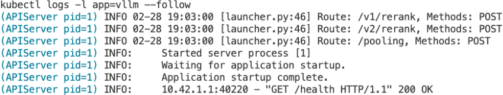
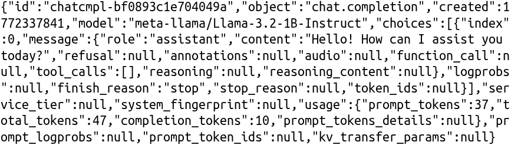

# 第9章：生产级 LLM 服务栈 {-}

*为可靠的 LLM 服务构建端到端生产系统*

> 万物皆会失败，无时无刻。
- Werner Vogels，Amazon CTO

**Code Summary**

- `fastapi.responses.StreamingResponse`：通过 SSE 将生成的 token 流式传输给客户端
- `fastapi.FastAPI`：推理网关和模型运行器的 HTTP 层
- `uvicorn`：用于启动网关、模型运行器和分词器服务的 ASGI 服务器
- `httpx.AsyncClient`：从 API 网关到模型运行器的异步转发
- `pydantic.BaseModel`：推理 API 的验证请求和响应模式
- `transformers.AutoTokenizer`：用于计费、验证和自定义后端的独立分词
- `prometheus_client`：TTFT、延迟百分位数和吞吐量指标
- `opentelemetry.trace`：跨服务组件的分布式追踪跨度
- `kubectl`：在 Kubernetes 上部署、检查和调试 vLLM 和 SGLang 工作负载

## 生产 LLM 服务系统剖析

在前面的章节，我们探索了如何用像 DDP、FSDP、DeepSpeed 和 Megatron-LM 这样的分布式技术大规模训练大型模型。我们还审视了像 vLLM 和 SGLang 这样优化单节点和多节点推理的推理引擎。现在是时候将这些部分组合成一个完整的生产系统了。

AI 模型服务涵盖广泛的工作负载谱系。传统机器学习模型——梯度提升树、线性模型和小型神经网络——通常在 CPU 上用像 TensorFlow Serving 或 Triton Inference Server 这样的框架服务。用于图像分类或目标检测的计算机视觉模型也可以用像 ONNX Runtime 这样的优化运行时在 CPU 上高效运行，ONNX Runtime 多年来一直为生产 CV 工作负载提供动力；只有对更大的模型或吞吐量需求更高时才需要 GPU。这些工作负载有相对可预测的延迟，因为输入大小固定。用于图像生成的扩散模型（Stable Diffusion、DALL-E）以它们的迭代去噪过程呈现独特挑战，需要仔细的批处理策略，常常受益于像无分类器引导缓存这样的技术。

然而，LLM 服务有它自己独特的特征，将它与这些其他工作负载区分开。文本生成的自回归性质意味着输出长度不可预测——一个简单的"是"或"否"问题可能生成 2 个 token，而一个代码生成请求可能产生 2,000 个。这种可变性使批处理和资源分配从根本上不同于固定输出的模型。KV 缓存随序列长度线性增长，造成传统 ML 服务中不存在的内存压力。而聊天应用的流式性质意味着用户期待在 token 生成时看到它们，而非只是最终响应。

本章专门专注于 LLM 服务，建立在我们在第 6 章和第 7 章涵盖的推理引擎之上。我们讨论的架构模式——路由、负载均衡、可观测性——广泛适用于 AI 服务，但特定的实现和权衡为大语言模型的独特需求量身定制。

一个生产 LLM 服务系统不只是运行在 GPU 上的一个模型。它是一个复杂的分布式系统，有多个组件协同工作以提供可靠、可扩展和成本高效的推理服务。在深入特定的部署策略之前，理解这个架构至关重要。

一个典型的生产服务栈包括以下组件：

- **API 网关。** 网关位于客户端和后端服务之间，处理请求路由、认证、限流和负载均衡。它是抽象掉多个模型运行器和路由决策复杂性的单一入口点。
- **模型运行器。** 这是系统的核心：一个有状态的、GPU 支持的推理引擎，管理模型加载、KV 缓存和连续批处理。在生产中，你通常使用 vLLM 或 SGLang（在第 6 章和第 7 章涵盖）作为模型运行器，但架构原则无论你选择哪个引擎都适用。
- **监控与可观测性。** 生产系统需要对正在发生什么的可见性。可观测性通常不是一个独立服务，而是通过检测库集成到每个组件中。这包括指标收集（通常导出到 Prometheus）、分布式追踪（OpenTelemetry）和结构化日志。没有可观测性，调试生产问题变得几乎不可能。
- **分词器服务（可选）。** 一个无状态、轻量的服务，处理文本分词和逆分词。像 vLLM 这样的现代推理引擎在内部处理分词，所以单独的分词器服务不那么常见。它对在推理前计算 token（用于计费或限流）、验证输入长度，或使用自定义推理后端时有用。

{#fig:serving-architecture .block width=80% align=center}

图~\ref{fig:serving-architecture} 显示这些组件如何组合在一起。客户端向 API 网关发送请求，网关根据请求的模型和当前负载将它们路由到合适的模型运行器。所有组件向可观测性栈报告指标和追踪。


一个简化的实现在 `code/basic/` 中可用。示例使用 Qwen2.5-1.5B-Instruct 作为默认模型，它在大多数带 8GB+ VRAM 的 GPU 上舒适运行。为了更小的占用，你可以通过修改代码中的模型名替换为 Qwen2.5-0.5B-Instruct 或 TinyLlama-1.1B-Chat。

要试用它们，先安装依赖。我们在 conda 环境中用以下版本测试：

```bash
conda create -n usao python=3.12
conda activate usao
pip install fastapi==0.133.1 uvicorn==0.35.0 httpx==0.28.1 \
    pydantic==2.12.5 transformers==4.57.3 vllm==0.15.1
```

你的环境可能需要不同的版本——根据需要调整以与你的 CUDA 和 PyTorch 设置兼容。

如果你在下载模型时遇到 `401 Client Error` 或 `403 Forbidden`，你需要设置你的 Hugging Face token：

```bash
export HF_TOKEN=your_huggingface_token
```

你可以从 [huggingface.co/settings/tokens](https://huggingface.co/settings/tokens) 获取 token。一些模型需要在它们的模型页面上接受许可协议才能授予访问。

在一个终端中启动模型运行器（这将下载并加载模型）：

```bash
cd code/basic
uvicorn model_runner:app --host 0.0.0.0 --port 8002
```

模型运行器（`code/basic/model_runner.py`）是一个包装 vLLM 进行推理的 FastAPI 服务。它在启动时加载模型并暴露一个 `/generate` 端点。首次运行时模型加载需要一两分钟，因为它下载权重并编译 CUDA 图。

在另一个终端中，启动 API 网关：

```bash
uvicorn api_gateway:app --host 0.0.0.0 --port 8000
```

API 网关（`code/basic/api_gateway.py`）是面向公众的入口点。在这个简化示例中，它提供限流并将请求路由到模型运行器。生产网关会添加认证、跨副本负载均衡和请求排队。

然后你可以向网关发送请求：

```bash
curl -X POST http://localhost:8000/generate \
  -H "Content-Type: application/json" \
  -d '{"prompt": "What is machine learning?", "max_tokens": 100}'
```

`code/basic/` 目录还包括一个独立的分词器服务（`tokenizer_service.py`），演示如何构建单独的分词层。虽然 vLLM 在内部处理分词，单独的服务对扩散模型（需要 CLIP 分词）、计费的 token 计数或自定义后端有用。该服务在启动时加载两个分词器：用于 LLM 的 Qwen2.5-1.5B 分词器和用于像 Stable Diffusion 这样的扩散模型的 `openai/clip-vit-large-patch14` 分词器。要试用它，启动该服务：

```bash
uvicorn tokenizer_service:app --host 0.0.0.0 --port 8001
```

分词器只在 CPU 上加载词汇文件——不需要 GPU——所以这个服务可以在任何机器上运行。服务运行后，你可以为 LLM 分词文本：

```bash
curl -X POST http://localhost:8001/tokenize \
  -H "Content-Type: application/json" \
  -d '{"model": "qwen2.5-1.5b", "text": "Hello world"}'
```

对于像 Stable Diffusion 这样的扩散模型，文本提示在文本编码器能处理它之前需要 CLIP 分词。同一服务用不同的模型名处理这个：

```bash
curl -X POST http://localhost:8001/tokenize \
  -H "Content-Type: application/json" \
  -d '{"model": "stable-diffusion", "text": "a photo of a cat"}'
```

如果你只需要 token 计数——比如用于计费或强制输入长度限制——`/count` 端点只返回数字而没有完整的 token 列表：

```bash
curl -X POST http://localhost:8001/count \
  -H "Content-Type: application/json" \
  -d '{"model": "qwen2.5-1.5b", "text": "How many tokens is this?"}'
```

监控层不包括在这个基本示例中——我们将在第~\ref{sec:k8s-deployment}节涵盖可观测性模式。

## 请求路由与流量管理

在生产系统中，你常常需要同时服务多个模型、智能路由请求，并跨实例平衡负载。除了基本路由，你还需要安全推出新模型版本和运行实验的策略。本节涵盖完整的流量管理画面：路由、负载均衡、金丝雀部署和 A/B 测试。

### 路由策略

在多模型部署中路由请求有三种常见方法：

- **基于特征的路由** 检查请求内容以确定哪个模型最适合。例如，代码相关的提示可能路由到 Code Llama，而一般聊天去对话模型。这种方法在不同模型有不同优势时工作良好，但需要仔细的关键词匹配或分类逻辑。
- **A/B 流量拆分** 使用一致性哈希将用户分配到模型变体。关键洞见是使用用户 ID（或会话 ID）作为哈希输入，确保同一用户总是得到同一模型。这种一致性对有意义的 A/B 比较至关重要——如果用户在模型之间随机跳动，你就不能将性能差异归因于模型本身。
- **动态模型选择** 考虑运行时因素，如当前负载、延迟预算和成本约束。一个成本敏感的请求可能路由到更小、更便宜的模型，而一个延迟关键的请求去最快的可用选项。这种方法需要实时跟踪模型性能指标。

所有三种策略的实现在 `code/basic/routing.py` 中可用。`FeatureBasedRouter`、`ABRouter` 和 `DynamicRouter` 类演示这些模式。

### 负载均衡

一旦你决定了哪个模型处理一个请求，你需要选择那个模型的哪个实例接收它。三种标准方法是：

**轮询** 通过按顺序循环遍历实例来均匀分发请求。它简单，且在实例有相似容量和请求有相似成本时工作良好。

**最少连接** 路由到有最少活跃请求的实例。这自然处理可变的请求持续时间——慢请求不会造成一个实例落后而其他闲置。

**加权均衡** 为实例分配不同的容量，在你有异构硬件（如一些实例在 A100 上，其他在 H100 上）时有用。

所有三种均衡器，加上与它们集成的健康检查器，在 `code/basic/load_balancer.py` 和 `code/basic/health_check.py` 中实现。

### 金丝雀部署与 A/B 测试

除了路由到现有模型，你需要安全引入新模型版本的策略。金丝雀部署允许你在监控问题的同时逐步推出新模型。A/B 测试实现在生产中比较模型性能。两种技术对安全、数据驱动的模型更新都至关重要。

**金丝雀部署。** 金丝雀部署背后的想法很简单：不是一次将所有流量切换到新模型，而是先将一小部分（比如 10%）发送到新的"金丝雀"模型，而其余继续到稳定版本。你监控两个版本，比较错误率和延迟。如果金丝雀表现良好，你逐步增加它的流量份额。如果它表现差，你以最小的用户影响立即回滚。要跟踪的关键指标是错误率和延迟——一个合理的晋升策略可能允许金丝雀有比稳定版本高达 10% 的错误率和 20% 的延迟，如果金丝雀的错误率超过稳定版本率的两倍则触发回滚。

**流量转移。** 这是逐步将用户从稳定移到金丝雀的机制。一个典型的进程可能是：10% → 25% → 50% → 75% → 100%。在每一步，你等待足够的请求积累（统计显著性），然后决定是继续还是回滚。

**A/B 测试。** A/B 测试在目标上与金丝雀部署不同：金丝雀关乎安全推出，而 A/B 测试关乎比较替代方案以做数据驱动的决策。一个 A/B 测试可能比较两个不同的模型、两个不同的提示模板，或两个不同的推理配置。关键要求是一致的分配——同一用户必须总是看到同一变体，通过用户 ID 的一致性哈希实现。

一个示例实现在 `code/basic/canary.py`。下面的导入假设你的工作目录是 `code/basic/`：

```python
from canary import CanaryDeployment, TrafficShifter, ABTestFramework, ABTestConfig

# Example 1: Canary deployment for a new model version
canary = CanaryDeployment(
    stable_model="llama-2-7b-v1",
    canary_model="llama-2-7b-v2",
    traffic_percent=0.1  # Start with 10% to canary
)

# Route a request
model = canary.route({"prompt": "Hello"})  # Returns stable or canary model
# After getting response, record metrics
canary.record_metrics(model, latency=0.15, error=False)

# Check if canary should be promoted or rolled back
if canary.should_promote():
    print("Canary performing well, increase traffic")
elif canary.should_rollback():
    print("Canary failing, rolling back")

# Example 2: Gradual traffic shifting
shifter = TrafficShifter("model-v1", "model-v2")
shifter.increase_traffic()  # 0% -> 10%
shifter.increase_traffic()  # 10% -> 25%
# ... continue based on metrics

# Example 3: A/B testing two models
ab = ABTestFramework()
ab.register_test(ABTestConfig(
    test_name="model_comparison",
    variants={"llama-7b": 0.5, "mistral-7b": 0.5},
    metrics=["latency", "quality_score"]
))

# Assign user to variant (consistent across requests)
variant = ab.assign_variant("model_comparison", user_id="user123")
# Record metrics after serving
ab.record_metric("model_comparison", variant, "latency", 0.12)
# Get aggregated results
results = ab.get_results("model_comparison")
```

这些模式与 API 网关集成——在生产中，你会将路由逻辑接线到你的请求处理流水线。

## 运维：可观测性、可靠性和成本

除了流量管理，生产系统需要运维能力：监控系统健康、优雅处理故障，以及优化成本。这些横切关注点适用于服务栈中的每个组件。

### 可观测性

在一个分布式 LLM 服务系统中，单个请求可能触及 API 网关、分词器服务和模型运行器——没有适当的可观测性，调试问题变得几乎不可能。生产 LLM 服务需要三种可观测性：

**分布式追踪** 用 OpenTelemetry 跟踪请求在多个服务中流动。每个服务创建记录时序和元数据的"跨度"，由一个通过 HTTP 头传播的 trace ID 链接在一起。当一个请求慢时，你可以准确看到哪个服务贡献了延迟。

**指标收集** 用 Prometheus 跟踪聚合统计：请求计数、延迟直方图、错误率和资源利用率。与追踪（被采样）不同，指标捕获每个请求，使它们对告警和 SLO 监控至关重要。LLM 服务的关键指标包括按模型的每秒请求数、延迟百分位数（p50、p95、p99）、活跃请求计数和 GPU 利用率。

**结构化日志** 以机器可解析格式（通常是 JSON）捕获关于单个请求的详细信息。与传统日志不同，结构化日志可以被查询和聚合——例如，找到特定用户所有花费超过 5 秒的请求。

所有三种的示例实现在 `code/basic/observability.py` 中可用。

### 可靠性与容错

**冷启动缓解。** LLM 推理有显著的冷启动延迟——加载模型和预热 GPU 可能需要 30-60 秒。两种策略有帮助：启动时预热（在加载后立即通过模型发送虚拟请求）和保活请求（周期性虚拟请求以防止模型在空闲期变冷）。

**自动扩缩。** 基于请求的自动扩缩根据流量调整副本计数。关键参数包括目标 RPS、扩容阈值（通常目标的 120%）、缩容阈值（通常目标的 50%）和冷却期。对于 LLM 服务，对缩容要保守——启动一个新的 GPU 实例需要几分钟，所以有稍微过剩的容量比措手不及更好。

**背压。** 当流量超过容量时，一个有界请求队列提供背压——当队列满时，新请求立即以 503 错误被拒绝而非在长时间等待后超时。这给客户端一个稍后重试或路由到不同后端的清晰信号。

### 成本优化

GPU 实例很贵，所以成本优化很重要。**竞价实例**（或可抢占 VM）比按需便宜 60-90%，但可以短暂通知后被终止——一个典型策略用 50% 竞价实例作为基线容量，用按需实例在竞价实例被抢占时吸收流量。**模型选择** 将成本敏感的请求路由到更小、更便宜的模型；一个 7B 模型每 token 成本可能是 13B 模型的一半，而对许多用例，质量差异不足以证明成本合理。

预热、自动扩缩、请求排队和成本优化路由的示例实现在 `code/basic/fault_tolerance.py` 中可用。

## 在 Kubernetes 上部署 LLM 服务 {#sec:k8s-deployment}

我们到目前为止涵盖的概念——路由、负载均衡、金丝雀部署、可观测性和容错——是平台无关的模式。你可以在裸机服务器上、用 Docker Compose，或在任何云平台上实现它们。然而，Kubernetes（K8s）已成为生产 LLM 服务的主导平台。

Kubernetes^[Kubernetes 官方网站：\url{https://kubernetes.io/}] 是一个开源容器编排系统，最初由 Google 开发，现由云原生计算基金会（CNCF）维护。在其核心，Kubernetes 跨机器集群管理容器化工作负载，处理调度、扩缩、网络和存储。你在 YAML 清单中描述你期望的状态——你想要一个服务的多少副本、每个需要多少 CPU 和内存、它们应该如何暴露到网络——Kubernetes 持续工作使实际状态匹配你期望的状态。这种声明式模型，结合自愈能力（自动重启失败的容器、在节点死亡时重新调度工作负载），使 Kubernetes 很适合需要高可用性的生产系统。

专门对于 LLM 服务，Kubernetes 为我们讨论的许多模式提供原生原语：

| 概念 | Kubernetes 原语 | 实践中 |
|---------------|----------------------|---------------------------|
| 负载均衡 | Services、Ingress | 通过网关的模型感知路由 |
| 自动扩缩 | HPA^[Horizontal Pod Autoscaler：\url{https://kubernetes.io/docs/tasks/run-application/horizontal-pod-autoscale/}]、KEDA^[Kubernetes Event-driven Autoscaling：\url{https://keda.sh/}] | 基于每秒请求数或队列深度扩缩 |
| 健康检查 | Liveness/Readiness 探针 | `/health`、`/ready` 端点 |
| 金丝雀部署 | Ingress 流量拆分 | 模型版本间的加权路由 |
| 可观测性 | Prometheus、OpenTelemetry | 延迟、吞吐量、GPU 指标 |
| 容错 | Pod 重启、PDB^[PodDisruptionBudget：\url{https://kubernetes.io/docs/tasks/run-application/configure-pdb/}] | 带请求排空的优雅关闭 |
| GPU 调度 | 设备插件、requests/limits | pod spec 中的 `nvidia.com/gpu: 1` |

{#fig:k8s-architecture .block width=90% align=center}

图~\ref{fig:k8s-architecture} 展示这些原语在一个典型设置中如何组合。外部流量通过一个 Ingress 进入，它路由到一个跨 Deployment 负载均衡的 Service。每个 Deployment 管理多个运行 vLLM 的 Pod，Horizontal Pod Autoscaler（HPA）根据需求扩缩副本。两个 Deployment（model-v1 和 model-v2）用加权流量拆分（90%/10%）实现金丝雀部署。在底部，GPU 节点用 NVIDIA 设备插件调度工作负载。

Kubernetes 不用你从头实现这些模式，而是让你声明你期望的状态并处理实现细节。这种声明式方法——结合丰富的操作符和工具生态系统——是像 vLLM Production Stack 和 llm-d 这样的生产 LLM 服务栈建立在 Kubernetes 上的原因。

我们将分两步探索基于 Kubernetes 的 LLM 服务。首先，我们将用 k3d^[k3d - 在 docker 中运行 k3s（Rancher Lab 的最小 Kubernetes 发行版）：\url{https://k3d.io/}] 设置一个本地开发环境，k3d 是一个完全运行在 Docker 中的轻量 Kubernetes 发行版。这给我们一个安全的操场，在部署到生产之前试验配置。然后，我们将部署 llm-d^[llm-d - Kubernetes 上的生产 LLM 服务：\url{https://llm-d.ai/}]，一个实现我们讨论的所有模式——__路由、自动扩缩、可观测性和容错__——作为 Kubernetes 原生资源的生产就绪服务栈。

### 用 k3d 进行本地开发

k3d 将 k3s^[k3s - 轻量 Kubernetes：\url{https://k3s.io/}]（一个轻量 Kubernetes 发行版）包装在 Docker 容器中，在几分钟内给你一个功能完整的 Kubernetes 集群。它轻量（不需要 VM）、支持 GPU 直通，并产生在生产集群上不加修改就工作的清单。这使它非常适合在部署到生产之前开发和测试 LLM 服务配置。

完整的 k3d 设置脚本在 `code/k3d/` 中可用。设置涉及三个主要步骤：安装先决条件、构建自定义 GPU 启用的 k3s 镜像，以及创建集群。

```bash
cd code/k3d
# Step 1: Install prerequisites (NVIDIA Container Toolkit, k3d)
./install-prerequisites.sh
# Step 2: Build custom k3s-cuda image
./build.sh
# Step 3: Create cluster with GPU support
./create-cluster.sh
```

`install-prerequisites.sh` 脚本检查 NVIDIA 驱动、安装 NVIDIA Container Toolkit，并安装 k3d。`build.sh` 脚本创建一个带 CUDA 和 NVIDIA 运行时支持的自定义 k3s 镜像——必要的，因为默认 k3s 镜像不包括 GPU 支持。

自定义镜像将 k3s 与 CUDA 和 NVIDIA Container Toolkit 结合。关键文件是 `code/k3d/Dockerfile` 和 `code/k3d/device-plugin-daemonset.yaml`。Dockerfile 用多阶段构建将 k3s 二进制复制到一个 NVIDIA CUDA 基础镜像，然后安装容器工具包并配置 containerd 使用 NVIDIA 运行时。设备插件清单在集群启动时自动部署，使 GPU 作为 `nvidia.com/gpu` 资源对 Kubernetes 可见。

`build.sh` 脚本自动检测你的本地 CUDA 版本并获取最新的 k3s 发布，所以在大多数情况下你可以简单地不带参数运行它。如果你需要特定版本，用环境变量覆盖：

```bash
# Use specific versions (check hub.docker.com/r/rancher/k3s and hub.docker.com/r/nvidia/cuda)
K3S_TAG=v1.32.0-k3s1 CUDA_TAG=13.0.0-base-ubuntu24.04 ./build.sh
```

CUDA 版本必须与你的 NVIDIA 驱动兼容。运行 `nvidia-smi` 查看你的驱动支持的最大 CUDA 版本——你可以使用任何不超过那个数字的版本。

图~\ref{fig:k3d-architecture} 显示产生的 k3d GPU 集群的架构。主机运行 Docker Engine，它包含带两个节点的 k3d 网络：一个运行 Kubernetes 控制平面服务的控制平面（server-0），和一个运行像 vLLM pod 这样应用工作负载的工作节点（agent-0）。两个节点都使用自定义 k3s-cuda 镜像，并通过 `--gpus=all` 有 GPU 直通。NVIDIA 设备插件作为 DaemonSet 运行，将物理 GPU 作为 `nvidia.com/gpu` 资源暴露给 Kubernetes。

{#fig:k3d-architecture .block width=90% align=center}

运行三个设置脚本后，验证集群工作：

```bash
kubectl get nodes
# NAME                         STATUS   ROLES           AGE   VERSION
# k3d-mycluster-gpu-server-0   Ready    control-plane   41s   v1.35.1+k3s1
# k3d-mycluster-gpu-agent-0    Ready    <none>          37s   v1.35.1+k3s1
```

然后验证 GPU 对集群可访问：

```bash
kubectl describe nodes | grep nvidia.com/gpu
```

{#fig:k-desc-node .wrap align=top-right}

图~\ref{fig:k-desc-node} 显示来自一个 8-GPU A100 节点的示例输出（完整输出在 `code/k3d/kubectl_describe_node.txt` 中可用）。在输出中，`Capacity` 指示检测到的总 GPU，`Allocatable` 显示多少可用于 pod 调度，`Allocated` 显示当前使用为 requests/limits（零表示还没有 pod 使用 GPU）。由于 k3d 将所有主机 GPU 传给每个容器，每个节点报告相同的 GPU 计数——这是本地开发的预期行为。


关于集群自定义选项，如挂载模型目录或选择特定 GPU，参考 `code/k3d/README.md`。

### 在 k3d 上部署 vLLM

GPU 集群运行后，我们现在可以部署 vLLM 来服务 LLM 推理。`code/k3d/vllm/` 目录包含几个模型的即用型 Kubernetes 清单，所以你不需要从头写 YAML。

Hugging Face 上许多流行的模型是"门控"的，意味着你需要接受它们的许可条款并认证才能下载它们。Llama 模型属于这一类。如果你部署门控模型，先用我们之前设置的 `HF_TOKEN` 环境变量创建一个 Kubernetes secret：

```bash
kubectl create secret generic hf-token-secret --from-literal=token="$HF_TOKEN"
```

现在你可以部署一个模型。在生产中，模型选择取决于你可用的 GPU 内存和像延迟、吞吐量和输出质量这样的业务需求。为了这个演示，我们使用较小的模型。Phi-tiny-MoE 是一个轻量选项，在较小 GPU 上测试良好，而 Llama-3.2-1B 提供更好的质量但需要大约 8GB 的 GPU 内存：

```bash
cd code/k3d/vllm
kubectl apply -f llama-3.2-1b.yaml
# or ./deploy-phi-tiny-moe.sh for smaller GPUs
```

部署清单处理你否则需要手动配置的细节：GPU 资源请求使 Kubernetes 在有可用 GPU 的节点上调度 pod、带适合模型加载超时的健康探针、缓存下载权重的卷挂载，以及网络访问的 Kubernetes 服务。用以下命令观察部署进度：

```bash
kubectl get pods -l app=vllm -w
# NAME                       READY   STATUS              RESTARTS   AGE
# vllm-llama-32-1b-pod-xxx   0/1     ContainerCreating   0          2m40s
```

pod 最初会在 Kubernetes 拉取 vLLM 容器镜像时显示 `ContainerCreating`。这可能需要几分钟，取决于你的网络速度。一旦状态改为 `Running`，你可以查看日志：

```bash
kubectl logs -l app=vllm --follow
```

{#fig:k-logs-follow .wrap width=70% align=right-top}

图~\ref{fig:k-logs-follow} 显示模型启动期间的典型日志输出。日志显示如果模型需要从 Hugging Face 获取则下载进度，接着是模型被加载到 GPU 内存。模型加载通常需要 2-5 分钟，取决于模型大小以及权重是否已在本地缓存。一旦日志指示 "Application startup complete."，服务器就准备好接受请求。

要测试 API，将服务端口转发到你的本地机器并发送请求：

```bash
kubectl port-forward svc/vllm-llama-32-1b-service 8000:8000 &

curl http://localhost:8000/v1/chat/completions \
  -H "Content-Type: application/json" \
  -d '{
    "model": "meta-llama/Llama-3.2-1B-Instruct",
    "messages": [{"role": "user", "content": "Hello!"}],
    "max_tokens": 50
  }'
```

{#fig:k-vllm-output .wrap width=65% align=right-top}

图~\ref{fig:k-vllm-output} 显示来自运行在 Kubernetes 中的 vLLM 服务器的成功响应。JSON 响应遵循 OpenAI 聊天补全格式，包括模型名、生成的内容和 token 使用统计。

查看部署清单（`code/k3d/vllm/llama-3.2-1b.yaml` 和 `code/k3d/vllm/phi-tiny-moe.yaml`），你会注意到几个值得理解的配置模式。`--gpu-memory-utilization 0.2` 标志告诉 vLLM 只保留 20% 的 GPU 内存——远低于约 0.85 的默认值。那个保守设置适合共享 GPU 或多模型集群；对于你想要最大吞吐量的单个模型，改用 0.8–0.9。

健康探针值得特别注意。Kubernetes 用 liveness 和 readiness 探针确定 pod 是否健康，但 LLM 模型需要显著的时间加载到 GPU 内存——对更大的模型常常几分钟。清单将 `initialDelaySeconds` 设为 120-180 秒以给模型时间加载；没有那个延迟，Kubernetes 在无尽循环中重启 pod。允许几次连续失败（`failureThreshold` 为 3 或更高），使 GC 期间单个慢探针不看起来像崩溃。

`/models` 处的卷挂载跨 pod 重启持久化下载的模型权重。这很重要，因为从 Hugging Face 下载一个 7B 参数模型需要相当的时间和带宽。一旦缓存，后续 pod 重启直接从磁盘加载模型。

`/dev/shm` 处的共享内存容易被忽略。Docker 的默认段只有 64MB，然而张量并行 vLLM 工作进程通过它路由 NCCL 和 IPC 缓冲区——空间太少集合操作会挂起，几乎没有诊断输出。清单挂载一个更大的卷（带 `medium: Memory` 的 `emptyDir`，或容器上等效的 `--shm-size`），大小适合你的张量并行宽度。

对于不适合单块 GPU 的更大模型，你可以通过将 `--tensor-parallel-size` 设为 GPU 数量并相应更新资源限制来分片模型。`code/k3d/README.md` 文件提供关于多 GPU 配置和排查常见问题的详细指导。

### 清理

当你完成实验后，清理集群以释放资源：

```bash
k3d cluster delete mycluster-gpu
docker rmi k3s-cuda:<your-tag>  # optional, removes the custom image
```


### 多模型和多引擎服务

单个 vLLM 部署成功运行后，我们现在可以探索更复杂的服务模式。生产部署很少只服务一个模型——你可能对不同任务有不同的模型（简单查询用小模型，复杂推理用更大的），或你可能想 A/B 测试不同的模型或推理引擎。

`code/k3d/` 目录提供两个自动化这些部署模式的管理脚本：

- `manage-cluster-multi-models.sh`：用单个引擎（vLLM）部署多个模型（Llama-3.2-1B + Phi-tiny-MoE）
- `manage-cluster-multi-engines.sh`：在多个引擎（vLLM + SGLang）上部署同一模型（Llama-3.2-1B）

#### 多模型路由

关键洞见是 API 网关可以根据 OpenAI 兼容请求体中的 `model` 字段路由请求。当一个客户端发送指定 `"model": "meta-llama/Llama-3.2-1B-Instruct"` 的请求时，网关查找哪个 Kubernetes 服务托管那个模型并相应地转发请求。这创建一个统一端点，客户端不需要知道哪个后端服务器处理哪个模型。

图~\ref{fig:multi-model-routing} 展示这个架构。客户端应用向 API 网关发送请求，网关解析 `model` 字段并将请求转发到合适的 vLLM 服务。每个模型在它自己的 pod 中运行，带一个专用的 Kubernetes 服务。

{#fig:multi-model-routing width=80%}

让我们部署这个架构。管理脚本处理所有复杂性——创建命名空间、部署两个模型，并设置网关：

```bash
cd code/k3d
./manage-cluster-multi-models.sh start
```

我们可以通过以下方式检查部署状态：

```bash
./manage-cluster-multi-models.sh status
```

status 命令显示运行的内容。你应该看到两个 vLLM pod（每个模型一个）和它们对应的服务：

```
==========================================
k3d Cluster Status: mycluster-gpu
==========================================
📊 Cluster list:
NAME            SERVERS   AGENTS   LOADBALANCER
mycluster-gpu   1/1       1/1      true
Switched to context "k3d-mycluster-gpu".
📊 Kubernetes nodes:
NAME                         STATUS   ROLES           AGE     VERSION
k3d-mycluster-gpu-agent-0    Ready    <none>          5h32m   v1.35.1+k3s1
k3d-mycluster-gpu-server-0   Ready    control-plane   5h32m   v1.35.1+k3s1
📊 Namespaces:
NAME              STATUS   AGE
multi-models      Active   20m
📊 Pods in namespace multi-models:
NAME                                     READY   STATUS    RESTARTS   AGE
vllm-llama-32-1b-pod-76895c5cfb-vkz7w    1/1     Running   0          20m
vllm-phi-tiny-moe-pod-55b8c8c959-nvxjh   1/1     Running   0          2m33s
📊 Services in namespace multi-models:
NAME                        TYPE        CLUSTER-IP      EXTERNAL-IP   PORT(S)    AGE
vllm-llama-32-1b-service    ClusterIP   10.43.178.154   <none>        8000/TCP   20m
vllm-phi-tiny-moe-service   ClusterIP   10.43.55.228    <none>        8000/TCP   20m
```

这个脚本创建一个 `multi-models` 命名空间、部署两个 vLLM 模型（Llama-3.2-1B 和 Phi-tiny-MoE），并设置 API 网关。

路由配置（`gateway/routing-config.yaml`）将模型名映射到 Kubernetes 服务：

```yaml
routing:

  - model: "meta-llama/Llama-3.2-1B-Instruct"
    service_name: "vllm-llama-32-1b-service.multi-models.svc.cluster.local"
  - model: "microsoft/Phi-tiny-MoE-instruct"
    service_name: "vllm-phi-tiny-moe-service.multi-models.svc.cluster.local"
```

当网关接收一个带 `"model": "meta-llama/Llama-3.2-1B-Instruct"` 的请求时，它在这个表中查找服务名——这里是 `vllm-llama-32-1b-service.multi-models.svc.cluster.local`，即 `<service>.<namespace>.svc.cluster.local`——并转发请求而不向客户端暴露后端布局。

现在让我们测试它。首先，设置端口转发以从你的本地机器访问网关：

```bash
kubectl port-forward svc/vllm-api-gateway 8080:8000 &
```

然后向 LLama 发送请求并获取响应：

```bash
$ curl http://localhost:8080/v1/chat/completions \
  -H "Content-Type: application/json" \
  -d '{"model": "meta-llama/Llama-3.2-1B-Instruct", 
       "messages": [{"role": "user", "content": "Hello!"}]}'
{"id":"chatcmpl-8d9100935563642c","object":"chat.completion","created":...,
"model":"meta-llama/Llama-3.2-1B-Instruct","choices":[{"index":0,"message":{
"role":"assistant","content":"Hello! How can I assist you today?"...
prompt_logprobs":null,"prompt_token_ids":null,"kv_transfer_params":null}
```

现在向 Phi 模型发送请求——相同端点，不同的 `model` 字段：

```bash
$ curl http://localhost:8080/v1/chat/completions \
  -H "Content-Type: application/json" \
  -d '{"model": "microsoft/Phi-tiny-MoE-instruct", 
       "messages": [{"role": "user", "content": "Hello!"}]}'
{"id":"chatcmpl-a59b963764eb8f41","object":"chat.completion","created":...,
"model":"microsoft/Phi-tiny-MoE-instruct","choices":[{"index":0,"message":
{"role":"assistant","content":" Hello! How can I assist you today?"...
"prompt_logprobs":null,"prompt_token_ids":null,"kv_transfer_params":null}
```

注意两个请求都去 `localhost:8080`，但网关根据 `model` 字段将它们路由到不同的后端。这是多模型路由的力量：客户端与单个端点交互，而基础设施处理模型放置。

在转到多引擎路由之前，清理这个部署以释放 GPU 资源：

```bash
./manage-cluster-multi-models.sh stop
```

这个命令停止端口转发进程并移除 `multi-models` 命名空间中的所有资源。

#### 多引擎路由

更进一步，我们可以在不同的推理引擎（vLLM 和 SGLang）上部署同一模型并根据 `inference_server` 字段路由。这对基准测试引擎或在它们之间逐步迁移有用。

如图~\ref{fig:multi-engine-routing} 所示，网关解析 `model` 和 `inference_server` 字段来确定路由。使用多引擎管理脚本：

```bash
cd code/k3d
./manage-cluster-multi-engines.sh start
```

这创建一个 `multi-engines` 命名空间并在 vLLM 和 SGLang 上部署 Llama-3.2-1B。我们可以通过运行以下命令检查部署状态：

```bash
$ ./manage-cluster-multi-engines.sh status
==========================================
k3d Cluster Status: mycluster-gpu
==========================================
📊 Cluster list:
NAME            SERVERS   AGENTS   LOADBALANCER
mycluster-gpu   1/1       1/1      true
Switched to context "k3d-mycluster-gpu".
📊 Kubernetes nodes:
NAME                         STATUS   ROLES           AGE     VERSION
k3d-mycluster-gpu-agent-0    Ready    <none>          6h16m   v1.35.1+k3s1
k3d-mycluster-gpu-server-0   Ready    control-plane   6h16m   v1.35.1+k3s1
📊 Namespaces:
NAME              STATUS   AGE
multi-engines     Active   21m
multi-models      Active   64m
📊 Pods in namespace multi-engines:
NAME                                      READY   STATUS    RESTARTS   AGE
sglang-llama-32-1b-pod-7dc599696d-67f9r   1/1     Running   0          21m
vllm-llama-32-1b-pod-76895c5cfb-m9bbw     1/1     Running   0          21m
📊 Services in namespace multi-engines:
NAME                         TYPE        CLUSTER-IP      EXTERNAL-IP   PORT(S)    AGE
sglang-llama-32-1b-service   ClusterIP   10.43.249.196   <none>        8000/TCP   21m
vllm-llama-32-1b-service     ClusterIP   10.43.89.85     <none>        8000/TCP   21m
```

{#fig:multi-engine-routing width=80%}

路由配置（`code/k3d/gateway/routing-config.yaml`）包括引擎特定的路由，允许客户端选择它们偏好的推理引擎：

```yaml
routing:

  - model: "meta-llama/Llama-3.2-1B-Instruct"
    inference_server: "vllm"
    service_name: "vllm-llama-32-1b-service.multi-engines.svc.cluster.local"
  - model: "meta-llama/Llama-3.2-1B-Instruct"
    inference_server: "sglang"
    service_name: "sglang-llama-32-1b-service.multi-engines.svc.cluster.local"
  - model: "meta-llama/Llama-3.2-1B-Instruct"
    inference_server: null  # Default to vLLM
    service_name: "vllm-llama-32-1b-service.multi-engines.svc.cluster.local"
```

带 `inference_server: null` 的第三个条目充当回退——不指定引擎的请求默认去 vLLM。

设置端口转发并测试两个引擎：

```bash
kubectl port-forward svc/vllm-api-gateway 8080:8000 &
```

首先，一个不指定引擎的请求（默认路由到 vLLM）：

```bash
$ curl http://localhost:8080/v1/chat/completions \
  -H "Content-Type: application/json" \
  -d '{"model": "meta-llama/Llama-3.2-1B-Instruct",
       "messages": [{"role": "user", "content": "Hello!"}]}'
{"id":"chatcmpl-9583dfa06c9b9669","object":"chat.completion","created":...,
"model":"meta-llama/Llama-3.2-1B-Instruct","choices":[{"index":0,"message":{
"role":"assistant","content":"Hello! How can I assist you today?"...
"prompt_logprobs":null,"prompt_token_ids":null,"kv_transfer_params":null}
```

现在通过添加 `inference_server` 字段显式路由到 SGLang：

```bash
$ curl http://localhost:8080/v1/chat/completions \
  -H "Content-Type: application/json" \
  -d '{"model": "meta-llama/Llama-3.2-1B-Instruct",
       "inference_server": "sglang",
       "messages": [{"role": "user", "content": "Hello!"}]}'
{"id":"e02f545aca204f...3b20","object":"chat.completion","created":...,
"model":"meta-llama/Llama-3.2-1B-Instruct","choices":[{"index":0,"message":{
"role":"assistant","content":"Hello! How can I assist you today?"...
"usage":{"prompt_tokens":37,"total_tokens":47,"completion_tokens":10...}
```

网关还聚合 `/v1/models` 端点，返回所有后端所有可用模型的组合列表。对于生产部署，你会想添加认证（API 密钥或 OAuth token）、限流（每客户端请求配额）和可观测性（请求日志、延迟指标、错误跟踪）。`code/k3d/gateway/api-gateway.py` 包括这些关注点的示例中间件。


## 用 llm-d 进行 Kubernetes 部署

在上一节，我们构建了一个本地 k3d 集群来试验 vLLM 部署。虽然这种方法提供灵活性和对底层组件的深入理解，大规模的生产部署常常受益于处理分布式推理运维复杂性的标准化解决方案。

存在几个用于 LLM 服务的 Kubernetes 原生框架。**KServe**[^kserve] 提供带流量治理（金丝雀发布、A/B 测试）和多模型托管的企业级模型服务，但需要 Istio 或 Knative 作为依赖。**KubeAI**[^kubeai] 提供带零缩放和前缀感知负载均衡的轻量操作符，不需要外部依赖——非常适合更简单的部署。**vLLM production-stack**[^vllm-stack] 是官方 vLLM 部署解决方案，带 LMCache 集成用于跨实例的 KV 缓存共享。

本章专注于 **llm-d**[^llmd]，因为它提供一个"电池包含"的部署框架，将经过良好测试的组件（vLLM、Envoy、NIXL）组装成一个内聚系统、提供带最小配置的生产就绪 Helm charts，并支持像解耦预填充/解码和 InfiniBand RDMA 上的高速数据传输这样的高级特性。这些框架之间的选择取决于你的具体需求：KServe 用于企业流量治理、KubeAI 用于轻量零依赖部署、vLLM production-stack 用于带 KV 缓存共享的官方 vLLM 支持，llm-d 用于需要解耦推理或高速互连的部署。手动 k3d 方法和 llm-d 之间的详细比较在表 @tbl:k3d-llmd-comparison 中提供。

[^kserve]: KServe：\url{https://kserve.github.io/website/}
[^kubeai]: KubeAI：\url{https://www.kubeai.org/}
[^vllm-stack]: vLLM production-stack：\url{https://docs.vllm.ai/en/stable/deployment/integrations/production-stack.html}
[^llmd]: llm-d 项目：\url{https://github.com/llm-d/llm-d}

### 什么是 llm-d？

将 llm-d 视为一个"电池包含"的部署框架，将同类最佳的开源组件组装成一个内聚系统。在其核心，llm-d 使用 vLLM[^vllm-llmd] 作为模型服务器——就是我们在 k3d 一节手动部署的同一个引擎。但 llm-d 在其上添加几层智能：推理网关（IGW）[^igw] 充当智能请求调度器、Envoy Proxy[^envoy] 处理负载均衡和路由，NIXL[^nixl] 实现在像 InfiniBand RDMA 或 TPU ICI 这样的快速互连上的高速数据传输。Kubernetes 编排所有这些组件，确保它们优雅地扩缩和恢复。

[^vllm-llmd]: vLLM 推理引擎：\url{https://github.com/vllm-project/vllm}
[^igw]: 推理网关（IGW）：\url{https://github.com/kubernetes-sigs/gateway-api-inference-extension}
[^envoy]: Envoy Proxy：\url{https://www.envoyproxy.io/}
[^nixl]: NIXL（NVIDIA Inference Xfer Library）：\url{https://github.com/ai-dynamo/nixl}

### 关键特性

**智能推理调度。** llm-d 最有价值的能力之一是它的智能请求路由。传统负载均衡器轮询分发请求或基于像连接计数这样的简单指标。但 LLM 推理有独特的特征：一个带 10,000-token 提示的请求与一个带 100 token 的行为非常不同。llm-d 的 IGW 理解这一点。它可以预测请求延迟并相应路由，确保长请求不阻塞短请求。它还实现前缀缓存感知路由——如果一个 vLLM 实例已经有特定系统提示的 KV 缓存，带相同前缀的后续请求被路由到那里，大幅减少首 token 时间。对于企业部署，SLA 感知调度确保高级客户获得优先访问计算资源，而负载感知均衡基于每个实例的当前容量而非只计算连接来分发工作。

**预填充/解码解耦。** 也许 llm-d 最创新的特性是它对解耦推理的支持。在传统 LLM 服务中，单块 GPU 处理预填充阶段（处理输入提示）和解码阶段（一个一个生成输出 token）两者。这些阶段有非常不同的计算特征：预填充是计算受限和可并行的，而解码是内存带宽受限和顺序的。通过将它们分离到不同的服务器池上，llm-d 可以独立优化每个。预填充服务器可以用更大的批大小和更高的 GPU 利用率，而解码服务器可以为低延迟调优。挑战是在它们之间传输 KV 缓存——这是 NIXL 大放异彩的地方，用 RDMA 在毫秒内移动 GB 级的缓存数据。一个 sidecar 容器协调这些传输，确保解码服务器在它们需要时正好接收 KV 缓存。

**解耦前缀缓存。** 建立在 vLLM 的 KVConnector 抽象之上，llm-d 实现一个复杂的缓存层次结构。独立缓存（有时称为 N/S 表示 North/South）将 KV 缓存卸载到本地内存和 NVMe 存储，允许单个实例服务比它的 GPU 内存通常允许的更多并发请求。共享缓存（E/W 表示 East/West）实现实例之间的 KV 缓存传输，所以如果一个服务器已经为一个共同系统提示计算了缓存，其他可以检索它而非重新计算。对于最苛刻的部署，全局索引提供缓存前缀的集群范围视图，以额外协调开销为代价实现最优路由决策。

**变体自动扩缩。** 传统 Kubernetes 自动扩缩（HPA）基于 CPU 或内存利用率扩缩，但 LLM 工作负载需要更聪明的扩缩。llm-d 的变体自动扩缩器测量每个模型服务器实例的实际容量——给定当前内存压力它每秒能生成多少 token。它然后分析近期流量模式：请求大小的混合、服务质量需求和到达率。基于这个分析，它计算预填充服务器、解码服务器和为延迟容忍批处理请求保留的实例的最优混合。这实现真正的 SLO 级效率，在延迟退化之前而非之后扩容。

__硬件支持：__ llm-d 的优势之一是它广泛的硬件兼容性。项目直接在 NVIDIA GPU（A100、L4 和更新）、AMD GPU（MI250 和更新）、Google TPU（v5e 和更新）和 Intel Data Center GPU Max 系列（Ponte Vecchio）上测试和验证部署。这种多供应商支持随着组织寻求避免锁定并跨不同云服务商优化成本而越来越重要。

### 部署架构

涵盖了 llm-d 的关键特性——智能调度、预填充/解码解耦、分布式缓存和变体自动扩缩——让我们看看这些组件在生产部署中如何组合。

图 \ref{fig:llmd-architecture} 展示完整的架构。要理解它如何工作，让我们追踪一个请求通过系统。

每个生产 API 需要一个前门——处理互联网流量混乱现实的东西：TLS 加密、认证、限流和优雅处理行为不端的客户端。在 llm-d 中，这个角色落在 Envoy Proxy[^envoy] 上，一个在云原生部署中广泛使用的高性能边缘代理。你可能已经在你的基础设施中有 Envoy（它为 Istio[^istio] 服务网格和许多 API 网关提供动力）；llm-d 简单地利用它作为所有推理请求的入口点。

{#fig:llmd-architecture width=80%}

[^istio]: Istio 服务网格：\url{https://istio.io/}

从 Envoy，请求流向推理网关（IGW）[^igw]——llm-d 的"大脑"。虽然 Envoy 处理通用 HTTP 关注点，IGW 理解 LLM 推理。它检查每个请求的特征：提示多长？请求哪个模型？任何后端已经缓存相关前缀了吗？基于这个分析，IGW 将请求路由到最优的模型服务器。这与轮询或基于连接计数分发请求的传统负载均衡器根本不同——IGW 基于每个请求的实际计算成本做路由决策。

IGW 之后是执行推理的模型服务器。在标准模式，每个服务器处理完整的推理流水线。但 llm-d 也支持解耦模式，其中服务器专门化：预填充服务器处理输入提示（计算密集、可并行），而解码服务器生成输出 token（内存带宽受限、延迟敏感）。当一个预填充服务器完成处理一个提示时，一个 NIXL[^nixl] sidecar 用 RDMA[^rdma] 将 KV 缓存传输到分配的解码服务器，即使对大缓存也常常在毫秒内完成。这种分离允许每种服务器类型独立优化——预填充服务器可以为吞吐量激进批处理，而解码服务器为最小延迟调优。

[^rdma]: 远程直接内存访问（RDMA）允许计算机之间的直接内存访问，无需涉及 CPU 或操作系统。

对于服务许多带共享前缀（共同系统提示、少样本示例）请求的部署，llm-d 可以可选地将 KV 缓存存储在共享 NVMe[^nvme] 存储上。这实现集群范围的前缀缓存：当一个服务器为一个流行前缀计算缓存时，其他服务器可以检索它而非重新计算，大幅减少整个机群的冗余工作。

[^nvme]: 非易失性内存主机控制器接口规范（NVMe）是为 SSD 设计的高速存储接口协议。


### llm-d 入门

部署 llm-d 需要一个运行 1.29 或更高版本的生产级 Kubernetes 集群。与我们的本地 k3d 实验不同，llm-d 为带严肃硬件的环境设计：你需要能运行大型模型的加速器（对 70B+ 参数模型想想 A100 或更新），理想情况下有像节点内 NVLink 和节点间 InfiniBand 或 RoCE RDMA 这样的快速互连。对于 Google Cloud 部署，TPU ICI 和 DCN 提供类似的高带宽连接。

安装过程利用 Helm，Kubernetes 的包管理器。添加 llm-d 仓库后，单个 `helm install` 命令部署整个栈——vLLM 模型服务器、推理网关、Envoy 代理和所有支持基础设施。Helm 的美妙之处在于复杂配置变成简单的键值对：启用推理网关、指定服务哪个模型、为多 GPU 推理设置张量并行。

配置通过一个几乎像规范文档的 `values.yaml` 文件发生。你声明你想要什么——两个带缓存感知路由的 IGW 副本、跨四块 GPU 以 90% 内存利用率服务 Llama 3.1 70B 的 vLLM、带它们自己副本计数和 GPU 分配的单独预填充和解码服务器池——Helm 将这翻译成实现它所需的几十个 Kubernetes 资源。自动扩缩部分特别优雅：你不是基于 CPU 利用率扩缩（对 GPU 工作负载意义不大），而是指定目标每秒查询数，llm-d 的变体自动扩缩器处理其余。

配套的代码目录（`code/llmd/`）包含完整、测试过的部署配置。`llm-d-multi-engine/` 子目录演示用 vLLM 和 SGLang 后端两者部署同一模型（Qwen2.5-0.5B-Instruct），展示 llm-d 的引擎无关路由。`llm-d-multi-model/` 子目录显示带不同 Llama 变体的多模型部署。每个目录包括部署脚本、Helm values 文件和排查指南——在你自己的环境中复制这些设置所需的一切。

### 明路径

llm-d 项目用术语"明路径"（well-lit paths）来描述经过彻底测试和基准测试的部署模式。llm-d 不用让用户通过试错弄清最优配置，这些路径代表常见场景的久经沙场的配方。

**智能推理调度** 是大多数部署的起点。通过将 vLLM 放在推理网关之后，你立即获得比轮询更聪明的负载均衡。IGW 基于提示长度预测请求延迟并相应路由，防止长请求阻塞短请求。它还跟踪哪些 vLLM 实例缓存了哪些前缀，将重复请求路由到能更快服务它们的实例。对于刚开始生产 LLM 之旅的团队，这条路径提供简单性和性能改进的最佳平衡。

**预填充/解码解耦** 在服务带长提示的大型模型时变得有价值。考虑一个处理 10,000-token 文档的 70B 参数模型：预填充阶段（在所有输入 token 上计算注意力）是计算密集和可并行的，而解码阶段（一个一个生成输出 token）是内存带宽受限和顺序的。通过将这些分离到不同的服务器池上，每个可以独立优化。预填充服务器可以为吞吐量激进批处理；解码服务器可以为最小延迟调优。结果是减少的首 token 时间（TTFT）和更可预测的每输出 token 时间（TPOT）。问题是 KV 缓存必须在服务器之间传输，这需要快速互连——这条路径在 InfiniBand 或 NVLink 上大放异彩，但在较慢网络上可能不值得复杂性。

**宽专家并行** 针对像 Mixtral 或 DeepSeek 这样的混合专家（MoE）模型。这些模型对每个 token 只激活参数的一个子集，使它们在推理时高效但部署起来有挑战。专家并行跨不同 GPU 分布不同的专家，而数据并行同时处理多个请求。llm-d 协调这个复杂的舞蹈，将 token 路由到正确的专家，同时最大化加速器利用率。对于大规模部署 MoE 模型的组织，这条路径可以大幅减少延迟并增加吞吐量。

### 监控与可观测性

生产 LLM 服务需要对系统行为的可见性。llm-d 与标准 Kubernetes 监控栈集成——Prometheus 用于指标收集，Grafana 用于可视化。除了像 CPU 和内存这样的通用指标，llm-d 暴露 LLM 特定的遥测：请求延迟分布、每秒 token 吞吐量、整个机群的 GPU 利用率，以及关键的 KV 缓存命中率。这最后一个指标特别有说服力：高命中率表明前缀感知路由有效工作，而低命中率暗示你可能需要缓存预热策略或路由策略调整。

### 选择你的路径

对于生产 LLM 服务新手团队，智能推理调度路径提供最平缓的学习曲线和即时好处。你可以从基本 vLLM 设置以最小的配置更改部署它，却从更聪明的路由获得有意义的延迟和吞吐量改进。

随着你的部署成熟和你遇到特定瓶颈，其他路径变得相关。如果用户抱怨长文档上慢的首 token 时间，预填充/解码解耦可以帮助——但只有当你有网络带宽高效传输 KV 缓存时。如果你部署 MoE 模型并看到次优的 GPU 利用率，专家并行可能是答案。

关键是监控你的指标并让它们指导你的演进。观察 KV 缓存命中率以评估路由有效性。分别跟踪 TTFT 和 TPOT 以理解延迟来自哪里。监控 GPU 利用率以识别未充分利用的容量。并基于实际流量模式而非理论估计调整自动扩缩参数——将最小副本设得足够高以在没有冷启动的情况下处理基线负载、最大副本以容纳峰值，以及基于每实例观察容量的目标 QPS。

### 多模型服务

正如我们用 k3d 部署多个模型，llm-d 用生产级基础设施支持多模型服务。`code/llmd/llm-d-multi-model/` 目录包含在 vLLM 上服务 Llama-3.2-1B 和 Qwen2.5-0.5B 的部署配置。

图 \ref{fig:llmd-multi-model} 显示 llm-d 的多模型架构。每个模型得到它自己的 ModelService，InferencePool 根据 `model` 字段自动发现和路由请求——不需要手动服务映射。这是与我们 k3d 设置的关键区别：llm-d 不用手动配置路由规则，而是发现 ModelService 实例并自动构建路由表。

{#fig:llmd-multi-model width=80%}

`llm-d-multi-model/` 目录提供一个处理所有复杂性的管理脚本。用以下命令部署两个模型：

```bash
cd code/llmd/llm-d-multi-model
./manage-cluster-multi-models.sh start
```

脚本固定 vLLM v0.14.1 以匹配 llm-d v0.5.0——常常比独立的 `code/basic/` 栈（上面安装命令中的 0.15.1）落后一两个版本，因为 llm-d 针对它自己的镜像矩阵测试。它还需要一个自定义 k3s-cuda 镜像（默认 k3s 缺少 NVIDIA 容器工具包支持）。为你的 CUDA 版本构建一个——运行 `nvidia-smi`，然后 `cd code/k3d && ./build.sh`。vLLM 和 llm-d 移动很快；根据需要更新部署文件中的镜像标签（见 README）。用 `./manage-cluster-multi-models.sh status` 检查集群状态。

脚本创建集群、安装 NVIDIA 设备插件、设置 llm-d，并部署两个模型。检查部署状态：

```bash
$ kubectl get pods
NAME                                    READY   STATUS    AGE
vllm-llama-32-1b                        1/1     Running   5m
vllm-qwen2-5-0-5b                       1/1     Running   3m
```

每个模型通过一个 Helm values 文件（`llama-3.2-1b-values.yaml`、`qwen2.5-0.5b-values.yaml`）配置，它指定模型工件位置、GPU 需求和副本计数。关键配置是告诉 llm-d 从哪里获取模型的 `modelArtifacts` 部分：

```yaml
modelArtifacts:
  uri: "hf://meta-llama/Llama-3.2-1B-Instruct"
  name: "meta-llama/Llama-3.2-1B-Instruct"
```

通过端口转发到每个服务测试部署：

```bash
kubectl port-forward svc/vllm-llama-32-1b 8001:8000 &
kubectl port-forward svc/vllm-qwen2-5-0-5b 8002:8000 &

# Request Llama model
$ curl http://localhost:8001/v1/chat/completions \
  -H "Content-Type: application/json" \
  -d '{"model": "meta-llama/Llama-3.2-1B-Instruct",
       "messages": [{"role": "user", "content": "Hello!"}]}'
{"id":"chatcmpl-...","object":"chat.completion","created":...,
"model":"meta-llama/Llama-3.2-1B-Instruct","choices":[{"index":0,
"message":{"role":"assistant","content":"Hello! How can I help you today?"}...

# Request Qwen model
$ curl http://localhost:8002/v1/chat/completions \
  -H "Content-Type: application/json" \
  -d '{"model": "Qwen/Qwen2.5-0.5B-Instruct",
       "messages": [{"role": "user", "content": "Hello!"}]}'
{"id":"chatcmpl-...","object":"chat.completion","created":...,
"model":"Qwen/Qwen2.5-0.5B-Instruct","choices":[{"index":0,
"message":{"role":"assistant","content":"Hello! How can I assist you?"}...
```

上面的示例使用最简单的设置——不带推理网关的直接服务访问。这需要每个模型单独的端口转发，类似于访问原始 vLLM pod。对于生产部署，llm-d 提供根据请求体中 `model` 字段将请求路由到正确模型的推理网关。让我们添加它：

```bash
./manage-cluster-multi-models.sh start --with-gateway
```

这部署 Gateway API CRD 和一个基于 Envoy 的网关，它根据请求体中的 `model` 字段路由请求。现在你可以通过单个端点访问两个模型：

```bash
$ kubectl port-forward svc/llm-gateway 8000:8000 &
Forwarding from 127.0.0.1:8000 -> 8000

# Request Llama model
$ curl http://localhost:8000/v1/chat/completions \
  -H "Content-Type: application/json" \
  -d '{"model": "meta-llama/Llama-3.2-1B-Instruct",
       "messages": [{"role": "user", "content": "Hello!"}]}'
{"id":"chatcmpl-...","model":"meta-llama/Llama-3.2-1B-Instruct",
"choices":[{"message":{"role":"assistant",
"content":"Hello! How can I assist you today?"}...

# Request Qwen model (same port, different model)
$ curl http://localhost:8000/v1/chat/completions \
  -H "Content-Type: application/json" \
  -d '{"model": "Qwen/Qwen2.5-0.5B-Instruct",
       "messages": [{"role": "user", "content": "Hello!"}]}'
{"id":"chatcmpl-...","model":"Qwen/Qwen2.5-0.5B-Instruct",
"choices":[{"message":{"role":"assistant",
"content":"Hello! How can I assist you today?"}...
```

网关从请求体提取模型名并路由到合适的 vLLM 服务。显示部署和测试的完整示例日志在 `code/llmd/llm-d-multi-model/example.log` 中可用。

与我们构建自定义 API 网关的手动 k3d 设置不同，llm-d 的推理网关使用 Kubernetes Gateway API Inference Extension 自动处理路由。它还添加智能：跟踪跨实例的前缀缓存状态并将重复请求路由到能更快服务它们的服务器。

>NOTES: llm-d 遵循"vLLM 优先"的设计哲学。推理网关的智能特性——前缀缓存感知路由、基于 NIXL 的 KV 缓存传输和推理调度器——与 vLLM 的内部紧密集成。SGLang 支持正在积极开发中（在 GitHub issue #403[^sglang-issue] 中跟踪），但截至撰写本文时，llm-d 的原生路由不支持引擎选择。对于对多引擎部署感兴趣的读者，`code/llmd/llm-d-multi-engine/` 目录提供一个使用自定义 API 网关层的变通方法——详见 README。

>NOTEE

[^sglang-issue]: [https://github.com/llm-d/llm-d/issues/403](https://github.com/llm-d/llm-d/issues/403)

### 比较 k3d 和 llm-d 方法

@tbl:k3d-llmd-comparison 总结了我们的手动 k3d 设置和 llm-d 的生产栈之间的关键区别。最显著的区别在路由和负载均衡：虽然我们的 k3d 设置用带基本轮询分发的自定义 API 网关，llm-d 的推理网关是 Kubernetes 原生和前缀缓存感知的——它将请求路由到已经有相关 KV 缓存条目的 pod，减少冗余计算。对于多模型部署，k3d 需要网关配置中的手动服务映射，而 llm-d 自动发现 ModelService 实例并构建路由表。监控故事类似：k3d 需要手动 Prometheus/Grafana 设置，而 llm-d 开箱即用包括预配置的仪表板。

::: {width=85%}

| 特性 | k3d（手动） | llm-d（生产） |
|-------------|----------------|---------------------|
| **设置** | 手动 YAML 文件 | Helm charts（自动化） |
| **路由** | 自定义 API 网关 | 推理网关（K8s 原生） |
| **负载均衡** | 基本轮询 | 智能（前缀缓存感知） |
| **监控** | 手动设置 | 内建 Prometheus/Grafana |
| **扩缩** | 手动 pod 管理 | HPA 就绪、自动扩缩支持 |
| **多模型** | 手动服务映射 | 自动发现 |
| **生产特性** | 有限 | 完整生产栈 |

Table: k3d 和 llm-d 部署方法的比较 {#tbl:k3d-llmd-comparison}

:::

我们之前探索的 k3d 方法对学习和本地开发有价值——你准确理解每个组件做什么，因为你自己构建了它。但对于服务真实流量的生产部署，llm-d 久经沙场的配置和智能路由提供更稳健的基础。过渡很直接：概念相同，只有实现细节改变。

## 本章小结

在生产环境中落地高可用、高性能的 LLM 推理服务，其复杂性远超单纯加载权重与响应单次请求。本章深入剖析了现代大模型推理的核心机制——分词、注意力计算与 KV 缓存管理——从而理解了为何需要借助 vLLM 和 SGLang 这类现代推理引擎，在底层替我们接管动态连续批处理（Continuous Batching）与非连续分页显存（PagedAttention/RadixAttention）的复杂调度。

我们基于 k3d 从零搭建了一套完整的多模型微服务栈，亲手实践了服务编排、流量路由与 API 网关的核心逻辑；随后我们对比了企业级部署方案 llm-d，探讨了如何将 InferencePool、前缀缓存感知路由以及就绪探测机制封装进支持自动模型发现的生产级 Helm Chart。

工业级生产系统不仅要求逻辑正确，更依赖全链路维度的工程保障：用于排查延迟毛刺的可观测性监控、保障平滑升级的金丝雀发布，以及基于算力负载动态伸缩的成本控制机制。从单机原型开发演进到支撑数百万级并发请求的生产系统，跨度固然巨大，但核心架构准则始终如一：透彻理解业务负载特征、度量关键性能指标，并最大限度实现自动化闭环。

当推理服务基础设施就位后，一个核心问题随之而来：这套系统的实际吞吐与延迟表现究竟如何？下一章我们将全景剖析分布式基准测试与系统调优——借助 genai-bench 与 PyTorch Profiler 等专业工具，系统量化吞吐量、时延分布与集群横向扩展效率。

## 有用的链接

__LLM 服务框架__

- vLLM GitHub：\url{https://github.com/vllm-project/vllm}
- vLLM Production Stack：\url{https://github.com/vllm-project/production-stack}
- SGLang GitHub：\url{https://github.com/sgl-project/sglang}

__Kubernetes 和 llm-d__

- llm-d GitHub：\url{https://github.com/llm-d/llm-d}
- llm-d 文档：\url{https://www.llm-d.ai/}
- Inference Gateway：\url{https://github.com/kserve/inference-gateway}
- k3d（Docker 中的 k3s）：\url{https://k3d.io/}
- NVIDIA Device Plugin for Kubernetes：\url{https://github.com/NVIDIA/k8s-device-plugin}

__可观测性和监控__

- OpenTelemetry：\url{https://opentelemetry.io/}
- Prometheus：\url{https://prometheus.io/}
- Grafana：\url{https://grafana.com/}

__API 网关和路由__

- Envoy Proxy：\url{https://www.envoyproxy.io/}
- FastAPI：\url{https://fastapi.tiangolo.com/}
- Kubernetes Gateway API：\url{https://gateway-api.sigs.k8s.io/}

__教程和指南__

- vLLM Kubernetes 部署：\url{https://docs.vllm.ai/en/stable/deployment/k8s/}
- NVIDIA Container Toolkit：\url{https://docs.nvidia.com/datacenter/cloud-native/container-toolkit/}

<!-- include: exercises/torch_zh.md if include_math -->
<!-- include: exercises/torch_zh.md if include_torch -->
