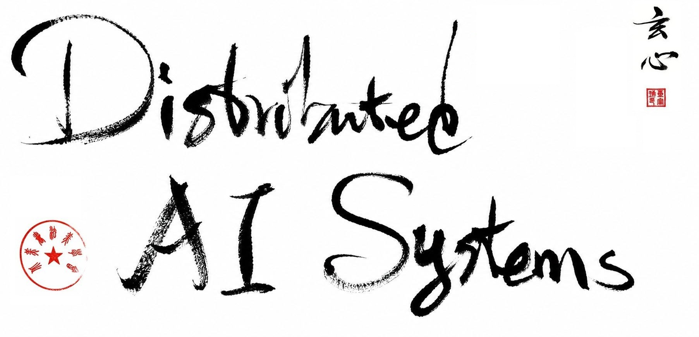

{.fullpage width=80%}

\newpage

# Copyright and Credits


__Distributed AI Systems__

Copyright © 2026 Packt Publishing

All rights reserved. No part of this book may be reproduced, stored in a retrieval system, or transmitted in any form or by any means, without the prior written permission of the publisher, except in the case of brief quotations embedded in critical articles or reviews.

Every effort has been made in the preparation of this book to ensure the accuracy of the information presented. However, the information contained in this book is sold without warranty, either express or implied. Neither the author, nor Packt Publishing or its dealers and distributors, will be held liable for any damages caused or alleged to have been caused directly or indirectly by this book.

Packt Publishing has endeavored to provide trademark information about all of the companies and products mentioned in this book by the appropriate use of capitals. However, Packt Publishing cannot guarantee the accuracy of this information.

\
Publishing Product Manager: Kunal Chaudhari

Senior Editors: Deepayan Bhattacharjee

Content Development Editors: Deepayan Bhattacharjee

Technical Editor: Deepayan Bhattacharjee

Copy Editor: Deepayan Bhattacharjee

Project Manager: Ankit Maroli, K. Loganathan

Project Coordinator: Rithika Shetty

Indexer: Deepayan Bhattacharjee

Production Designer: Rithika Shetty, Xuan Xin

Marketing Coordinators: Rithika Shetty

\
First published: June 2026

Published by Packt Publishing Ltd.

ISBN 978-1-8073017-1-2

www.packt.com


# Dedication {-}

>CENTERS: up=1cm

__To my parents, Chuntao He and Zongyuan Wu.__

*- Fuheng Wu*

>CENTERE

\newpage

# Contributors

## About the author

**Henry (Fuheng) Wu** is a Principal Machine Learning Tech Lead at Oracle's Generative AI organization, where he specializes in distributed training, large-scale inference, and GPU systems. He has delivered core components of Oracle's Vision and Document Understanding AI services and co-authored a Microsoft and Oracle blog on high-performance deep learning.

Henry has contributed to open-source projects including SGLang, genai-bench, pyLLaMA, chatLLaMA, and Oracle's HiQ observability system. His work spans PyTorch Distributed, DeepSpeed, Kubernetes GPU clusters, and production LLM serving—always with a focus on practical, scalable systems that run in real enterprise environments.

## About the reviewers

Packt's review program pairs authors with industry practitioners who read the manuscript for technical accuracy and clarity. The following reviewers provided detailed feedback on early drafts of this book:

**Liu Yong** — Ph.D, NUS

**Huaizheng Zhang** — Staff Research Scientist, ByteDance

**Junwei Zhang** — GenAI | Engineer | Moderator | 18K+ followers | x{Uber, DoorDash}

**Junnan Li** — Research Director @Salesforce; Time-Series, CUA, and Multimodal AI (BLIP)

**Jerry Liu** — Co-founder/CEO @ LlamaIndex

**Henry Mao** — Co-founder @ smithery.ai | Prev. co-founder of Jenni.ai (exited)

**Doris Xin** — CEO & Co-Founder @ Disarray | UC Berkeley CS PhD | Ex-LinkedIn, Google, Databricks

**You Yang** — NUS Professor

**Juncong Jack Wu** — USA AI Olympiad Nationals Bronze, 2026; Canada AI Olympiad National Qualifier Distinguished Honor Roll, National Team Selection Top 18; USACO Silver

# Preface

Large AI models now reach billions or even trillions of parameters. Training and serving them is no longer a single-GPU exercise—it is a distributed systems problem. You need to reason about GPU memory, high-speed interconnects, collective communication, job schedulers, inference batching, and production observability, often in the same week. Many resources explain one layer well: a training framework here, an inference engine there, a Kubernetes guide somewhere else. What has been missing is a single path from distributed training through inference to production serving, with runnable code you can execute on your own hardware.

This book is that path. Complete with hands-on code examples, it guides you to build distributed AI systems from the ground up—covering everything from distributed training and inference to production serving. The goal is not to memorize APIs, but to build intuition: why gradient synchronization hangs, when FSDP beats DDP, how PagedAttention changes serving economics, what to profile before you tune. If you work through the examples chapter by chapter, you will be able to scale workloads from a single GPU to a multi-node cluster and deploy inference systems that are faster, more memory-efficient, and easier to operate. The frameworks will keep evolving; the systems patterns in this book are what endure.

## Who this book is for

This book is for ML engineers, AI researchers, and DevOps engineers who need to train or serve large AI models at scale. Platform engineers, HPC cluster administrators, and cloud architects will be able to advance their skill set with this guide. A basic understanding of Python and PyTorch fundamentals is necessary to get started. Prior knowledge of distributed systems, cluster schedulers, or container orchestration is helpful but not required—the book covers these concepts from the ground up, starting with resource estimation, data preparation, and hardware fundamentals.

## What this book covers

*Chapter 1, Introduction to Modern Distributed AI*, introduces resource estimation, data preparation, and your first distributed training example with PyTorch.

*Chapter 2, GPU Hardware, Networking, and Parallelism Strategies*, covers GPU architecture, high-speed interconnects, and the parallelism strategies used throughout the rest of the book.

*Chapter 3, Distributed Training with PyTorch DDP*, walks through data parallelism on single-node and multi-node clusters, including debugging and performance tuning.

*Chapter 4, Scaling with Fully Sharded Data Parallel (FSDP)*, explains parameter sharding, hybrid sharding, and checkpointing for memory-efficient training.

*Chapter 5, Beyond State Sharding with DeepSpeed and Megatron*, covers DeepSpeed ZeRO optimization and Megatron-style tensor, pipeline, and expert parallelism, and when to choose each framework.

*Chapter 6, Distributed Inference and vLLM*, introduces inference fundamentals, PagedAttention, continuous batching, and tensor/expert parallelism for serving.

*Chapter 7, Cross-Request Optimization with SGLang*, explores structured generation, radix attention, and router-based serving optimizations.

*Chapter 8, Running Distributed Training with SLURM*, shows how to launch and manage multi-node training jobs on HPC clusters.

*Chapter 9, Production LLM Serving Stack*, builds a complete serving stack with Kubernetes, GPU scheduling, routing, and observability.

*Chapter 10, Distributed Benchmarking and Performance Optimization*, covers benchmarking methodologies, profiling tools, and systematic performance tuning.

*Chapter 11, The Evolving Landscape of Distributed AI*, surveys emerging trends including MoE architectures, edge–cloud coordination, and future directions.

## To get the most out of this book

You will need a machine with at least one NVIDIA GPU to run most examples; multi-GPU and multi-node setups are used in later chapters on distributed training and inference. Linux is the primary environment throughout, and all code examples use Python with PyTorch. Familiarity with the command line, virtual environments, and basic deep learning concepts (models, optimizers, loss functions) will help you move faster.

We recommend cloning the example code repository and working through each chapter's exercises in order—the early chapters establish hardware and parallelism concepts that later chapters build on. When you do not have local GPU access, cloud notebooks (such as Kaggle) with multiple GPUs can substitute for some exercises, as described in Chapter 1. For cluster-focused chapters, a SLURM environment or a local Kubernetes cluster with GPU nodes is ideal but not strictly required to understand the launch patterns and configuration.

## Download the example code files

You can download the example code files for this book from GitHub at [https://github.com/PacktPublishing/Distributed-AI-Systems](https://github.com/PacktPublishing/Distributed-AI-Systems). If code has been updated since publication, you will find the latest version on GitHub. You can also download the code files by visiting the book's page on Packt's website and entering the name of the book in the search box. Follow the link to the book's product page and check the Support section.

We also have other code bundles from our rich catalog of books and videos available at [https://github.com/PacktPublishing/](https://github.com/PacktPublishing/). Check them out!

## Download the color images

We also provide a PDF file that has color images of the screenshots and diagrams used in this book. You can download it from [https://www.packtpub.com/](https://www.packtpub.com/): search for the book by name, click on the product page, and navigate to the Downloads section to download the images.

## Conventions used

There are a number of text conventions used throughout this book.

**Bold** indicates new terms, important words, or UI elements you see on screen. For example, words in menus or dialog boxes appear in bold. Here is an example: "Select **Settings** from the **Accelerator** menu."

*Italic* indicates file names, URLs, and emphasis within paragraphs.

A block of code is set as follows:

```bash
git clone https://github.com/PacktPublishing/Distributed-AI-Systems
```


## Get in touch

Feedback from our readers is always welcome.

**General feedback:** If you have questions about any aspect of this book, email us at customercare@packtpub.com and mention the book title in the subject of your message.

**Errata:** Although we have taken every care to ensure the accuracy of our content, mistakes do happen. If you have found a mistake in this book, we would be grateful if you would report this to us. Please visit [www.packtpub.com/support/errata](https://www.packtpub.com/support/errata) and fill in the form.

**Piracy:** If you come across any illegal copies of our works in any form on the internet, we would be grateful if you would provide us with the location address or website name. Please contact us at copyright@packt.com with a link to the material.

**If you are interested in becoming an author:** If there is a topic that you have expertise in and you are interested in either writing or contributing to a book, please visit [authors.packtpub.com](https://authors.packtpub.com).

## Share Your Thoughts

Once you've read *Distributed AI Systems*, we'd love to hear your thoughts! Please [click here to go straight to the Amazon review page for this book](https://www.amazon.com/dp/1807301712) and share your feedback.

Your review is important to us and the tech community and will help us make sure we're delivering excellent quality content.


# Foreword

We are living through one of the most transformative epochs in the history of technology. The rapid evolution of Artificial Intelligence—moving from niche statistical models to gargantuan large language models and multi-modal systems spanning billions or even trillions of parameters—has fundamentally shifted our relationship with computing. Yet, as the mathematical formulation of these models remains elegantly bound to deep learning fundamentals, the engineering reality of executing them has exploded in complexity. Today, the bottleneck to AI progress is no longer just algorithmic creativity; it is fundamentally a system engineering challenge.  

Building a neural network on a single GPU has become a commoditized task, abstracted away by modern software libraries. However, taking that same network and distributing its training across thousands of specialized chips, or orchestrating low-latency, high-throughput inference for millions of concurrent users, is an entirely different beast. It requires a profound, multi-disciplinary mastery over physical hardware, high-speed networking topologies, memory management tricks, complex software orchestration, and algorithmic nuances. It is a domain where a single misplaced communication bottleneck can degrade hardware utilization from pristine efficiency to a crawl, rendering millions of dollars of compute infrastructure idle.  

For too long, knowledge in the distributed AI space has been siloed. Engineers looking to master this domain have had to piece together disparate academic papers, fragmented blog posts, tribal knowledge from elite tech companies, and chaotic open-source repository documentation. There has been a glaring gap between theoretical high-level explanations of parallelism and the actual code required to deploy stable, fault-tolerant workloads on a Kubernetes cluster.  

*Distributed AI Systems: A practical guide to building scalable training, inference, and serving systems for production AI* is the comprehensive blueprint the industry has desperately needed.  

Fuheng Wu has done something remarkable with this text. He has demystified the black box of infrastructure engineering for AI. Rather than treating training, inference, and cluster management as isolated domains, this book treats them as an integrated lifecycle. It systematically walks the reader through the complete operational pipeline—from understanding the silicon and high-speed interconnects that form the physical bedrock, to mastering PyTorch DDP, FSDP, and DeepSpeed ZeRO optimization strategies for multi-node scaling.  

Crucially, the book recognizes that training is only half the battle. In a production-first world, serving these models efficiently is where the economic and engineering viability of AI is won or lost. By diving deep into distributed inference fundamentals, vLLM, and SGLang, Fuheng equips engineers with the tools to tame memory fragmentation and unlock massive throughput. Finally, by grounding these concepts in cloud-native orchestration with Kubernetes and establishing robust observability frameworks, the book ensures that your systems don't just work in theory—they remain resilient and maintainable under production workloads.  

Whether you are a machine learning engineer seeking to scale your models beyond the limits of a single accelerator, a platform engineer tasked with building a modern AI cluster, or an architect designing the next generation of enterprise AI infrastructure, this book will serve as your definitive guide. Fuheng’s hands-on, code-first approach translates intimidating infrastructure challenges into predictable, repeatable engineering methodologies.  

As you read these chapters, I encourage you to not just absorb the code, but to deeply study the underlying patterns of resource estimation, memory management, and network communication. The frameworks of today will inevitably evolve, but the distributed systems principles meticulously laid out in this book will remain the foundation of AI infrastructure for years to come.  

Gang Zhao

Staff Engineer at Anyscale, Meta, Uber

May 2026 


```{=latex}
% END_OF_PREFACE
```
