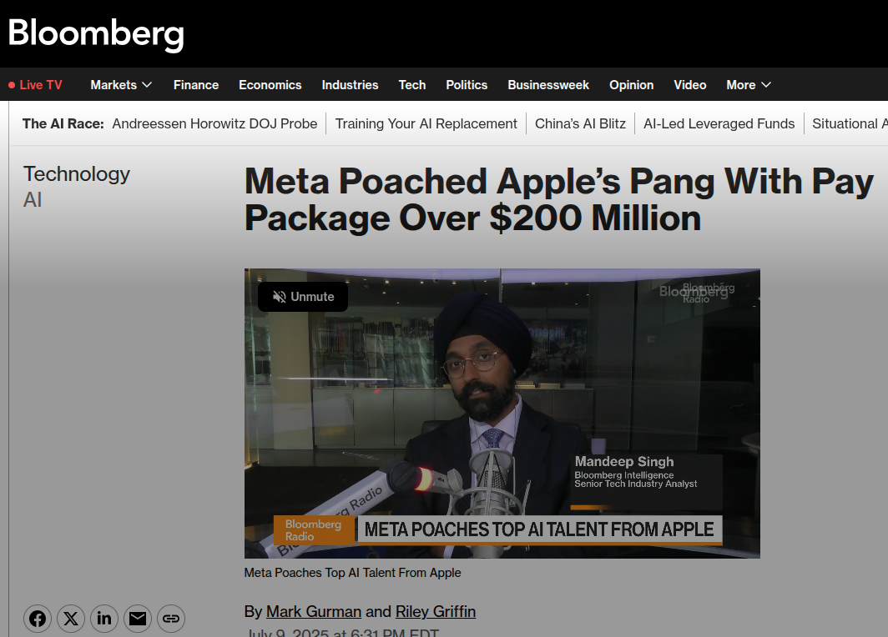
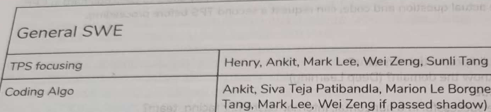

<!-- _class: cover -->
<!-- _paginate: false -->


<span class="badge">Conference Keynote</span>

# From Single GPU to<br>Production Clusters

## Building Distributed AI Systems for Training and Inference

<div class="divider"></div>

<div class="footer-meta">
  <div class="author-name">Henry Fuheng Wu</div>
  <div class="author-title">Author of <em>Distributed AI Systems</em></div>
  <div class="author-link">🔗 <a href="https://www.linkedin.com/in/henrywoo/" style="color: #2b7a78 !important;">linkedin.com/in/henrywoo</a></div>
  <div class="conf-info">Global Data & AI Virtual Tech Conference 2026 · August 22–24</div>
</div>

<!--
Welcome everyone, thanks for having me. I'm Henry, and today I want to walk through what it actually takes to go from a single-GPU experiment to a production-grade distributed AI system, for both training and inference. This is drawn from hands-on production work at places like Oracle, Wells Fargo, Uber plus material from my book Distributed AI Systems. Let's get started.
-->

---

## About the Speaker

**Henry Fuheng Wu**

  <div class="author-link">🔗 <a href="https://www.linkedin.com/in/henrywoo/" style="color: #2b7a78 !important;">linkedin.com/in/henrywoo</a></div>
<hr>

- AI leader and distributed systems expert
- Author of **Distributed AI Systems**, *Above the Clouds*, *Mathematics for AI and Machine Learning*
- Amazon Best-Selling Author in AI · Judge, International AI Innovation Olympiad
- Production AI experience across **Wells Fargo, Oracle, Uber, and Oscar Health**
- Built large-scale inference, distributed training, GPU infrastructure, and real-time data platforms

<!--
A quick bit about my background so you know where this is coming from. I've spent my career building production AI systems, distributed training, large-scale inference, GPU infrastructure, across Oracle, Wells Fargo, Uber, Oscar Health. I've also written about this space, including my book Distributed AI Systems, and I judge AI competitions on the side. Everything in this talk is grounded in things I've actually shipped, not just theory.
-->

---

## The Most Lucrative Skill Set on the Planet



**Meta paid Apple's Ruoming Pang a package reportedly over $200 million** to lead AI research — the going rate for people who actually know how to build and scale these systems.

<!--
So with that background, let me tell you why I actually wrote this book. Last year, Meta poached Apple's Ruoming Pang with a compensation package reportedly north of two hundred million dollars, to work on AI. That is not a typo, and it is not a one-off. Companies are paying unprecedented numbers for people who deeply understand how to train, scale, and serve these models, because that knowledge is the bottleneck standing between a research idea and a product that actually works at scale. Everything we're about to walk through, distributed training, GPU infrastructure, inference at scale, that's the actual substance behind headlines like this one. This book, and this talk, are about building that knowledge, not just admiring the paycheck.
-->

---

## It's Not a One-Off


**Meta raids Apple. Microsoft raids Meta.** Every major lab is fighting over the same, narrow pool of people who can actually build and scale these systems.

<!--
And this isn't an isolated headline, it's a pattern. Meta hired two of Apple's AI researchers, Mark Lee and Tom Gunter, for its Superintelligence Labs team. Then, within weeks, reports surfaced that Microsoft was compiling a target list of Meta's own AI engineers and researchers, offering multimillion-dollar packages to pull them away. Meta raids Apple, Microsoft raids Meta, and this cycle keeps going. It tells you something important: this isn't one company overpaying for hype, it's every major lab agreeing, with their wallets, that this specific expertise is scarce and valuable.
-->

---

## I've Actually Worked With One of Them



That's **Mark Lee**, my teammate at Uber ATG — same project, same interview panel, same team.

Top engineers aren't wizards — they just had the rare opportunity to master the full production lifecycle. That knowledge has been trapped inside a few labs. To bridge that gap, I wrote ***Distributed AI Systems*** and open-sourced the complete codebase.

<!--
And that Mark Lee name isn't just a headline to me, this is personal. Back at Uber ATG, Mark Lee was on my team. We sat on the same interview panel together, running initial tech phone screens for candidates side by side. When I say this talent war is real, it's not from a news feed, it's right in my network. But here's the real point: engineers in these positions aren't superheroes, they just had the rare opportunity to work across the full lifecycle at scale. That knowledge has been siloed inside a handful of top labs. It took me a decade across Oracle, Wells Fargo, and Uber to piece it all together — and that's exactly why I wrote Distributed AI Systems and open-sourced the code, to give every engineer that complete production playbook.
-->

---

## The Pattern, Confirmed Everywhere You Look

<div class="two-columns">
  <div class="left-content">
    <p style="font-size: 1.25em; font-weight: 700; color: #d9622b; margin: 0 0 16px 0; line-height: 1.3;">$100M bonuses. $250M pay packages.</p>
    <p style="font-size: 0.95em; color: #5b6169; margin: 0; line-height: 1.5;">Reported independently by Reuters, Business Insider, the New York Times, and Inc.</p>
  </div>
  <div class="right-img">
    
  </div>
</div>

<!--
And it's not just two or three headlines I cherry-picked, this is what you find the moment you search. A hundred-million-dollar bonuses reported in the AI talent war. AI researchers earning millions, with entire articles on how to break into that market yourself. The New York Times comparing quarter-billion-dollar AI pay packages to NBA superstar contracts. Zuckerberg personally cooking and hand-delivering soup to recruit engineers. This is Reuters, Business Insider, the New York Times, Inc dot com, all independently reporting the same underlying story. When that many independent outlets converge on the same number, that's not a fluke, that's the market telling you exactly what this knowledge is worth. That's the gap this book exists to close.
-->

---

## Agenda

1. Why distributed AI — the scale challenge
2. GPU memory and networking bottlenecks
3. Distributed training strategies
4. PyTorch DDP and FSDP in practice
5. Scaling further: DeepSpeed and Megatron
6. Distributed inference — vLLM and SGLang
7. Benchmarking and observability
8. Common production failure modes
9. Key takeaways

<!--
Here's the roadmap. We'll start with why distribution is necessary at all, then go under the hood on GPU memory and networking, because that's where most bottlenecks actually live. From there we'll cover the core training strategies: DDP, FSDP, DeepSpeed, and Megatron. Then we pivot to inference with vLLM and SGLang, talk about how to benchmark all of this properly, and close with the failure modes that catch teams off guard in production.
-->

---

## Why Modern AI Requires Distribution

- Model sizes have outpaced single-GPU memory for years — a 70B-parameter model alone needs **~140GB+** just for weights in FP16
- Training adds optimizer states, gradients, and activations on top of weights
- **The scale challenge is not optional** — it's a hard constraint of modern foundation models

**Rule of thumb:** if your model + optimizer state + activations don't fit in one GPU's memory, or a single GPU can't finish training in a reasonable time, you need a distributed strategy.

<!--
Let's ground this in numbers. A 70-billion-parameter model needs roughly 140GB just to hold the weights in FP16, before you've loaded a single batch. Once you add optimizer states, gradients, and activations for training, that number multiplies several times over. So the question isn't whether to distribute, it's when, and the rule of thumb I use is simple: if it doesn't fit in one GPU's memory, or training would take unreasonably long on one GPU, you're in distributed territory.
-->

---

## GPU Memory and Networking Bottlenecks

**Compute is rarely the bottleneck — memory and communication are.**

- **Memory bandwidth** — moving weights/activations on and off the GPU dominates many workloads
- **Interconnect** — NVLink (intra-node) vs. InfiniBand/RoCE (inter-node) create a steep bandwidth cliff between nodes
- **NUMA and CPU affinity** — poor pinning silently degrades PCIe transfer speed
- **Collective communication cost** — AllReduce, AllGather, and ReduceScatter traffic scales with model size and cluster size

Understanding *where* the bytes move is the first step to designing for scale.

<!--
This is the slide I wish more engineers internalized before they start optimizing compute. In practice, compute is rarely your bottleneck, memory bandwidth and communication are. NVLink inside a node is fast, but the moment you cross node boundaries onto InfiniBand or RoCE, there's a steep bandwidth cliff. Bad NUMA or CPU pinning can quietly throttle your PCIe transfers too. And every collective operation, AllReduce, AllGather, ReduceScatter, costs you traffic that scales with both model size and cluster size. If you understand where the bytes move, you understand where your performance problems will come from.
-->

---

## Distributed Training Strategies

| Strategy | Shards | Best for |
|---|---|---|
| **Data Parallelism (DDP)** | Data batches | Model fits on one GPU |
| **Fully Sharded Data Parallel (FSDP)** | Params, grads, optimizer state | Model too large for one GPU |
| **Tensor Parallelism** | Individual layers | Very large layers, high-bandwidth links |
| **Pipeline Parallelism** | Model depth (stages) | Many GPUs, deep models |
| **Sequence / Context Parallelism** | Sequence dimension | Long-context training |

Production systems increasingly combine several of these — **hybrid parallelism**.

<!--
Here's the strategy landscape at a glance. Data parallelism, which DDP implements, is your starting point when the model fits on one GPU. FSDP shards parameters, gradients, and optimizer states when it doesn't. Tensor and pipeline parallelism shard the model itself, its layers or its depth, for very large models. Sequence and context parallelism handle long-context training. And in practice, production systems rarely use just one of these, they combine several, which is what we call hybrid parallelism. We'll walk through DDP and FSDP in detail next.
-->

---

## PyTorch DDP: How It Works

- Each rank holds a **full copy** of the model; only gradients are synchronized
- **Gradient bucketing** groups small gradients so communication overlaps with backward computation
- **AllReduce** averages gradients across ranks after each backward pass
- Mixed precision + gradient scaling keeps throughput high without losing accuracy

```bash
torchrun --nproc_per_node=8 --nnodes=2 \
  --rdzv_backend=c10d --rdzv_endpoint=$MASTER_ADDR:29500 \
  train.py
```

Simple, robust — but every rank needs the **full model** in memory.

<!--
DDP is the workhorse of distributed training, and it's worth understanding exactly what it does. Every rank keeps a full copy of the model, only gradients get synchronized, via AllReduce, after each backward pass. The clever part is gradient bucketing: PyTorch groups gradients into buckets so communication can overlap with backward computation instead of waiting for it to finish. Combined with mixed precision, this gets you excellent throughput. The catch is memory, every single rank needs the full model, optimizer states and all, which is exactly the wall we hit next.
-->

---

## FSDP: Breaking the Memory Wall

- Shards **parameters, gradients, and optimizer states** across ranks instead of replicating them
- Full parameters are gathered just-in-time for each layer's forward/backward, then freed
- **FSDP2** introduces per-parameter sharding and `DeviceMesh` for clean 1D/2D (hybrid) sharding topologies

```python
mesh = init_device_mesh("cuda", (num_nodes, gpus_per_node))
for block in model.transformer_blocks:
    fully_shard(block, mesh=mesh)
fully_shard(model, mesh=mesh)
```

**Result:** models far larger than any single GPU's memory become trainable.

> *Full implementation & recipes:* [`github.com/PacktPublishing/Distributed-AI-Systems`](https://github.com/PacktPublishing/Distributed-AI-Systems)

<!--
FSDP is the answer to that memory wall. Instead of every rank holding a full copy, FSDP shards parameters, gradients, and optimizer states across ranks, and only gathers the full parameters just-in-time for each layer's forward and backward pass, then frees them again. FSDP2 cleaned this up significantly with per-parameter sharding and the DeviceMesh API, which makes 1D and 2D, that is hybrid, sharding topologies much easier to reason about and configure. The net effect: you can train models that simply would not fit on any single GPU, using hardware you already have.
-->

---

## Going Further: DeepSpeed & Megatron

**DeepSpeed ZeRO** — state sharding taken to its logical conclusion:
- Stage 1: optimizer states · Stage 2: + gradients · Stage 3: + parameters (like FSDP)
- **ZeRO-Offload / ZeRO-Infinity**: spill to CPU or NVMe for models beyond cluster GPU memory

**Megatron-LM** — parallelism along a *second axis*, computation itself:
- **Tensor parallelism** shards individual layers across GPUs
- **Pipeline parallelism** shards model depth into stages
- Combine with data/sequence parallelism for trillion-parameter-scale training

<!--
When FSDP still isn't enough, there are two more levers. DeepSpeed's ZeRO takes state sharding all the way: Stage 1 shards optimizer states, Stage 2 adds gradients, Stage 3 adds parameters, which is functionally similar to FSDP. ZeRO-Offload and ZeRO-Infinity go further, spilling to CPU or even NVMe storage for models that exceed your entire cluster's GPU memory. Megatron-LM attacks the problem from a different axis entirely, it shards the computation itself, splitting individual layers with tensor parallelism and model depth with pipeline parallelism. Combine these with data and sequence parallelism, and this is genuinely how trillion-parameter models get trained.
-->

---

## From Training to Inference

Inference has a fundamentally different profile:

- **Prefill** (compute-bound) vs. **Decode** (memory-bound, one token at a time)
- The **KV cache** avoids recomputing attention for prior tokens — but grows with every generated token
- Naive KV cache allocation fragments GPU memory and wastes capacity
- This is the "out of memory" problem that shapes every modern inference engine

<!--
Now let's shift from training to inference, because it's a fundamentally different problem. Inference has two very different phases: prefill, which is compute-bound and processes your whole prompt at once, and decode, which is memory-bound and generates one token at a time. The KV cache is what makes decode efficient, it avoids recomputing attention over every previous token, but it grows continuously as generation proceeds. If you allocate that cache naively, you fragment GPU memory badly, and that's really the root of the out-of-memory problems that plague naive inference serving.
-->

---

## vLLM: Solving KV Cache Fragmentation

- **PagedAttention** manages the KV cache like OS virtual memory — fixed-size blocks, no fragmentation, no wasted padding
- Enables much higher **batch density** and throughput per GPU
- Scales out with familiar parallelism strategies:
  - **Tensor parallelism** for large models across GPUs
  - Pipeline and data parallelism for further scale-out

```bash
vllm serve meta-llama/Llama-3-70b --tensor-parallel-size 8
```

<!--
vLLM's core contribution is PagedAttention, which treats the KV cache the way an operating system treats virtual memory: fixed-size blocks, no fragmentation, and no wasted padding. That alone dramatically increases how many requests you can batch together on one GPU, which directly increases throughput. And vLLM scales out the same way training does, tensor parallelism for large models, plus pipeline and data parallelism for further scale-out. If you're serving open models at any real scale today, there's a good chance vLLM is already part of your stack.
-->

---

## SGLang: Cross-Request Optimization

A different philosophy — optimize *across* requests, not just within one:

- **RadixAttention** — reuses shared prompt prefixes across requests via a radix tree cache
- **Zero-overhead scheduler** and **operator fusion** for lower per-step latency
- **Prefill/Decode disaggregation** — separates compute-bound and memory-bound phases onto different workers
- **Router-based architecture** — a model gateway load-balances across replicas, TP/PP/DP workers

Best fit for high cache-reuse workloads: chat, agents, RAG, few-shot prompting.

<!--
SGLang takes a different angle: instead of optimizing a single request, it optimizes across requests. RadixAttention keeps a radix tree of shared prompt prefixes, so if two requests share a system prompt or few-shot examples, that computation gets reused instead of repeated. Add a zero-overhead scheduler, operator fusion, and prefill/decode disaggregation, which separates the compute-bound and memory-bound phases onto different workers, and you get real latency wins. This shines especially in chat, agent, and RAG workloads, where prefix reuse across requests is high.
-->

---

## Benchmarking and Observability

**Training:**
- Throughput (tokens/sec, samples/sec), scaling efficiency vs. GPU count
- PyTorch Profiler / NVIDIA Nsight Systems for compute vs. communication breakdown
- Network/collective profiling to catch AllReduce bottlenecks early

**Inference:**
- **TTFT** (time to first token), **TPOT** (time per output token), p50/p90/p99 latency
- Cold start vs. warm performance, throughput under concurrent load
- Tools like `genai-bench` for reproducible, apples-to-apples comparisons

**You can't optimize what you don't measure — and percentiles matter more than averages.**

<!--
None of this matters if you can't measure it. On the training side, I care about throughput, scaling efficiency as you add GPUs, and using tools like PyTorch Profiler or Nsight Systems to see the actual split between compute and communication time. On the inference side, the metrics that matter are time-to-first-token, time-per-output-token, and, critically, percentile latencies, not just averages. A p99 that's ten times your average is a real user experience problem that an average will hide from you completely. Tools like genai-bench help make these comparisons reproducible.
-->

---

## Common Production Failure Modes

- **Silent scaling loss** — near-linear speedup on paper, poor real-world efficiency from communication overhead or stragglers
- **OOM under load** — KV cache growth or batch size spikes exhausting GPU memory
- **Checkpoint failures** — large-scale checkpointing that doesn't survive node failure, or is too slow to be practical
- **Network bottlenecks** — misconfigured NCCL/interconnect settings quietly capping throughput
- **Undetected node failures** — training or serving continuing degraded instead of failing fast and recovering elastically

Design for failure from day one: fault detection, elastic training, and fast checkpoint/restore are not optional at scale.

<!--
Let me close the technical section with the failure modes I've actually seen bite teams in production. Silent scaling loss, where your speedup curve looks fine on paper but real efficiency is poor because of communication overhead or straggler nodes. OOM under load, when KV cache growth or a batch size spike exhausts GPU memory unexpectedly. Checkpointing that looks fine until a node actually fails, and either takes too long or doesn't survive the failure. Misconfigured NCCL or interconnect settings that quietly cap your throughput without any obvious error. And nodes that fail without being detected, leaving training or serving degraded instead of recovering. The takeaway: design for failure from day one, not as an afterthought.
-->

---

## Key Takeaways

- Distribution is driven by **memory and communication limits**, not just raw compute
- Start simple — **DDP** — and move to **FSDP/DeepSpeed/Megatron** only when memory forces you to
- Inference is a different problem from training: **KV cache management and cross-request reuse** dominate
- **Benchmark relentlessly** — percentile latency and scaling efficiency, not just averages
- Production reliability requires designing for failure, not just for the happy path

<!--
So if you remember five things from this talk: distribution is driven by memory and communication limits, not just raw compute. Start with DDP, and only move to FSDP, DeepSpeed, or Megatron when memory actually forces your hand. Inference is a genuinely different problem from training, KV cache management and cross-request reuse dominate there. Benchmark relentlessly, and look at percentiles, not averages. And build for failure from the start, because at scale, something is always failing somewhere.
-->

---

<!-- _class: cover -->
<!-- _paginate: false -->

# Thank You!

## Continue Learning & Build with Us

<div style="display: grid; grid-template-columns: 1fr 1fr; gap: 20px; margin: 16px 0;">

<div style="background: rgba(255, 255, 255, 0.75); padding: 14px 18px; border-radius: 8px; border: 1px solid rgba(0,0,0,0.06); box-shadow: 0 4px 12px rgba(0,0,0,0.04);">
  <div style="font-weight: 700; color: #1f7a72; font-size: 0.95em; margin-bottom: 4px;">📖 Read the Book</div>
  <div style="font-size: 0.78em; color: #555; line-height: 1.4;"><strong>Distributed AI Systems</strong><br>Hands-on guide to training, inference & cluster scaling</div>
</div>

<div style="background: rgba(255, 255, 255, 0.75); padding: 14px 18px; border-radius: 8px; border: 1px solid rgba(0,0,0,0.06); box-shadow: 0 4px 12px rgba(0,0,0,0.04);">
  <div style="font-weight: 700; color: #e76f51; font-size: 0.95em; margin-bottom: 4px;">💻 Clone & Run Code</div>
  <div style="font-size: 0.78em; color: #555; line-height: 1.4;"><strong>GitHub:</strong> <a href="https://github.com/PacktPublishing/Distributed-AI-Systems" style="color: #2a9d8f;">PacktPublishing/Distributed-AI-Systems</a><br>Full benchmarks, DDP, FSDP & vLLM scripts</div>
</div>

<div style="background: rgba(255, 255, 255, 0.75); padding: 14px 18px; border-radius: 8px; border: 1px solid rgba(0,0,0,0.06); box-shadow: 0 4px 12px rgba(0,0,0,0.04);">
  <div style="font-weight: 700; color: #3d84a8; font-size: 0.95em; margin-bottom: 4px;">🌐 Technical Articles</div>
  <div style="font-size: 0.78em; color: #555; line-height: 1.4;"><strong>Website:</strong> <a href="https://distaisys.com" style="color: #2a9d8f;">distaisys.com</a><br>Deep dives, architecture teardowns & updates</div>
</div>

<div style="background: rgba(255, 255, 255, 0.75); padding: 14px 18px; border-radius: 8px; border: 1px solid rgba(0,0,0,0.06); box-shadow: 0 4px 12px rgba(0,0,0,0.04);">
  <div style="font-weight: 700; color: #6a4bbc; font-size: 0.95em; margin-bottom: 4px;">🤝 Connect with Author</div>
  <div style="font-size: 0.78em; color: #555; line-height: 1.4;"><strong>Henry Fuheng Wu</strong><br>🔗 <a href="https://www.linkedin.com/in/henrywoo/" style="color: #2a9d8f;">linkedin.com/in/henrywoo</a></div>
</div>

</div>

<div style="font-size: 0.72em; color: #8b929e; margin-top: 6px;">
  Global Data & AI Virtual Tech Conference 2026 · Q&A
</div>

<!--
Thank you all for your time today! We covered the foundational principles from GPU memory and interconnects to DDP, FSDP, and inference with vLLM/SGLang. If you want to go deeper and run every single script, test case, and benchmark yourself, head over to our GitHub repository at github.com/PacktPublishing/Distributed-AI-Systems and check out distaisys.com for ongoing deep dives. The complete blueprint is in Distributed AI Systems. Feel free to connect with me on LinkedIn, and I'd love to take your questions now!
-->
